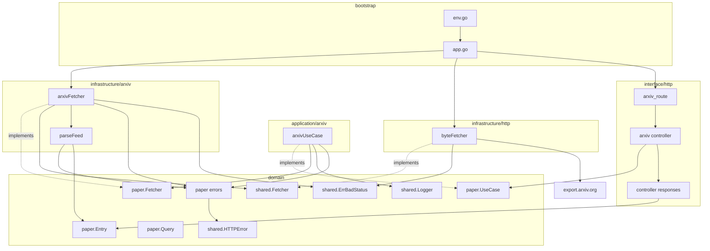
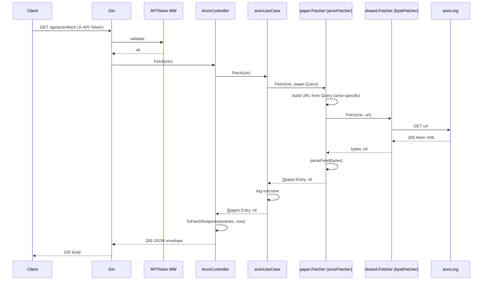
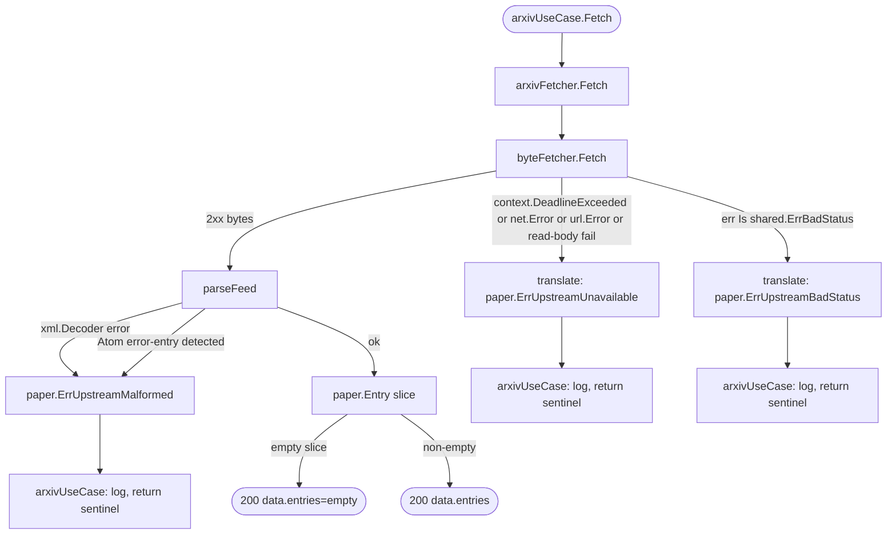

# Design Document — arxiv-fetcher

## Overview

**Purpose**: Deliver the first concrete ingestion adapter for the DeFi research monitor — a manual, on-demand HTTP trigger that fetches the most recently submitted arXiv papers for a fixed set of configured categories and returns them in the response body.

**Users**: The single researcher operating the monitor. No other consumer today; the response shape is rich enough for a future pipeline stage (dedupe, extraction, summarisation) to consume when it lands, but nothing downstream is in scope here.

**Impact**: Introduces a new source-neutral `paper` aggregate in the domain layer, a new generic `shared.Fetcher` byte-GET port (implemented in `infrastructure/http/`), an arxiv-specific `paper.Fetcher` implementation at `infrastructure/arxiv/` (which owns URL building, byte-fetching, and Atom parsing), a thin orchestration use case at `application/arxiv/`, and a new authenticated `/api/arxiv/fetch` endpoint. No persistence, no schema changes, no scheduling.

### Goals

- Provide an authenticated `GET /api/arxiv/fetch` endpoint that returns the newest arXiv entries for configured categories in a single call.
- Introduce a source-neutral `paper` domain aggregate (`Entry`, `Query`, `UseCase` port, `Fetcher` port) that future paper sources can share.
- Keep `shared.Fetcher` fully generic (byte-level GET, URL in / bytes out) so non-paper API sources (e.g. governance forums) can reuse it.
- Co-locate URL construction, HTTP call, and Atom parsing inside `infrastructure/arxiv/` so the application layer never touches raw bytes or XML.
- Fail fast at startup on missing or invalid arXiv configuration (categories, `max_results`).
- Distinguish upstream failures with 502 (bad status / malformed upstream) vs 504 (timeout / network unreachable).
- Keep the parser as a pure function so it is fixture-testable without network I/O.

### Non-Goals

- Persisting fetched entries to any datastore.
- Deduplication, PDF extraction, HTML extraction, LLM summarisation.
- Scheduling, cron, or background periodic fetches.
- Integrating with the existing `Source` aggregate (per-row category config).
- Runtime mutation of categories or `max_results`.
- Rate-limit enforcement beyond whatever arXiv itself returns (single-caller manual trigger).
- Multi-page / paginated requests per trigger.
- Authentication primitives — the existing `APIToken` middleware is reused as-is.
- Supporting a second paper source in v1 (the domain is source-neutral by design; the application-layer orchestrator and infrastructure adapter are arxiv-specific).

## Boundary Commitments

### This Spec Owns

- The `paper` domain aggregate: `Entry` value object, `Query` value object, `UseCase` port, `Fetcher` port, and error sentinels.
- The single HTTP endpoint `GET /api/arxiv/fetch`, its controller (at `interface/http/controller/arxiv/`), and its response DTOs.
- The orchestration use case `arxivUseCase` at `application/arxiv/`, which implements `paper.UseCase` for the arXiv source and depends only on `paper.Fetcher` (never on bytes or XML).
- The arxiv-specific `paper.Fetcher` implementation at `infrastructure/arxiv/`, which owns: URL construction from `paper.Query`, the outbound HTTP call (delegated to a `shared.Fetcher`), Atom/XML parsing via `parseFeed`, and translation of transport and content failures into `paper.*` sentinels.
- The arxiv-specific Atom parser `parseFeed` at `infrastructure/arxiv/parser.go`, including detection of arXiv's Atom-wrapped error entries.
- The generic `shared.Fetcher` port (renamed from `shared.APIFetcher`) and its concrete byte-level implementation at `infrastructure/http/`.
- Signature change to the port: from `APIFetcher.Fetch(ctx, endpoint string) ([]byte, error)` to `shared.Fetcher.Fetch(ctx context.Context, url string) ([]byte, error)`.
- Startup validation of `ARXIV_BASE_URL`, `ARXIV_CATEGORIES`, `ARXIV_MAX_RESULTS`, and composition of the immutable `paper.Query`.
- Extension of `route.Deps` with a feature-scoped `ArxivConfig` sub-bundle carrying a `paper.Fetcher` and a `paper.Query`.

### Out of Boundary

- Persistence of any kind (no repository, no tables, no migrations).
- Deduplication against prior fetches.
- The `Source` aggregate and its per-row configuration; the arxiv-fetcher does not create, read, or update `sources` rows.
- Scheduling / cron / background fetch loops.
- Article aggregate, LLM summarisation, PDF or HTML extraction.
- Rate-limit enforcement beyond respecting arXiv's own responses.
- Authentication middleware authoring — reused as-is from `interface/http/middleware/api_token.go`.
- A second paper-source adapter — the `paper.Fetcher` port is designed for one but v1 ships only the arXiv adapter.

### Allowed Dependencies

- `domain/shared.Fetcher` (port, renamed and re-specified by this spec).
- `domain/shared.Logger` (port, consumed for outcome logging per requirement 4.5).
- `domain/shared.HTTPError` and `NewHTTPError` (for error sentinels).
- `domain/shared.ErrBadStatus` (new sentinel — see §Shared additions).
- `domain/paper` (from the application, infrastructure, and interface layers).
- `interface/http/middleware.APIToken` (via `/api` group registration — not imported directly by arxiv code).
- `interface/http/middleware.ErrorEnvelope` (implicit via controller using `c.Error(err)`).
- `interface/http/common.Data` / `common.Err` (response envelope helpers).
- `stdlib` `net/http`, `encoding/xml`, `net/url`, `time`, `context`, `strings`, `io`, `errors`, `fmt`.
- No database, no ORM, no third-party arxiv libraries.

### Revalidation Triggers

- Change to the `paper.Entry` shape or the controller-layer `FetchResponse` / `EntryResponse` DTOs → future pipeline consumers must revalidate.
- Change to the `paper.Fetcher` port signature or the `paper.Query` shape → every future paper-source adapter must revalidate.
- Change to the `shared.Fetcher` port signature → every future API-source byte adapter (paper or otherwise) must revalidate.
- Change to the error-sentinel contract (`paper.ErrUpstreamBadStatus` / `ErrUpstreamMalformed` / `ErrUpstreamUnavailable` → 502 / 502 / 504) → clients that reason about status must revalidate.
- Change to `shared.ErrBadStatus` (the generic transport sentinel) → every adapter that translates transport errors must revalidate.
- Introduction of scheduling or persistence → the spec boundary expands and must be re-opened.
- Replacing the XML parser with a library or a port abstraction → consumers of `infrastructure/arxiv.parseFeed` must revalidate.

## Architecture

### Existing Architecture Analysis

- Hexagonal layout with strict inward-only dependencies (`domain/` ← `application/` ← `infrastructure/` ← `interface/` ← `bootstrap/`). Within `domain/`, sub-packages may import each other; `domain/shared` remains source-neutral in this spec.
- `APIFetcher` port pre-exists in `domain/shared/ports.go` with no concrete implementation. This spec renames it to `shared.Fetcher`, re-shapes it as a truly generic byte-GET (URL string in, bytes out), and delivers its first concrete implementation at `infrastructure/http/`.
- `APIToken` middleware pre-exists and is mounted at the `/api` group level in `bootstrap/app.go`; new endpoints registered under `d.Group` inherit authentication automatically (satisfies requirement 1.2 generically).
- `ErrorEnvelope` middleware already maps `*shared.HTTPError` to the standard response envelope. Domain sentinels following the `source.ErrNotFound` pattern are the idiomatic way to encode the 502/504 distinction.
- `route.Deps` currently carries only cross-cutting infra. This spec adds a feature-scoped sub-bundle rather than diluting `Deps`.

### Architecture Pattern & Boundary Map



**Architecture Integration**:
- **Selected pattern**: Ports & Adapters with two stacked ports at different abstraction levels. The low-level `shared.Fetcher` is a generic HTTP byte-GET port with one concrete impl in `infrastructure/http/`. The high-level `paper.Fetcher` is a paper-domain port returning typed `[]paper.Entry`; its arXiv impl in `infrastructure/arxiv/` composes `shared.Fetcher` + URL construction + Atom parsing.
- **Domain boundaries**: `paper` is a new source-neutral aggregate in `domain/paper/`. It owns `Entry`, `Query`, the `UseCase` and `Fetcher` ports, and error sentinels. It knows nothing about HTTP transport, XML, or arXiv specifically. `domain/shared` remains source-neutral; `shared.Fetcher` commits only to URL-in / bytes-out.
- **Responsibility split**:
  - `application/arxiv` (use case): orchestrates at the domain level, holds the immutable `paper.Query`, logs the outcome. Never touches bytes or XML. Never inspects transport-level errors.
  - `infrastructure/arxiv` (arxiv adapter): owns URL construction from `paper.Query`, calls `shared.Fetcher`, parses bytes via `parseFeed`, translates transport and content failures into `paper.*` sentinels.
  - `infrastructure/http` (byte fetcher): owns the raw HTTP call. Returns `(body, nil)` on 2xx; returns `shared.ErrBadStatus`-wrapped error on non-2xx; returns stdlib errors (`context.DeadlineExceeded`, `*url.Error`, read-body errors) for transport failures.
- **Existing patterns preserved**: `route.Deps` + per-resource `Router(d Deps)` function; `c.Error(err)` with `*shared.HTTPError` sentinels handled by `ErrorEnvelope`; viper env loading with fail-fast validation; hand-written fakes in `tests/mocks/`.
- **Steering compliance**: Strict inward-only imports; `context.Context` is the first arg of every use-case and adapter method; `log/slog` via `shared.Logger` port only; viper-backed flat `Env` struct with `mapstructure` tags.

### Technology Stack

| Layer | Choice / Version | Role in Feature | Notes |
|-------|------------------|-----------------|-------|
| Backend / Services | Go 1.25, Gin v1.12 (existing) | HTTP server + routing for the new endpoint. | Reuses existing engine and middleware stack. |
| Backend / Services | `net/http` (stdlib) | Outbound HTTP client inside the generic `byteFetcher`. | No third-party HTTP client; stdlib meets all needs. |
| Backend / Services | `encoding/xml` (stdlib) | Atom feed parser inside `infrastructure/arxiv/parser.go`. | Namespace handling via struct tags; no third-party XML lib. |
| Data / Storage | — | Not applicable; no persistence. | See Non-Goals. |
| Messaging / Events | — | Not applicable; synchronous request/response only. | |
| Infrastructure / Runtime | Viper v1.21 (existing), `.env` loader | New `ARXIV_BASE_URL`, `ARXIV_CATEGORIES`, `ARXIV_MAX_RESULTS` entries. | Validated at startup; service refuses to boot on invalid config. |

> **New dependencies**: none. All additions are stdlib.

## File Structure Plan

### Directory Structure

```
backend/
├── internal/
│   ├── domain/
│   │   ├── paper/                                # NEW aggregate (source-neutral)
│   │   │   ├── model.go                          # Entry value object
│   │   │   ├── ports.go                          # UseCase, Query, Fetcher
│   │   │   └── errors.go                         # ErrUpstreamBadStatus / Malformed / Unavailable
│   │   └── shared/
│   │       ├── ports.go                          # MODIFIED: renamed APIFetcher → Fetcher; URL in, bytes out
│   │       └── errors.go                         # MODIFIED: add ErrBadStatus transport sentinel
│   ├── application/
│   │   └── arxiv/                                # NEW: thin orchestrator
│   │       ├── usecase.go                        # arxivUseCase, depends on paper.Fetcher only
│   │       └── usecase_test.go                   # orchestration tests with fake paper.Fetcher
│   ├── infrastructure/
│   │   ├── http/                                 # NEW: generic shared.Fetcher impl
│   │   │   ├── byte_fetcher.go                   # NewByteFetcher(timeout, userAgent) → shared.Fetcher
│   │   │   └── byte_fetcher_test.go              # httptest.Server: 2xx, non-2xx, timeout, network
│   │   └── arxiv/                                # arxiv-specific paper.Fetcher impl
│   │       ├── fetcher.go                        # NewArxivFetcher(baseURL, shared.Fetcher) → paper.Fetcher
│   │       ├── fetcher_test.go                   # URL-build + transport-error translation tests (fake shared.Fetcher)
│   │       ├── parser.go                         # parseFeed: bytes → []paper.Entry (pure function)
│   │       ├── parser_test.go                    # fixture-driven parser tests
│   │       └── testdata/
│   │           ├── happy.xml                     # multi-entry feed
│   │           ├── empty.xml                     # valid feed, zero entries
│   │           ├── malformed.xml                 # invalid XML
│   │           └── error_entry.xml               # arXiv's Atom-wrapped error
│   ├── interface/
│   │   └── http/
│   │       ├── controller/
│   │       │   └── arxiv/                        # NEW subpackage (package name: arxiv)
│   │       │       ├── controller.go             # ArxivController.Fetch; maps []paper.Entry → FetchResponse
│   │       │       └── responses.go              # FetchResponse, EntryResponse, ToFetchResponse
│   │       └── route/
│   │           ├── arxiv_route.go                # NEW: ArxivRouter(d Deps)
│   │           └── route.go                      # MODIFIED: Deps += ArxivConfig; Setup calls ArxivRouter
│   └── bootstrap/
│       ├── env.go                                # MODIFIED: +Arxiv* fields + CSV parser + fail-fast validation
│       └── app.go                                # MODIFIED: compose byteFetcher → arxivFetcher → Query; pack into route.Deps.Arxiv
├── tests/
│   ├── mocks/
│   │   └── paper_fetcher.go                      # NEW: hand-written paper.Fetcher fake (records Query; returns canned []paper.Entry or sentinel)
│   └── integration/
│       ├── setup/
│       │   └── setup.go                          # MODIFIED: accept fake paper.Fetcher + paper.Query; register arxiv router
│       └── arxiv_test.go                         # NEW: integration coverage (200 happy/empty, 401, 502 x2, 504)
└── .env.example                                  # MODIFIED: +ARXIV_BASE_URL, +ARXIV_CATEGORIES, +ARXIV_MAX_RESULTS
```

> Go package names by path:
> - `internal/application/arxiv` → `package arxiv`
> - `internal/infrastructure/arxiv` → `package arxiv`
> - `internal/infrastructure/http` → `package http` (standard lib clash is avoided by local import alias `httpinfra`)
> - `internal/interface/http/controller/arxiv` → `package arxiv`
>
> Only `bootstrap/app.go` and `interface/http/route/arxiv_route.go` import more than one of the `arxiv` packages; they use local aliases (`arxivapp`, `arxivinfra`, `arxivctrl`).

### Modified Files

- `internal/domain/shared/ports.go` — rename `APIFetcher` to `Fetcher`; change signature to `Fetch(ctx context.Context, url string) ([]byte, error)`; doc comment: "port for generic byte-level HTTP GETs; adapters translate sentinel errors (`shared.ErrBadStatus`, stdlib transport errors) into their own domain error vocabulary".
- `internal/domain/shared/errors.go` — add `var ErrBadStatus = errors.New("shared.fetch: upstream returned non-success status")` sentinel used by byte-fetcher implementations to signal non-2xx responses.
- `internal/interface/http/route/route.go` — `Deps` gains `Arxiv ArxivConfig`; `Setup` adds `ArxivRouter(d)`.
- `internal/bootstrap/env.go` — `Env` gains `ArxivBaseURL`, `ArxivCategoriesRaw`, `ArxivCategories []string` (post-parse), `ArxivMaxResults int`; loader splits `ArxivCategoriesRaw` by comma, trims, validates non-empty (requirement 2.2); validates `ArxivMaxResults` ∈ `[1, 30000]` (requirement 3.3 + arXiv's hard cap; see research.md risk log).
- `internal/bootstrap/app.go` — constructs the generic `byteFetcher`, wraps it in `arxivFetcher` with the configured base URL, assembles the immutable `paper.Query`, and hands both to `route.Setup` via `route.ArxivConfig`.
- `tests/integration/setup/setup.go` — `SetupTestEnv` gains options so tests can inject a fake `paper.Fetcher` and a fixed `paper.Query`; registers the arxiv router.
- `.env.example` — documents the three new env vars with sane placeholder values.

## System Flows

### Successful fetch



### Failure classification



**Key decisions**:
- `byteFetcher` (`shared.Fetcher` impl) is source-neutral. It returns `shared.ErrBadStatus` wrapping the status code on non-2xx, stdlib errors on transport failure, and `(body, nil)` on 2xx. It does not produce paper-domain sentinels.
- `arxivFetcher` (`paper.Fetcher` impl) is where translation happens. It maps transport errors to `paper.ErrUpstreamUnavailable`, `shared.ErrBadStatus` to `paper.ErrUpstreamBadStatus`, and content-level parse failures to `paper.ErrUpstreamMalformed`.
- `parseFeed` returns `paper.ErrUpstreamMalformed` directly for both XML decode failures and arXiv's Atom-wrapped error entries.
- `arxivUseCase` is a pure relay at the domain level: it receives either `[]paper.Entry` or a `paper.*` sentinel from the fetcher, logs, and returns. It never sees bytes, XML, URLs, HTTP status codes, or stdlib transport errors.
- Empty-entries is a success (200 with empty list) per requirement 1.5, not an error.

## Requirements Traceability

| Requirement | Summary | Components | Interfaces | Flows |
|-------------|---------|------------|------------|-------|
| 1.1 | Authenticated GET returns 200 with fetched entries | ArxivController, arxivUseCase, arxivFetcher, byteFetcher, parseFeed | `paper.UseCase.Fetch`, `paper.Fetcher.Fetch`, `shared.Fetcher.Fetch` | Successful fetch |
| 1.2 | Missing/invalid token → 401, no upstream call | `APIToken` middleware (pre-existing), route group registration | `middleware.APIToken` | — (short-circuits before controller) |
| 1.3 | Response fields: id, title, authors, abstract, primary category, submitted date, PDF link | `paper.Entry`, controller `EntryResponse`, `parseFeed`, `ToFetchResponse` | `paper.Entry`, `arxiv.ToFetchResponse` | Successful fetch |
| 1.4 | No datastore writes | `arxivUseCase` (no repository dependency), `arxivFetcher` (no persistence) | — | Successful fetch (no persistence edge) |
| 1.5 | Empty result → 200 with empty list | `arxivUseCase`, `ArxivController`, `parseFeed` (empty slice on zero entries) | `paper.UseCase.Fetch`, `paper.Fetcher.Fetch` | Successful fetch (empty branch) |
| 2.1 | Categories read from env at startup | `bootstrap.Env`, env loader, `app.go` Query assembly | `bootstrap.LoadEnv` | — |
| 2.2 | Missing/empty category list → fail to start | env loader validation | `bootstrap.LoadEnv` | — |
| 2.3 | Fetch uses only configured categories | `bootstrap.app.go` (builds Query), `arxivUseCase` (relays Query via `paper.Fetcher`), `arxivFetcher` (builds URL from `Query.Categories`) | `paper.Query`, `paper.Fetcher.Fetch` | Successful fetch |
| 2.4 | Multiple categories → OR semantics | `arxivFetcher` URL builder (`cat:X+OR+cat:Y`) | — | Successful fetch |
| 2.5 | No runtime mutation interface | `ArxivController` (no mutation handlers); `paper.Query` is immutable after bootstrap assembly | — | — |
| 3.1 | Sort descending by submitted date | `arxivFetcher` URL builder (`sortBy=submittedDate&sortOrder=descending`) — fixed for arxiv source | — | Successful fetch |
| 3.2 | At most `max_results` per call | `arxivFetcher` URL builder reads `Query.MaxResults` | `paper.Query` | Successful fetch |
| 3.3 | Invalid `max_results` → fail to start | env loader validation | `bootstrap.LoadEnv` | — |
| 3.4 | No pagination per trigger | `arxivUseCase` — single `paper.Fetcher.Fetch` call per request; `arxivFetcher` — single `shared.Fetcher.Fetch` call per `Fetch` | — | Successful fetch |
| 3.5 | Determinism across repeat calls with no upstream change | Immutable `paper.Query` per process + fixed arxiv sort order | `paper.Query` | Successful fetch |
| 4.1 | Upstream non-success HTTP → 502 | `byteFetcher` → `shared.ErrBadStatus`; `arxivFetcher` translates to `paper.ErrUpstreamBadStatus` | `shared.ErrBadStatus`, `paper.ErrUpstreamBadStatus` | Failure classification |
| 4.2 | Malformed upstream body → 502 | `parseFeed` error + Atom error-entry detection | `paper.ErrUpstreamMalformed` | Failure classification |
| 4.3 | Timeout / network failure → 504 | `byteFetcher` returns stdlib transport error; `arxivFetcher` translates to `paper.ErrUpstreamUnavailable` | `paper.ErrUpstreamUnavailable` | Failure classification |
| 4.4 | No partial/fabricated entries on upstream failure | `arxivFetcher` returns `(nil, err)` on any sub-step failure; `arxivUseCase` passes through unchanged | `paper.UseCase.Fetch`, `paper.Fetcher.Fetch` | Failure classification |
| 4.5 | Log outcome with failure category | `arxivUseCase` logging at end of request | `shared.Logger` | Successful fetch + Failure classification |

## Components and Interfaces

| Component | Domain/Layer | Intent | Req Coverage | Key Dependencies (P0/P1) | Contracts |
|-----------|--------------|--------|--------------|--------------------------|-----------|
| `paper.Entry` | domain | Source-neutral value object for one paper. | 1.3 | — | State |
| `paper.Query` | domain | Source-neutral fetch criteria (categories + max results). | 2.3, 2.4, 3.2 | — | State |
| `paper.UseCase` (port) | domain | Source-neutral fetch contract for the HTTP layer. | 1.1, 1.4, 1.5, 3.4, 3.5, 4.4, 4.5 | — | Service |
| `paper.Fetcher` (port) | domain | Source-neutral domain-level fetch contract returning typed entries. | 1.1, 1.3, 1.5, 3.4, 4.4 | `paper.Query`, `paper.Entry` (P0) | Service |
| `paper` error sentinels | domain | Typed 502/504 `*shared.HTTPError` values for upstream failures. | 4.1, 4.2, 4.3 | `shared.HTTPError` (P0) | State |
| `shared.Fetcher` (port, RENAMED + RE-SHAPED) | domain | Generic byte-level HTTP GET. URL in, bytes out. | 1.1 | — | Service |
| `shared.ErrBadStatus` | domain | Source-neutral transport sentinel for non-2xx responses. | 4.1 | — | State |
| `arxivUseCase` (impl) | application/arxiv | Thin orchestrator: invoke `paper.Fetcher`, log, return. Never touches bytes/XML/URLs. | 1.1, 1.4, 1.5, 3.4, 4.4, 4.5 | `paper.Fetcher` (P0), `shared.Logger` (P1) | Service |
| `arxivFetcher` (impl of `paper.Fetcher`) | infrastructure/arxiv | URL construction + byte fetch + Atom parse + error translation. | 2.3, 2.4, 3.1, 3.2, 3.4, 4.1, 4.2, 4.3, 4.4 | `shared.Fetcher` (P0), `parseFeed` (P0, package-local), `paper` (P0) | Service |
| `parseFeed` (function) | infrastructure/arxiv | Pure Atom → `[]paper.Entry` parser; returns `paper.ErrUpstreamMalformed` on content failure. | 1.3, 1.5, 4.2 | `encoding/xml` (P0, stdlib), `paper` (P0) | Service |
| `byteFetcher` (impl of `shared.Fetcher`) | infrastructure/http | Generic HTTP byte-GET; returns `shared.ErrBadStatus` on non-2xx, stdlib errors on transport failure. | 1.1, 4.1, 4.3 | `net/http` (P0, stdlib), external host (P0) | Service, API |
| `ArxivController` | interface/http/controller/arxiv | HTTP handler; delegates to `paper.UseCase`; maps `[]paper.Entry` → `FetchResponse`. | 1.1, 1.3, 1.5, 4.4 | `paper.UseCase` (P0) | API |
| Controller DTOs (`FetchResponse`, `EntryResponse`) | interface/http/controller/arxiv | Wire/JSON shape for the endpoint. | 1.3 | `paper.Entry` (P0) | State, API |
| `ArxivRouter` | interface/http/route | Registers `GET /api/arxiv/fetch`; wires ctrl locally from `route.Deps.Arxiv`. | 1.1, 1.2 | `paper.UseCase`, `paper.Fetcher`, `paper.Query` via `Deps.Arxiv` (P0) | API |
| Env extensions | bootstrap | Load + validate `ARXIV_*` config; assemble `paper.Query` once at startup. | 2.1, 2.2, 2.5, 3.3, 3.5 | `viper` (P0), `paper.Query` (P0) | State |

### Domain Layer

#### `paper.Entry`

| Field | Detail |
|-------|--------|
| Intent | Immutable source-neutral value object for one paper. |
| Requirements | 1.3 |

**Responsibilities & Constraints**
- Carries the minimum information required to identify and route a paper downstream (requirement 1.3) plus the `<updated>` date and full category list as non-load-bearing extras.
- Source-neutral: field names do not assume a particular provider. For the arxiv source, `SourceID` holds the arXiv identifier (e.g. `2404.12345`) and `Version` holds e.g. `v1`.
- Value object: no identity beyond its fields; no invariants enforced at construction time (the upstream source is the authority).
- No behavior. Pure data.

**Contracts**: State.

##### State Shape

```go
// internal/domain/paper/model.go
type Entry struct {
    SourceID        string    // e.g. "2404.12345" for the arxiv source
    Version         string    // e.g. "v1", "v2"; may be empty
    Title           string
    Authors         []string
    Abstract        string
    PrimaryCategory string    // e.g. "cs.LG"
    Categories      []string  // all assigned categories incl. primary
    SubmittedAt     time.Time // first-submission date
    UpdatedAt       time.Time // latest-version date
    PDFURL          string    // parsed from the source's canonical PDF link
    AbsURL          string    // parsed from the source's canonical abstract URL
}
```

#### `paper.Query`

| Field | Detail |
|-------|--------|
| Intent | Source-neutral fetch criteria passed to any paper-source `paper.Fetcher` impl. |
| Requirements | 2.3, 2.4, 3.2 |

**Responsibilities & Constraints**
- Immutable value: constructed once at bootstrap and reused across all calls (requirement 3.5's determinism guarantee).
- Source-neutral: no arxiv-specific fields. Source-specific translation (e.g. arxiv's `cat:X+OR+cat:Y` syntax, `sortBy=submittedDate&sortOrder=descending`) happens inside the concrete `paper.Fetcher` implementation.
- Validation (non-empty `Categories`, `MaxResults ∈ [1, 30000]`) is enforced at construction time by the bootstrap layer; the struct itself does not re-validate.

**Contracts**: State.

##### State Shape

```go
// internal/domain/paper/ports.go
type Query struct {
    Categories []string // non-empty; each element trimmed, non-empty
    MaxResults int      // 1..30000 inclusive
}
```

#### `paper.UseCase`

| Field | Detail |
|-------|--------|
| Intent | Orchestration contract consumed by the HTTP controller. |
| Requirements | 1.1, 1.4, 1.5, 3.4, 3.5, 4.4, 4.5 |

**Responsibilities & Constraints**
- Zero runtime state; zero persistence. Each call is independent.
- Must not return a partial list alongside an error (requirement 4.4). On any failure, returns `(nil, err)`.
- Must log exactly one outcome per invocation, including the failure category when applicable (requirement 4.5).
- Must not expose any parameter for runtime-mutating categories or `max_results` (requirement 2.5).

**Contracts**: Service.

##### Service Interface

```go
// internal/domain/paper/ports.go
type UseCase interface {
    Fetch(ctx context.Context) ([]Entry, error)
}
```

- Preconditions: none at the boundary (auth via middleware; config validated at boot).
- Postconditions: returns `([]Entry, nil)` (possibly empty) or `(nil, *shared.HTTPError)` where the error `Is` one of the three `paper.*` sentinels.
- Invariants: never writes to a datastore; never returns `nil, nil`; never returns non-empty entries alongside a non-nil error.

#### `paper.Fetcher`

| Field | Detail |
|-------|--------|
| Intent | Source-neutral domain-level fetch port. Takes a `paper.Query`; returns typed entries or a `paper.*` sentinel. |
| Requirements | 1.1, 1.3, 1.5, 3.4, 4.4 |

**Responsibilities & Constraints**
- Implementations translate a source-neutral `paper.Query` into whatever transport/protocol their source requires, execute the fetch, parse the response into `paper.Entry` values, and translate all failures into `paper.*` sentinels.
- The port hides bytes, XML/JSON, URLs, HTTP status codes, and transport error types from everything above it.
- One call → at most one outbound fetch (requirement 3.4).

**Contracts**: Service.

##### Service Interface

```go
// internal/domain/paper/ports.go
type Fetcher interface {
    Fetch(ctx context.Context, q Query) ([]Entry, error)
}
```

- Preconditions: `q.Categories` non-empty, `q.MaxResults` ∈ `[1, 30000]` (caller guarantees).
- Postconditions: returns `([]Entry, nil)` (possibly empty) or `(nil, *shared.HTTPError)` `Is`-ing one of the three `paper.*` sentinels.
- Invariants: never returns a non-empty slice alongside a non-nil error.

#### `paper` error sentinels

| Field | Detail |
|-------|--------|
| Intent | Typed `*shared.HTTPError` values for the three upstream-failure categories required by requirement 4. |
| Requirements | 4.1, 4.2, 4.3 |

**Responsibilities & Constraints**
- Values, not factories — follow the `source.ErrNotFound` pattern.
- `Code` and `Message` are stable; operators can rely on them.
- Consumed by the existing `ErrorEnvelope` middleware — no controller-side status mapping.
- Source-neutral messages (operators identify the specific source from the endpoint path and from the structured log line emitted by the use case).

**Contracts**: State.

##### Sentinels

```go
// internal/domain/paper/errors.go
var (
    ErrUpstreamBadStatus   = shared.NewHTTPError(http.StatusBadGateway,     "paper source returned non-success status", nil)
    ErrUpstreamMalformed   = shared.NewHTTPError(http.StatusBadGateway,     "paper source returned malformed response", nil)
    ErrUpstreamUnavailable = shared.NewHTTPError(http.StatusGatewayTimeout, "paper source unavailable",                 nil)
)
```

#### `shared.Fetcher` (renamed + re-shaped)

| Field | Detail |
|-------|--------|
| Intent | Generic byte-level HTTP GET port. Any API source (paper or otherwise) may reuse it. |
| Requirements | 1.1 (indirectly, via the chain into `paper.Fetcher`) |

**Responsibilities & Constraints**
- Implementations perform a single HTTP GET against the provided URL and return the response body on 2xx.
- On non-2xx: return an error that wraps `shared.ErrBadStatus` (via `fmt.Errorf("%w: status=%d", shared.ErrBadStatus, code)`) so adapters can identify it with `errors.Is`.
- On transport failures (timeout, network, DNS, TLS, read-body failure after headers): return a stdlib-identifiable error (`context.DeadlineExceeded`, `*url.Error`, or similar) — adapters identify these with `errors.Is` / `errors.As`.
- Implementations do not parse the body, do not retry, and do not interpret status codes beyond success/non-success.

**Contracts**: Service.

##### Service Interface

```go
// internal/domain/shared/ports.go
// Fetcher is a generic byte-level HTTP GET port. Implementations return the
// response body on 2xx. On non-2xx, the error wraps shared.ErrBadStatus. On
// transport failure, implementations return stdlib-identifiable errors
// (context.DeadlineExceeded, *url.Error, ...). Higher layers translate these
// into their own error vocabulary.
type Fetcher interface {
    Fetch(ctx context.Context, url string) ([]byte, error)
}
```

#### `shared.ErrBadStatus` (new sentinel)

| Field | Detail |
|-------|--------|
| Intent | Generic, source-neutral sentinel that byte-level fetchers wrap to signal a non-2xx response. |
| Requirements | 4.1 (consumed upstream by `arxivFetcher` translation) |

```go
// internal/domain/shared/errors.go
var ErrBadStatus = errors.New("shared.fetch: upstream returned non-success status")
```

### Application Layer

#### `arxivUseCase`

| Field | Detail |
|-------|--------|
| Intent | Thin orchestrator: invoke `paper.Fetcher`, log the outcome, return. Never touches bytes, XML, URLs, HTTP status codes, or transport errors. |
| Requirements | 1.1, 1.4, 1.5, 3.4, 4.4, 4.5 |

**Responsibilities & Constraints**
- Receives an immutable `paper.Query` and a `paper.Fetcher` at construction. Both come from bootstrap.
- Per call: invokes `fetcher.Fetch(ctx, query)` exactly once, logs, returns.
- On any `paper.*` sentinel: log a `WarnContext` with a stable category string and return `(nil, sentinel)` verbatim.
- On success: log one `InfoContext` with entry count and categories; return `(entries, nil)`.
- Does not own URL construction, byte-fetching, or parsing. All three live below the `paper.Fetcher` port.

**Dependencies**
- Inbound: `ArxivController` (P0).
- Outbound: `paper.Fetcher` (P0), `shared.Logger` (P1).

**Contracts**: Service.

##### Service Signature

```go
// internal/application/arxiv/usecase.go
// Package arxiv implements paper.UseCase for the arXiv source.
package arxiv

type arxivUseCase struct {
    fetcher paper.Fetcher
    log     shared.Logger
    query   paper.Query // immutable after construction
}

func NewArxivUseCase(fetcher paper.Fetcher, log shared.Logger, query paper.Query) paper.UseCase
```

- Preconditions: `query.Categories` non-empty, `query.MaxResults ∈ [1, 30000]` (bootstrap enforces).
- Postconditions: returns `([]paper.Entry, nil)` on success or `(nil, err)` where `err` `Is` one of the three `paper.*` sentinels.
- Invariants: single `paper.Fetcher.Fetch` call per invocation; no retries.

##### Orchestration (pseudocode)

```
Fetch(ctx):
    entries, err := u.fetcher.Fetch(ctx, u.query)
    if err != nil:
        u.log.WarnContext(ctx, "paper.fetch.failed",
            "source", "arxiv",
            "category", classify(err),   // "bad_status" | "malformed" | "unavailable"
            "err", err)
        return nil, err  // sentinel passed through verbatim
    u.log.InfoContext(ctx, "paper.fetch.ok",
        "source", "arxiv",
        "count", len(entries),
        "categories", u.query.Categories)
    return entries, nil
```

`classify(err)` inspects the sentinel identity via `errors.Is` and returns a stable log string. It does not produce sentinels.

**Implementation Notes**
- Integration: completely decoupled from transport and content details.
- Validation: none at the use-case boundary beyond trusting its constructor preconditions.
- Risks: the use case is intentionally thin; the value it adds is the outcome log and the `paper.UseCase` boundary for the controller.

### Infrastructure Layer

#### `arxivFetcher` (`paper.Fetcher` implementation)

| Field | Detail |
|-------|--------|
| Intent | Composite adapter that owns the full arxiv-specific pipeline: URL construction, byte fetch (delegated to `shared.Fetcher`), Atom parse, error translation. |
| Requirements | 2.3, 2.4, 3.1, 3.2, 3.4, 4.1, 4.2, 4.3, 4.4 |

**Responsibilities & Constraints**
- Translates `paper.Query` into an arxiv-specific query string and joins it with its configured `baseURL`:
  - `search_query=(cat:c1+OR+cat:c2+…+OR+cat:cN)` (parentheses omitted when only one category).
  - `sortBy=submittedDate&sortOrder=descending` (fixed).
  - `max_results={Query.MaxResults}` (fixed sort + fixed max-results → requirement 3.5 determinism).
  - Uses `net/url` to assemble the query string safely.
- Makes a single call to `shared.Fetcher.Fetch(ctx, url)`.
- Translates errors from `shared.Fetcher`:
  - `errors.Is(err, shared.ErrBadStatus)` → `paper.ErrUpstreamBadStatus` (requirement 4.1).
  - `errors.Is(err, context.DeadlineExceeded)` OR `net.Error.Timeout() == true` OR `*url.Error` wrapping a network-layer failure OR read-body failure → `paper.ErrUpstreamUnavailable` (requirement 4.3).
  - Any other error → `paper.ErrUpstreamUnavailable` (fail-safe; treat unknown as "no complete response").
- On 2xx body, calls `parseFeed(body)`:
  - `parseFeed` returns `paper.ErrUpstreamMalformed` on decode failure or detected Atom error entry (requirement 4.2).
  - Otherwise, returns `([]paper.Entry, nil)` — possibly empty (requirement 1.5).
- Never returns a non-empty slice alongside a non-nil error (requirement 4.4).

**Dependencies**
- Inbound: `arxivUseCase` (P0).
- Outbound: `shared.Fetcher` (P0), `parseFeed` (P0, package-local), `paper` (P0).
- External: arxiv.org (P0, via `shared.Fetcher`).

**Contracts**: Service.

##### Service Signature

```go
// internal/infrastructure/arxiv/fetcher.go
package arxiv

func NewArxivFetcher(baseURL string, http shared.Fetcher) paper.Fetcher
```

- Preconditions: `baseURL` is a valid absolute URL (bootstrap validates); `http` is non-nil.
- Postconditions: per call, returns `([]paper.Entry, nil)` on success or `(nil, err)` where `err` `Is` one of the three `paper.*` sentinels.
- Invariants: one `shared.Fetcher.Fetch` call per invocation; no retries; no in-memory caching.

##### URL construction

```
base=https://export.arxiv.org/api/query
query=search_query=(cat:cs.LG+OR+cat:q-fin.ST)&sortBy=submittedDate&sortOrder=descending&max_results=100
url=base?query
```

Single-category: `search_query=cat:cs.LG&...`. Parentheses are URL-encoded when grouping multiple categories (`%28`, `%29`).

**Implementation Notes**
- Integration: no retry, no backoff. Manual trigger and single caller; respects arXiv's 1-req/3s etiquette by virtue of being manual.
- Validation: does not re-validate `paper.Query` fields; trusts the caller.
- Risks: if `shared.Fetcher` returns an error not covered by the translation switch, the adapter conservatively returns `paper.ErrUpstreamUnavailable` rather than leaking a non-sentinel error upward.

#### `parseFeed` (pure function, colocated with `arxivFetcher`)

| Field | Detail |
|-------|--------|
| Intent | Decode an Atom feed byte slice into `[]paper.Entry`, or return `paper.ErrUpstreamMalformed`. |
| Requirements | 1.3, 1.5, 4.2 |

**Responsibilities & Constraints**
- Pure function: no I/O, no logging, no global state.
- Uses `encoding/xml` with namespace-aware struct tags for `arxiv:primary_category`.
- Detects Atom-wrapped error entries (`<entry><id>http://arxiv.org/api/errors#…</id></entry>`) and returns `paper.ErrUpstreamMalformed`.
- Returns `paper.ErrUpstreamMalformed` on any `encoding/xml` decode failure.
- Parses `<id>` into `SourceID` + `Version` (strip `http://arxiv.org/abs/` prefix; split trailing `vN` if present).
- Parses `<link title="pdf" …/>` directly; never constructs the URL.
- A structurally valid feed with zero `<entry>` elements returns `([]paper.Entry{}, nil)`, not an error (requirement 1.5).

**Contracts**: Service.

##### Signature

```go
// internal/infrastructure/arxiv/parser.go
package arxiv

// parseFeed decodes arXiv's Atom feed into source-neutral paper.Entry values.
// Returns paper.ErrUpstreamMalformed on any content-level failure.
func parseFeed(body []byte) ([]paper.Entry, error)
```

- Preconditions: `body` is the raw HTTP response body.
- Postconditions: returns `([]paper.Entry, nil)` on a structurally valid feed (possibly empty) or `(nil, err)` where `err` `Is(paper.ErrUpstreamMalformed)`.
- Invariants: never panics on malformed XML; never mutates input.

#### `byteFetcher` (`shared.Fetcher` implementation)

| Field | Detail |
|-------|--------|
| Intent | Generic HTTP byte-GET client usable by any API source. |
| Requirements | 1.1, 4.1, 4.3 |

**Responsibilities & Constraints**
- Constructor accepts a `time.Duration` timeout and a `User-Agent` string. Uses a single `*http.Client` internally.
- Per call: issues one `GET` against the provided URL with the configured `User-Agent` and `Accept: */*`. Does not cache, retry, or redirect beyond Go's default redirect policy.
- Non-2xx responses: returns `fmt.Errorf("%w: status=%d", shared.ErrBadStatus, resp.StatusCode)`; the body is drained and discarded.
- Transport failures (`context.DeadlineExceeded`, `net.Error` with `Timeout()`, `*url.Error` wrapping a network-layer failure): returns the stdlib error unchanged.
- Read-body failure after headers received: returns `fmt.Errorf("read body: %w", err)` (adapters treat this as "no complete response").
- Source-neutral: knows nothing about arxiv, paper, or XML. Designed for future reuse by governance forums and other API sources.

**Dependencies**
- Outbound: `net/http` (P0, stdlib), `shared.ErrBadStatus` (P0).

**Contracts**: Service, API.

##### Service Signature

```go
// internal/infrastructure/http/byte_fetcher.go
package http

func NewByteFetcher(timeout time.Duration, userAgent string) shared.Fetcher
```

- Preconditions: `timeout > 0`; `userAgent` non-empty.
- Postconditions: per call, returns `(body, nil)` on 2xx; `(nil, err)` with `errors.Is(err, shared.ErrBadStatus)` on non-2xx; `(nil, err)` with a stdlib error on transport failure.
- Invariants: one outbound request per `Fetch`; no retries.

##### API Contract (outbound)

| Method | URL | Headers | Response | Errors |
|--------|-----|---------|----------|--------|
| GET | caller-provided | `User-Agent` (constructor-configured), `Accept: */*` | 2xx → body; non-2xx → err wrapping `shared.ErrBadStatus` | Timeout/network → stdlib error (`context.DeadlineExceeded`, `*url.Error`, ...) |

### Interface Layer

#### `ArxivController`

| Field | Detail |
|-------|--------|
| Intent | HTTP handler; delegates to `paper.UseCase`; maps `[]paper.Entry` to the controller-local `FetchResponse`. |
| Requirements | 1.1, 1.3, 1.5, 4.4 |

**Responsibilities & Constraints**
- Parses no query parameters (requirement 2.5, 3.4).
- Passes the request context into the use case.
- On success, maps `[]paper.Entry` to `FetchResponse` via `ToFetchResponse` and writes `http.StatusOK` + `common.Data(resp)`.
- On error, calls `c.Error(err)` and lets `ErrorEnvelope` middleware render the envelope (status pulled from `*shared.HTTPError`).
- Owns the wire shape (`FetchResponse` / `EntryResponse`) — the domain has no response DTOs.

**Contracts**: API.

##### API Contract (inbound)

| Method | Endpoint | Request | Response | Errors |
|--------|----------|---------|----------|--------|
| GET | `/api/arxiv/fetch` | none (no body, no query params) | `200 { "data": FetchResponse }` | `401` (missing/invalid `X-API-Token` — middleware), `502` (`paper.ErrUpstreamBadStatus` / `paper.ErrUpstreamMalformed`), `504` (`paper.ErrUpstreamUnavailable`) |

##### Request / Response shapes (controller-owned)

```go
// internal/interface/http/controller/arxiv/responses.go
package arxiv

type FetchResponse struct {
    Entries   []EntryResponse `json:"entries"`
    Count     int             `json:"count"`
    FetchedAt time.Time       `json:"fetched_at"`
}

type EntryResponse struct {
    SourceID        string    `json:"source_id"`
    Version         string    `json:"version,omitempty"`
    Title           string    `json:"title"`
    Authors         []string  `json:"authors"`
    Abstract        string    `json:"abstract"`
    PrimaryCategory string    `json:"primary_category"`
    Categories      []string  `json:"categories"`
    SubmittedAt     time.Time `json:"submitted_at"`
    UpdatedAt       time.Time `json:"updated_at"`
    PDFURL          string    `json:"pdf_url"`
    AbsURL          string    `json:"abs_url"`
}

// ToFetchResponse maps domain entries to the wire shape.
// fetchedAt is the controller's clock stamp for the response envelope.
func ToFetchResponse(entries []paper.Entry, fetchedAt time.Time) FetchResponse
```

#### `ArxivRouter`

| Field | Detail |
|-------|--------|
| Intent | Register `GET /api/arxiv/fetch`; build the local `arxivUseCase` + controller chain from `route.Deps.Arxiv`. |
| Requirements | 1.1, 1.2 |

**Responsibilities & Constraints**
- Mirrors the existing `SourceRouter(d Deps)` pattern.
- Reads its dependencies from `d.Arxiv` (the feature-scoped sub-bundle).
- Registers a single route on `d.Group.Group("/arxiv")`.

**Contracts**: API.

##### Shape

```go
// internal/interface/http/route/arxiv_route.go
package route

import (
    arxivapp "github.com/yoavweber/defi-monitor-backend/internal/application/arxiv"
    arxivctrl "github.com/yoavweber/defi-monitor-backend/internal/interface/http/controller/arxiv"
)

func ArxivRouter(d Deps) {
    uc := arxivapp.NewArxivUseCase(d.Arxiv.Fetcher, d.Logger, d.Arxiv.Query)
    ctrl := arxivctrl.NewArxivController(uc)
    g := d.Group.Group("/arxiv")
    g.GET("/fetch", ctrl.Fetch)
}
```

And `route.Deps` gains:

```go
// internal/interface/http/route/route.go (excerpt)
type ArxivConfig struct {
    Fetcher paper.Fetcher
    Query   paper.Query
}

type Deps struct {
    Group  *gin.RouterGroup
    DB     *gorm.DB
    Logger shared.Logger
    Clock  shared.Clock
    Arxiv  ArxivConfig
}
```

### Bootstrap Layer

#### Env extensions

| Field | Detail |
|-------|--------|
| Intent | Load `ARXIV_*` env vars, parse the category CSV, validate fail-fast, assemble `paper.Query` once. |
| Requirements | 2.1, 2.2, 2.5, 3.3, 3.5 |

**Responsibilities & Constraints**
- `ArxivBaseURL` defaults to `https://export.arxiv.org/api/query`.
- `ArxivCategoriesRaw` is the raw CSV (e.g. `cs.LG,q-fin.ST`); after `LoadEnv` splits + trims, `ArxivCategories []string` must be non-empty (requirement 2.2).
- `ArxivMaxResults` is an int; must satisfy `1 ≤ v ≤ 30000` (requirement 3.3 + arXiv's hard cap; see research.md risk log).
- Validation errors bubble out of `LoadEnv` with a descriptive message; `cmd/<binary>/main.go` (which already surfaces `LoadEnv` errors) terminates the process.

**Contracts**: State.

##### Struct additions

```go
// internal/bootstrap/env.go (excerpt)
type Env struct {
    // … existing fields …
    ArxivBaseURL        string   `mapstructure:"ARXIV_BASE_URL"`
    ArxivCategoriesRaw  string   `mapstructure:"ARXIV_CATEGORIES"`
    ArxivCategories     []string `mapstructure:"-"` // post-parse
    ArxivMaxResults     int      `mapstructure:"ARXIV_MAX_RESULTS"`
}
```

##### Wiring shape

```go
// internal/bootstrap/app.go (excerpt)
import (
    httpinfra  "github.com/yoavweber/defi-monitor-backend/internal/infrastructure/http"
    arxivinfra "github.com/yoavweber/defi-monitor-backend/internal/infrastructure/arxiv"
)

byteFetcher  := httpinfra.NewByteFetcher(15*time.Second, "defi-monitor/1.0 (+https://github.com/yoavweber/defi-monitor-backend)")
arxivFetcher := arxivinfra.NewArxivFetcher(env.ArxivBaseURL, byteFetcher)
query := paper.Query{
    Categories: env.ArxivCategories,
    MaxResults: env.ArxivMaxResults,
}
route.Setup(route.Deps{
    Group: api, DB: db, Logger: logger, Clock: shared.SystemClock{},
    Arxiv: route.ArxivConfig{Fetcher: arxivFetcher, Query: query},
})
```

**Implementation Notes**
- Integration: a single place converts env → `paper.Query`; all downstream layers see an already-validated Query.
- Validation: at `LoadEnv` tail, split `ArxivCategoriesRaw` on `,`, trim, drop empties, enforce non-empty. Enforce `ArxivMaxResults ∈ [1, 30000]`.
- Risks: trailing commas and whitespace must be tolerated (trim each element, drop empties).

## Data Models

No persisted data. The only data in play are:

- **In-memory value objects (domain)**: `paper.Entry`, `paper.Query`.
- **Response DTOs (interface layer)**: `arxiv.FetchResponse`, `arxiv.EntryResponse` in `interface/http/controller/arxiv/`.
- **Configuration**: `bootstrap.Env` additions.

No ORM models, no migrations, no indexes, no tables.

### Data Contracts & Integration

**Outbound (arXiv)**: Atom 1.0 XML over HTTPS; decoded via `encoding/xml` inside `infrastructure/arxiv/parser.go`. See `research.md` for the decoded shape.

**Inbound (HTTP)**: JSON envelope via `interface/http/common.Envelope`, consistent with the rest of the `/api` surface.

**Forward compatibility**: Additive fields on `paper.Entry` / `EntryResponse` are safe. A second paper source later requires a new `paper.Fetcher` implementation (in e.g. `infrastructure/biorxiv/`) and a new `paper.UseCase` implementation (in `application/biorxiv/`); `paper.Entry`, `paper.Query`, and the domain sentinels accommodate this without change. A non-paper API source (governance forum) reuses `shared.Fetcher` directly and defines its own domain aggregate and ports.

## Error Handling

### Error Strategy

- Three domain-layer sentinels in `paper/errors.go` (`*shared.HTTPError`) encode every upstream-failure category.
- One source-neutral transport sentinel in `shared/errors.go` (`ErrBadStatus`) signals non-2xx at the byte-fetcher boundary.
- Transport classification split across two layers:
  - `byteFetcher` (`shared.Fetcher` impl): returns `shared.ErrBadStatus` on non-2xx and stdlib errors on transport failure. Source-neutral.
  - `arxivFetcher` (`paper.Fetcher` impl): translates those into `paper.ErrUpstreamBadStatus` / `paper.ErrUpstreamUnavailable`.
- Content-level classification is owned by `parseFeed` → `paper.ErrUpstreamMalformed`, emitted from inside `arxivFetcher`.
- `arxivUseCase` is a pure relay; it never inspects HTTP status codes, stdlib error types, or `shared.ErrBadStatus`. It only reasons about the three `paper.*` sentinels.
- The controller uses `c.Error(err)` exclusively; status rendering is the middleware's job.
- No retries. No fallbacks. No partial responses (requirement 4.4).

### Error Categories and Responses

- **Auth errors (401)**: handled by the pre-existing `APIToken` middleware — request never reaches the controller.
- **Upstream bad status (502, `paper.ErrUpstreamBadStatus`)**: arXiv returned a non-2xx response.
- **Upstream malformed (502, `paper.ErrUpstreamMalformed`)**: XML decode failure OR arXiv's Atom-wrapped error-entry contract.
- **Upstream unavailable (504, `paper.ErrUpstreamUnavailable`)**: timeout, DNS failure, connection refused, TLS handshake failure, read-body failure after headers.
- **Success with empty results (200)**: valid Atom feed with zero entries — returns `{"entries": [], "count": 0, ...}` per requirement 1.5.

### Monitoring

- The use case logs exactly one structured line per invocation via `shared.Logger`:
  - Success: `InfoContext("paper.fetch.ok", "source", "arxiv", "count", N, "categories", […])`.
  - Failure: `WarnContext("paper.fetch.failed", "source", "arxiv", "category", "bad_status"|"malformed"|"unavailable", "err", err.Error())`.
- The existing `Logger` middleware already records HTTP method, status, duration — no additional HTTP-level instrumentation is needed.
- No metrics emission in v1 (no metrics backend wired yet per steering).

## Testing Strategy

### Unit Tests

1. `parseFeed` happy path (`happy.xml` fixture → expected `[]paper.Entry`, correct `SourceID`/`Version` split, PDF URL from `<link title="pdf">`, `<published>` → `SubmittedAt`). Lives in `infrastructure/arxiv/parser_test.go`.
2. `parseFeed` empty feed (`empty.xml` → `([]paper.Entry{}, nil)`, not `nil`).
3. `parseFeed` malformed XML (`malformed.xml` → error `Is(paper.ErrUpstreamMalformed)`).
4. `parseFeed` Atom-wrapped error entry (`error_entry.xml` → error `Is(paper.ErrUpstreamMalformed)`).
5. `arxivFetcher` URL construction: using an inline fake `shared.Fetcher` that captures the URL, verify single-category (no parentheses), multi-category (`cat:X+OR+cat:Y`), `sortBy=submittedDate&sortOrder=descending`, `max_results` from `paper.Query`.
6. `arxivFetcher` transport-error translation: fake `shared.Fetcher` returns `shared.ErrBadStatus` → `paper.ErrUpstreamBadStatus`; returns `context.DeadlineExceeded` → `paper.ErrUpstreamUnavailable`; returns `*url.Error` with a wrapped network error → `paper.ErrUpstreamUnavailable`.
7. `arxivFetcher` parse-error propagation: fake returns bytes that `parseFeed` rejects → `paper.ErrUpstreamMalformed`.
8. `byteFetcher` against `httptest.Server`: 200 → bytes; 500 → `errors.Is(err, shared.ErrBadStatus)`; handler sleep > timeout → `context.DeadlineExceeded`.
9. `arxivUseCase` orchestration: fake `paper.Fetcher` returns entries → logged Info + entries returned; fake returns each `paper.*` sentinel → logged Warn with correct category + sentinel returned verbatim.
10. `bootstrap.LoadEnv` rejects empty / whitespace-only `ARXIV_CATEGORIES`, and rejects `ARXIV_MAX_RESULTS` values in `{0, -1, 30001, ""}`.

### Integration Tests (`tests/integration/`, build tag `integration`)

1. `GET /api/arxiv/fetch` with valid `X-API-Token` + fake `paper.Fetcher` returning canned entries → 200, decoded response matches; fake asserts the received `paper.Query` matches the configured one.
2. Same endpoint, fake returning `([]paper.Entry{}, nil)` → 200 with `data.entries: []`, `data.count: 0` (requirement 1.5).
3. No `X-API-Token` → 401, fake records zero invocations (requirement 1.2 + "shall not contact arXiv").
4. Fake returning `paper.ErrUpstreamBadStatus` → 502 with standard error envelope.
5. Fake returning `paper.ErrUpstreamUnavailable` → 504 with standard error envelope.
6. Fake returning `paper.ErrUpstreamMalformed` → 502 with standard error envelope.

### Performance / Load

Not applicable in v1: manual trigger, single caller, no SLO commitments. `net/http` client timeout is the only latency bound.

## Security Considerations

- **Authentication**: reuses the existing `X-API-Token` static-token scheme (requirement 1.2). The arxiv-fetcher does not own auth. Generic for any future `/api` endpoint by virtue of the group-level middleware mount.
- **Secrets**: no new secrets introduced. `ARXIV_*` are non-secret configuration.
- **Outbound request hygiene**: the `byteFetcher` sends a descriptive `User-Agent` with a contact URL, per arXiv Terms of Use etiquette. No credentials are ever sent outbound.
- **Injection**: category values flow from env into the URL query string inside `arxivFetcher`, which uses `net/url` to assemble the query string safely.
- **TLS**: HTTPS endpoint only; `net/http` default cert verification is used.
- **Logging**: request IDs are attached by the existing `RequestID` middleware. The use case does not log response bodies.

## Performance & Scalability

- Per-call cost: 1 outbound HTTP request, 1 XML decode, 0 DB calls. No amplification.
- Response size: bounded by `paper.Query.MaxResults` (hard cap 30000 from arXiv, typical config 50–500). The JSON encoder in Gin streams, so peak memory per request is bounded.
- Concurrency: no shared state between invocations. `byteFetcher` is safe for concurrent use (`net/http.Client` is goroutine-safe); `arxivFetcher` has no per-call state; `paper.Query` is treated as immutable.
- No caching in v1. Requirement 3.5's determinism guarantee is delivered by the immutable `paper.Query` + arXiv's fixed sort order, not by local caching.
