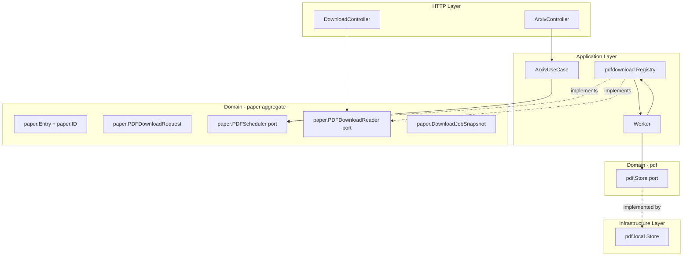
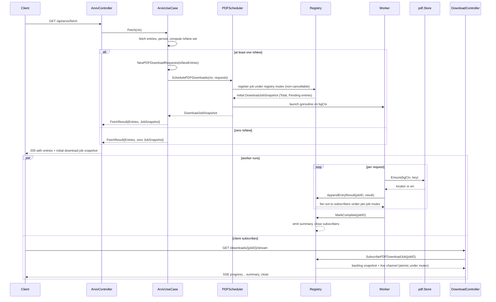
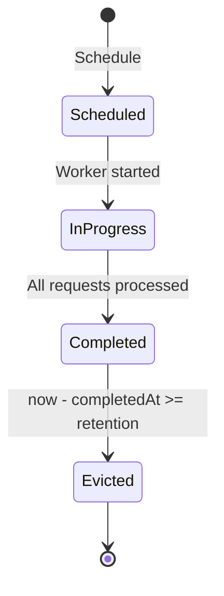

# Design Document: arxiv-pdf-download

## Overview

**Purpose**: After `/api/arxiv/fetch` persists a batch of new arXiv
entries, the Research Monitor backend must download each entry's PDF
into the local artifact store without delaying the fetch response, and
expose per-entry outcomes to the client over a Server-Sent Events
stream and a REST status endpoint.

**Users**: API clients of the Research Monitor backend (the future
frontend is the primary consumer; integration tests and curl-based
operators are secondary). Operators observe lifecycle through the
existing structured-log pipeline.

**Impact**: Extends the `paper` aggregate with a PDF-download port
surface (value objects + `PDFScheduler` / `PDFDownloadReader` ports)
and adds a new `application/pdfdownload` package that implements those
ports. Modifies the arxiv use case and HTTP response, and adds two
HTTP endpoints. The existing `pdf.Store` is reused unchanged. No new
domain aggregate is introduced — orchestration is a paper-context
concern.

### Goals
- Fire-and-forget PDF downloads triggered by the existing arxiv fetch flow.
- Per-entry failure isolation reusing the existing `pdf.Category*` taxonomy.
- Replay-safe SSE stream + REST status endpoint with consistent results.
- Bounded in-memory job state with explicit retention-window eviction.
- Layering preserved: arxiv use case depends on a port in `domain/paper`, never on `pdf.Store` or on `application/pdfdownload`.
- Interface segregation: the scheduler port consumes a small `PDFDownloadRequest` value object, not the whole `paper.Entry`.

### Non-Goals
- User-confirmation flow before downloading. Marked as a single comment at the trigger site.
- Persistence of jobs across process restarts.
- Retry / backoff inside the worker. A seam is reserved for a future policy; a one-line comment at the worker call site notes this.
- Parallel downloads within one job. Sequential for now.
- Re-downloading entries where `IsNew == false`.
- WebSocket transport, push to clients other than the requester, or new auth on the routes.
- Frontend changes.
- A new `domain/pdfdownload` aggregate. Orchestration is application-layer; the ports live in the paper bounded context where they conceptually belong.

## Boundary Commitments

### This Spec Owns
- New value objects on the `paper` aggregate: `paper.ID`, `paper.PDFDownloadRequest`, `paper.DownloadJobID`, `paper.DownloadEntryStatus`, `paper.DownloadEntryResult`, `paper.DownloadJobSnapshot`, `paper.DownloadEvent`.
- New ports on the `paper` aggregate: `paper.PDFScheduler` (write side), `paper.PDFDownloadReader` (read side).
- New error sentinel: `paper.ErrDownloadJobUnknown`.
- A free constructor `paper.IDFromEntry(Entry) ID` for building a `paper.ID` from an existing entry, plus `paper.NewID(source, sourceID, version string) ID` for direct construction.
- A `paper.ID.PDFArtifactKey() string` method that produces the source-scoped artifact identifier used as `pdf.Key.SourceID` (centralizes the previous ad-hoc concatenation rule).
- The implementing in-memory job registry in `application/pdfdownload`: state machine, per-job event log, subscriber fan-out, retention-window eviction.
- A background worker (private to `application/pdfdownload`) that calls `pdf.Store.Ensure` per scheduled request and writes outcomes into the registry.
- The two new HTTP endpoints: `GET /api/arxiv/downloads/:job_id` and `GET /api/arxiv/downloads/:job_id/stream`.
- Extending the existing `arxiv.UseCase.Fetch` return type and the `arxivctrl.FetchResponse` DTO with the initial `DownloadJobSnapshot`.
- The single trigger-site call from the arxiv use case to the scheduler, plus the deferred-decision comment for the future user-confirm flow.
- Job lifecycle log lines (scheduled / completed / evicted / subscriber-dropped) on the existing `shared.Logger`.

### Out of Boundary
- The `pdf.Store` contract. Unchanged. The byte-fetch implementation in `internal/infrastructure/pdf/local` is not modified.
- The `paper.Entry` type itself. No fields, methods, or behavior are added to `Entry`. ID construction lives in free functions on the `paper` package; this preserves the existing "Entry carries no behavior" convention documented in `model.go`.
- The arxiv fetcher (`internal/infrastructure/arxiv`). Unchanged.
- Authentication/authorization on the new routes. They sit under the existing `/api` group and inherit its middleware.
- Persistence of `download_status` to the database.
- The HTTP verb of `/api/arxiv/fetch` (kept as `GET`; see Architecture decisions below).
- Behavior of downstream consumers (extraction, analyzer). They keep reading from `pdf.Store` independently.

### Allowed Dependencies
- `domain/paper` may import: stdlib only. (Existing rule. The new value objects and ports live entirely in the `paper` package and reference no other `domain/<x>` package.)
- `application/pdfdownload` may import: `domain/paper`, `domain/pdf`, `domain/shared`.
- `application/arxiv` may import: `domain/paper`, `domain/shared` (existing). Must NOT import `domain/pdf` or `application/pdfdownload`.
- `internal/http/controller/paper` (new file inside the existing controller area) may import: `domain/paper`, `domain/shared`, `internal/http/common`. Must NOT import `application/pdfdownload`.
- `internal/http/route` may import the application packages it constructs (existing convention).
- `internal/bootstrap/app.go` is the only place the registry is constructed; it is the only file that imports `application/pdfdownload`.

### Revalidation Triggers
- Adding a new fetch trigger site (e.g. a future user-confirmed flow). Forces re-checking the scheduler call invariants and the deferred-decision comment.
- Changing the `pdf.Store.Ensure` signature or its `pdf.Category*` taxonomy. Forces re-checking the worker classifier and SSE event payload.
- Introducing parallelism per job (currently out of scope). Forces re-checking the registry mutex discipline and event ordering guarantees.
- Replacing the in-memory registry with a durable backing store. Forces re-checking the unknown-after-restart contract (R6.4) and the `DownloadJobID` collision window.
- Changing the response shape of `arxivctrl.FetchResponse`. Forces a swag rebuild and re-examination of any consumer that decodes it.
- Adding new fields to `paper.Entry` that should flow into a download decision. Forces re-checking whether `PDFDownloadRequest` needs to grow.

## Architecture

### Existing Architecture Analysis
- Inward-only layering per `structure.md` §2; ports under `domain/<entity>/ports.go`, implementing structs unexported, constructors return interfaces (§4, §7).
- Cross-cutting ports (`Logger`, `Clock`) on `domain/shared`. `log/slog` only. `context.Context` first parameter on every method.
- HTTP composition root: `bootstrap/app.go` builds shared infra and hands it to `route.Setup` via `route.Deps`. Per-resource routers (`<entity>_route.go`) build their own `repo → usecase → controller` chain locally. Swag annotations required on every handler.
- Reusable assets confirmed in `research.md`: `pdf.Store.Ensure` (idempotent + atomic), `pdf.CategoryInvalidKey/Fetch/Store`, `paper.Entry` carrying `Source` / `SourceID` / `Version` / `PDFURL`, `shared.Logger`, `shared.Clock`.

### Architecture Pattern & Boundary Map



**Key decisions**:
- One `Registry` instance owned by the `application/pdfdownload` package implements both `paper.PDFScheduler` (write side) and `paper.PDFDownloadReader` (read side). The arxiv use case sees only the write port; the controller sees only the read port. They never share a Go type with each other.
- The arxiv use case maps `[]paper.Entry` (`IsNew == true`) into `[]paper.PDFDownloadRequest` via a small constructor `paper.NewPDFDownloadRequests(...)` defined in the paper package. The scheduler never sees a full `paper.Entry`.
- `Worker` is private to `application/pdfdownload`. One goroutine per job; entries processed sequentially.
- `GET /api/arxiv/fetch` retained. The added job snapshot field is purely additive (`omitempty`) in the response envelope; no surface migration.
- **Schedule contract is non-cancellable.** `SchedulePDFDownloads` mutates registry state under a mutex without consulting the passed `ctx`. Once the call returns, the job is registered atomically and the worker has been launched on a registry-owned background context. The `ctx` parameter is preserved on the interface for future tracing and to satisfy the project-wide rule that `context.Context` is the first parameter of every port method, but it never short-circuits registration. Schedule returns a non-nil error only when the registry is shut down (R3.5).
- **Subscribe is atomic.** `SubscribePDFDownloadJob` captures the current event log and registers the subscriber channel under the per-job mutex in the same critical section. Once it returns, every event produced by the worker is delivered through exactly one of `backlog` or `live` — never both, never neither (R4.1, R5.4).
- **Slow-subscriber policy: drop, don't block.** Per-subscriber buffered channel of fixed size; on overflow the registry closes the channel and drops the slot. The subscriber observes a closed stream and falls back to the REST status endpoint.
- **Eviction policy: lazy-on-read.** Mutex-guarded read paths sweep expired completed jobs before serving. A `Sweep(ctx, now)` helper is exposed for deterministic tests. No background goroutine in v1.
- **Worker context is detached from the request.** Derived from a registry-owned `context.Background()` with cancel hooked to bootstrap shutdown. The fetch request `ctx` is never propagated to the worker (R3.5).

### Technology Stack

| Layer | Choice / Version | Role in Feature | Notes |
|---|---|---|---|
| Backend / Services | Go 1.25 | Registry, worker, controllers | Existing |
| HTTP | Gin (existing) | SSE via `c.Stream(...)` and standard JSON handlers | First SSE use in repo; helper documented in controller |
| IDs | `github.com/google/uuid` | `DownloadJobID` generation | Already in `tech.md` |
| Persistence | None | Registry is in-memory, lost on restart per R6.4 | No DB schema change |
| Logging | `log/slog` via `shared.Logger` | Job lifecycle (scheduled, entry-completed, completed, evicted, subscriber-dropped) | Existing port |
| Clock | `shared.Clock` | Retention-window comparisons | Existing port |
| Swag | `github.com/swaggo/swag` | Annotations on three handlers (extended Fetch + two new) | Run `task swag` |

## File Structure Plan

### Directory Structure
```
backend/internal/
├── domain/
│   └── paper/
│       ├── model.go         # MODIFIED: add paper.ID value object; add NewID and IDFromEntry
│       │                    #           free functions; add (ID).PDFArtifactKey() method.
│       │                    #           Entry itself unchanged.
│       ├── download.go      # NEW: PDFDownloadRequest, DownloadJobID, DownloadEntryStatus,
│       │                    #      DownloadEntryResult, DownloadJobSnapshot, DownloadEvent,
│       │                    #      NewPDFDownloadRequests constructor
│       ├── ports.go         # MODIFIED: add PDFScheduler and PDFDownloadReader ports
│       └── errors.go        # MODIFIED: add ErrDownloadJobUnknown
├── application/
│   └── pdfdownload/         # NEW package; implements paper.PDFScheduler + paper.PDFDownloadReader
│       ├── service.go       # Registry struct + NewRegistry constructor; implements both ports
│       ├── service_test.go  # Unit tests: schedule, success/fail, completion, eviction, slow subscriber, atomic subscribe
│       ├── worker.go        # Per-job goroutine: iterates requests, calls pdf.Store.Ensure
│       └── classifier.go    # error -> (status, category, description) using pdf.ErrInvalidKey/ErrFetch/ErrStore
└── http/
    ├── controller/
    │   └── paper/                          # existing convention area
    │       └── pdfdownload_controller.go   # NEW: SSE handler + status handler with swag annotations
    │       └── pdfdownload_responses.go    # NEW: JobStatusEnvelope, EntryResultDTO, ProgressEventDTO, SummaryEventDTO
    │       └── pdfdownload_controller_test.go
    └── route/
        └── pdfdownload_route.go            # NEW: registers GET /arxiv/downloads/:job_id and /:job_id/stream
```

```
backend/tests/
├── mocks/
│   ├── paper_pdf_scheduler.go     # NEW: hand-written fake paper.PDFScheduler for arxiv use case tests
│   └── pdf_store.go               # NEW (if not present): fake pdf.Store for application/pdfdownload tests
└── integration/
    └── arxiv_pdf_download_test.go # NEW: end-to-end: fetch -> SSE replay -> summary -> status endpoint
```

### Modified Files
- `backend/internal/domain/paper/model.go` — add `paper.ID` value object (`Source`, `SourceID`, optional `Version`); add free functions `NewID` and `IDFromEntry`; add method `(ID).PDFArtifactKey() string`. `Entry` itself is not modified — no methods, no fields.
- `backend/internal/domain/paper/ports.go` — add `PDFScheduler` and `PDFDownloadReader` interfaces (alongside existing `Fetcher` and `Repository`).
- `backend/internal/domain/paper/errors.go` — add `ErrDownloadJobUnknown` sentinel.
- `backend/internal/application/arxiv/usecase.go` — accept `paper.PDFScheduler` in `NewArxivUseCase`. After the persistence loop, build the `IsNew` slice, call `paper.NewPDFDownloadRequests(...)` to map to requests, then call `scheduler.SchedulePDFDownloads`. Carry the deferred-decision comment at this call site.
- `backend/internal/application/arxiv/usecase_test.go` — inject the fake scheduler; assert it is called with only `IsNew` requests on success and not called on persistence failure.
- `backend/internal/http/route/route.go` — add `DownloadConfig{Reader paper.PDFDownloadReader}` to `Deps`. Extend `ArxivConfig` with `Scheduler paper.PDFScheduler`. Register the new download router in `Setup`.
- `backend/internal/http/route/arxiv_route.go` — pass `d.Arxiv.Scheduler` into `arxivapp.NewArxivUseCase`.
- `backend/internal/http/controller/arxiv/controller.go` — extend the response with the initial `DownloadJobSnapshot` (omitempty when nothing scheduled). Update swag annotations and `FetchEnvelope`.
- `backend/internal/http/controller/arxiv/responses.go` — add the snapshot field to the response struct and the mapper from `arxivapp.FetchResult` to wire shape.
- `backend/internal/bootstrap/app.go` — construct one registry; pass it as `paper.PDFScheduler` into `route.ArxivConfig` and as `paper.PDFDownloadReader` into `route.DownloadConfig`. Register a shutdown hook that cancels the registry-owned context and drains in-flight workers.
- `backend/internal/bootstrap/env.go` — add two fields: `PDFDownloadRetention time.Duration` (default 5 minutes), `PDFDownloadSubscriberBuffer int` (default 32). Tagged for viper.
- `backend/docs/` — regenerated by `task swag` after annotations change.

## System Flows

### Trigger and Lifecycle (sequence)



### Job State



Decisions:
- `Scheduled` is an instantaneous state; the worker transitions to `InProgress` synchronously inside `SchedulePDFDownloads` before returning.
- `InProgress → Completed` is atomic with the final `DownloadEvent.Summary` append; subscribers always observe the summary as the last event before close.
- `Evicted` is realized on the next read after the retention window elapses; tests can force it via `Sweep`.

## Requirements Traceability

| Requirement | Summary | Components | Interfaces | Flows |
|---|---|---|---|---|
| 1.1 | Schedule on success with IsNew>0 | `ArxivUseCase`, `Registry` | `paper.PDFScheduler.SchedulePDFDownloads` | Trigger sequence (alt branch 1) |
| 1.2 | No job when zero IsNew | `ArxivUseCase` | empty requests slice short-circuit | Trigger sequence (alt branch 2) |
| 1.3 | No job on fetch/persist failure | `ArxivUseCase` | early-return path | Trigger sequence (precondition) |
| 1.4 | Visible deferred-decision comment | `ArxivUseCase` (trigger site) | source comment | n/a |
| 2.1 | Non-blocking fetch response | `ArxivController`, `Registry` | `SchedulePDFDownloads` returns immediately | Trigger sequence |
| 2.2 | job_id + scheduled list in response | `ArxivController`, `arxivctrl.FetchResponse` | `DownloadJobSnapshot` | Trigger sequence |
| 2.3 | Unique job_id within retention window | `Registry` | `uuid.NewString()` + registry uniqueness check | n/a |
| 2.4 | Concurrent fetches independent | `Registry` | mutex discipline | n/a |
| 3.1 | Per-entry attempts | `Worker`, `pdf.Store` | `Worker.run` loop | Trigger sequence (par) |
| 3.2 | Success records bytes | `Worker`, `Classifier` | `DownloadEntryResult.Bytes` | Trigger sequence (par) |
| 3.3 | Failure records category + description; loop continues | `Worker`, `Classifier`, `Registry` | `DownloadEntryResult.Status/Category/Description` | Trigger sequence (par) |
| 3.4 | No duplicate artifacts | `pdf.Store` (existing idempotency) | `Store.Ensure` | n/a |
| 3.5 | Request cancel does not cancel job | `Registry`, `Worker` | non-cancellable Schedule + bgCtx worker | Architecture key decision |
| 4.1 | Replay buffered events | `Registry`, `DownloadController` | `SubscribePDFDownloadJob` returns (backlog, channel) atomically | SSE branch |
| 4.2 | download.progress event payload | `Worker`, `DownloadController` | `ProgressEventDTO` | SSE branch |
| 4.3 | Terminal download.summary then close | `Registry`, `DownloadController` | live channel close after `Summary` event | State diagram, SSE branch |
| 4.4 | Disconnect isolated | `DownloadController`, `Registry` | per-subscriber channel + context.Done watch | SSE branch |
| 4.5 | Unknown/expired job → client error | `Registry`, `DownloadController` | `ErrDownloadJobUnknown` → 404 | n/a |
| 4.6 | Server-push only | `DownloadController` | SSE transport | n/a |
| 5.1 | Status endpoint per-job aggregate + per-entry list | `Registry`, `DownloadController` | `SnapshotPDFDownloadJob` | n/a |
| 5.2 | Partial results while in progress | `Registry` | snapshot semantics | State diagram |
| 5.3 | Unknown/expired status request → client error | `Registry`, `DownloadController` | `ErrDownloadJobUnknown` → 404 | n/a |
| 5.4 | Stream and status consistent | `Registry` | atomic snapshot+subscribe under same mutex | Architecture key decision |
| 6.1 | Retain in-progress jobs | `Registry` | retention applies only after completion | State diagram |
| 6.2 | Retention window after completion | `Registry`, `Sweep` | `Retention` config | State diagram |
| 6.3 | Unknown after eviction | `Registry` | `Sweep` then read | State diagram |
| 6.4 | Restart loses jobs | `Registry` | in-memory only | n/a |
| 6.5 | Lifecycle logging | `Registry` | `shared.Logger` events | n/a |

## Components and Interfaces

| Component | Domain/Layer | Intent | Req Coverage | Key Dependencies (P0/P1) | Contracts |
|---|---|---|---|---|---|
| `paper.ID` | domain value object | Stable identity for a paper across sources | structural | stdlib (P0) | n/a |
| `paper.PDFDownloadRequest` | domain value object | Minimal payload the scheduler consumes | 1.1, 2.2, 3.1 | `paper.ID` (P0) | n/a |
| `paper.PDFScheduler` | domain port | Write-side: register a job + initial snapshot | 1.1, 1.2, 2.1, 2.2, 2.3, 3.5 | `Registry` impl (P0) | Service |
| `paper.PDFDownloadReader` | domain port | Read-side: snapshot + subscribe atomically | 4.1, 4.5, 5.1, 5.2, 5.3, 5.4, 6.3 | `Registry` impl (P0) | Service |
| `Registry` | application | In-memory state, fan-out, eviction | 2.3, 2.4, 3.5, 4.1, 4.3, 4.4, 5.4, 6.* | `shared.Logger` (P0), `shared.Clock` (P0) | Service, State |
| `Worker` | application | Per-job goroutine, calls `pdf.Store.Ensure` | 3.1, 3.2, 3.3, 4.2, 4.3 | `pdf.Store` (P0), `Classifier` (P0) | Batch |
| `Classifier` | application | Maps `pdf.Err*` to `(status, category, description)` | 3.2, 3.3 | `domain/pdf` constants (P0) | Service |
| `ArxivUseCase` (modified) | application | Trigger site for scheduler | 1.1–1.4, 2.1, 2.2 | `paper.PDFScheduler` (P0), `paper.Repository` (P0), `paper.Fetcher` (P0) | Service |
| `ArxivController` (modified) | http | Surfaces job snapshot in response | 2.2 | `ArxivUseCase` (P0) | API |
| `DownloadController` | http | SSE + status endpoints | 4.*, 5.*, 6.5 | `paper.PDFDownloadReader` (P0) | API |
| `Bootstrap` (modified) | bootstrap | Constructs registry; wires shutdown | 3.5, 6.4 | `pdfStore`, `logger`, `clock`, `env` (P0) | n/a |

### Domain — `domain/paper` (extensions)

**Responsibilities**: Define the value objects, ports, and sentinel needed by the arxiv use case (caller) and the registry implementation (callee). No behavior beyond constructors and validators. No infrastructure imports.

**Service Interface (Go)**
```go
package paper

import (
    "context"
    "time"
)

// ID is the stable identity of a paper across sources.
// Source + SourceID is unique within the catalogue. Version is part of
// identity for sources where each version is materialized separately
// (arXiv treats v1, v2, ... as distinct PDFs).
type ID struct {
    Source   string
    SourceID string
    Version  string
}

func (i ID) Validate() error { /* non-empty Source + SourceID; no path chars */ }
func (i ID) String() string  { /* "<source>:<id>[v<version>]" */ }

// PDFArtifactKey returns the source-scoped artifact identifier used as
// the SourceID of pdf.Key. For arXiv this is "<id><version>", e.g.
// "2404.12345v1". Centralizing the rule here prevents cache-key drift
// between the worker and any other call site that builds a pdf.Key.
func (i ID) PDFArtifactKey() string { /* arXiv: i.SourceID + i.Version */ }

// NewID is the direct constructor.
func NewID(source, sourceID, version string) ID { return ID{source, sourceID, version} }

// IDFromEntry is the convenience constructor when an Entry is in scope.
// Lives as a free function (not a method on Entry) to preserve the
// "Entry carries no behavior" convention documented in model.go.
func IDFromEntry(e Entry) ID { return ID{Source: e.Source, SourceID: e.SourceID, Version: e.Version} }

// PDFDownloadRequest is the minimal payload the scheduler consumes.
// Carrying just (PaperID, PDFURL) keeps the port interface-segregated
// from the rest of paper.Entry.
type PDFDownloadRequest struct {
    PaperID PDFDownloadRequestID // alias of ID; named for callsite clarity
    PDFURL  string
}

type PDFDownloadRequestID = ID

// NewPDFDownloadRequests builds requests from entries. The caller is
// responsible for filtering to IsNew==true entries before calling.
// Returns an empty slice if entries is empty.
func NewPDFDownloadRequests(entries []Entry) []PDFDownloadRequest { /* ... */ }

type DownloadJobID string

type DownloadEntryStatus string

const (
    DownloadStatusPending DownloadEntryStatus = "pending"
    DownloadStatusSuccess DownloadEntryStatus = "success"
    DownloadStatusFailed  DownloadEntryStatus = "failed"
)

type DownloadEntryResult struct {
    PaperID     ID
    Status      DownloadEntryStatus
    Bytes       int       // populated on success
    Category    string    // populated on failure (mirrors pdf.Category*)
    Description string    // populated on failure (sanitized human-readable)
    CompletedAt time.Time // zero on Pending
}

type DownloadJobSnapshot struct {
    JobID       DownloadJobID
    Total       int
    Succeeded   int
    Failed      int
    Completed   bool
    CompletedAt time.Time
    Entries     []DownloadEntryResult
}

// DownloadEvent is a sum type carried over Subscribe channels.
// Exactly one of Progress / Summary is non-nil per emission. Summary
// is emitted last; the channel closes immediately after.
type DownloadEvent struct {
    JobID    DownloadJobID
    Progress *DownloadEntryResult
    Summary  *DownloadJobSnapshot
}

// PDFScheduler is the write-side port consumed by callers that want
// to dispatch a batch of PDF downloads.
//
// Contract:
//   - Schedule mutates registry state under its own mutex and DOES NOT
//     consult ctx for that mutation. Once Schedule returns, the job is
//     registered atomically and the worker has been launched on a
//     registry-owned background context. (R3.5)
//   - With an empty requests slice, Schedule returns a zero
//     DownloadJobSnapshot and a nil error; no job is created. (R1.2)
//   - The returned snapshot has Total set, Entries fully populated with
//     DownloadStatusPending, and Completed == false. (R2.2)
//   - Schedule returns a non-nil error only when the registry is
//     shutting down.
type PDFScheduler interface {
    SchedulePDFDownloads(ctx context.Context, requests []PDFDownloadRequest) (DownloadJobSnapshot, error)
}

// PDFDownloadReader is the read-side port consumed by HTTP controllers.
//
// Contract:
//   - SnapshotPDFDownloadJob returns ErrDownloadJobUnknown when the job
//     id is unknown or evicted. (R4.5, R5.3)
//   - SubscribePDFDownloadJob captures the current event log and
//     registers the subscriber channel under the same per-job mutex,
//     atomically. Once it returns, every event produced by the worker
//     is delivered through exactly one of backlog or live - never
//     both, never neither. (R4.1, R5.4)
//   - The live channel is closed after the Summary event is delivered,
//     or when the subscriber is dropped under the slow-consumer policy.
type PDFDownloadReader interface {
    SnapshotPDFDownloadJob(ctx context.Context, id DownloadJobID) (DownloadJobSnapshot, error)
    SubscribePDFDownloadJob(ctx context.Context, id DownloadJobID) (backlog []DownloadEvent, live <-chan DownloadEvent, err error)
}
```

**Errors**: `paper.ErrDownloadJobUnknown = errors.New("paper: download job unknown")`. The download controller wraps it into the existing `*shared.HTTPError` envelope (404) before returning, so the existing error middleware handles status mapping.

### Application — `application/pdfdownload`

**Responsibilities**: One unexported `registry` struct implements `paper.PDFScheduler` and `paper.PDFDownloadReader` simultaneously. Mutex-guarded state. Workers are private goroutines spawned by `Schedule`. Each entry result is appended atomically with subscriber fan-out (R5.4).

**State**
- `jobs map[paper.DownloadJobID]*job` guarded by `sync.Mutex` (single mutex; `Subscribe` is rare, RWMutex savings would be marginal and the mutex is the simpler invariant).
- Each `*job`: `id`, `total`, `entries []paper.DownloadEntryResult`, `events []paper.DownloadEvent` (full event log; bounded by `total + 1`), `subscribers []chan paper.DownloadEvent`, `completed bool`, `completedAt time.Time`, plus a per-job mutex for entry append ordering.
- Per-subscriber channel: buffered size `subscriberBuffer` (default 32). On send overflow the registry closes the channel and drops the slot. The subscriber observes a closed channel; the controller sends a final SSE error frame and ends the response.
- **Fan-out uses a non-blocking send per subscriber**, ensuring the worker is never blocked by a slow client:
  ```go
  select {
  case sub.ch <- ev:
  default:
      close(sub.ch)
      // remove sub; emit pdfdownload.subscriber.dropped (slow_consumer)
  }
  ```
  This is the correctness reason that the slow-subscriber-drop policy actually drops rather than stalls the worker.
- Top-level `bgCtx` (with `cancel`) constructed once at registry creation; workers derive from it; bootstrap shutdown calls `cancel`.

**Schedule contract (implementation detail)**
1. Build a fresh job under registry-mutex: `uuid.NewString()`, populate `entries` as `Pending` for every request.
2. Initialise the per-job mutex, the empty event log, the empty subscribers slice.
3. Launch the worker goroutine with `bgCtx`.
4. Build the initial `DownloadJobSnapshot` from the in-progress job under the registry mutex.
5. Release the mutex and return the snapshot.

The passed `ctx` is never observed during steps 1–4. This is the correctness reason that a client disconnecting during the (very small) registration window cannot lose a job (R3.5).

**Subscribe contract (implementation detail)**
Under the per-job mutex:
1. If the job is unknown or evicted, return `paper.ErrDownloadJobUnknown`.
2. Snapshot `events` into a returned `backlog` slice (copy).
3. Allocate a buffered channel of size `subscriberBuffer`, append it to `subscribers`.
4. Release the mutex and return.

Because steps 2 and 3 happen in the same critical section, the worker's next `Append` either finds the new subscriber and fans out (the event arrives via `live`) or it has already appended (the event was in `backlog`). The two cases are mutually exclusive (R4.1, R5.4).

**Worker contract**
- Single goroutine per job. Iterates `requests` in submission order.
- For each request: build `pdf.Key{SourceType: req.PaperID.Source, SourceID: req.PaperID.PDFArtifactKey(), URL: req.PDFURL}`, call `Store.Ensure(bgCtx, key)`, classify outcome via `Classifier`, build a `DownloadEntryResult`, append it to the registry under per-job mutex, fan out a `DownloadEvent{Progress: &result}` using the non-blocking send pattern documented above.
- After the loop: build the final `DownloadJobSnapshot`, append a `DownloadEvent{Summary: &summary}`, mark `completed = true`, set `completedAt = clock.Now()`, close every subscriber channel.
- A short `// TODO: future retry/backoff seam` comment precedes the `Ensure` call. No implementation today (Non-Goal).

**Classifier**
```go
func classify(err error, bytes int) (paper.DownloadEntryStatus, string, string) {
    switch {
    case err == nil:
        return paper.DownloadStatusSuccess, "", ""
    case errors.Is(err, pdf.ErrInvalidKey):
        return paper.DownloadStatusFailed, pdf.CategoryInvalidKey, sanitize(err)
    case errors.Is(err, pdf.ErrFetch):
        return paper.DownloadStatusFailed, pdf.CategoryFetch, sanitize(err)
    case errors.Is(err, pdf.ErrStore):
        return paper.DownloadStatusFailed, pdf.CategoryStore, sanitize(err)
    default:
        return paper.DownloadStatusFailed, "unknown", sanitize(err)
    }
}
```
- `sanitize` strips secrets and absolute paths; trims to a fixed length suitable for an SSE frame.

**Sweep**
- `Sweep(ctx, now)` walks `jobs`; if `completed && now.Sub(completedAt) >= retention`, deletes the entry and logs `pdfdownload.job.evicted`.
- Read paths (`SnapshotPDFDownloadJob`, `SubscribePDFDownloadJob`) call `sweepLocked(now)` before lookup so an expired job returns `ErrDownloadJobUnknown` even without a background ticker.

**Construction**
```go
func NewRegistry(
    store pdf.Store,
    logger shared.Logger,
    clock shared.Clock,
    opts Options,
) (*Registry, ShutdownFunc)
```
- `Options{Retention time.Duration; SubscriberBuffer int}`.
- `*Registry` exposes both `paper.PDFScheduler` and `paper.PDFDownloadReader` (the same struct satisfies both).
- `ShutdownFunc(ctx)` cancels `bgCtx` and waits for in-flight workers, bounded by `ctx`.

**Implementation Notes**
- Integration: bootstrap constructs one registry and passes it to both `route.ArxivConfig.Scheduler` and `route.DownloadConfig.Reader`.
- Validation: `Schedule` skips requests that fail `req.PaperID.Validate()` (defense-in-depth; the worker's downstream `pdf.Key.Validate()` would also catch them and surface a per-entry `failed/invalid_key` event).
- Risks: `events []DownloadEvent` grows linearly with entry count; bounded by job size in practice. Subscriber channel buffer = 32 is a heuristic; adjust by env without recompiling.

### Application — `application/arxiv` (modification)

**Modified signature**
```go
func NewArxivUseCase(
    fetcher paper.Fetcher,
    repo paper.Repository,
    log shared.Logger,
    query paper.Query,
    scheduler paper.PDFScheduler, // NEW
) UseCase
```

**Modified return type**
```go
type FetchResult struct {
    Entries []Result                     // existing per-entry IsNew result
    Job     paper.DownloadJobSnapshot    // zero value when no IsNew entries
}

type UseCase interface {
    Fetch(ctx context.Context) (FetchResult, error)
}
```

**Behavior**
- After the existing per-entry persistence loop completes successfully, collect the `Entry` values for which `Save` returned `IsNew == true`.
- Build requests via `paper.NewPDFDownloadRequests(...)`.
- Call `scheduler.SchedulePDFDownloads(ctx, requests)`. The fetch request `ctx` is passed only because the port signature requires it; the scheduler does not use it for cancellation.
- A single source comment precedes the call:
  > `// Trigger location may move behind an explicit user-confirmation step in a future spec.`
- If `Schedule` returns an error (registry shut down, etc.), log at `Error` and return the entries with a zero `DownloadJobSnapshot`. The fetch HTTP response still succeeds; the operator log carries the operational signal.

### HTTP — `internal/http/controller/arxiv` (modification)

**Modified `arxivctrl.FetchResponse`**
```go
type FetchResponse struct {
    FetchedAt string                       `json:"fetched_at"`
    Entries   []EntryDTO                   `json:"entries"`
    Job       *DownloadJobSnapshotDTO      `json:"job,omitempty"` // nil when zero IsNew
}
```
- `Job` is `omitempty`. When zero `IsNew` entries, the response is identical to today (R1.2 backward-compat by accident).
- `DownloadJobSnapshotDTO` mirrors `paper.DownloadJobSnapshot` (`job_id`, `total`, `succeeded`, `failed`, `completed`, `completed_at`, `entries[]`).
- Swag annotation block extended; `task swag` regenerated.

### HTTP — `internal/http/controller/paper` (new — pdfdownload subset)

**API Contract**
| Method | Endpoint | Request | Response | Errors |
|---|---|---|---|---|
| GET | `/api/arxiv/downloads/:job_id` | path `job_id` | `JobStatusEnvelope` | 404 (unknown/expired) |
| GET | `/api/arxiv/downloads/:job_id/stream` | path `job_id` | SSE event stream | 404 (unknown/expired) |

**Status response (`JobStatusEnvelope`)**
```jsonc
{
  "data": {
    "job_id": "9b9e...",
    "total": 12,
    "succeeded": 10,
    "failed": 2,
    "completed": true,
    "completed_at": "2026-05-09T10:11:12Z",
    "entries": [
      {"paper_id":{"source":"arxiv","source_id":"2404.12345","version":"v1"},"status":"success","bytes":482113,"completed_at":"..."},
      {"paper_id":{"source":"arxiv","source_id":"2404.99999","version":"v1"},"status":"failed","category":"fetch","description":"upstream timeout","completed_at":"..."}
    ]
  }
}
```

**SSE wire format**
```
event: download.progress
data: {"paper_id":{"source":"arxiv","source_id":"2404.12345","version":"v1"},"status":"success","bytes":482113}

event: download.progress
data: {"paper_id":{"source":"arxiv","source_id":"2404.99999","version":"v1"},"status":"failed","category":"fetch","description":"upstream timeout"}

event: download.summary
data: {"total":12,"succeeded":10,"failed":2}
```
- After `download.summary` the server closes the connection.
- Client disconnect (request `ctx.Done()` via `c.Request.Context()`) terminates the handler without affecting the underlying job (R4.4).
- On `paper.ErrDownloadJobUnknown` from `SubscribePDFDownloadJob`, the handler responds with HTTP 404 before sending any SSE frame (R4.5).
- The handler relies on Gin's `c.Stream(func(w io.Writer) bool {...})` pattern. Each call writes via `c.SSEvent(name, data)` and returns `true` while events remain. The standard headers (`Content-Type: text/event-stream`, `Cache-Control: no-cache`, `Connection: keep-alive`) are set explicitly before streaming.

### Bootstrap (modification)

```go
// app.go (excerpt — illustrative)
registry, registryShutdown := pdfdownload.NewRegistry(
    pdfStore, logger, clock,
    pdfdownload.Options{
        Retention:        env.PDFDownloadRetention,
        SubscriberBuffer: env.PDFDownloadSubscriberBuffer,
    },
)
deps := route.Deps{
    ...
    Arxiv:    route.ArxivConfig{Fetcher: arxivFetcher, Query: q, Scheduler: registry},
    Download: route.DownloadConfig{Reader: registry},
    ...
}
shutdownHooks = append(shutdownHooks, registryShutdown)
```

- `route.ArxivConfig` grows a `Scheduler paper.PDFScheduler` field; `route.PaperConfig`, `PDFConfig` unchanged.
- `route.DownloadConfig{Reader paper.PDFDownloadReader}` is new.
- `registryShutdown(ctx)` cancels `bgCtx` and waits for workers to finish (or `ctx` deadline).

## Data Models

### Domain Model
- Aggregate root: `paper.Entry` (existing). Identity now exposed via `paper.ID`.
- New value objects on the aggregate: `PDFDownloadRequest`, `DownloadJobID`, `DownloadEntryStatus`, `DownloadEntryResult`, `DownloadJobSnapshot`, `DownloadEvent`. None are aggregate roots; they are transient projections of "the paper is having its PDF materialized".
- Invariants enforced by the registry implementation:
  - `len(events) == len(entries) + (1 if completed else 0)`
  - `completed == true → events[len(events)-1].Summary != nil && all subscriber channels closed`
  - `len(entries) == total → completed == true` immediately after the worker emits the summary

### Logical / Physical Data Model
- No persisted schema. Registry state lives in process memory; lost on restart per R6.4.

### Data Contracts & Integration
- API JSON contracts defined inline above (status envelope and SSE frames).
- No event bus integration; SSE is the only inter-process channel.

## Error Handling

### Strategy
- Domain sentinels: `paper.ErrDownloadJobUnknown`. Other failure modes are per-entry data, not request-level errors.
- HTTP boundary: the existing `interface/http/common` envelope middleware translates `*shared.HTTPError` sentinels. The download controller wraps `ErrDownloadJobUnknown` into `shared.HTTPError{Code: 404, Message: "download job unknown"}` before returning.
- Worker errors are observable, not fatal: every `pdf.Ensure` failure becomes a `DownloadEntryResult{Status: failed, Category, Description}` and a `download.progress` event. The job continues. The job summary always emits.

### Categories and Responses
- **User errors (4xx)**: 404 unknown job (R4.5, R5.3).
- **System errors (5xx)**: registry shutdown is logged; `Schedule` returning an error is logged but the fetch response still succeeds with empty `DownloadJobSnapshot`.
- **Business logic errors**: per-entry `failed` outcome with a category from `pdf.Category*`.

### Monitoring
Lifecycle log keys (level: Info unless noted):
- `pdfdownload.job.scheduled` — `job_id`, `total`, `paper_ids`.
- `pdfdownload.entry.completed` — `job_id`, `paper_id`, `status`, `bytes` or `category`+`description` (level: Warn on failure).
- `pdfdownload.job.completed` — `job_id`, `total`, `succeeded`, `failed`, `duration_ms`.
- `pdfdownload.job.evicted` — `job_id`, `age_ms`.
- `pdfdownload.subscriber.dropped` — `job_id`, reason `slow_consumer` (level: Warn).

## Testing Strategy

### Unit Tests (`application/pdfdownload`)
- Schedule with empty requests returns zero `DownloadJobSnapshot` and creates no job (1.2).
- Schedule with N requests returns a unique `DownloadJobID` and an initial snapshot reporting `Total=N, Completed=false, Entries all Pending` immediately (2.2, 2.3, 6.1).
- Worker records `DownloadEntryResult{Status: success, Bytes>0}` on `Store.Ensure` returning a locator with bytes (3.1, 3.2).
- Worker records `DownloadEntryResult{Status: failed, Category: "fetch"}` on `Store.Ensure` returning `pdf.ErrFetch` and continues to the next entry (3.3).
- Subscriber that connects after first entry result receives the buffered event then live events ending in summary, then channel close (4.1, 4.3).
- Subscriber that fails to drain its channel beyond `SubscriberBuffer` is dropped without blocking the worker (4.4).
- **Atomic Subscribe under contention**: spawn N concurrent Subscribers while the worker emits; assert each subscriber sees exactly one delivery of every event, with `-race` (4.1, 5.4).
- Schedule under a cancelled `ctx` still registers the job and runs the worker to completion (3.5).
- Sweep evicts only completed jobs older than retention; in-progress jobs are retained (6.1, 6.2, 6.3).

### Unit Tests (`application/arxiv`, modified)
- `Fetch` calls `SchedulePDFDownloads` once with only `IsNew` requests on the success path (1.1).
- `Fetch` does not call `SchedulePDFDownloads` when no entry is `IsNew` (1.2).
- `Fetch` does not call `SchedulePDFDownloads` when persistence fails (1.3).

### Unit Tests (`http/controller/paper` — pdfdownload subset)
- Stream handler returns 404 when `SubscribePDFDownloadJob` returns `ErrDownloadJobUnknown` (4.5).
- Stream handler writes replayed events before live events and closes after summary (4.1, 4.3).
- Status handler returns the snapshot JSON consistent with the events seen on the stream for the same job (5.4).

### Integration Tests (`tests/integration/`, build tag `integration`)
- End-to-end: stub arxiv fetcher returns N entries with valid `PDFURL`s served by an `httptest.Server` returning small PDF bytes; client calls `GET /api/arxiv/fetch`, receives an initial snapshot with `job_id`, then opens `/downloads/{job_id}/stream`, receives N `download.progress` events plus `download.summary`, then `GET /downloads/{job_id}` matches.
- Failure variant: one URL returns 500, the rest succeed; per-entry results carry the right categories.
- Concurrency: two parallel `GET /api/arxiv/fetch` calls produce distinct job IDs and independent streams.
- Race detector enabled (`go test -race`).

### Performance / Load
- Out of scope for v1. The TODO comment near the worker `Ensure` call notes that retry/backoff and parallelism are future work.

## Optional Sections

### Security Considerations
- The new endpoints sit under the existing `/api` group and inherit the `APIToken` middleware, so authentication is unchanged. `DownloadJobID` is a UUIDv4 — guessing brute-force is the same risk profile as any other bearer-style identifier under the existing token gate.
- `description` strings sent over SSE/JSON are sanitized by the classifier to strip filesystem paths and any embedded credentials before reaching clients. No fetch error message is forwarded raw.

### Performance & Scalability
- Memory: O(jobs · entries) for retained job state; eviction window bounds it. With default 5-minute retention and typical arxiv batches under 100 entries, peak footprint is tens of KB per job.
- Latency added to `/api/arxiv/fetch`: dominated by `Schedule` registration only (one map insert + one goroutine launch). No network I/O in the synchronous path.
- Throughput: sequential per job is fine for ≤100-entry batches typical of arXiv; parallelism is recorded as a future seam.

### Migration Strategy
- No data migration. Adding the `job` field to the fetch response is additive (`omitempty`); existing clients ignore unknown fields.
