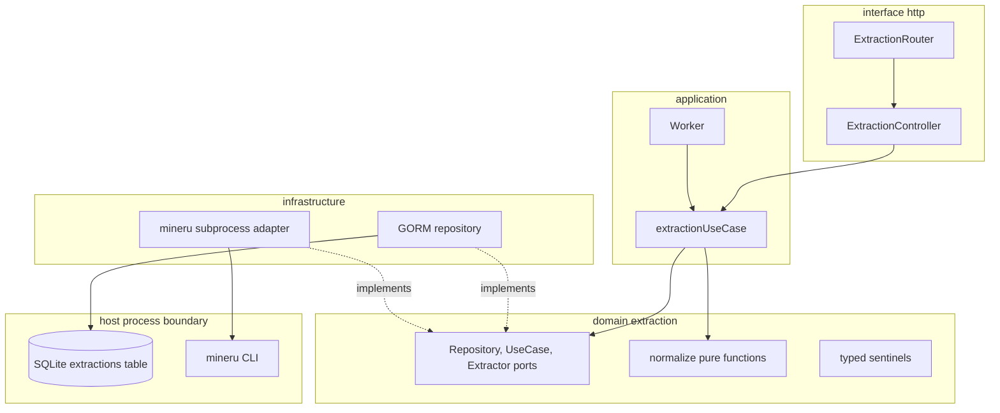
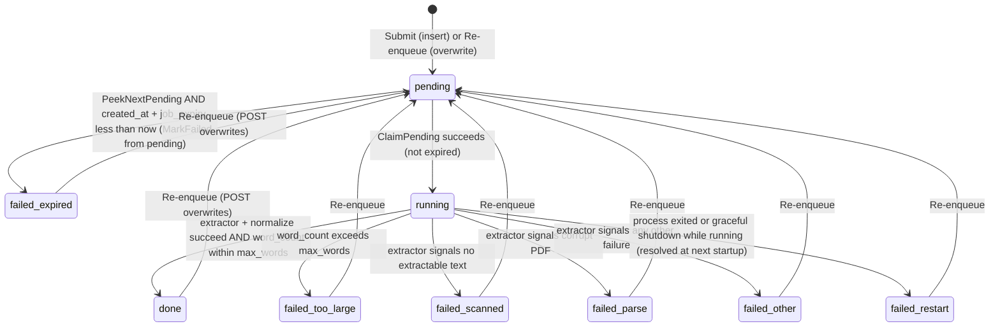
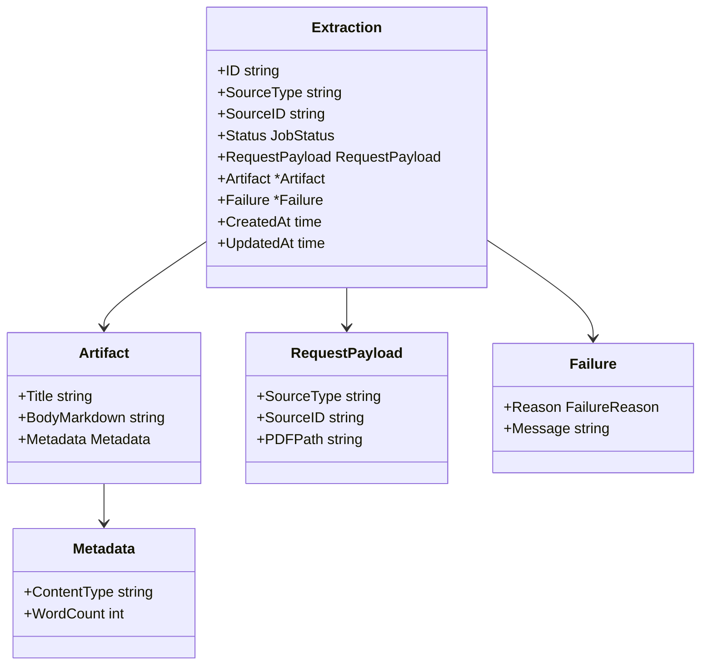

# Design Document — document-extraction

## Overview

**Purpose**: Convert a local PDF identified by `(source_type, source_id, pdf_path)` into a normalized, math-faithful Markdown artifact that downstream LLM summarization can consume, on an asynchronous request/poll lifecycle that tolerates restart and a multi-minute extractor latency profile.

**Users**: The single researcher running the personal DeFi research monitor backend, calling the authenticated `/api` group either directly (curl / scripts) or, later, from a future "fetch + persist + extract" pipeline that supplies the `pdf_path` after downloading the PDF.

**Impact**: Introduces the first asynchronous job-bearing aggregate in the backend (`extraction`), the first subprocess-based outbound adapter (MinerU), and the first per-process worker goroutine wired through `bootstrap/app.go`. The existing `paper` and `source` aggregates are not modified; the only shared coupling is the convention that `(source_type, source_id)` mirrors the same pair already used by `paper-persistence`.

### Goals

- An authenticated, async HTTP contract (`POST /api/extractions`, `GET /api/extractions/:id`) that returns within HTTP timeouts even when the underlying extractor takes minutes.
- A single canonical Markdown output shape regardless of which extractor implementation produced it: math wrapped as `$...$` / `$$...$$`, references stripped, tables/images/figure-captions removed, whitespace word count, deterministic title selection.
- A typed, mutually-exclusive failure taxonomy (`scanned_pdf`, `parse_failed`, `extractor_failure`, `too_large`, `expired`, `process_restart`) that callers can branch on without parsing free-form text.
- Race-safe one-artifact-per-`(source_type, source_id)` invariant enforced at the storage layer; idempotent overwrite-in-place re-extraction.
- A restart-recovery contract that guarantees no extraction sits in `running` after a process restart and any `pending` row resumes without operator intervention.

### Non-Goals

- PDF acquisition / download; HTML or non-PDF source extraction; OCR / scanned-PDF rescue; preservation of tables, images, figure captions, equations beyond what the extractor emits natively.
- Batch / fan-out submission, LLM summarization, thesis-angle flagging, webhooks, push notifications.
- Automatic retry of failed jobs; multi-worker concurrency; cancellation endpoints; background expiry sweepers; auto-purge of completed rows.
- Schema or behavioural changes to `paper-persistence` or `arxiv-fetcher`; foreign keys between `extractions` and `papers`.
- Operator install of the underlying extractor binary; `mineru` is a host prerequisite documented but not bundled.

## Boundary Commitments

### This Spec Owns

- The `extraction` aggregate (`internal/domain/extraction/`): `Artifact`, `RequestPayload`, `JobStatus`, `FailureReason` value types; `Repository`, `UseCase`, and `Extractor` ports; aggregate-scoped `*shared.HTTPError` sentinels.
- The pure-domain normalization rules (math delimiter unification, references stripping, table/image/figure-caption skipping, word count, title selection).
- The application use case orchestrating enqueue, re-enqueue, expiry check, normalization, persistence, and status reporting.
- The persistence adapter (single `extractions` table) and the storage-level uniqueness invariant on `(source_type, source_id)`.
- The MinerU subprocess adapter and the contract for typed-error classification from CLI exit codes / stderr.
- The single-worker goroutine, the buffered signal channel that wakes it, and the lifecycle wiring (recovery flip → per-pending self-signal → goroutine launch → graceful stop).
- The two HTTP endpoints (`POST /api/extractions`, `GET /api/extractions/:id`) and their wire DTOs; `swag` annotations, OpenAPI envelope wrappers, integration-test coverage.
- The `extraction.*` config block in `bootstrap/env.go` (`max_words`, `signal_buffer`, `job_expiry`, `mineru_path`, `mineru_timeout`).
- Bootstrap composition: extractor → repository → use case → worker → controller → route registration → on-startup recovery → start worker.

### Out of Boundary

- Anything in `internal/domain/paper/` or `internal/domain/source/`. `paper.Entry` is read by **callers** of this API; this spec does not import `paper`.
- PDF download / staging. The caller is responsible for `pdf_path` pointing at a readable file at extraction time. Failures to read are surfaced as `extractor_failure`.
- HTML extraction (deferred spec); OCR / scanned-PDF rescue (`scanned_pdf` is a failure terminal, not a recovery path).
- Multi-worker concurrency, automatic retry of failed jobs, cancellation endpoints, background expiry sweepers, auto-purge / housekeeping of completed rows.
- LLM summarization, thesis-angle flagging, frontend rendering of extraction state.
- Authentication / authorization changes — the existing `APIToken` middleware is inherited unchanged; this spec does not author auth.

### Allowed Dependencies

- `internal/domain/shared` — `Logger`, `Clock`, `HTTPError`, `NewHTTPError`, `AsHTTPError`. **Required**.
- `internal/infrastructure/persistence/migrate.go` — must register the new `Extraction` GORM model in `AutoMigrate`. **Required**.
- `internal/bootstrap/{app.go,env.go}` — composition root and config struct. **Required**.
- `internal/http/route/route.go` — extend `route.Deps` with an `Extraction` sub-bundle, register `ExtractionRouter` from `Setup`. **Required**.
- `internal/http/middleware.APIToken` — reused via the existing `/api` group mount. **Required**.
- `internal/http/common.{Envelope, ErrorEnvelope}` — wire envelope. **Required**.
- `os/exec`, `os.TempDir`, standard library only inside the MinerU adapter. No new third-party deps in v1.
- MinerU CLI on the host (operator-supplied prerequisite).

The `extraction` aggregate **must not** import `internal/domain/paper`, `internal/domain/source`, or anything under `internal/infrastructure/`. It also must not introduce a foreign key to the `papers` table, share a schema with it, or modify the existing `paper.*` ports.

### Revalidation Triggers

Any of the following changes must trigger a downstream / integration recheck of consumers (future LLM summary spec, future batch-extraction spec, future frontend):

- Wire-shape changes on `POST /api/extractions` request body or response, or on `GET /api/extractions/:id` response.
- Additions, removals, or renames in the `FailureReason` set or the `JobStatus` lifecycle.
- Changes to the `(source_type, source_id)` keying convention (e.g. accepting non-`paper` `source_type` values, changing case-sensitivity, accepting compound source ids).
- Changes to the normalization contract (math delimiter format, references-stripping rules, word-count algorithm, title selection rules) that alter artifact byte-content for the same input.
- Restart-recovery contract changes (e.g. removing the `process_restart` reason, removing the per-pending self-signal step at startup).
- New runtime prerequisites (e.g. swapping MinerU for a different extractor that requires different host install steps).

## Architecture

### Existing Architecture Analysis

The backend follows hexagonal layering per `structure.md`: `domain/<entity>` defines ports + value types, `application/<entity>` orchestrates, `infrastructure/<area>` adapts outward (GORM, HTTP byte-fetcher, observability), `internal/http` is the inbound adapter, `bootstrap/app.go` is the composition root. `paper` and `source` already follow this pattern. The `paper` aggregate established the composite-key dedupe pattern (`uniqueIndex:idx_papers_source_source_id`, `gorm.ErrDuplicatedKey` translation) that this spec mirrors. The synchronous arxiv use case is the only orchestration precedent; an asynchronous worker is new.

Steering compliance: domain stays free of `gorm.io/...`; conversion lives in `infrastructure/persistence/extraction/{ToDomain,FromDomain}`; `context.Context` is the first parameter on every port method (including `Extractor.Extract`); structured logging only via `shared.Logger`; hand-written fakes only, under `tests/mocks/`.

### Architecture Pattern & Boundary Map



**Architecture Integration**:

- Selected pattern: hexagonal aggregate, identical layout to `paper` and `source`. Orchestration lives in application; ports and pure normalization rules live in domain; subprocess and SQLite live in infrastructure.
- Domain / feature boundaries: the worker is application-layer, owns the wake channel, and is the only writer driving status transitions other than the request handler's initial `pending` insert and re-enqueue overwrite.
- Existing patterns preserved: `*shared.HTTPError` sentinels translated by `ErrorEnvelope` middleware, `route.Deps` sub-bundle composition, GORM composite-`uniqueIndex` dedupe, hand-written fakes in `tests/mocks/`.
- New components rationale: a worker goroutine and a subprocess adapter are net-new shapes — both are required by the latency profile and the math-fidelity constraint; both stay behind ports so they can evolve.
- Steering compliance: dependency direction inward only; no `domain → infrastructure` import; logging via `shared.Logger`; `context.Context` first; tests follow `testing.md` (real GORM-over-`:memory:` for repo, hand-written fakes for `Extractor`).

### Technology Stack

| Layer | Choice / Version | Role in Feature | Notes |
|-------|------------------|-----------------|-------|
| Backend / Services | Go 1.25 | Aggregate, worker, controller, adapter | Existing stack; no new deps. |
| HTTP | Gin (`github.com/gin-gonic/gin`) | Handler binding, route mount under `/api` | Existing stack. |
| Data / Storage | GORM v2 + SQLite | `extractions` table; composite `uniqueIndex`; `gorm.Config{TranslateError: true}` already enabled in bootstrap. | Existing stack. Driver swap to Postgres remains trivial — DB-agnostic at the port level. |
| Subprocess / External Tool | MinerU 3.x CLI (`mineru -b pipeline -p <pdf> -o <tmpdir>`) | v1 `Extractor` implementation | Operator prerequisite. The `pipeline` backend is selected explicitly: it uses traditional ML models (PP-DocLayoutV2 for layout, unimernet for formula recognition, paddleocr_torch for OCR) — no VLM model required. This avoids the 2.2 GB `MinerU2.5-Pro-*` VLM weights and the slower VLM inference path while preserving math fidelity for standard LaTeX equations. License compatible with personal / non-revenue use as of MinerU 3.x. |
| Config | viper-backed flat struct (`bootstrap/env.go`) | New `Extraction*` fields. | Existing pattern. |
| Logging | `log/slog` via `shared.Logger` port | Re-extraction events, worker lifecycle, failure classification. | Existing pattern. |
| Concurrency | `chan struct{}` (buffered) + single goroutine | Wake-only worker signalling. | DB row is durable execution input. |
| API docs | `swaggo/gin-swagger` | OpenAPI annotations on the two new handlers. | Run `task swag` after annotation edits. |

Background investigation, vendor option matrices, and rejected alternatives live in `research.md`.

## File Structure Plan

### Directory Structure

```
backend/
├── internal/
│   ├── domain/
│   │   └── extraction/
│   │       ├── doc.go                  # Package overview (single-purpose).
│   │       ├── model.go                # Artifact, RequestPayload, JobStatus, FailureReason value types.
│   │       ├── ports.go                # Repository, UseCase, Extractor interfaces; ExtractInput/ExtractOutput value types.
│   │       ├── errors.go               # *shared.HTTPError sentinels (ErrNotFound, ErrCatalogueUnavailable, ErrInvalidRequest, ErrUnsupportedSourceType, ErrInvalidTransition, ErrScannedPDF, ErrParseFailed, ErrExtractorFailure).
│   │       ├── requests.go             # SubmitRequest with Validate() error.
│   │       ├── normalize.go            # Pure-domain normalization rules.
│   │       └── normalize_test.go       # Unit tests for normalize.go.
│   ├── application/
│   │   └── extraction/
│   │       ├── usecase.go              # extractionUseCase: Submit (enqueue/re-enqueue), Get (status + artifact), Process (worker step).
│   │       ├── usecase_test.go         # Use case unit tests with real repo (in-memory SQLite) + fake Extractor + fake Clock.
│   │       ├── worker.go               # Worker: signal channel, drain loop, pickup-time expiry check, graceful stop.
│   │       └── worker_test.go          # Worker unit tests (signal-driven dequeue, drain, expiry against frozen clock, non-blocking send on full channel).
│   ├── infrastructure/
│   │   ├── persistence/
│   │   │   ├── migrate.go              # MODIFY: register &extraction.Extraction{} in AutoMigrate's list.
│   │   │   └── extraction/
│   │   │       ├── model.go            # GORM Extraction struct (table=extractions); ToDomain / FromDomain; uniqueIndex on (source_type, source_id); composite index on (status, created_at).
│   │   │       ├── repo.go             # repository: Upsert, FindByID, PeekNextPending, ClaimPending, MarkDone, MarkFailed, RecoverRunningOnStartup, ListPendingIDs.
│   │   │       └── repo_test.go        # Real GORM-over-:memory: tests covering CRUD, dedupe, recovery flip, request_payload round-trip.
│   │   └── extraction/
│   │       └── mineru/
│   │           └── adapter.go          # mineruExtractor: invokes mineru CLI directly via os/exec, reads bundle .md, classifies errors. No unit test — the adapter is exercised end-to-end against the real CLI by the mineru-tagged integration tests in tests/integration/.
│   ├── http/
│   │   ├── route/
│   │   │   ├── route.go                # MODIFY: add ExtractionConfig, extend route.Deps, call ExtractionRouter from Setup.
│   │   │   └── extraction_route.go     # ExtractionRouter wiring controller + route group.
│   │   └── controller/
│   │       └── extraction/
│   │           ├── controller.go       # ExtractionController: Submit handler, Get handler, swag annotations.
│   │           ├── controller_test.go  # Controller-level unit tests with a fake UseCase.
│   │           ├── requests.go         # Wire DTOs (SubmitExtractionRequest); JSON tags + binding rules.
│   │           └── responses.go        # Wire DTOs (ExtractionStatusResponse, ExtractionArtifactResponse, *Envelope wrappers for swag).
│   └── bootstrap/
│       ├── app.go                      # MODIFY: build extractor → repository → use case → worker → controller; run recovery + per-pending self-signal; start worker; plumb shutdown context.
│       └── env.go                      # MODIFY: add ExtractionMaxWords, ExtractionSignalBuffer, ExtractionJobExpiry, MineruPath, MineruTimeout fields with viper bindings + defaults.
└── tests/
    ├── mocks/
    │   ├── extraction_repo.go          # Hand-written fake of extraction.Repository.
    │   ├── extraction_extractor.go     # Hand-written fake of extraction.Extractor.
    │   └── extraction_usecase.go       # Hand-written fake of extraction.UseCase (used by controller tests).
    └── integration/
        ├── testdata/
        │   └── amm_arbitrage_with_fees.pdf    # Fixture PDF (DeFi paper) consumed by the mineru-tagged tests below; chosen because it carries dense LaTeX math, so the verification step driven by Task 1 has real delimiter content to inspect.
        ├── extraction_test.go                  # //go:build integration. End-to-end via SetupTestEnv with a fake Extractor injected through the test harness: 401 / 400 / 404 / happy path / re-extraction / oversized payload (max_words=1) / scanned PDF.
        ├── extraction_mineru_adapter_test.go   # //go:build mineru. Black-box test against the extraction.Extractor interface with the MinerU adapter injected; calls Extract directly with the fixture PDF; logs full output.Markdown to test output (pass or fail) so the operator can sample-verify MinerU's real delimiter format. Assertions are expected to fail initially — they drive the normalizer-locking step from Task 1.
        └── extraction_mineru_e2e_test.go       # //go:build mineru. Full stack against a real MinerU run: SetupTestEnv → POST /api/extractions with the fixture path → poll GET /api/extractions/:id until status=done or 5-minute timeout → log final body_markdown to test output regardless of outcome → assert title non-empty, body contains at least one $...$ or $$...$$ math expression, body contains no references / bibliography heading, 0 < word_count <= max_words, metadata.content_type == "paper". Assertions are expected to fail initially.
```

> The `mineru`-tagged tests are opt-in only (default `task test` stays hermetic); they require a working MinerU install on the host, run against a real subprocess, and intentionally start with assertions that fail until the normalizer is verified against MinerU's actual output. Both tests resolve the fixture via `filepath.Join(os.Getwd(), "testdata", "amm_arbitrage_with_fees.pdf")` — never a hardcoded absolute path — so they run from any developer's checkout without edits.

### Modified Files

- `backend/internal/infrastructure/persistence/migrate.go` — add `&extraction.Extraction{}` to the `AutoMigrate` list. New aggregate registration is the only change.
- `backend/internal/http/route/route.go` — extend `Deps` with `Extraction ExtractionConfig`; add `ExtractionConfig{ Repo, UseCase, Worker }` struct; call `ExtractionRouter(d)` from `Setup`.
- `backend/internal/bootstrap/app.go` — instantiate extractor adapter, repository, use case, worker; run on-startup `RecoverRunningOnStartup` and per-pending self-signal; start worker goroutine with the app's lifecycle context; populate `route.Deps.Extraction`.
- `backend/internal/bootstrap/env.go` — add `ExtractionMaxWords` (`EXTRACTION_MAX_WORDS`, default `50000`), `ExtractionSignalBuffer` (`EXTRACTION_SIGNAL_BUFFER`, default `10`), `ExtractionJobExpiry` (`EXTRACTION_JOB_EXPIRY`, default `1h`, parsed as `time.Duration`), `MineruPath` (`MINERU_PATH`, default `mineru`), `MineruTimeout` (`MINERU_TIMEOUT`, default `10m`).

Each file has one clear responsibility. The `extraction` aggregate's directories mirror the `paper` and `source` layout one-for-one, so reviewers reading the existing aggregates will find the same structure.

## System Flows

### Submission and worker pickup (happy path)

```mermaid
sequenceDiagram
    participant Client
    participant API as Controller (POST /api/extractions)
    participant UC as extractionUseCase
    participant Repo as repository (SQLite)
    participant Sig as signal channel
    participant W as Worker goroutine
    participant Ext as mineruExtractor
    participant Norm as normalize (pure)

    Client->>API: POST source_type=paper, source_id, pdf_path
    API->>UC: Submit(ctx, payload)
    UC->>Repo: Upsert(payload) -> (id, priorStatus|nil)
    alt prior row existed
        UC->>UC: log extraction.reextract with priorStatus, priorReason
    end
    UC->>Sig: non-blocking send (struct{})
    UC-->>API: 202 {id, status: pending}
    API-->>Client: 202

    W->>Sig: receive wake
    loop drain until no pending
        W->>Repo: PeekNextPending() -> (row, ok)
        alt no row
            note right of W: exit loop, await next signal
        else has row
            W->>W: pickup-time expiry check (clock.Now vs created_at + job_expiry)
            alt expired
                W->>Repo: MarkFailed(id, expired, msg) from pending
            else not expired
                W->>Repo: ClaimPending(id) transition pending to running
                W->>Ext: Extract(ctx, ExtractInput{pdf_path})
                alt ctx cancelled (graceful shutdown)
                    note right of W: row remains in running; next startup flips it to failed process_restart
                else extractor returned
                    Ext-->>W: ExtractOutput{markdown}
                    W->>Norm: Normalize(markdown)
                    Norm-->>W: NormalizedArtifact{title, body, word_count}
                    alt word_count > max_words
                        W->>Repo: MarkFailed(id, too_large, msg) from running
                    else
                        W->>Repo: MarkDone(id, artifact) from running
                    end
                end
            end
        end
    end
```

The worker drains the DB after every wake — a coalesced wake (full buffer) cannot leave work stranded because the next `PeekNextPending` call will find any unprocessed row.

**Shutdown semantics**: when `ctx.Done()` fires while a row is in `running` (graceful shutdown propagating context cancellation into `Extractor.Extract`), the worker does **not** rewrite the row. The row is left in `running`; the next process startup runs `RecoverRunningOnStartup` and the row becomes `failed: process_restart` per Requirement 5.5. This avoids misclassifying an operator-initiated shutdown as `extractor_failure` and keeps the failure taxonomy honest.

### Lifecycle, expiry, and restart recovery



**Reconciliation of AC 5.3 with AC 5.5**: AC 5.5 is dispositive for rows whose persisted status was `running` at the prior process exit — they always become `failed: process_restart`, regardless of `created_at` age. AC 5.3's expiry-equivalence applies to rows currently in `pending` (whether they have been waiting since their original `Submit` or were resurrected by a re-extraction `POST` after a `process_restart`); the predicate is identical in either case and is evaluated at pickup time only. This matches the brief's explicit choice that `process_restart` is the recovery path and `re-POST` is the operator action; calling a crashed-mid-run row `expired` would misattribute the cause.

Restart sequence (executed before the worker goroutine accepts wake signals):

1. `Repository.RecoverRunningOnStartup(ctx)` — atomically `UPDATE extractions SET status='failed', failure_reason='process_restart', failure_message=... WHERE status='running'`.
2. `Repository.ListPendingIDs(ctx)` — enumerate every row whose status is `pending`.
3. For each id: non-blocking send on the worker's signal channel (capacity-bounded; over-buffer drops are safe — the worker re-checks the DB after every drained job).
4. Launch the worker goroutine, which immediately enters its main wake loop.

## Requirements Traceability

| Requirement | Summary | Components | Interfaces | Flows |
|-------------|---------|------------|------------|-------|
| 1.1 | 202 + `{id, status: pending}` on submit | ExtractionController, extractionUseCase, repository | `POST /api/extractions`; `UseCase.Submit`; `Repository.Upsert` | Submission |
| 1.2 | Submit response without waiting on extractor | ExtractionController, extractionUseCase, Worker | `UseCase.Submit` returns before extraction; signal channel send | Submission |
| 1.3 | 400 on missing fields or non-`paper` source_type | ExtractionController, SubmitRequest | `SubmitRequest.Validate`; `ErrInvalidRequest`, `ErrUnsupportedSourceType` | Submission (validation branch) |
| 1.4 | 401 on missing/invalid token | `APIToken` middleware (inherited) | Middleware on `/api` group | n/a |
| 1.5 | New `(source_type, source_id)` creates a new row | extractionUseCase, repository | `Repository.Upsert` insert path | Submission |
| 1.6 | Re-extraction overwrites in place + log | extractionUseCase, repository | `Repository.Upsert` conflict path; `extraction.reextract` log | Submission (re-enqueue branch) |
| 2.1 | Status + key on GET success | ExtractionController, repository | `GET /api/extractions/:id`; `Repository.FindByID` | Read |
| 2.2 | Done responses include title, body, metadata | ExtractionController, responses.go | `ExtractionArtifactResponse` | Read |
| 2.3 | Failed responses include reason + message | ExtractionController, responses.go | `ExtractionStatusResponse` failure branch | Read |
| 2.4 | Pending/running responses omit artifact + reason | responses.go | DTO conditional rendering | Read |
| 2.5 | 404 on unknown id | ExtractionController, repository | `extraction.ErrNotFound` | Read |
| 2.6 | 401 on missing/invalid token | `APIToken` middleware | Middleware on `/api` group | n/a |
| 2.7 | Read returns recorded values verbatim | repository, ToDomain | `Repository.FindByID` | Read |
| 3.1 | Math delimiter normalization | normalize.go | `Normalize` pure function | n/a |
| 3.2 | Preserve heading & paragraph structure | normalize.go | `Normalize` | n/a |
| 3.3 | Strip references / bibliography / works-cited | normalize.go | `Normalize` | n/a |
| 3.4 | Skip tables / images / figure captions | normalize.go | `Normalize` | n/a |
| 3.5 | Title from first `#` heading | normalize.go | `Normalize` returns Title | n/a |
| 3.6 | Title fallback to source filename | normalize.go, extractionUseCase | `Normalize`; use case passes filename basename | n/a |
| 3.7 | `word_count` = whitespace-token count of body | normalize.go | `Normalize` returns WordCount | n/a |
| 3.8 | `metadata.content_type` mirrors `source_type` | extractionUseCase, model.go | `Artifact.Metadata.ContentType` set from `RequestPayload.SourceType` | n/a |
| 4.1 | `failed: scanned_pdf` on no extractable text | mineruExtractor, extractionUseCase | `extraction.ErrScannedPDF`; failure mapping | Lifecycle |
| 4.2 | `failed: parse_failed` on corrupt PDF | mineruExtractor, extractionUseCase | `extraction.ErrParseFailed` | Lifecycle |
| 4.3 | `failed: extractor_failure` on other infra errors | mineruExtractor, extractionUseCase | `extraction.ErrExtractorFailure` | Lifecycle |
| 4.4 | `failed: too_large` when `word_count > max_words` | extractionUseCase | post-normalize gate | Submission |
| 4.5 | Mutually exclusive failure reasons | model.go (FailureReason enum), extractionUseCase | `FailureReason` constants; single `MarkFailed` write per row | Lifecycle |
| 5.1 | `pending → running → done | failed` lifecycle | extractionUseCase, repository | `Repository.PeekNextPending` + `ClaimPending` + `MarkDone` + `MarkFailed` | Lifecycle |
| 5.2 | `failed: expired` when picked up after job_expiry | Worker, repository | pickup-time expiry predicate against `shared.Clock`; `MarkFailed(id, expired)` from `pending` | Lifecycle |
| 5.3 | Expiry predicate uniform for any `pending` row (whether original or post-`process_restart` re-`POST`) | Worker, repository | shared predicate; AC 5.5 supersedes for was-running-at-restart rows (see state diagram caption) | Lifecycle |
| 5.4 | No scheduled sweep | Worker | absence of ticker; predicate evaluated only at pickup | Lifecycle |
| 5.5 | No `running` row by first served request | bootstrap, repository | `RecoverRunningOnStartup` runs before route registration completes for `extraction` | Lifecycle |
| 5.6 | Pending rows resume without operator action | bootstrap, Worker | `ListPendingIDs` + per-row self-signal before goroutine launch | Lifecycle |
| 5.7 | Re-extraction on terminal-state row works | extractionUseCase, repository | `Repository.Upsert` resets status, refreshes `created_at` | Submission |
| 6.1 | Single `Extractor` contract; tool replaceable | extraction.Extractor port | `Extractor` interface | n/a |
| 6.2 | MinerU is v1 implementation | mineruExtractor | `infrastructure/extraction/mineru/adapter.go` | n/a |
| 6.3 | At most one artifact per `(source_type, source_id)` | repository, model.go | composite `uniqueIndex:idx_extractions_source_source_id` | n/a |
| 6.4 | Concurrent submissions: exactly one prevailing artifact | repository | `Upsert` transaction + `gorm.ErrDuplicatedKey` translation | Submission |
| 6.5 | Service ready when HTTP traffic begins | bootstrap | `AutoMigrate` + recovery before `engine.Run` | Startup |
| 6.6 | Fail-fast startup if storage cannot init | bootstrap | error from `AutoMigrate` / `RecoverRunningOnStartup` aborts boot | Startup |

## Components and Interfaces

| Component | Domain/Layer | Intent | Req Coverage | Key Dependencies (P0/P1) | Contracts |
|-----------|--------------|--------|--------------|--------------------------|-----------|
| `extraction.Repository` | domain port | Persist and query the `extractions` row, enforce composite-key dedupe, drive lifecycle transitions, run recovery. | 1.5, 1.6, 2.1, 2.7, 5.1, 5.2, 5.3, 5.5, 5.7, 6.3, 6.4, 6.6 | GORM `*gorm.DB` (P0 — implementation only) | Service, State |
| `extraction.UseCase` | domain port | Orchestrate Submit (enqueue / re-enqueue), Get (read), and Process (worker step). | 1.1, 1.2, 1.3, 1.5, 1.6, 2.1–2.7, 3.6, 3.8, 4.1–4.5, 5.1, 5.2, 5.7 | `Repository` (P0), `Extractor` (P0), `shared.Logger` (P0), `shared.Clock` (P0), `Normalize` (P0) | Service |
| `extraction.Extractor` | domain port | Convert a PDF on disk to raw markdown + tool-emitted title hint, or a typed domain error. | 4.1, 4.2, 4.3, 6.1, 6.2 | `os/exec` (P0 — implementation only), `mineru` CLI (P0 — host) | Service |
| `Normalize` | domain pure function | Unify math delimiters, strip references, skip tables / images / figure captions, count words, select title. | 3.1–3.8 | none | Service |
| `extractionUseCase` | application | `extraction.UseCase` impl. | as `extraction.UseCase` row | `Repository`, `Extractor`, `shared.Logger`, `shared.Clock` | Service |
| `Worker` | application | Single goroutine; consumes signal channel; runs `UseCase.Process`; drains DB; honours pickup-time expiry; graceful stop on `ctx.Done()`. | 1.2, 5.1–5.6 | `extraction.UseCase` (P0), `shared.Logger` (P0), `chan struct{}` (P0) | State, Batch |
| `repository` | infrastructure persistence | GORM-backed `extraction.Repository` impl over the `extractions` table. | as `extraction.Repository` row | `*gorm.DB` (P0) | Service, State |
| `mineruExtractor` | infrastructure adapter | Subprocess invocation of `mineru` CLI; reads produced bundle markdown; classifies CLI exit codes / stderr to typed errors; cleans temp dir. | 4.1, 4.2, 4.3, 6.2 | `os/exec.CommandContext` (P0), `mineru` CLI (P0 — host), `os.TempDir` (P0) | Service |
| `ExtractionController` | interface http | Bind JSON, call `UseCase.Submit` / `UseCase.Get`, surface domain errors via `c.Error` for `ErrorEnvelope` middleware. | 1.1, 1.3, 1.4, 2.1–2.6 | `extraction.UseCase` (P0), `common.Envelope` (P0), `APIToken` middleware (P0 — inherited) | API |

### Domain

#### `extraction.Repository`

| Field | Detail |
|-------|--------|
| Intent | Persist extraction state and the artifact body, enforce the composite-key uniqueness invariant, drive lifecycle transitions, and run startup recovery. |
| Requirements | 1.5, 1.6, 2.1, 2.7, 5.1–5.3, 5.5, 5.7, 6.3, 6.4, 6.6 |

**Responsibilities & Constraints**

- Owns the `extractions` table; the only writer of its rows.
- Enforces `at most one row per (source_type, source_id)` via composite `uniqueIndex`.
- All status transitions go through this port; the worker and use case do not run raw SQL.
- `context.Context` is the first parameter of every method.
- Returns `*shared.HTTPError` sentinels (`ErrNotFound`, `ErrCatalogueUnavailable`) so the `ErrorEnvelope` middleware translates failures correctly without controller-side mapping.

**Dependencies**

- Outbound: `*gorm.DB` (P0, implementation only).
- External: SQLite (P0, swappable to Postgres without port changes).

**Contracts**: Service [x] / API [ ] / Event [ ] / Batch [ ] / State [x]

##### Service Interface

```go
package extraction

import (
    "context"
    "time"
)

// Repository owns the on-disk shape of an extraction and the only writer of its
// rows. Implementations live under internal/infrastructure/persistence/extraction/.
type Repository interface {
    // Upsert inserts a new pending row for payload, or — if a row with the same
    // (SourceType, SourceID) already exists — overwrites it: status reset to
    // pending, body / failure cleared, request_payload replaced, created_at
    // refreshed so the new request gets a full job_expiry window. The original
    // row id is preserved. priorStatus is non-nil iff a row was overwritten.
    Upsert(ctx context.Context, payload RequestPayload) (id string, priorStatus *PriorState, err error)

    // FindByID returns the extraction row keyed by id, or ErrNotFound.
    FindByID(ctx context.Context, id string) (*Extraction, error)

    // PeekNextPending returns the oldest pending row (oldest by created_at)
    // without transitioning its status. ok=false signals an empty queue. The
    // returned row's request_payload is the worker's execution input. The
    // worker calls this first so the pickup-time expiry predicate (Requirement
    // 5.2) is evaluated while the row is still pending — an expired row is
    // marked failed without ever entering running.
    PeekNextPending(ctx context.Context) (row *Extraction, ok bool, err error)

    // ClaimPending atomically transitions a specific row from pending to
    // running. Returns ErrInvalidTransition if the row's current status is not
    // pending (e.g. another writer claimed it; in v1 the single worker
    // guarantees this is unreachable, but the precondition is still enforced
    // at the storage layer for forward compatibility with multi-worker).
    ClaimPending(ctx context.Context, id string) error

    // MarkDone writes the artifact body, normalized metadata, and transitions
    // status to done. id MUST currently be in running.
    MarkDone(ctx context.Context, id string, artifact Artifact) error

    // MarkFailed transitions status to failed with the given reason and message.
    // The allowed prior status depends on the reason:
    //   - reason == FailureReasonExpired         -> id MUST currently be in pending
    //   - any other FailureReason                -> id MUST currently be in running
    // Implementations enforce this in the UPDATE predicate so a misuse fails
    // loudly rather than silently mutating a terminal row.
    MarkFailed(ctx context.Context, id string, reason FailureReason, message string) error

    // RecoverRunningOnStartup transitions every row currently in running to
    // failed: process_restart. Called from bootstrap before the worker goroutine
    // launches and before any HTTP request is served.
    RecoverRunningOnStartup(ctx context.Context) (recovered int, err error)

    // ListPendingIDs returns the ids of every row currently in pending, oldest
    // first by created_at. Called once at startup so bootstrap can self-signal
    // the worker channel per pending row.
    ListPendingIDs(ctx context.Context) ([]string, error)
}

// PriorState describes the row that was overwritten by Upsert.
type PriorState struct {
    Status        JobStatus
    FailureReason FailureReason // zero value when prior status was not failed
}
```

- Preconditions: every method receives a non-cancelled `ctx`; `ClaimPending` requires id in `pending`; `MarkDone` requires id in `running`; `MarkFailed` requires id in `pending` for `FailureReasonExpired` and in `running` for every other reason; `Upsert.payload.SourceType == "paper"` per Requirement 1.3 (validated upstream by the use case).
- Postconditions: at most one row with any given (`SourceType`, `SourceID`) exists at any moment; `Upsert` is observable as exactly one prevailing row to a concurrent `FindByID`; recovery is idempotent; a precondition violation surfaces as `ErrInvalidTransition` rather than a silent no-op.
- Invariants: all status transitions go through this port; rows never move backwards from `done`, `failed`, or `running` to `pending` except via `Upsert`'s overwrite-in-place path or `RecoverRunningOnStartup`'s `running → failed: process_restart` flip.

**Implementation Notes**

- Integration: GORM-backed implementation over the `extractions` table; bootstrap opens GORM with `gorm.Config{TranslateError: true}` (already enabled), so unique-constraint violations surface as `gorm.ErrDuplicatedKey`. `Upsert` runs `Create` first; on `ErrDuplicatedKey`, falls back to a transactional `UPDATE … WHERE source_type = ? AND source_id = ?` that captures the prior row's status / reason inside the same transaction.
- Validation: domain-level invariants (status transitions are valid, `MarkDone` is only called from `running`) are asserted in unit tests against the real GORM impl over `:memory:` SQLite.
- Risks: a Postgres swap should preserve the same `gorm.ErrDuplicatedKey` translation (already a property of `TranslateError`).

#### `extraction.UseCase`

| Field | Detail |
|-------|--------|
| Intent | Orchestrate Submit (enqueue / re-enqueue), Get (read), and Process (worker step) on top of `Repository`, `Extractor`, `Normalize`, `Logger`, and `Clock`. |
| Requirements | 1.1, 1.2, 1.3, 1.5, 1.6, 2.1–2.7, 3.6, 3.8, 4.1–4.5, 5.1, 5.2, 5.7 |

**Responsibilities & Constraints**

- Validates `SubmitRequest` (non-empty fields, `source_type == "paper"`).
- Calls `Repository.Upsert`; on conflict, emits `extraction.reextract` log line with prior status / reason.
- Sends a non-blocking wake signal on the worker channel after a successful `Submit`. The channel handle is injected.
- `Process(ctx, row)` is the worker's per-job step **after** the worker has already evaluated the pickup-time expiry predicate and called `Repository.ClaimPending(id)` (so the row arrives in `running`). Process then: calls `Extractor.Extract` → calls `Normalize` → applies the word-count gate → `MarkDone` or `MarkFailed` (from `running`).
- The expiry path lives in the `Worker`, not in `Process`: the worker peeks the next pending row, runs the predicate, and on overrun calls `Repository.MarkFailed(id, FailureReasonExpired, …)` from `pending` directly without ever entering `Process`.
- `Get(ctx, id)` reads the row through `Repository.FindByID` and returns the same `Extraction` value.
- The use case is the **only** translator from extractor errors to `FailureReason`. The mapping table is centralised here, not in the controller or adapter.
- `ctx` cancellation propagates to `Extractor.Extract`. When `Extract` returns a `ctx.Err()` (graceful shutdown), the use case **does not** call `MarkFailed`; the row is left in `running` for `RecoverRunningOnStartup` to flip to `failed: process_restart` on next boot.

**Dependencies**

- Outbound: `Repository` (P0), `Extractor` (P0), `shared.Logger` (P0), `shared.Clock` (P0).

**Contracts**: Service [x]

##### Service Interface

```go
package extraction

import "context"

type UseCase interface {
    // Submit creates or overwrites the row for payload, sends a wake signal, and
    // returns the id and current status (always pending on success).
    // ErrInvalidRequest / ErrUnsupportedSourceType signal validation failures.
    Submit(ctx context.Context, payload RequestPayload) (SubmitResult, error)

    // Get returns the current state of an extraction or ErrNotFound.
    Get(ctx context.Context, id string) (*Extraction, error)

    // Process drives a single claimed row through expiry-or-extract-or-fail.
    // Called by Worker. The row is already in status running when received.
    Process(ctx context.Context, row Extraction) error
}

type SubmitResult struct {
    ID     string
    Status JobStatus // always JobStatusPending on success
}
```

- Preconditions: `Submit` rejects empty `SourceType`/`SourceID`/`PDFPath` and any `SourceType != "paper"`; `Process` is called with a row already in `running` (the worker has peeked, evaluated expiry, and claimed before invoking `Process`).
- Postconditions: `Submit` always leaves the row in `pending`; `Process` leaves the row in `done` or `failed: {scanned_pdf | parse_failed | extractor_failure | too_large}`; **except** when `ctx` is cancelled mid-extraction, in which case the row is left in `running` for the next-boot recovery path. Failure reason ⇆ extractor error mapping is total (every non-cancellation `Extractor` error maps to exactly one `FailureReason`).
- Invariants: `metadata.content_type` is set from `request_payload.source_type` (Requirement 3.8); a re-extraction always emits exactly one `extraction.reextract` log line; expiry is never decided inside `Process` — it is the worker's responsibility, evaluated against a `pending` row before `ClaimPending`.

**Implementation Notes**

- Integration: receives the worker signal channel via constructor (`NewExtractionUseCase(repo, extractor, log, clock, sigCh)`); `Submit` performs the non-blocking `select { case sigCh <- struct{}{}: default: }` send after `Upsert` returns successfully.
- Validation: `SubmitRequest.Validate()` runs in the controller via Gin's binding tags; the use case re-validates `source_type == "paper"` to remain trustworthy when called from non-HTTP entrypoints (future batch spec).
- Risks: the use case must handle the case where the use case is asked to `Process` a row whose `Extractor.Extract` panics — the worker recovers panics; the use case does not.

#### `extraction.Extractor`

| Field | Detail |
|-------|--------|
| Intent | Convert a PDF on disk into raw markdown plus a tool-emitted title hint, or a typed domain error from a fixed taxonomy. |
| Requirements | 4.1, 4.2, 4.3, 6.1, 6.2 |

**Responsibilities & Constraints**

- Single method: `Extract(ctx, ExtractInput) (ExtractOutput, error)`.
- Errors must be one of: `ErrScannedPDF`, `ErrParseFailed`, `ErrExtractorFailure` (catch-all), or a `ctx`-cancellation error.
- Implementations must respect `ctx` cancellation (subprocess kill on `ctx.Done()`).
- Implementations must clean up any temp resources before returning, regardless of outcome.

**Dependencies**

- Implementation only: `os/exec` (P0), `os.TempDir` (P0), MinerU CLI on host (P0 — operator prerequisite).

**Contracts**: Service [x]

##### Service Interface

```go
package extraction

import "context"

type ExtractInput struct {
    PDFPath    string
    SourceType string // forwarded as a hint to extractors that may behave differently per source.
    SourceID   string
}

type ExtractOutput struct {
    // Markdown is the raw markdown emitted by the extractor, before normalization.
    Markdown string
    // TitleHint is the tool-emitted title heuristic, if any. The use case
    // prefers Normalize-derived title (Requirement 3.5) and falls back to the
    // source filename (Requirement 3.6); TitleHint is informational only.
    TitleHint string
}

type Extractor interface {
    Extract(ctx context.Context, in ExtractInput) (ExtractOutput, error)
}
```

- Preconditions: `in.PDFPath` is a path on the local filesystem at call time; the use case is responsible for forwarding the request body verbatim.
- Postconditions: on `nil` error, `Markdown` is non-empty; on any error, no temp resources outlive the call.
- Invariants: only the four error categories above are returned; raw `os/exec` errors do not leak.

**Implementation Notes**

- Integration: v1 implementation lives at `infrastructure/extraction/mineru/adapter.go`; future implementations (Mathpix, `mineru-api`-over-HTTP) drop in at sibling paths and are wired in `bootstrap/app.go`.
- Validation: classification rules (CLI exit codes / stderr substrings) are unit-tested via an injectable command runner; the actual MinerU CLI is exercised by an `integration` + `mineru` build-tagged test.
- Risks: MinerU stderr output drifts between releases; classification fidelity must be re-checked when MinerU versions change. `research.md` flags the sample-verification follow-up locked into Task 1 of `tasks.md`.

#### `Normalize` (pure function)

| Field | Detail |
|-------|--------|
| Intent | Apply the project's normalization contract to raw markdown emitted by an extractor. |
| Requirements | 3.1–3.8 |

**Responsibilities & Constraints**

- Pure: no I/O, no time, no random; deterministic for any input.
- Inputs: `markdown string`, `fallbackTitle string` (typically the source PDF basename).
- Output: a `NormalizedArtifact` with `Title`, `BodyMarkdown`, `WordCount`.

**Implementation Notes**

- Math delimiter normalization: `\(...\)` → `$...$`, `\[...\]` → `$$...$$`. Default `$ / $$` pass through unchanged. The replacement is delimiter-only — formula content is not touched.
- References stripping: locate the first heading whose trimmed text (case-insensitive, exact match) is one of `references`, `bibliography`, `works cited`; drop that heading and every subsequent line. Heading detection respects markdown heading syntax (`#` through `######`).
- Skip blocks: GFM tables (`|...|` rows separated by a `---` row), images (`` lines), figure captions (lines beginning with `Figure N:` / `Fig. N:`). Leading/trailing whitespace is collapsed after removal so paragraph structure stays predictable.
- Title selection: the first level-1 (`#`) heading's text after any references-section truncation; if absent, `fallbackTitle`.
- Word count: `len(strings.Fields(BodyMarkdown))` after normalization. The same value is reported in `Artifact.Metadata.WordCount`.
- Risks: rule changes alter byte-content for the same input; fixture-based unit tests guard against accidental regressions.

### Application

#### `Worker`

| Field | Detail |
|-------|--------|
| Intent | Single goroutine that consumes the wake channel, peeks the next pending row, evaluates pickup-time expiry, claims-then-processes when not expired, and drives the queue until empty. |
| Requirements | 1.2, 5.1–5.6 |

**Responsibilities & Constraints**

- Owns nothing except the wake channel, the goroutine lifecycle, and the drain loop. Does not own state; the DB is the source of truth.
- Per-row sequence: `PeekNextPending` → expiry predicate (`clock.Now()` vs `peeked.CreatedAt + job_expiry`) → on overrun, `Repository.MarkFailed(id, FailureReasonExpired, …)` from `pending`; on not overrun, `Repository.ClaimPending(id)` (transitions to `running`) → `UseCase.Process(ctx, row)`.
- The worker is the **only** caller that demotes a `pending` row to `failed: expired`; `UseCase.Process` never sees an expired-and-still-pending row.
- After each iteration (expiry or completed `Process`), re-checks the DB until `PeekNextPending` returns `(_, false, nil)` — this absorbs dropped wake signals from full-buffer sends.
- On `ctx.Done()` during an in-flight `Process`, the extractor is cancelled via the propagated `ctx`. The worker does not call `MarkFailed`; the row is left in `running` and the next process boot's `RecoverRunningOnStartup` flips it to `failed: process_restart`. The bootstrap shutdown path waits for the worker goroutine to finish (the `Extract` call returns) before closing the DB.
- Does not catch panics from `Process` other than logging and returning; an extractor panic crashes the worker and is surfaced to the operator.

**Contracts**: State [x] / Batch [x]

##### Batch / Job Contract

- Trigger: receive on the wake channel.
- Input: `Repository.PeekNextPending` (read-only); `Repository.ClaimPending` (transition pending→running on the not-expired branch). The peeked row's `request_payload` JSON is the per-job execution input.
- Output: row transitions to one of `done`, `failed: expired`, `failed: too_large`, `failed: scanned_pdf`, `failed: parse_failed`, `failed: extractor_failure`; or remains in `running` when `ctx` is cancelled mid-extraction (recovered to `failed: process_restart` on next boot).
- Idempotency & recovery: a coalesced wake (full buffer dropped) is recovered by the post-iteration drain loop; restart recovery is the bootstrap-time `RecoverRunningOnStartup` + per-pending self-signal sequence.

**Implementation Notes**

- Integration: `NewWorker(uc, log, sigCh)` returns a struct with `Start(ctx)` and `Stop()` semantics; bootstrap calls `Start(appCtx)` (non-blocking) and registers a `Stop()` hook in the shutdown sequence.
- Validation: unit tests use a real `extraction.UseCase` over an in-memory SQLite repo + a hand-written fake `Extractor` from `tests/mocks/`; the wake channel and frozen `shared.Clock` are injected.
- Risks: a slow `Process` blocks the queue; this is acceptable in v1 (single-worker by spec); a future spec layering multi-worker concurrency must add a `claim` predicate (e.g. advisory lock or `WHERE status='pending'` `RETURNING`) before transitioning `pending → running`.

### Infrastructure

#### `repository` (GORM)

| Field | Detail |
|-------|--------|
| Intent | GORM-backed `extraction.Repository` impl over the `extractions` table. |
| Requirements | as `extraction.Repository` |

**Implementation Notes**

- Integration: opens against the shared `*gorm.DB` from bootstrap; the bootstrap helper enables `gorm.Config{TranslateError: true}`. `Upsert` first attempts `Create`; on `gorm.ErrDuplicatedKey` runs an inner transaction performing `SELECT FOR UPDATE`-equivalent (SQLite uses an implicit transaction and the unique-index serialises) → `UPDATE … SET status='pending', body_markdown='', failure_reason='', failure_message='', request_payload=?, created_at=? WHERE source_type=? AND source_id=?` and returns the captured prior `(status, failure_reason)` as `*PriorState`.
- `PeekNextPending` runs `SELECT … FROM extractions WHERE status='pending' ORDER BY created_at ASC LIMIT 1` with no UPDATE — the row stays in `pending` until the worker decides whether to expire or claim it.
- `ClaimPending` runs `UPDATE extractions SET status='running', updated_at=? WHERE id=? AND status='pending'`; if the affected-row count is `0`, returns `ErrInvalidTransition`. The same predicate-in-WHERE pattern enforces the precondition for `MarkDone` / `MarkFailed` (only update if the prior status matches the contract); a zero-row update surfaces as `ErrInvalidTransition`.
- Validation: real-DB tests under `repo_test.go` cover insert, conflict-overwrite, recovery flip, peek ordering by `created_at`, claim from `pending` (success) and from `running` (`ErrInvalidTransition`), `MarkFailed` rejection when prior status doesn't match the reason's allowed prior, and `request_payload` JSON round-trip.
- Risks: the `Upsert` transaction must order the prior-state read before the update; otherwise the `extraction.reextract` log line could attribute the wrong status.

#### `mineruExtractor`

| Field | Detail |
|-------|--------|
| Intent | Subprocess invocation of MinerU CLI; reads the produced bundle directory's `.md`; classifies CLI errors into the four-category Extractor taxonomy. |
| Requirements | 4.1, 4.2, 4.3, 6.2 |

**Responsibilities & Constraints**

- Builds a fresh temp directory under `os.TempDir()` per call; deletes it on return regardless of outcome.
- Invokes `mineru -b pipeline -p <pdf_path> -o <tmpdir>` via `exec.CommandContext(ctx, …)`, propagating cancellation to the subprocess. The `-b pipeline` flag is mandatory and not configurable in v1: it locks the adapter to the pipeline backend (PP-DocLayoutV2 + unimernet + paddleocr_torch) so the operator does not need to download the 2.2 GB VLM weights and so the markdown output shape is stable across hosts.
- Reads the produced `.md` file from the bundle (single `.md` per invocation; image and JSON sidecars ignored).
- Error classification table (sample-verified during Task 1 of `tasks.md`):
  - exit code `0` + readable `.md` → success.
  - stderr contains `no extractable text` / `image-only PDF` / equivalent → `ErrScannedPDF`.
  - stderr contains `parse error` / `corrupt PDF` / equivalent → `ErrParseFailed`.
  - any other non-zero exit / unreadable bundle / `exec` failure → `ErrExtractorFailure` wrapping the underlying message.
- Configuration: `mineruPath` (binary location) and `mineruTimeout` injected from `Env`; `Extract` enforces the timeout via `context.WithTimeout` derived from the call-site `ctx`.

**Dependencies**

- Outbound (impl only): `os/exec`, `os.TempDir`, MinerU CLI on host.

**Contracts**: Service [x]

**Implementation Notes**

- Integration: the adapter calls `exec.CommandContext` directly; there is no injectable command runner. Verification is done end-to-end against the real `mineru` binary, not at the unit-test layer — the classification table is whatever the integration test under `//go:build mineru` observes against the fixture PDF and any deliberately-malformed inputs the operator chooses to add.
- Validation: `tests/integration/extraction_mineru_adapter_test.go` invokes the adapter (constructed via its public constructor and held behind the `extraction.Extractor` interface) against `testdata/amm_arbitrage_with_fees.pdf`, logs the full markdown output regardless of pass / fail, and gates the math-delimiter / classification verification mandated by Task 1 of `tasks.md`. The classification rows for `scanned_pdf` and `parse_failed` are validated by adding fixture PDFs that trigger those conditions when (or if) the operator decides those branches need regression coverage.
- Risks: MinerU 3.x stderr text is not a stable contract; fixture verification is mandated before code lands and must be re-run when MinerU is upgraded. Without unit-level mocking the only safety net is the `mineru`-tagged tests — they must be run before any change to the adapter's classification logic ships.

### Interface (HTTP)

#### `ExtractionController`

| Field | Detail |
|-------|--------|
| Intent | Bind JSON to `SubmitRequest`, call `UseCase.Submit` / `UseCase.Get`, surface `*shared.HTTPError` sentinels via `c.Error` for the existing `ErrorEnvelope` middleware. |
| Requirements | 1.1, 1.3, 1.4, 2.1–2.6 |

**Contracts**: API [x]

##### API Contract

| Method | Endpoint | Request | Response | Errors |
|--------|----------|---------|----------|--------|
| POST | `/api/extractions` | `SubmitExtractionRequest` | `202 ExtractionStatusResponse` (status: `pending`) | `400` invalid body / unsupported source_type, `401` missing/invalid token, `500` catalogue unavailable |
| GET | `/api/extractions/:id` | path-only | `200 ExtractionStatusResponse` (artifact fields included only when status=`done`; failure fields included only when status=`failed`) | `401` missing/invalid token, `404` unknown id, `500` catalogue unavailable |

`SubmitExtractionRequest` (request body):

```json
{
  "source_type": "paper",
  "source_id": "2404.12345",
  "pdf_path": "/local/path/to/paper.pdf"
}
```

`ExtractionStatusResponse` (response payload, `data` field of `Envelope`):

```json
{
  "id": "uuid",
  "source_type": "paper",
  "source_id": "2404.12345",
  "status": "pending | running | done | failed",
  "title": "...",                       // present iff status == "done"
  "body_markdown": "...",               // present iff status == "done"
  "metadata": {                         // present iff status == "done"
    "content_type": "paper",
    "word_count": 12345
  },
  "failure_reason": "scanned_pdf | parse_failed | extractor_failure | too_large | expired | process_restart",  // present iff status == "failed"
  "failure_message": "..."             // present iff status == "failed"
}
```

The conditional rendering is enforced in `responses.go` via `omitempty` JSON tags + a status-conditional construction function that drops the artifact / failure fields entirely for `pending` / `running`.

**Implementation Notes**

- Integration: registered by `ExtractionRouter(d Deps)` under the `/api/extractions` group; reuses the existing `APIToken` middleware mounted on `/api`.
- Validation: Gin binding tags on `SubmitExtractionRequest` handle the missing-field 400 path (Requirement 1.3); the use case re-validates `source_type == "paper"` and returns `ErrUnsupportedSourceType` (`*shared.HTTPError` with code 400).
- Risks: `swag` annotations must include `@Failure 401 {object} common.ErrorEnvelope`, `@Failure 404 {object} common.ErrorEnvelope`, `@Failure 400 {object} common.ErrorEnvelope`, `@Failure 500 {object} common.ErrorEnvelope`, and `@Security APIToken`; missing annotations break the OpenAPI doc generation.

## Data Models

### Domain Model



Aggregate root: `Extraction`. Transactional boundary: a single row. Invariants: `Status ∈ {pending, running, done, failed}`; `Artifact` non-nil iff `Status == done`; `Failure` non-nil iff `Status == failed`; `RequestPayload.SourceType == "paper"` (v1).

### Logical Data Model

- One `extractions` row per `(source_type, source_id)`; identity is the row id (UUID).
- `request_payload` is JSON-encoded `{source_type, source_id, pdf_path}` so the worker reads its execution input from the row alone.
- Composite uniqueness on `(source_type, source_id)` is the spec's invariant for one-artifact-per-paper.
- Composite index on `(status, created_at)` makes worker pickup (`SELECT … WHERE status='pending' ORDER BY created_at ASC LIMIT 1`) cheap.
- Transaction boundary: every status transition is one `UPDATE`; `Upsert` on the conflict path runs an inner transaction so the prior row's status is captured atomically.
- Temporal aspects: `created_at` is refreshed on re-extraction so the new request gets a full `job_expiry` window. `updated_at` is auto-managed by GORM.

### Physical Data Model

`extractions` table:

| Column | Type | Constraints | Notes |
|--------|------|-------------|-------|
| `id` | TEXT | PRIMARY KEY | UUIDv4 generated by `FromDomain`. |
| `source_type` | TEXT | NOT NULL, `uniqueIndex:idx_extractions_source_source_id`, `index` | v1 only `paper`. |
| `source_id` | TEXT | NOT NULL, `uniqueIndex:idx_extractions_source_source_id` | provider-local id. |
| `status` | TEXT | NOT NULL, part of composite `index:idx_extractions_status_created_at` | one of `pending`, `running`, `done`, `failed`. |
| `request_payload` | TEXT | NOT NULL | JSON-encoded `RequestPayload`. |
| `body_markdown` | TEXT | NOT NULL DEFAULT `''` | empty until `done`. |
| `metadata_content_type` | TEXT | NOT NULL DEFAULT `''` | mirrors `request_payload.source_type`. |
| `metadata_word_count` | INTEGER | NOT NULL DEFAULT `0` | post-normalize whitespace count. |
| `title` | TEXT | NOT NULL DEFAULT `''` | normalize-derived title or filename fallback. |
| `failure_reason` | TEXT | NOT NULL DEFAULT `''` | one of the six `FailureReason` constants when status=`failed`. |
| `failure_message` | TEXT | NOT NULL DEFAULT `''` | descriptive message. |
| `created_at` | DATETIME | NOT NULL, part of `idx_extractions_status_created_at` | refreshed on re-extraction. |
| `updated_at` | DATETIME | NOT NULL | GORM auto-managed. |

`AutoMigrate` adds the `Extraction` model to the existing list in `internal/infrastructure/persistence/migrate.go`.

### Data Contracts & Integration

- Wire DTO format: JSON. Field names use `snake_case` to match the existing `paper`/`source` controllers.
- Schema versioning: not needed in v1; future additive fields use `omitempty` to remain backward-compatible. Removals or renames go through the `Revalidation Triggers` checklist.
- Cross-service consistency: none. The `(source_type, source_id)` convention coincides with `paper-persistence`'s composite key but is not enforced by any cross-table constraint.

## Error Handling

### Error Strategy

- Domain layer defines `*shared.HTTPError` sentinels:
  - `extraction.ErrInvalidRequest` (400) — missing fields.
  - `extraction.ErrUnsupportedSourceType` (400) — `source_type != "paper"` in v1.
  - `extraction.ErrNotFound` (404) — unknown id (read path).
  - `extraction.ErrCatalogueUnavailable` (500) — repository failure.
  - `extraction.ErrInvalidTransition` (500) — repository precondition violation (`ClaimPending` / `MarkDone` / `MarkFailed` called against a row whose current status does not match the contract). Internal-only; in v1's single-worker model this is a programmer error and should crash loudly. Listed here so the GORM repo's zero-rows-affected branch returns it consistently.
  - `extraction.ErrScannedPDF` / `ErrParseFailed` / `ErrExtractorFailure` (internal-only — never returned over the wire; the use case translates them into the `failed` row state and the controller surfaces the row's `failure_reason`).
- Controllers call `c.Error(err)` and let the existing `ErrorEnvelope` middleware translate `*shared.HTTPError` to the envelope status + body. No status-code mapping in controllers.

### Error Categories and Responses

- **User errors** (4xx): `400` invalid body / unsupported `source_type` (Requirement 1.3); `401` missing or invalid token (inherited from middleware); `404` unknown extraction id (Requirement 2.5).
- **System errors** (5xx): `500` catalogue unavailable (Requirement 6.6 startup; runtime DB errors).
- **Job-domain failures**: surfaced via the `failed` row state with one of `scanned_pdf`, `parse_failed`, `extractor_failure`, `too_large`, `expired`, `process_restart`. These are not HTTP failures; the GET response is `200` with `status: failed` and the typed reason.

### Monitoring

- Structured `slog` events emitted via `shared.Logger`:
  - `extraction.submit` — accepted submission with id, source key.
  - `extraction.reextract` — overwrite-in-place; carries id, source key, prior status, prior failure reason. Required by Requirement 1.6 ("operator-visible event").
  - `extraction.worker.start` / `extraction.worker.stop` — lifecycle.
  - `extraction.worker.expired` — pickup-time expiry.
  - `extraction.worker.failed` — failure; carries reason + message.
  - `extraction.worker.done` — success; carries word count.
  - `extraction.recovery.flipped` — startup recovery; carries number of rows transitioned to `process_restart`.

## Testing Strategy

- **Unit tests** (no build tag; default `task test`):
  - `domain/extraction/normalize_test.go` — fixture-driven coverage of: math delimiter unification both directions (`$/$$` no-op, `\(...\)` / `\[...\]` rewrite); references / bibliography / works-cited stripping including the case where the heading is missing (no truncation); table / image / figure-caption removal; title selection from first `#`; title fallback to source filename; whitespace word count on a body with mixed whitespace runs.
  - `application/extraction/usecase_test.go` — `Submit` enqueues a new row; `Submit` overwrites a prior row, refreshes `created_at`, and emits `extraction.reextract` with the prior status; `Submit` rejects `source_type != "paper"` with `ErrUnsupportedSourceType`; `Process` happy path → `done` with correct metadata; `Process` extractor errors map 1:1 to `FailureReason` values; `Process` `word_count > max_words` → `failed: too_large` carrying actual count + threshold in message.
  - `application/extraction/worker_test.go`:
    - **peek-then-claim sequence**: not-expired branch calls `ClaimPending` then `Process` exactly once per row; drain loop continues after each iteration until `PeekNextPending` returns empty.
    - **expiry peek test (Critical Issue 2 resolution)**: insert a row with `created_at` older than `job_expiry`; trigger one wake; assert the row transitions directly from `pending` to `failed: expired` without ever passing through `running` (verified by repository status snapshot before and after, and by zero calls on the fake `Extractor`).
    - **non-blocking send**: a full wake channel does not block the sender (covers `Submit` under bursty load).
    - **worker shutdown test (Critical Issue 1 resolution)**: cancel the worker's `ctx` mid-`Process`; assert the row is still in `running` immediately after cancellation; then call `Repository.RecoverRunningOnStartup`; assert the row is in `failed: process_restart`. The fake `Extractor` blocks on a channel until cancellation is observed, so the timing is deterministic.
  - `infrastructure/persistence/extraction/repo_test.go` — `Upsert` insert path; `Upsert` conflict path overwrites and returns `*PriorState`; `PeekNextPending` returns the oldest `pending` row without transitioning it (asserted by re-reading the row's status); `ClaimPending` transitions `pending → running` and returns `ErrInvalidTransition` when the row is not in `pending`; `MarkFailed(_, FailureReasonExpired, _)` succeeds only when row is in `pending` and rejects `running`; `MarkFailed` for any other reason rejects `pending`; `RecoverRunningOnStartup` flips every `running` to `failed: process_restart` and is idempotent; `request_payload` JSON round-trips losslessly.
  - **No adapter unit tests.** The MinerU adapter is exercised exclusively by `extraction_mineru_adapter_test.go` against the real CLI; a fake-command-runner unit test would only assert assumptions about MinerU's stderr/exit format that the real-CLI test verifies directly. Skipping the unit layer here is deliberate — see `research.md` for the rationale.

- **Hermetic integration tests** (build tag `integration`, `tests/integration/setup.SetupTestEnv`):
  - `tests/integration/extraction_test.go` — happy path POST → poll GET until `done` with a **fake** `Extractor` injected through the test harness; 401 without `X-API-Token`; 400 on missing `pdf_path`; 400 on `source_type=html`; 404 on unknown id; re-extraction overwrites in place and the second GET returns the new artifact; oversized payload (`max_words=1`) → `failed: too_large`; scanned-PDF fake → `failed: scanned_pdf`. This suite stays fully hermetic — no MinerU, no subprocess.

- **MinerU verification tests** (build tag `mineru` only, opt-in; require a working `mineru` install on the host):
  - `tests/integration/extraction_mineru_adapter_test.go` — black-box test against the `extraction.Extractor` **interface** (not the concrete `mineruExtractor` struct). Constructs the MinerU adapter via its public constructor and assigns it to a variable typed as `extraction.Extractor`. Resolves the fixture at runtime via `wd, _ := os.Getwd(); pdfPath := filepath.Join(wd, "testdata", "amm_arbitrage_with_fees.pdf")` (Go tests run with cwd = the test package directory, so this resolves to `backend/tests/integration/testdata/amm_arbitrage_with_fees.pdf` regardless of how the test is invoked) and calls `Extract(ctx, ExtractInput{PDFPath: pdfPath})`. **Logs the full `output.Markdown` to test output regardless of pass / fail** (via `t.Logf`) so the operator can inspect what MinerU actually produces against a real DeFi paper. Initial assertions (math delimiter format, presence of headings, absence of figure captions in the raw output) are **expected to fail initially** — they drive the sample-verification step mandated by Task 1 of `tasks.md`. Once the operator has reviewed the logged markdown and locked the normalizer rules, the assertions become the regression guard.
  - `tests/integration/extraction_mineru_e2e_test.go` — full-stack run with no fakes. Boots `SetupTestEnv` (real DB, real worker, real MinerU adapter wired in via the env config). Resolves the fixture at runtime by the same pattern as the adapter test (`wd, _ := os.Getwd(); pdfPath := filepath.Join(wd, "testdata", "amm_arbitrage_with_fees.pdf")`) so the path is **never** a hardcoded absolute string and the test runs from any developer's checkout without edits. Issues `POST /api/extractions` with `{ "source_type": "paper", "source_id": "amm-arbitrage-fees", "pdf_path": pdfPath }`, polls `GET /api/extractions/:id` every 2 seconds until `status == "done"` or a 5-minute deadline expires. **Logs the final `body_markdown` to test output regardless of outcome.** Asserts: `title` non-empty; `body_markdown` contains at least one `$...$` inline OR `$$...$$` display math expression; `body_markdown` contains no heading whose trimmed text matches `references` / `bibliography` / `works cited` (case-insensitive); `metadata.word_count > 0` AND `metadata.word_count <= max_words`; `metadata.content_type == "paper"`. Like the adapter test, initial assertions are **expected to fail** and serve as the verification gate.

- **Performance / load**: not a v1 target. Single-worker throughput is bounded by MinerU latency; explicitly out of scope for v1 measurement.

## Optional Sections

### Security Considerations

- Authentication: inherited from the existing `APIToken` middleware mounted on `/api`. This spec does not author auth.
- `pdf_path` is supplied by the caller and read by the local process. The service trusts the caller (single-user model from `product.md`); there is no path-traversal guard. **Decision**: in v1 the caller must be the same operator running the service; if a future spec exposes extraction submission to a less-trusted caller, a new requirement is needed (e.g. constrain `pdf_path` to a configured base directory). Out of v1 scope.
- Subprocess hardening: `exec.CommandContext` is invoked with explicit args (no shell expansion); `mineruPath` is a configured binary path, not interpolated user input.
- Body size: not capped at the HTTP layer in v1. `extraction.max_words` gates persisted body size by word count after normalization; an unbounded MinerU output is held in memory transiently — acceptable at single-user scale.

### Performance & Scalability

- Single-worker throughput cap is the stated v1 trade-off. The `extractions(status, created_at)` index keeps `PeekNextPending` O(1)-ish for SQLite at the expected catalogue size (hundreds of rows); `ClaimPending` is an indexed by-id update.
- A future multi-worker spec must add an atomic claim predicate before transitioning `pending → running`.
- No connection-pool tuning is needed in v1; SQLite serialises writes intrinsically.
