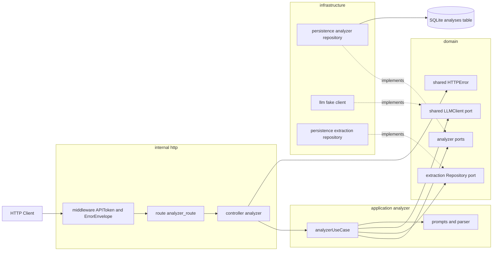
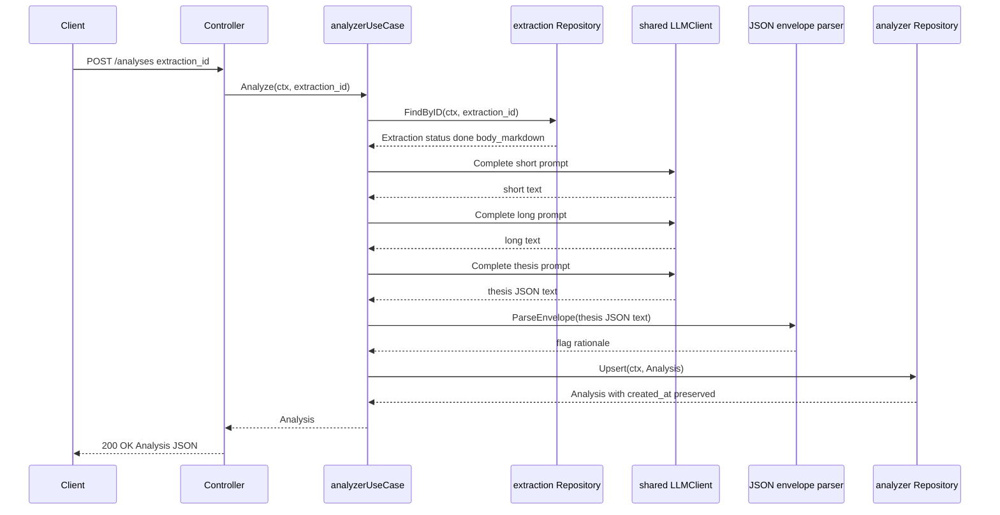
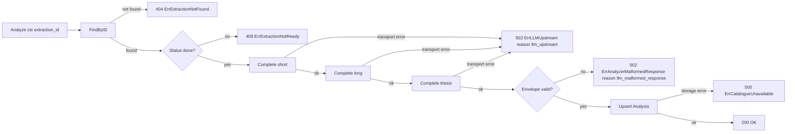

# Design Document: llm-analyzer

## Overview

**Purpose**: This feature delivers synchronous LLM-driven analysis (short summary + long summary + thesis-angle classification) of an already-extracted paper to the sole-user researcher operating the personal DeFi research monitor.

**Users**: The researcher uses the analyzer to triage papers without reading every body in full and to surface thesis-angle candidates worth deeper investigation. The analyzer is consumed via two HTTP endpoints under the existing `/api` group.

**Impact**: Adds a new vertical slice (`domain/analyzer`, `application/analyzer`, `infrastructure/persistence/analyzer`, `infrastructure/llm/fake`, `internal/http/controller/analyzer`, route registration, AutoMigrate of one new table) that consumes only `extraction.Repository` upstream. Adds one optional field to the project-shared `*shared.HTTPError` to carry a machine-readable error discriminator demanded by Requirement 5.4. No other existing feature is modified.

### Goals

- A synchronous `POST /analyses` request running three LLM calls and returning a persisted analysis in one round trip.
- A `GET /analyses/:extraction_id` read-back that never invokes the LLM.
- Overwrite-on-rerun semantics with `created_at` preservation and concurrent-rerun convergence.
- Fail-fast error handling: distinct HTTP status codes per failure class, a stable machine-readable reason for the two 502 modes, no retries.
- A default fake LLM provider that requires no API key and exercises the full success path including the JSON-envelope parser.
- Provider substitutability: a future Anthropic adapter can replace the fake without touching the analyzer's prompts, parser, or persistence shape.

### Non-Goals

- Real LLM provider integration (Anthropic). Deferred to a follow-up spec.
- Asynchronous, queued, scheduled, or background-worker analysis.
- Analysis history, versioning, or multi-revision storage.
- Triage / news-vs-paper classification beyond the thesis-angle flag.
- Cost, token, or rate-limit accounting.
- Reads from the papers store; the analyzer never depends on `paper-persistence`.
- Retry / backoff of any kind for LLM calls.
- Listing or filtering endpoints (`GET /analyses` index).

## Boundary Commitments

### This Spec Owns

- The `domain/analyzer` package: `Analysis` value type, `UseCase` and `Repository` ports, sentinel errors.
- The `application/analyzer` use case: orchestration of three LLM calls, prompt strings, prompt-version constants, thesis-angle JSON-envelope parser.
- The `infrastructure/persistence/analyzer` GORM model and repository (one new table, `analyses`).
- The `infrastructure/llm/fake` adapter: the project's first implementation of `shared.LLMClient`, deterministic by `PromptVersion`.
- The `internal/http/controller/analyzer` package and the `internal/http/route/analyzer_route.go` registration.
- The wire shape of `POST /analyses` and `GET /analyses/:extraction_id`.
- The mapping from analyzer sentinels to HTTP status codes plus the `details.reason` discriminator string.
- AutoMigrate registration of `analyzer.Analysis` in the project migration list.
- The `LLM_PROVIDER` env var and its bootstrap branch.

### Out of Boundary

- Real LLM provider integration. Deferred.
- Any change to `domain/extraction`, `application/extraction`, `infrastructure/persistence/extraction`, or any controller other than the new analyzer controller.
- Any change to `domain/paper`, `application/source_usecase.go`, or the papers persistence package.
- Async or worker-driven analysis, retry, scheduling.
- Listing, search, or aggregation endpoints over analyses.
- Changes to the auth scheme.
- Frontend rendering.

### Allowed Dependencies

- **Outbound (read-only)**: `extraction.Repository.FindByID` for resolving `extraction_id` to the row carrying `body_markdown` and `Status`.
- **Outbound (port)**: `shared.LLMClient.Complete` for every LLM call.
- **Outbound (shared infrastructure)**: `shared.Logger`, `shared.Clock`, `*gorm.DB`, the `gin.Engine` and the existing `middleware.APIToken` / `middleware.ErrorEnvelope`.
- **Cross-cutting modification**: an additive optional `Reason` field on `*shared.HTTPError` and the corresponding branch in `middleware.ErrorEnvelope`. Every existing call site is preserved by zero-value default; this is an additive change to project-shared infrastructure, not to a sibling feature spec.

Forbidden:
- `domain/analyzer` importing `domain/extraction` or `domain/paper` (composition happens in `application/analyzer`).
- `application/analyzer` importing `infrastructure/persistence/extraction` (composition is via the `extraction.Repository` port).
- Reads from `paper.Repository` from any analyzer code.
- Use of `gorm.io/gorm/clause.OnConflict` (the project precedent is transaction + duplicated-key-catch + UPDATE).

### Revalidation Triggers

The following changes oblige downstream consumers (real LLM adapter, future analyses-feed UI) to re-check integration:

- Any change to the `Analysis` value type's persisted fields or to the wire-level response shape.
- Any change to `shared.LLMClient` (signature of `Complete`, fields on `LLMRequest` / `LLMResponse`).
- Any change to the prompt-version strings (`analyzer.short.v1`, `analyzer.long.v1`, `analyzer.thesis.v1`) or to the thesis-angle JSON envelope `{flag, rationale}`.
- Any change to the sentinel-to-HTTP map or the `details.reason` strings (`llm_upstream`, `llm_malformed_response`).
- Any change to the `LLM_PROVIDER` accepted value set.
- Any change to the upstream contract that the analyzer treats as "ready" (currently `extraction.Status == done`).

## Architecture

### Existing Architecture Analysis

The project follows a strict inward-only dependency rule (`domain` ← `application` / `infrastructure` ← `bootstrap`) per `.kiro/steering/structure.md`. Every existing feature is a vertical slice with the same layout (`domain/<feature>/`, `application/<feature>/`, `infrastructure/persistence/<feature>/`, `internal/http/controller/<feature>/`, `internal/http/route/<feature>_route.go`). Outbound-only ports are declared in `domain/`, implementations in `infrastructure/`. The HTTP layer is composed in `internal/bootstrap/app.go` via a `route.Deps` struct.

Two integration patterns the analyzer adopts verbatim:
- **Race-safe upsert**: `internal/infrastructure/persistence/extraction/repo.go:42-129` runs a transaction, catches `gorm.ErrDuplicatedKey` from an insert, then performs an explicit `UPDATE ... WHERE id = ?` via `map[string]any` so zero-values land. No `clause.OnConflict` is used anywhere in the codebase.
- **HTTP error translation**: every controller calls `c.Error(err)`; `middleware.ErrorEnvelope` (mounted globally) unwraps to `*shared.HTTPError` and renders `common.Err(code, message)`. Anything not wrapping `*shared.HTTPError` becomes 500.

### Architecture Pattern & Boundary Map



**Architecture Integration**:

- **Selected pattern**: clean hexagonal vertical slice, identical to the four existing feature slices. The analyzer use case orchestrates two outbound ports (`extraction.Repository`, `shared.LLMClient`) and one inbound port it owns (`analyzer.Repository`).
- **Domain/feature boundaries**: composition happens only in the application layer. `domain/analyzer` does not know `domain/extraction`. The use case takes both ports as constructor arguments and is the single place they meet.
- **Existing patterns preserved**: port-and-adapter dependency rule; race-safe upsert via transaction; sentinel-to-HTTP via `*shared.HTTPError`; bootstrap wiring via `route.Deps`; flat env-var struct.
- **New components rationale**: every package introduced is a new responsibility seam (analyzer domain, analyzer use case, analyzer persistence, fake LLM adapter, analyzer controller). None duplicate existing capability.
- **Steering compliance**: dependency rule per `structure.md` is enforced (see Allowed Dependencies and Forbidden lists above). Logging via `shared.Logger`. Time via `shared.Clock`. Tests follow `testing.md`.

### Technology Stack

| Layer | Choice / Version | Role in Feature | Notes |
|-------|------------------|-----------------|-------|
| Backend / Services | Go 1.25, Gin | HTTP surface, controller, route registration | Existing standard |
| Data / Storage | GORM + SQLite (driver `gorm.io/driver/sqlite`) | New `analyses` table, race-safe upsert | AutoMigrate registers `analyzer.Analysis` in `migrate.go` |
| LLM | `domain/shared.LLMClient` port + `infrastructure/llm/fake` (new) | Default provider in this slice | First implementation of an existing port; real adapter deferred |
| Cross-cutting | `*shared.HTTPError` extended with optional `Reason` | Carries `error.details.reason` discriminator | Additive change; backward-compatible |
| Docs | `swaggo/gin-swagger` | OpenAPI annotations on the two new endpoints | Run `task swag` post-implementation |

## File Structure Plan

### Directory Structure

```
backend/
├── internal/
│   ├── domain/
│   │   └── analyzer/                                NEW
│   │       ├── model.go              Analysis value type
│   │       ├── ports.go              UseCase, Repository interfaces
│   │       └── errors.go             Sentinel errors with HTTPError mapping
│   ├── application/
│   │   └── analyzer/                                NEW
│   │       ├── usecase.go            analyzerUseCase + NewAnalyzerUseCase
│   │       ├── prompts.go            Prompt strings + prompt-version constants
│   │       └── parse.go              thesis-angle JSON envelope parser
│   ├── infrastructure/
│   │   ├── persistence/
│   │   │   └── analyzer/                            NEW
│   │   │       ├── model.go          GORM row, TableName, From/ToDomain
│   │   │       └── repo.go           Repository impl, race-safe upsert
│   │   └── llm/                                     NEW (also creates llm/)
│   │       └── fake/
│   │           └── client.go         shared.LLMClient impl, deterministic by PromptVersion
│   ├── http/
│   │   ├── controller/
│   │   │   └── analyzer/                            NEW
│   │   │       ├── controller.go     POST /analyses, GET /analyses/:extraction_id
│   │   │       └── responses.go      wire DTOs + Swagger response types
│   │   └── route/
│   │       └── analyzer_route.go     NEW           Route registration on /api group
│   ├── domain/shared/errors.go       MODIFIED      Add optional Reason field to HTTPError
│   └── http/middleware/error_envelope.go MODIFIED  Populate error.details.reason when Reason != ""
├── internal/bootstrap/
│   ├── env.go                        MODIFIED      Add LLMProvider field + validation
│   └── app.go                        MODIFIED      Wire analyzer repo, use case, controller, fake LLM
├── internal/infrastructure/persistence/
│   └── migrate.go                    MODIFIED      Register analyzer.Analysis in AutoMigrate list
├── tests/
│   ├── mocks/
│   │   └── llm_client.go             NEW           Hand-written double for use-case tests
│   └── integration/
│       └── analyzer_test.go          NEW           Full HTTP→repo path with fake LLM
└── docs/                             REGENERATED   `task swag` after annotations
```

### Modified Files

- `internal/domain/shared/errors.go` — add optional `Reason string` field to `HTTPError` and `NewHTTPError`. Backward compatible: zero value is the empty string and the middleware omits the discriminator when empty.
- `internal/http/middleware/error_envelope.go` — when the unwrapped `*shared.HTTPError` has a non-empty `Reason`, populate `common.Error.Details["reason"]`. One added branch.
- `internal/bootstrap/env.go` — add `LLMProvider string` with `mapstructure:"LLM_PROVIDER"`, default `"fake"`, validate `Value ∈ {"fake", "anthropic"}` at startup; `"anthropic"` returns a clear "not implemented yet" error until the adapter ships.
- `internal/bootstrap/app.go` — construct the fake client (or refuse to start when `LLMProvider == "anthropic"` until that adapter exists), build `analyzer.Repository`, build `analyzer.UseCase`, register on `route.Deps`, mount under `/api`.
- `internal/infrastructure/persistence/migrate.go` — append `analyzer.Analysis` to the AutoMigrate list.

Each file has one clear responsibility; the modified files each add one block, not a refactor.

## System Flows

### POST /analyses (success path)



Key decisions visible in the diagram and not restated elsewhere:
- The use case is the single composition point for `extraction.Repository`, `shared.LLMClient`, and `analyzer.Repository`.
- The three LLM calls are sequential, not parallel. Sequencing is intentional for this slice: keeps the use case linear, deterministic in tests, and trivially cancellable via context. Parallelism is a follow-up if latency demands it after the real adapter ships.
- Persistence happens after every LLM call has returned valid data. No partial row is ever written.

### Failure branches (decision view)



The 400 branch (bad request body) is handled at the controller before the use case is invoked and is omitted from the use case flow.

## Data Models

### Domain Model

`Analysis` is a value type, not an aggregate root. It has no behavior and is created exclusively by the analyzer use case.

```text
Analysis
  ExtractionID          string         // primary identity; FK to extractions.id
  ShortSummary          string         // trimmed text from LLM short call
  LongSummary           string         // trimmed text from LLM long call
  ThesisAngleFlag       bool           // from thesis envelope.flag
  ThesisAngleRationale  string         // from thesis envelope.rationale
  Model                 string         // taken from the thesis call's LLMResponse.Model
  PromptVersion         string         // composite version string (e.g., "short.v1+long.v1+thesis.v1") for traceability
  CreatedAt             time.Time
  UpdatedAt             time.Time
```

**Invariants**:
- Exactly one `Analysis` per `ExtractionID` exists at any time (upsert guarantee from the repository).
- `CreatedAt` is set once on first insert and never changes; `UpdatedAt` advances on every overwrite.
- All four LLM-derived fields (`ShortSummary`, `LongSummary`, `ThesisAngleFlag`, `ThesisAngleRationale`) are written together or not at all (use case writes only after every LLM call and the parser have succeeded).

### Logical Data Model

A single new entity, no relationships persisted at the SQL level (the FK to `extractions` is logical only — the analyzer reads via the port, not via a JOIN).

| Entity | Natural key | Cardinality |
|---|---|---|
| `analyses` | `extraction_id` | 0..1 per extraction |

### Physical Data Model (SQLite)

```text
TABLE analyses
  extraction_id            TEXT NOT NULL PRIMARY KEY
  short_summary            TEXT NOT NULL DEFAULT ''
  long_summary             TEXT NOT NULL DEFAULT ''
  thesis_angle_flag        INTEGER NOT NULL DEFAULT 0   -- 0/1 boolean
  thesis_angle_rationale   TEXT NOT NULL DEFAULT ''
  model                    TEXT NOT NULL DEFAULT ''
  prompt_version           TEXT NOT NULL DEFAULT ''
  created_at               DATETIME NOT NULL
  updated_at               DATETIME NOT NULL
```

GORM tags on the persistence model mirror the table:
- `extraction_id` is the GORM `primaryKey` and the PK alone (no separate UUID); it stores the same string the extraction's UUID PK uses.
- No additional indexes in this slice — every query is by primary key.
- No FK constraint is declared at the SQL level. The analyzer enforces extraction existence via `extraction.Repository.FindByID` before writing; SQLite FKs would add migration complexity that this slice does not need.

**Upsert strategy** (Requirement 3.1-3.5):

```text
Repository.Upsert(ctx, a Analysis) (Analysis, error):
  in a transaction:
    INSERT INTO analyses (...) VALUES (...) where created_at and updated_at are now
    if err == gorm.ErrDuplicatedKey:
      SELECT created_at FROM analyses WHERE extraction_id = a.ExtractionID
      UPDATE analyses
        SET short_summary, long_summary, thesis_angle_flag, thesis_angle_rationale,
            model, prompt_version, updated_at = now
        WHERE extraction_id = a.ExtractionID
      a.CreatedAt = the previously stored value
      a.UpdatedAt = now
    else if err != nil:
      return wrapped ErrCatalogueUnavailable
  return a, nil
```

This mirrors `internal/infrastructure/persistence/extraction/repo.go` and uses `map[string]any` in the UPDATE to ensure zero-values land. Concurrent reruns converge: SQLite serializes the writers; the second writer enters the duplicated-key branch and overwrites with its own values; exactly one row remains per `extraction_id`.

### Data Contracts & Integration

**`POST /analyses` request**:
```text
{ "extraction_id": "<uuid>" }
```
- Required, non-empty string. Bound via Gin's struct binding; missing or empty triggers `400 Bad Request` before the use case is invoked.

**`POST /analyses` and `GET /analyses/:extraction_id` response (200)**:
```text
{
  "data": {
    "extraction_id":          "<uuid>",
    "short_summary":          "<text>",
    "long_summary":           "<text>",
    "thesis_angle_flag":      true,
    "thesis_angle_rationale": "<text>",
    "model":                  "<provider model id>",
    "prompt_version":         "<composite version>",
    "created_at":             "<RFC3339>",
    "updated_at":             "<RFC3339>"
  }
}
```

**Error response envelope** (project standard, with new optional `details.reason`):
```text
{
  "error": {
    "code":    <http_status>,
    "message": "<human-readable>",
    "details": { "reason": "<machine-readable>" }   // present for the two 502 modes
  }
}
```

**Thesis-angle LLM response envelope** (LLM → use case, never crosses the wire):
```text
{ "flag": <bool>, "rationale": "<string>" }
```
- Anything other than this exact JSON shape is treated as malformed (Requirement 6.3).
- Extra fields are tolerated but ignored — minimum-strictness compatible with the requirement that `flag` and `rationale` be present and well-typed.

## Components and Interfaces

### Component summary

| Component | Domain/Layer | Intent | Req Coverage | Key Dependencies (P0/P1) | Contracts |
|-----------|--------------|--------|--------------|--------------------------|-----------|
| `analyzer.Analysis` | `domain/analyzer` | Persisted value of one analysis | 1.3, 3.1-3.4, 6.2 | none | State |
| `analyzer.UseCase` | `domain/analyzer` | Inbound port | 1.1, 1.4, 1.5, 2.1, 2.3 | none | Service |
| `analyzer.Repository` | `domain/analyzer` | Outbound persistence port | 1.2, 2.1, 2.2, 3.1-3.5 | none | Service |
| `analyzer` sentinels | `domain/analyzer` | Typed errors mapped to HTTPError | 4.1-4.4, 5.1-5.5, 6.3 | `*shared.HTTPError` (P0) | Service |
| `analyzerUseCase` | `application/analyzer` | Orchestrates 3 LLM calls + persistence | 1.1, 1.5, 3.x, 4.1-4.2, 5.1-5.5, 6.x | `extraction.Repository` (P0), `shared.LLMClient` (P0), `analyzer.Repository` (P0), `shared.Logger` / `shared.Clock` (P1) | Service |
| Prompts + parser | `application/analyzer` | Prompt strings, version constants, JSON envelope parser | 6.1-6.4, 7.2-7.3 | none | Service |
| `analyzer/persistence.repository` | `infrastructure/persistence/analyzer` | GORM-backed Repository impl with race-safe upsert | 1.2, 3.1-3.5, 5.5 | `*gorm.DB` (P0) | Service |
| `llm/fake.client` | `infrastructure/llm/fake` | Deterministic `shared.LLMClient` keyed by `PromptVersion` | 7.1-7.4 | none | Service |
| `analyzer.controller` | `internal/http/controller/analyzer` | HTTP surface + Swagger annotations | 1.3, 2.1-2.2, 4.3, 5.4, 8.x | `analyzer.UseCase` (P0), `middleware.APIToken` (P0), `middleware.ErrorEnvelope` (P0) | API |
| `analyzer_route` | `internal/http/route` | Route registration on `/api` | 8.1-8.3 | `route.Deps` (P0) | API |
| `shared.HTTPError` (extended) | `domain/shared` | Carries optional machine-readable `Reason` | 5.4 | `middleware.ErrorEnvelope` (P0) | Service |

### domain/analyzer

#### `Analysis`, `UseCase`, `Repository`, sentinels

| Field | Detail |
|-------|--------|
| Intent | The package-level surface analyzer code consumes; pure data + interfaces, no behavior |
| Requirements | 1.1-1.5, 2.1-2.3, 3.1-3.5, 4.1-4.4, 5.1-5.5, 6.1-6.4 |

**Responsibilities & Constraints**:
- `Analysis` is the canonical persisted value (see Domain Model).
- `UseCase` exposes only the two inbound operations the controller calls.
- `Repository` exposes only the two outbound operations the use case needs.
- Sentinel errors are plain `error` values that wrap `*shared.HTTPError` so the existing `ErrorEnvelope` middleware translates them. No analyzer-local HTTP plumbing.

**Dependencies**:
- Inbound: `analyzerUseCase` (application) implements `UseCase` (P0).
- Outbound: `*shared.HTTPError` for sentinel wrapping (P0). `time.Time` for timestamps. No domain-on-domain imports.
- External: none.

**Contracts**: Service ✓ / API / Event / Batch / State

##### Service Interface (Go)

```go
// domain/analyzer/ports.go
package analyzer

import "context"

type UseCase interface {
    Analyze(ctx context.Context, extractionID string) (*Analysis, error)
    Get(ctx context.Context, extractionID string) (*Analysis, error)
}

type Repository interface {
    Upsert(ctx context.Context, a Analysis) (Analysis, error)
    FindByID(ctx context.Context, extractionID string) (*Analysis, error)
}
```

- Preconditions:
  - `extractionID` is non-empty (controller-validated).
  - For `Analyze`: an extraction with that id exists and has `Status == done`.
- Postconditions:
  - `Analyze` returns the freshly persisted `Analysis` on success, never a partial value.
  - `Upsert` returns the row as it was persisted, with `CreatedAt` preserved for overwrites.
  - `FindByID` returns `analyzer.ErrAnalysisNotFound` (wrapping `*shared.HTTPError{Code: 404}`) for misses.
- Invariants:
  - Exactly one `Analysis` per `extractionID` after `Upsert` returns.

##### Sentinel Map

| Sentinel | Wraps `*shared.HTTPError` | `Reason` | Notes |
|---|---|---|---|
| `ErrExtractionNotFound` | 404, "extraction not found" | `extraction_not_found` | Surfaced from `Analyze` only |
| `ErrExtractionNotReady` | 409, "extraction not in done status" | `extraction_not_ready` | Surfaced from `Analyze` only |
| `ErrLLMUpstream` | 502, "llm upstream failed" | `llm_upstream` | Wraps the underlying transport error in `Err` |
| `ErrAnalyzerMalformedResponse` | 502, "llm response did not satisfy thesis envelope" | `llm_malformed_response` | Carries the offending text in `Err` for log only |
| `ErrAnalysisNotFound` | 404, "analysis not found" | `analysis_not_found` | Surfaced from `Get` only |
| `ErrCatalogueUnavailable` | 500, "analysis storage unavailable" | (unset) | Wraps the GORM error in `Err` |

`Reason` is used per Requirement 5.4 to disambiguate the two 502 modes; the others have unique HTTP codes and may also carry a stable reason for client convenience.

**Implementation Notes**
- Integration: every sentinel is constructed via `shared.NewHTTPError(code, message, cause).WithReason(reason)` (a small new helper). Callers use `errors.Is` and `errors.As` against the sentinel value and the underlying `*shared.HTTPError`.
- Validation: there is no analyzer-local validation of HTTP status; that lives in the shared infrastructure and is exercised by `middleware.ErrorEnvelope`.
- Risks: divergence between sentinel and HTTP code if a future change updates one without the other — mitigated by table-driven tests in the analyzer package that assert each sentinel's wrapped status code and reason.

### application/analyzer

#### `analyzerUseCase`

| Field | Detail |
|-------|--------|
| Intent | Single composition point for extraction reads, three LLM calls, JSON-envelope parsing, persistence |
| Requirements | 1.1, 1.4, 1.5, 2.1-2.3, 3.x, 4.1-4.2, 5.1-5.5, 6.1-6.4 |

**Responsibilities & Constraints**:
- Owns prompt strings and prompt-version constants (in `prompts.go`). Constants:
  - `promptVersionShort  = "analyzer.short.v1"`
  - `promptVersionLong   = "analyzer.long.v1"`
  - `promptVersionThesis = "analyzer.thesis.v1"`
  - `promptVersionComposite = "short.v1+long.v1+thesis.v1"` — persisted on every `Analysis` row.
- Owns the JSON envelope parser (in `parse.go`): a single function that decodes into a typed struct and validates field presence + types.
- Calls the three LLM completions sequentially. On any transport error → returns `ErrLLMUpstream` immediately, no retry.
- On thesis-envelope parse failure → `ErrAnalyzerMalformedResponse`. No retry.
- Times come from `shared.Clock`. Logging via `shared.Logger`.

**Dependencies**:
- Inbound: `analyzer.controller` (P0).
- Outbound: `extraction.Repository.FindByID` (P0), `shared.LLMClient.Complete` ×3 (P0), `analyzer.Repository.Upsert` and `FindByID` (P0), `shared.Logger` (P1), `shared.Clock` (P1).
- External: none.

**Contracts**: Service ✓ / API / Event / Batch / State

##### Service Interface (Go)

```go
// application/analyzer/usecase.go
package analyzer

import (
    "context"
    domain "github.com/yoavweber/research-monitor/backend/internal/domain/analyzer"
    extraction "github.com/yoavweber/research-monitor/backend/internal/domain/extraction"
    "github.com/yoavweber/research-monitor/backend/internal/domain/shared"
)

type analyzerUseCase struct {
    repo       domain.Repository
    extracts   extraction.Repository
    llm        shared.LLMClient
    logger     shared.Logger
    clock      shared.Clock
}

func NewAnalyzerUseCase(
    repo domain.Repository,
    extracts extraction.Repository,
    llm shared.LLMClient,
    logger shared.Logger,
    clock shared.Clock,
) domain.UseCase
```

**Implementation Notes**
- Integration: bootstrap constructs each port and passes them in. The use case calls `shared.LLMClient.Complete` without setting `LLMRequest.Model` and persists `Analysis.Model` from `LLMResponse.Model` of the thesis call. The fake returns `"fake"`; a future real Anthropic adapter will return its own model id.
- Validation: all input validation is at the controller boundary (extraction id non-empty, JSON well-formed). The use case validates only domain invariants (extraction status, envelope shape).
- Risks:
  - Sequential LLM calls inflate latency under the real provider. Acceptable for this slice (Req 1.4 only requires synchronous, not fast); parallelization is a future option.
  - The composite `prompt_version` string is a soft convention; if a single sub-prompt is bumped without bumping the composite, traceability breaks. Mitigation: a use-case test asserts that the composite reflects each sub-version.

### infrastructure/persistence/analyzer

#### `repository`

| Field | Detail |
|-------|--------|
| Intent | GORM-backed `analyzer.Repository` impl with race-safe upsert preserving `created_at` |
| Requirements | 1.2, 2.1-2.2, 3.1-3.5, 5.5 |

**Responsibilities & Constraints**:
- `TableName()` pinned to `"analyses"`.
- `FromDomain` / `ToDomain` for conversion; no GORM types leak to domain.
- `Upsert` uses transaction + `gorm.ErrDuplicatedKey` catch + explicit UPDATE via `map[string]any` (mirrors `extraction` repo). No `clause.OnConflict`.
- All errors that are not "not found" are wrapped with `analyzer.ErrCatalogueUnavailable`. `gorm.ErrRecordNotFound` translates to `analyzer.ErrAnalysisNotFound`.

**Dependencies**:
- Inbound: `analyzerUseCase` (P0).
- Outbound: `*gorm.DB` (P0).

**Contracts**: Service ✓ / API / Event / Batch / State (storage)

**Implementation Notes**
- Integration: registered in `migrate.go` AutoMigrate list. Bootstrap injects the shared `*gorm.DB`.
- Validation: storage-level invariants only; domain invariants are enforced upstream.
- Risks: the upsert pattern requires care that the inner UPDATE uses `map[string]any` (else GORM omits zero-values). Mirrors a known-good precedent.

### infrastructure/llm/fake

#### `client`

| Field | Detail |
|-------|--------|
| Intent | Deterministic `shared.LLMClient` keyed by `LLMRequest.PromptVersion` |
| Requirements | 7.1-7.4 |

**Responsibilities & Constraints**:
- `Complete(ctx, req)` returns canned text per `req.PromptVersion`:
  - `analyzer.short.v1` → fixed short summary text.
  - `analyzer.long.v1` → fixed long summary text.
  - `analyzer.thesis.v1` → `{"flag": false, "rationale": "fake-rationale"}` (valid envelope).
  - any other prompt version → returns a fixed "fake unsupported prompt version" string with `Model = "fake"`. The use case never sends an unknown version, so this branch exists only for safety, not as an API contract.
- `LLMResponse.Model` always returns `"fake"`. `PromptVersion` echoes the request value.
- No external network.

**Contracts**: Service ✓ / API / Event / Batch / State

**Implementation Notes**
- Integration: bootstrap selects this client when `LLM_PROVIDER == "fake"` (the default).
- Validation: a unit test asserts the thesis-prompt response parses as a valid envelope per the use case's parser.
- Risks: drift between the fake's canned envelope and the use case's envelope schema. Mitigated by a unit test that runs the parser over the fake's output for the thesis prompt.

### internal/http/controller/analyzer

#### `controller`

| Field | Detail |
|-------|--------|
| Intent | HTTP handlers for `POST /analyses` and `GET /analyses/:extraction_id` with Swagger annotations |
| Requirements | 1.3, 2.1-2.2, 4.3, 5.4, 8.1-8.3 |

**Responsibilities & Constraints**:
- Bind request body via Gin struct binding; missing/empty `extraction_id` returns 400 directly (not via the use case).
- Delegate every other failure to `c.Error(err)` so `middleware.ErrorEnvelope` translates the wrapped `*shared.HTTPError`.
- Render success via `common.Data(...)`.
- Swagger annotations (one per endpoint) follow extraction-controller convention.

**Contracts**: Service / API ✓ / Event / Batch / State

##### API Contract

| Method | Endpoint | Request | Success | Errors |
|--------|----------|---------|---------|--------|
| POST | `/api/analyses` | `{ "extraction_id": "<uuid>" }` | 200 + Analysis envelope | 400 (bad body), 401 (auth), 404 (extraction not found), 409 (extraction not ready), 502 (llm transport / malformed), 500 (storage) |
| GET | `/api/analyses/:extraction_id` | path param | 200 + Analysis envelope | 401 (auth), 404 (analysis not found) |

**Implementation Notes**
- Integration: registered via `analyzer_route.go` on the `/api` group, after `middleware.APIToken` is mounted. Inherits auth automatically (Requirement 8.1).
- Validation: only request-shape validation. Domain validation is in the use case.
- Risks: divergence between handler error mapping and the sentinel-to-HTTP map — mitigated by table-driven controller tests covering every status code.

### domain/shared (modified)

#### `HTTPError` (extension)

| Field | Detail |
|-------|--------|
| Intent | Adds optional machine-readable `Reason` discriminator |
| Requirements | 5.4 |

**Modification**:
```go
// domain/shared/errors.go (additive)
type HTTPError struct {
    Code    int
    Message string
    Reason  string // NEW: optional machine discriminator surfaced as error.details.reason
    Err     error
}

// helper preserves backward compatibility
func (e *HTTPError) WithReason(reason string) *HTTPError {
    e.Reason = reason
    return e
}
```

`middleware.ErrorEnvelope` is updated to populate `common.Error.Details["reason"] = he.Reason` when `he.Reason != ""`. Every existing call site continues to function unchanged.

**Risks**: minimal — additive change; the only new wire-level behavior is the appearance of `details.reason` for sentinels that opt in. Tested via a middleware unit test (one case for `Reason = ""`, one case for `Reason = "x"`).

## Requirements Traceability

| Requirement | Summary | Components | Interfaces | Flows |
|-------------|---------|------------|------------|-------|
| 1.1 | Synchronous produce-and-store given valid `extraction_id` | `analyzer.controller`, `analyzerUseCase`, `extraction.Repository`, `shared.LLMClient`, `analyzer.Repository` | `UseCase.Analyze`, `Repository.Upsert` | POST flow |
| 1.2 | Persist before returning | `analyzerUseCase`, `analyzer.Repository` | `Repository.Upsert` | POST flow |
| 1.3 | 200 + JSON body shape | `analyzer.controller` | API contract | POST flow |
| 1.4 | Hold response open synchronously | `analyzer.controller`, `analyzerUseCase` | `UseCase.Analyze` | POST flow |
| 1.5 | Three independent LLM invocations | `analyzerUseCase` | `shared.LLMClient.Complete` ×3 | POST flow |
| 2.1 | GET returns persisted analysis | `analyzer.controller`, `analyzerUseCase`, `analyzer.Repository` | `UseCase.Get`, `Repository.FindByID` | (trivial) |
| 2.2 | GET returns 404 when missing | `analyzerUseCase`, sentinel `ErrAnalysisNotFound` | sentinel map | (trivial) |
| 2.3 | GET never invokes LLM | `analyzerUseCase` | `UseCase.Get` (no LLM call) | (trivial) |
| 3.1 | Overwrite content fields | `analyzer/persistence.repository` | `Repository.Upsert` | upsert pseudocode |
| 3.2 | Preserve `created_at` | `analyzer/persistence.repository` | `Repository.Upsert` | upsert pseudocode |
| 3.3 | Advance `updated_at` | `analyzer/persistence.repository` | `Repository.Upsert` | upsert pseudocode |
| 3.4 | At most one row per `extraction_id` | physical model PK | n/a | n/a |
| 3.5 | Concurrent-rerun convergence | `analyzer/persistence.repository` (transaction) | `Repository.Upsert` | upsert pseudocode |
| 4.1 | 404 on unknown extraction | `analyzerUseCase`, sentinel `ErrExtractionNotFound` | sentinel map | failure flow |
| 4.2 | 409 on extraction not done | `analyzerUseCase`, sentinel `ErrExtractionNotReady` | sentinel map | failure flow |
| 4.3 | 400 on bad body | `analyzer.controller` | API contract | (handled at controller) |
| 4.4 | No row written on precondition failure | `analyzerUseCase` (early return before `Upsert`) | flow ordering | failure flow |
| 5.1 | 502 on LLM transport error | `analyzerUseCase`, sentinel `ErrLLMUpstream` | sentinel map | failure flow |
| 5.2 | 502 on malformed thesis envelope | `analyzerUseCase`, JSON parser, sentinel `ErrAnalyzerMalformedResponse` | sentinel map | failure flow |
| 5.3 | No retry | `analyzerUseCase` (sequential, fail-fast) | n/a | failure flow |
| 5.4 | Machine-readable 502 discriminator | `shared.HTTPError.Reason`, `middleware.ErrorEnvelope`, sentinels | error envelope shape | n/a |
| 5.5 | 500 on persistence failure | `analyzer/persistence.repository`, sentinel `ErrCatalogueUnavailable` | sentinel map | failure flow |
| 6.1 | Strict JSON envelope `{flag, rationale}` | JSON parser in `application/analyzer` | parser internal | n/a |
| 6.2 | Map envelope to persisted fields | `analyzerUseCase` | `Analysis` value type | POST flow |
| 6.3 | Treat malformed envelope per 5.2 | JSON parser | sentinel map | failure flow |
| 6.4 | Short/long stored as trimmed text | `analyzerUseCase` | `Analysis` value type | POST flow |
| 7.1 | Default provider needs no API key | `infrastructure/llm/fake.client`, bootstrap branch | `shared.LLMClient` | n/a |
| 7.2 | Deterministic per prompt type | `infrastructure/llm/fake.client` (keyed by `PromptVersion`) | `shared.LLMClient.Complete` | n/a |
| 7.3 | Thesis fake returns valid envelope | `infrastructure/llm/fake.client` | parser-compatible output | n/a |
| 7.4 | Provider substitutability | bootstrap branch on `LLM_PROVIDER`, `shared.LLMClient` port | `shared.LLMClient` | n/a |
| 8.1 | Reuse project auth | `analyzer_route` mounts on `/api` after `middleware.APIToken` | API contract | n/a |
| 8.2 | No new auth mechanism | `analyzer_route`, `analyzer.controller` | API contract | n/a |
| 8.3 | JSON only | `analyzer.controller` (Gin binding + `common.Data`) | API contract | n/a |

## Error Handling

### Error Strategy

Sentinels in `domain/analyzer` wrap `*shared.HTTPError` with the appropriate code, message, and (where needed) `Reason`. The use case returns sentinels; the controller forwards them to `c.Error(err)`; `middleware.ErrorEnvelope` renders the JSON. No analyzer-local HTTP rendering.

For 5.4, the optional `Reason` is the only new machinery: `error.details.reason` becomes the discriminator. Two distinct strings are pinned:
- `"llm_upstream"` — covers any non-nil error returned by `shared.LLMClient.Complete` for any of the three calls.
- `"llm_malformed_response"` — covers any failure of the JSON parser to decode + validate the thesis envelope.

### Error Categories and Responses

| HTTP code | Sentinel | Trigger | Wire `details.reason` |
|---|---|---|---|
| 400 | (controller-local) | Missing or malformed JSON body / empty `extraction_id` | (unset) |
| 401 | (middleware) | Missing or wrong `X-API-Token` | (unset) |
| 404 | `ErrExtractionNotFound` | `extraction.Repository.FindByID` returns not-found on POST | `extraction_not_found` |
| 404 | `ErrAnalysisNotFound` | `analyzer.Repository.FindByID` returns not-found on GET | `analysis_not_found` |
| 409 | `ErrExtractionNotReady` | Extraction `Status != done` | `extraction_not_ready` |
| 500 | `ErrCatalogueUnavailable` | Persistence layer error during `Upsert` | (unset) |
| 502 | `ErrLLMUpstream` | Any LLM transport error | `llm_upstream` |
| 502 | `ErrAnalyzerMalformedResponse` | Thesis envelope parse / validate failure | `llm_malformed_response` |

Per Requirement 5.3, no retry is performed at the use-case layer for any of the above.

### Monitoring

Per `tech.md` the project uses `log/slog` via `shared.Logger`. The use case logs:
- INFO at success exit with `extraction_id`, `prompt_version`, `model`, durations of each LLM call (using `shared.Clock`).
- WARN on `ErrLLMUpstream` and `ErrAnalyzerMalformedResponse` with the sentinel name and (for malformed) the raw response body trimmed to a fixed length to avoid log blow-up.
- WARN on `ErrCatalogueUnavailable` with the wrapped GORM error.

No new metrics, dashboards, or alerts are introduced in this slice.

## Testing Strategy

Test conventions follow `.kiro/steering/testing.md` (real-over-fake DB, hand-written doubles in `tests/mocks/`, sentence subtests, AAA via blank lines). Items below derive from the requirements' acceptance criteria, not from generic patterns.

### Unit tests

1. **`application/analyzer/parse_test.go`** — thesis-envelope parser covers: valid envelope, missing `flag`, missing `rationale`, non-boolean `flag`, non-string `rationale`, parseable JSON with extra fields (tolerated). Backs Requirements 6.1, 6.3.
2. **`application/analyzer/usecase_test.go`** — `analyzerUseCase` with `tests/mocks/llm_client.go` and an in-memory `analyzer.Repository`. Cases:
   - happy path (one row written, returned shape matches)
   - LLM transport error from each of the three calls (asserts `ErrLLMUpstream`, no row written)
   - malformed thesis envelope (asserts `ErrAnalyzerMalformedResponse`, no row written)
   - extraction not found / not done (asserts `ErrExtractionNotFound` / `ErrExtractionNotReady`, no LLM call)
   Backs Requirements 1.1, 1.5, 4.1, 4.2, 4.4, 5.1-5.3.
3. **`infrastructure/llm/fake/client_test.go`** — fake returns deterministic per-prompt-version output; thesis output round-trips through the application parser. Backs Requirements 7.1-7.3.
4. **`internal/domain/shared/errors_test.go`** — `HTTPError.WithReason` populates `Reason` and is accessible via `AsHTTPError`. Backs Requirement 5.4.
5. **`internal/http/middleware/error_envelope_test.go`** — when `Reason != ""` the middleware emits `error.details.reason`; when `Reason == ""` it does not. Backs Requirement 5.4.

### Integration tests (real SQLite via `testdb.New`)

1. **`infrastructure/persistence/analyzer/repo_test.go`**:
   - `Upsert` insert path returns the row.
   - `Upsert` overwrite path: pre-seeded row, second `Upsert` updates content + `updated_at`, preserves `created_at`.
   - Concurrent rerun: two goroutines call `Upsert` with different content; exactly one row remains; its `created_at` matches the earlier write's value.
   - `FindByID` returns `ErrAnalysisNotFound` for missing id.
   - `Upsert` returns `ErrCatalogueUnavailable` when DB is closed.
   Backs Requirements 1.2, 2.2, 3.1-3.5, 5.5.

### Controller tests (`httptest`, `gin.TestMode`)

1. **`internal/http/controller/analyzer/controller_test.go`** with an inline use-case fake:
   - 200 happy POST + GET round-trip (asserts response shape per 1.3).
   - 400 on missing `extraction_id`.
   - 401 inherited from middleware (asserts middleware mount).
   - 404 from `ErrExtractionNotFound` and `ErrAnalysisNotFound`.
   - 409 from `ErrExtractionNotReady`.
   - 502 with `details.reason == "llm_upstream"`.
   - 502 with `details.reason == "llm_malformed_response"`.
   - 500 with no `details.reason`.
   Backs Requirements 1.3, 2.1-2.2, 4.3, 5.4, 8.x.

### End-to-end / integration

1. **`tests/integration/analyzer_test.go`** — full HTTP path with the production fake LLM client, real SQLite via `testdb.New`, real bootstrap wiring of routes:
   - POST → 200 → assert one row in `analyses` with the fake's canned values.
   - POST again same id → 200 → assert same row, `created_at` preserved, `updated_at` advanced.
   - GET → 200 → assert shape matches POST response.
   - GET unknown id → 404.
   - POST with extraction not in done → 409 (seed an extraction with `pending` status).
   Backs Requirements 1.x, 2.x, 3.x, 4.1, 4.2.

No load or perf tests in this slice; the synchronous endpoint is bounded by the fake LLM's latency (microseconds) and the real adapter's perf is the next spec's problem.

## Security Considerations

This feature inherits all baseline controls from project steering:
- `X-API-Token` auth via `middleware.APIToken` mounted on `/api` (Requirement 8.1).
- No new sensitive data: persisted `body_markdown` and summaries are derivative of public arXiv content; no PII.
- The fake LLM does not call out, so this slice introduces zero new external network surface. The real adapter, when added, must address API-key handling (already env-configured per `tech.md`).

No feature-specific threat-model deltas. No additional decisions captured here.
