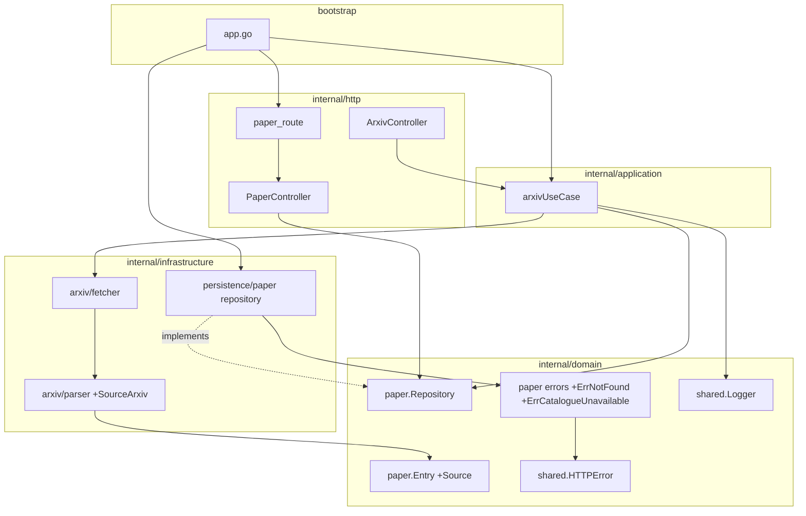
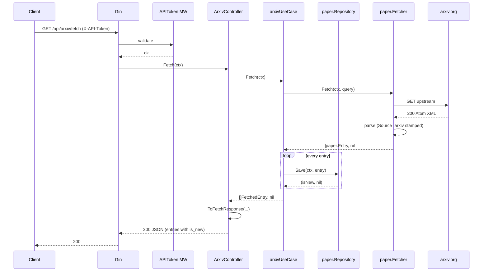
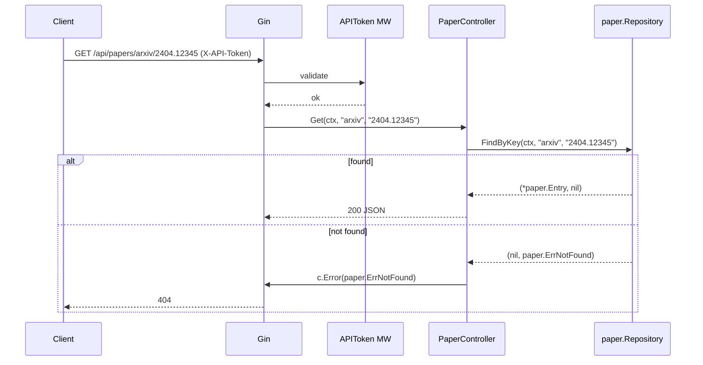
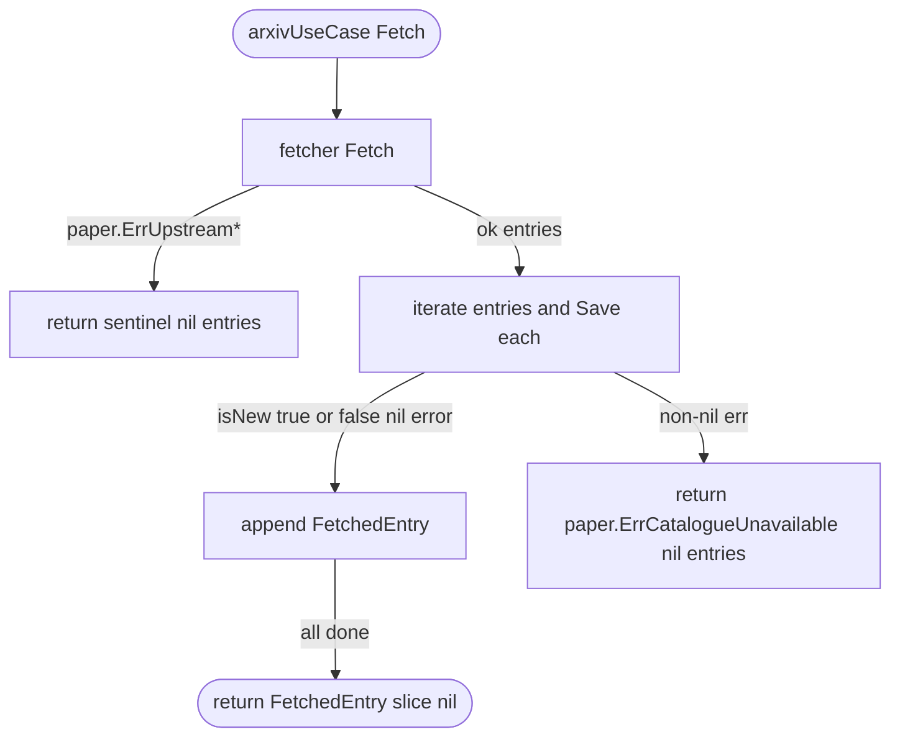

# Design Document — paper-persistence

## Overview

**Purpose**: Give the research monitor a durable, source-aware catalogue of `paper.Entry` values. Every call to `GET /api/arxiv/fetch` now persists its returned entries as a side effect and annotates each with an `is_new` flag; two new read-only endpoints let the researcher inspect the accumulated catalogue.

**Users**: The sole researcher operating the monitor. No other consumer today; the catalogue is also the substrate that future pipeline stages (cross-fetch dedupe, triage, LLM summary, frontend feed) will read.

**Impact**: Extends `paper.Entry` with a `Source` field, adds a catalogue domain port + SQLite adapter, introduces a path-nested retrieval endpoint `GET /api/papers/:source/:source_id` and a list endpoint `GET /api/papers`, and supersedes `arxiv-fetcher` requirement 1.4 by wiring auto-persist into the arxiv use case. The existing generic `shared.Fetcher` port is untouched; this spec does not change anything outside the paper domain and the arxiv ingestion path.

### Goals

- Make papers survive across sessions with first-seen-wins idempotency keyed on `(Source, SourceID)`.
- Enforce the uniqueness invariant at the storage layer so concurrent save races cannot produce duplicates.
- Expose the catalogue through two authenticated read-only HTTP endpoints mirroring the `source` aggregate's pattern.
- Turn `/api/arxiv/fetch` into a one-call fetch+persist with a per-entry `is_new` annotation on the response.
- Repeal `arxiv-fetcher` requirement 1.4 cleanly as part of this spec's diff.
- Keep the schema source-aware from day one so a future second paper source cannot collide on `SourceID`.

### Non-Goals

- Introducing an actual second paper source (only arxiv is wired; the schema and API are scaffolded for it).
- Per-source configuration or routing (no "enable/disable biorxiv" toggles, no per-source translation).
- Any HTTP endpoint that accepts a paper save request directly (no `POST /api/papers`).
- Version-upgrade semantics — a later revision of a persisted paper is skipped, never merged or appended.
- Delete / update / housekeeping on persisted papers.
- Pagination, filtering, or sort controls beyond newest-first.
- LLM summarisation, PDF extraction, triage, frontend UI, scheduling, cron.

## Boundary Commitments

### This Spec Owns

- Extending `paper.Entry` with a `Source` field (additive domain-model change).
- Removing the existing `paper.UseCase` interface (Fetch port from arxiv-fetcher). Its only consumer — `ArxivController` — shifts to an application-arxiv-local `OutcomeFetcher` interface; no other consumer exists.
- A new domain port `paper.Repository` with `Save`, `FindByKey`, `List`. The repository owns sentinel translation: it returns `paper.ErrNotFound` on miss and `paper.ErrCatalogueUnavailable` on any non-dedupe storage error, so callers (the arxiv use case for writes, the paper controller for reads) consume `*shared.HTTPError`-typed sentinels directly without an intermediate use-case layer.
- Two new domain error sentinels: `paper.ErrNotFound` (404) and `paper.ErrCatalogueUnavailable` (500).
- SQLite-backed repository implementation at `internal/infrastructure/persistence/paper/` mirroring the `source` aggregate layout, with a composite unique index on `(Source, SourceID)`.
- Auto-migration of the new table hooked into the existing `persistence.AutoMigrate(db)` call.
- A new controller + wire DTOs at `internal/http/controller/paper/` exposing the two read-only endpoints.
- A new router `PaperRouter` registered under the authenticated `/api` group after `ArxivRouter`.
- Modifying `arxivUseCase` to depend on `paper.Repository`, save every fetched entry, and return per-entry `is_new` outcomes.
- Modifying `arxiv-fetcher`'s controller response DTO to include `source` and `is_new` per entry.
- Modifying the arxiv parser to stamp `Source = "arxiv"` on every entry (exported constant `SourceArxiv` in `infrastructure/arxiv`).
- Supersedes `arxiv-fetcher` requirement 1.4; updates that spec's artefacts where necessary.
- Extending `route.Deps` and `bootstrap/app.go` to wire the new repository through the arxiv ingestion path and the paper HTTP query layer.

### Out of Boundary

- Any HTTP write endpoint for papers.
- Introducing a real second paper source (no biorxiv adapter, no source-routing logic).
- Per-source category configuration, rate limits, or feature flags.
- The arxiv fetch logic itself (`arxivFetcher`, `parseFeed`), beyond the source-stamping and the response DTO additions.
- Generic `shared.Fetcher` port or `httpclient.NewByteFetcher` — untouched.
- Any change to the `/api/arxiv/fetch` upstream behaviour (URL construction, category query, timeouts, transport-error translation) — untouched.
- The `source` aggregate — untouched except for being the structural precedent this spec mirrors.

### Allowed Dependencies

- `domain/paper` (this spec extends `Entry` and adds ports + sentinels).
- `domain/shared.HTTPError`, `shared.NewHTTPError`, `shared.AsHTTPError`.
- `domain/shared.Logger`, `shared.Clock`.
- `gorm.io/gorm` in the persistence adapter only (existing dependency).
- `internal/interface/http/common.Data`, `common.Err` (response envelope helpers).
- `internal/http/middleware.APIToken` (via `/api` group registration — not imported directly by paper code).
- `internal/http/middleware.ErrorEnvelope` (implicit via controller `c.Error(err)`).
- Stdlib `net/http`, `context`, `errors`, `fmt`, `time`.
- No new third-party dependencies.

### Revalidation Triggers

- Change to `paper.Entry` field set (additions, removals, rename) → downstream pipeline consumers + arxiv parser revalidate.
- Change to `paper.Repository` or `paper.Repository` port signatures → every caller revalidates.
- Change to the response shape of `GET /api/arxiv/fetch` (specifically the `source` / `is_new` fields added here) → downstream clients revalidate.
- Introduction of a second paper source → this spec's file-structure and routing assumptions re-check; the composite key already accommodates, but any source-specific logic must stay out of `paper` domain.
- Introduction of a pagination / filtering surface on the list endpoint → the response envelope adds fields; this spec's contract changes.
- Any change to the composite unique index or its columns → the storage invariant changes; concurrent-save behaviour must be re-verified.

## Architecture

### Existing Architecture Analysis

- Hexagonal layout with strict inward-only dependencies (`domain/` ← `application/` ← `infrastructure/` ← `interface/` ← `bootstrap/`). Within `domain/`, subpackages may import each other.
- `source` aggregate is the structural precedent: `domain/source/{model.go, ports.go, errors.go, requests.go, responses.go}`; `application/source_usecase.go`; `infrastructure/persistence/source/{model.go, repo.go}`; controller + route under the existing `/api` group. This spec mirrors the persistence and HTTP halves of that layout for `paper`. It deviates by dropping the application-layer wrapper: paper's repository is consumed directly because there is no per-call business logic to host above it.
- `paper.Entry` and `paper.UseCase` (Fetch) already exist from `arxiv-fetcher`. This spec adds a field, deletes the speculative `paper.UseCase` interface (replaced by an arxiv-application-local `OutcomeFetcher`), and wires in new siblings (`paper.Repository`, `paper.Repository`).
- Auto-migration runs at startup via `persistence.AutoMigrate(db)` inside bootstrap; adding one more model is a one-line change.
- The `ErrorEnvelope` middleware already maps `*shared.HTTPError` to the response envelope — reused unchanged.

### Architecture Pattern & Boundary Map



**Architecture Integration**:
- **Selected pattern**: Ports & Adapters with no application-layer wrapper for the paper aggregate's storage operations. `paper.Repository` is the single entry point, consumed directly by the arxiv ingestion path (writes) and the paper HTTP query layer (reads). The repository owns sentinel translation, mirroring the `source` aggregate's repository convention.
- **Responsibility split**:
  - `paper.Repository` (infrastructure): GORM CRUD + composite-key dedupe via `errors.Is(err, gorm.ErrDuplicatedKey)` + sentinel translation (`gorm.ErrRecordNotFound` → `paper.ErrNotFound`; any other DB error → `paper.ErrCatalogueUnavailable`).
  - `arxivUseCase` (application): unchanged fetch orchestration + one new step that iterates returned entries, calls `repository.Save` directly, and collects per-entry `is_new` values for the controller. Owns the aggregate `paper.fetch.ok` outcome log with new/skipped counts.
  - `PaperController` (interface): thin handler that delegates straight to `paper.Repository.Get` and `paper.Repository.List`; errors flow through `c.Error(err)` to the existing `ErrorEnvelope` middleware.
  - `arxiv/parser.go` (infrastructure): stamps `Source = SourceArxiv` on every parsed entry.
- **Existing patterns preserved**: `source` aggregate layout is mirrored; `route.Deps` sub-bundle style (already carrying `Arxiv ArxivConfig`) gains a parallel `Paper PaperConfig`; `common.Data`/`common.Err` envelope helpers reused; `ErrorEnvelope` middleware unchanged.
- **Steering compliance**: Strict inward-only imports; `context.Context` first arg on every use-case and repo method; `log/slog` via `shared.Logger` port; no new third-party dependencies; repository via `ToDomain`/`FromDomain` on the persistence side per steering §2.

### Dedupe mechanism (index)

<!-- DEDUPE-INDEX: pointers to every place dedupe lives in this design; grep for "DEDUPE:" to find code sites. -->

There is no standalone `Deduper` interface. Dedupe is a property of `Save`, enforced by the storage layer and surfaced via the `Save` return signature. Three co-operating sites:

1. **Storage-level enforcement** — `infrastructure/persistence/paper/model.go`: composite unique index on `(source, source_id)` declared as a GORM struct tag. This is the race-safe guarantee (R4.1, R4.2). See the persistence model block under **Infrastructure Layer → persistence/paper/repository** below; the struct tags are marked with `// DEDUPE:`.
2. **Repository-level outcome mapping** — `infrastructure/persistence/paper/repo.go`: `Save` branches on `errors.Is(err, gorm.ErrDuplicatedKey)` and returns `(false, nil)` on the duplicate path. See the `Save` pseudocode in the same section; the switch arm is marked with `// DEDUPE:`.
3. **Surface via return signature** — `domain/paper/ports.go`: `Save(ctx, Entry) (isNew bool, err error)`. `isNew=false, err=nil` is the dedupe-skip outcome. Marked with `// DEDUPE:` in the port doc-comment. `arxivUseCase` consumes the boolean to populate `FetchedEntry.IsNew` (R5.2 / R5.3).

Skip is **never** an error — it is a normal `(false, nil)` outcome. Only the unique-index enforcement at site (1) prevents duplicates under concurrent writes; an application-layer pre-check would be racy and is intentionally absent.

### Technology Stack

| Layer | Choice / Version | Role in Feature | Notes |
|-------|------------------|-----------------|-------|
| Backend / Services | Go 1.25, Gin v1.12 (existing) | HTTP handlers + routing for the two new endpoints + the modified arxiv endpoint response. | Reuses existing engine + middleware. |
| Data / Storage | GORM v1.31 + SQLite driver v1.6 (existing) | Persistence adapter for `paper.Repository` with composite unique index. | One new model registered in `persistence.AutoMigrate`. No new migrations files; auto-migration handles schema. |
| Logging / Observability | `log/slog` via `shared.Logger` (existing) | Outcome logs for save (`paper.save.created` / `paper.save.skipped`) and for auto-persist summary in arxiv use case. | No metrics in v1. |
| Messaging / Events | — | Not applicable. | |
| Infrastructure / Runtime | — | No new env vars, no new runtime config. | |

> **New dependencies**: none.

## File Structure Plan

### Directory Structure

```
backend/
├── internal/
│   ├── domain/
│   │   └── paper/
│   │       ├── model.go                          # MODIFIED: add Source field to Entry
│   │       ├── ports.go                          # MODIFIED: delete the speculative UseCase; add Repository
│   │       └── errors.go                         # MODIFIED: add ErrNotFound, ErrCatalogueUnavailable
│   ├── application/
│   │   └── arxiv/
│   │       ├── usecase.go                        # MODIFIED: depend on paper.Repository, save each entry, return per-entry is_new
│   │       └── usecase_test.go                   # MODIFIED: cover save path + is_new per-entry outcomes + save-failure path
│   ├── infrastructure/
│   │   ├── arxiv/
│   │   │   ├── parser.go                         # MODIFIED: stamp SourceArxiv on every entry
│   │   │   ├── parser_test.go                    # MODIFIED: assert Source == SourceArxiv on parsed entries
│   │   │   └── source.go                         # NEW: package-level const SourceArxiv = "arxiv"
│   │   └── persistence/
│   │       └── paper/                            # NEW package
│   │           ├── model.go                      # GORM model + ToDomain/FromDomain; composite unique index tag on (Source, SourceID)
│   │           ├── repo.go                       # NewRepository(db) → paper.Repository. Save maps gorm.ErrDuplicatedKey → (false, nil); FindByKey maps gorm.ErrRecordNotFound → paper.ErrNotFound; all other DB errors → paper.ErrCatalogueUnavailable
│   │           └── repo_test.go                  # unit tests with a temp SQLite file (happy + dedupe + composite-uniqueness + sentinel-translation cases)
│   ├── http/
│   │   ├── controller/
│   │   │   ├── arxiv/
│   │   │   │   ├── controller.go                 # MODIFIED: map per-entry FetchedEntry → EntryResponse carrying is_new
│   │   │   │   ├── controller_test.go            # MODIFIED: assert is_new and source on response entries
│   │   │   │   └── responses.go                  # MODIFIED: EntryResponse gains Source string + IsNew bool
│   │   │   └── paper/                            # NEW package (alias `paperctrl`)
│   │   │       ├── controller.go                 # PaperController.Get + PaperController.List
│   │   │       ├── controller_test.go            # handler-level tests with fake paper.Repository
│   │   │       └── responses.go                  # PaperResponse (matches the arxiv EntryResponse shape minus IsNew) + ToPaperResponse + ToPaperListResponse
│   │   └── route/
│   │       ├── route.go                          # MODIFIED: Deps gains Paper PaperConfig; Setup calls PaperRouter
│   │       ├── paper_route.go                    # NEW: PaperRouter(d) registers GET /api/papers and GET /api/papers/:source/:source_id
│   │       └── paper_route_test.go               # NEW: route-level smoke test
│   ├── bootstrap/
│   │   └── app.go                                # MODIFIED: construct paper.Repository; thread it into arxivUseCase and into route.Deps.Paper
│   └── (persistence/migrate.go)                  # MODIFIED: register the new paper model in AutoMigrate
└── tests/
    ├── mocks/
    │   ├── paper_fetcher.go                      # unchanged
    │   └── paper_repo.go                         # NEW: fake paper.Repository for integration tests (records Save/FindByKey/List, returns canned values + sentinels)
    └── integration/
        ├── arxiv_test.go                         # MODIFIED: assert is_new on first vs second call; verify entries queryable after fetch
        └── papers_test.go                        # NEW: happy / 401 / 404 / list newest-first / Source-disambiguation
```

### Modified Files

- `internal/domain/paper/model.go` — add `Source string` field to `Entry`. No other field or method changes.
- `internal/domain/paper/ports.go` — delete the speculative `UseCase` interface (no consumers remain after this spec); add the `Repository` interface.
- `internal/domain/paper/errors.go` — add `ErrNotFound` (`shared.NewHTTPError(http.StatusNotFound, "paper not found", nil)`) and `ErrCatalogueUnavailable` (`shared.NewHTTPError(http.StatusInternalServerError, "paper catalogue unavailable", nil)`).
- `internal/application/arxiv/usecase.go` — constructor signature gains a `paper.Repository` parameter; `Fetch` now loops entries, calls `repo.Save` directly, collects `(entry, isNew)` pairs, returns them; outcome log gains `new_count` / `skipped_count`; on save failure (anything other than the dedupe-skip path), the use case returns the repository's `paper.ErrCatalogueUnavailable` verbatim without partial results.
- `internal/application/arxiv/usecase_test.go` — new cases: save called once per returned entry; is_new is true on first occurrence + false on second; save failure yields `ErrCatalogueUnavailable` and `nil` entries; outcome log includes counts.
- `internal/infrastructure/arxiv/parser.go` — every constructed `paper.Entry` has `Source = SourceArxiv`.
- `internal/infrastructure/arxiv/parser_test.go` — happy-path fixture asserts `entries[0].Source == "arxiv"`.
- `internal/http/controller/arxiv/responses.go` — `EntryResponse` gains `Source string json:"source"` and `IsNew bool json:"is_new"`. A new internal type `FetchedEntry{Entry paper.Entry; IsNew bool}` crosses the application-layer ↔ controller boundary (defined in the arxiv application package and imported by the controller, or duplicated — design uses the latter for boundary cleanliness; see component block).
- `internal/http/controller/arxiv/controller.go` — handler maps `[]FetchedEntry` to `FetchResponse` via the updated mapper.
- `internal/http/controller/arxiv/controller_test.go` — assertions on new response fields; add a case where the use case returns `ErrCatalogueUnavailable` and the handler renders HTTP 500.
- `internal/http/route/route.go` — `Deps` gains `Paper PaperConfig`; `Setup` adds `PaperRouter(d)` after `ArxivRouter(d)`.
- `internal/bootstrap/app.go` — build `paper.Repository` and thread it through to both the arxiv use case constructor and `route.Deps.Paper`.
- `internal/infrastructure/persistence/migrate.go` — register the new paper model in `AutoMigrate`.
- `.kiro/specs/arxiv-fetcher/requirements.md` — strike-through or removal note on requirement 1.4 referencing this spec as the superseding source of truth. (Keeps the historical intent readable while marking the repeal.)
- `tests/integration/arxiv_test.go` — augment the happy path (first call returns `is_new: true` for all entries; immediate second call returns `is_new: false`; queryable via `GET /api/papers/arxiv/:source_id`); no invocation-count assertions change.

## System Flows

### Successful fetch + auto-persist



### Single-paper retrieval



### Auto-persist failure classification



**Key decisions**:
- Save operates per-entry inside the use case loop; no batching, no transaction.
- Dedupe-skip is `(isNew=false, err=nil)` — not an error. The repository never wraps it as an error.
- A non-dedupe save failure short-circuits the whole fetch with `paper.ErrCatalogueUnavailable`; no partial entries are returned (R5.5 + R4.4 semantic).
- Upstream fetch errors (`paper.ErrUpstream*`) pass through unchanged — the existing translation in `arxivFetcher` still applies; this spec doesn't add new upstream-side error cases.
- Empty upstream result still passes through the save loop (zero iterations) and returns `([]FetchedEntry{}, nil)`, preserving requirement 1.5 of arxiv-fetcher.

## Requirements Traceability

| Requirement | Summary | Components | Interfaces | Flows |
|-------------|---------|------------|------------|-------|
| 1.1 | New entry recorded, reported as new | paper repo `Save`, arxivUseCase loop | `paper.Repository.Save` | Fetch + auto-persist |
| 1.2 | Duplicate skipped, reported as skipped | same | same | Fetch + auto-persist |
| 1.3 | Different Source with same SourceID → distinct | paper repo composite unique index | `paper.Repository.Save`, schema | — |
| 1.4 | All Entry fields preserved verbatim | paper persistence model `ToDomain`/`FromDomain` | — | — |
| 1.5 | isNew observable at call site | Save returns `(isNew bool, err error)` | `paper.Repository.Save` | Fetch + auto-persist |
| 1.6 | Idempotent across repeated calls | composite unique index + dedupe branch | `paper.Repository.Save` | — |
| 2.1 | GET :source/:source_id → 200 with full entry | `PaperController.Get`, paper repo `FindByKey` | `paper.Repository.FindByKey` | Single-paper retrieval |
| 2.2 | Missing pair → 404 | `paper.ErrNotFound` sentinel + ErrorEnvelope middleware | `paper.Repository.Get`, `paper.ErrNotFound` | Single-paper retrieval (not-found branch) |
| 2.3 | Missing/invalid token → 401, no read | pre-existing `APIToken` middleware | `middleware.APIToken` | — (short-circuits) |
| 2.4 | Fields equal to save-time values | no mutation path between repo and HTTP | — | Single-paper retrieval |
| 3.1 | List returns every paper across sources | `PaperController.List`, repo `List` | `paper.Repository.List` | — |
| 3.2 | Newest-first by SubmittedAt | repo `List` ORDER BY submitted_at DESC | — | — |
| 3.3 | Empty catalogue → 200 with [] | controller maps nil/empty slice to `[]PaperResponse{}` | — | — |
| 3.4 | Missing/invalid token → 401, no read | pre-existing `APIToken` middleware | `middleware.APIToken` | — |
| 3.5 | List item shape identical to single-paper shape | shared `PaperResponse` type in controller | `ToPaperResponse` / `ToPaperListResponse` | — |
| 4.1 | At-most-one entry per (Source, SourceID) | composite unique index | schema + `paper.Repository.Save` | — |
| 4.2 | Concurrent races → exactly one winner | DB-level constraint; repo maps `ErrDuplicatedKey` → skip | — | — |
| 4.3 | Ready to serve on startup | `persistence.AutoMigrate(db)` extended | — | — |
| 4.4 | Fail-fast on migration failure | bootstrap propagates error from AutoMigrate | — | — |
| 5.1 | Fetch persists every returned entry before response | `arxivUseCase.Fetch` loop | `paper.Repository.Save` | Fetch + auto-persist |
| 5.2 | is_new true when newly persisted | `FetchedEntry.IsNew` populated from Save return | — | Fetch + auto-persist |
| 5.3 | is_new false when skipped; entry still returned | same | — | Fetch + auto-persist |
| 5.4 | Every returned entry has Source == arxiv | parser stamps `SourceArxiv` constant | `paper.Entry.Source`, `SourceArxiv` | — |
| 5.5 | Save failure → 5xx, no partial list | `paper.ErrCatalogueUnavailable` sentinel + arxiv use-case short-circuit | `paper.ErrCatalogueUnavailable` | Auto-persist failure |
| 5.6 | arxiv-fetcher req 1.4 superseded | requirements.md annotation + integration test augmentation | — | — |
| 5.7 | Order/count preserved, per-entry annotation only | loop processes entries in-order, appends matching FetchedEntry | — | Fetch + auto-persist |

## Components and Interfaces

| Component | Domain/Layer | Intent | Req Coverage | Key Dependencies (P0/P1) | Contracts |
|-----------|--------------|--------|--------------|--------------------------|-----------|
| `paper.Entry` (MODIFIED) | domain | Source-neutral value object; now carries `Source`. | 1.4, 1.3 | — | State |
| `paper.Repository` (port, NEW) | domain | Sole save/find/list port consumed directly by the arxiv use case (writes) and the paper controller (reads). Owns sentinel translation. | 1.1–1.6, 2.1, 2.2, 3.1–3.5, 5.1–5.3, 5.5 | `paper.Entry`, `paper.ErrNotFound`, `paper.ErrCatalogueUnavailable` | Service |
| `paper.Repository` (port, NEW) | domain | Persistence port: save, find by composite key, list. | 1.1–1.6, 2.1–2.4, 3.1–3.5, 4.1, 4.2 | — | Service |
| `paper.ErrNotFound` (NEW) | domain | 404 sentinel for missing-paper case. | 2.2 | `shared.HTTPError` (P0) | State |
| `paper.ErrCatalogueUnavailable` (NEW) | domain | 500 sentinel for non-dedupe save failure. | 5.5 | `shared.HTTPError` (P0) | State |
| `arxivUseCase` (impl, MODIFIED) | application/arxiv | Fetch + auto-persist + is_new collection. | 5.1–5.7 | `paper.Fetcher` (P0), `paper.Repository` (P0), `shared.Logger` (P1) | Service |
| `repository` (impl, NEW) | infrastructure/persistence/paper | GORM+SQLite repo with composite unique index. | 1.1–1.6, 2.1, 2.2, 3.1, 3.2, 4.1, 4.2 | `gorm.io/gorm` (P0), `paper` (P0) | Service |
| `parser` (MODIFIED) | infrastructure/arxiv | Emits entries with `Source=SourceArxiv`. | 5.4 | `paper` (P0) | Service |
| `PaperController` (NEW) | http/controller/paper | Handlers for `GET /api/papers` and `GET /api/papers/:source/:source_id`. | 2.1–2.3, 3.1–3.4 | `paper.Repository` (P0) | API |
| Paper response DTOs (NEW) | http/controller/paper | `PaperResponse`, `PaperListResponse`, mappers. | 1.4, 2.4, 3.5 | `paper.Entry` (P0) | State, API |
| `ArxivController` (MODIFIED) | http/controller/arxiv | Wire shape gains `source` + `is_new` per entry. | 5.2–5.4, 5.7 | `arxivapp.OutcomeFetcher` (P0) | API |
| `PaperRouter` (NEW) | http/route | Registers the two new endpoints under `/api`. | 2.1–2.3, 3.1–3.4 | `paper.Repository`, `shared.Clock`, `shared.Logger` via `Deps.Paper` (P0) | API |
| `route.Deps` (MODIFIED) | http/route | Gains `Paper PaperConfig`. | — | `paper.Repository` (P0) | State |
| Bootstrap wiring (MODIFIED) | bootstrap | Builds `paper.Repository`; threads it through to `arxivUseCase` and `route.Deps.Paper`. | All | `gorm.DB`, `paper.*`, `paper` persistence (P0) | State |

### Domain Layer

#### `paper.Entry` (modified)

| Field | Detail |
|-------|--------|
| Intent | Source-aware immutable value object for a single paper. |
| Requirements | 1.3, 1.4, 5.4 |

**Responsibilities & Constraints**
- Additive change: new `Source string` field. No field is removed or renamed.
- Zero-value `Source` indicates "unknown source" and is legal only transiently (e.g., in tests constructing ad-hoc entries); every path that persists an entry must have a non-empty `Source`. Enforced by the storage `NOT NULL` constraint rather than domain invariants, so the domain type stays frictionless.

**State Shape**

```go
// internal/domain/paper/model.go
type Entry struct {
    Source          string    // "arxiv" today; future: "biorxiv", etc.
    SourceID        string
    Version         string
    Title           string
    Authors         []string
    Abstract        string
    PrimaryCategory string
    Categories      []string
    SubmittedAt     time.Time
    UpdatedAt       time.Time
    PDFURL          string
    AbsURL          string
}
```

#### Removal of `paper.UseCase`

The existing `paper.UseCase` interface (sole method: `Fetch(ctx) ([]Entry, error)`) was introduced speculatively by `arxiv-fetcher` and has exactly one consumer (`ArxivController`) and one implementer (`arxivUseCase`). Under this spec, the controller needs per-entry `is_new` outcomes — a pairing that is arxiv-specific and does not belong in the source-neutral `paper` domain. The clean move is to **delete the interface**: `ArxivController` depends directly on the application-arxiv package's `OutcomeFetcher` interface (defined in `application/arxiv/usecase.go` alongside `arxivUseCase`), which returns `[]FetchedEntry`. No other consumer exists today; a hypothetical future second-source fetch interface can be introduced when that source actually lands, at which point its own controller's concerns will shape the shared interface.

`paper.Fetcher` (the infrastructure port consumed by `arxivUseCase` for the actual upstream call) is **unchanged** and stays where it is.

#### `paper.Repository`

| Field | Detail |
|-------|--------|
| Intent | Sole persistence port consumed directly by the arxiv ingestion path (writes) and the paper HTTP query layer (reads). Owns GORM interaction, the composite-key dedupe mechanic, AND sentinel translation — there is no application-layer wrapper. |
| Requirements | 1.1–1.6, 2.1, 2.2, 3.1, 3.2, 4.1, 4.2, 5.5 |

```go
// internal/domain/paper/ports.go
type Repository interface {
    // Save persists an entry or reports it as skipped on composite-key collision.
    // DEDUPE: isNew=true indicates a new insert; isNew=false paired with err=nil
    // indicates a dedupe skip (the (Source, SourceID) pair was already present).
    // A non-nil err is always *shared.HTTPError-typed (today: paper.ErrCatalogueUnavailable).
    Save(ctx context.Context, e Entry) (isNew bool, err error)

    // FindByKey returns the stored entry or paper.ErrNotFound. On any other
    // storage failure, returns paper.ErrCatalogueUnavailable.
    FindByKey(ctx context.Context, source, sourceID string) (*Entry, error)

    // List returns every persisted entry, newest-first by SubmittedAt.
    // Empty result is a non-nil empty slice. On storage failure, returns
    // paper.ErrCatalogueUnavailable.
    List(ctx context.Context) ([]Entry, error)
}
```

- **Preconditions**: `Save` expects a non-nil, non-zero-`Source` entry. The repository trusts the caller; DB `NOT NULL` constraints are the second layer of defence.
- **Postconditions**:
  - `Save` returns `(true, nil)` on new row; `(false, nil)` on dedupe skip (detected via `errors.Is(err, gorm.ErrDuplicatedKey)`); `(false, paper.ErrCatalogueUnavailable)` on any other DB error.
  - `FindByKey` returns `(*Entry, nil)` on hit; `(nil, paper.ErrNotFound)` on miss (translated from `gorm.ErrRecordNotFound`); `(nil, paper.ErrCatalogueUnavailable)` on any other DB error.
  - `List` returns `([]Entry{}, nil)` on empty; `(nil, paper.ErrCatalogueUnavailable)` on any DB error.
- **Invariants**: no caching, no batching. One query per method call. Every error returned by this port is a `*shared.HTTPError`-typed sentinel — raw GORM errors never leak to callers.

**Note on the sentinel-translation responsibility**: the `source` aggregate's `source.Repository.FindByID` already translates `gorm.ErrRecordNotFound` to `source.ErrNotFound` directly. This spec extends that convention to the full sentinel set (`ErrNotFound` + `ErrCatalogueUnavailable`) so callers never see raw infrastructure errors. There is no application-layer wrapper between the controller (or arxiv use case) and the repository; the controller simply calls `c.Error(err)` and the existing `ErrorEnvelope` middleware renders the response.

#### `paper` error sentinels (additions)

```go
// internal/domain/paper/errors.go (excerpt)
var (
    // existing: ErrUpstreamBadStatus, ErrUpstreamMalformed, ErrUpstreamUnavailable
    ErrNotFound              = shared.NewHTTPError(http.StatusNotFound,            "paper not found",              nil)
    ErrCatalogueUnavailable  = shared.NewHTTPError(http.StatusInternalServerError, "paper catalogue unavailable",  nil)
)
```

### Application Layer

> No `application/paper/` package exists in this design. There is no application-layer wrapper between the controllers and `paper.Repository`. Save's per-call outcome is observed via the `(isNew, err)` return signature; the aggregate `paper.fetch.ok` log line emitted by `arxivUseCase` (with `new` and `skipped` counts) is the operator-facing record. See research.md *Design Decisions → "Drop paper.CatalogueUseCase"* for the rationale.

#### `arxivUseCase` (modified)

| Field | Detail |
|-------|--------|
| Intent | Fetch + per-entry auto-persist + is_new collection. The fetch half is unchanged. |
| Requirements | 5.1–5.3, 5.4, 5.5, 5.7 |

**Types**

```go
// internal/application/arxiv/usecase.go

// FetchedEntry pairs a fetched domain Entry with the save-side outcome the
// HTTP layer needs to annotate in its response. This type is arxiv-application-
// specific by design — it does not belong in the source-neutral paper domain.
type FetchedEntry struct {
    Entry paper.Entry
    IsNew bool
}

// OutcomeFetcher is the narrow interface the arxiv HTTP controller depends on.
// arxivUseCase implements it.
type OutcomeFetcher interface {
    FetchWithOutcomes(ctx context.Context) ([]FetchedEntry, error)
}

type arxivUseCase struct {
    fetcher paper.Fetcher
    repo    paper.Repository
    log     shared.Logger
    query   paper.Query
}

// NewArxivUseCase returns an OutcomeFetcher. The `paper.UseCase` interface
// that previously existed in the domain is removed by this spec.
func NewArxivUseCase(
    fetcher paper.Fetcher,
    repo paper.Repository,
    log shared.Logger,
    query paper.Query,
) OutcomeFetcher
```

The controller's dependency edge becomes `arxivapp.OutcomeFetcher`; the domain port `paper.Fetcher` remains the infrastructure-side contract that `arxivUseCase` consumes for the outbound HTTP call.

**Fetch with outcomes**:

```
FetchWithOutcomes(ctx):
    entries, err := u.fetcher.Fetch(ctx, u.query)
    if err != nil {
        u.log.WarnContext(ctx, "paper.fetch.failed", "source", "arxiv", "category", classify(err), "err", err)
        return nil, err
    }

    outcomes := make([]FetchedEntry, 0, len(entries))
    newCount, skippedCount := 0, 0
    for _, e := range entries {
        isNew, saveErr := u.repo.Save(ctx, e)
        if saveErr != nil {
            u.log.ErrorContext(ctx, "paper.fetch.persist_failed", "source", "arxiv", "source_id", e.SourceID, "err", saveErr)
            return nil, saveErr // paper.ErrCatalogueUnavailable, per R5.5
        }
        outcomes = append(outcomes, FetchedEntry{Entry: e, IsNew: isNew})
        if isNew { newCount++ } else { skippedCount++ }
    }

    u.log.InfoContext(ctx, "paper.fetch.ok",
        "source", "arxiv",
        "count", len(entries),
        "new", newCount,
        "skipped", skippedCount,
        "categories", u.query.Categories)
    return outcomes, nil
```

### Infrastructure Layer

#### `persistence/paper/repository` (new)

| Field | Detail |
|-------|--------|
| Intent | GORM-backed `paper.Repository` impl; composite unique index enforces dedupe. |
| Requirements | 1.1–1.6, 2.1, 2.2, 3.1, 3.2, 4.1, 4.2 |

**Persistence model**

```go
// internal/infrastructure/persistence/paper/model.go
type Paper struct {
    ID              string     `gorm:"type:text;primaryKey"` // uuid generated in FromDomain
    // DEDUPE: the composite uniqueIndex on (Source, SourceID) is the
    // storage-level race-safe enforcement of R4.1 / R4.2. GORM creates the
    // index during AutoMigrate; concurrent INSERTs collide at the driver and
    // surface as gorm.ErrDuplicatedKey (handled in Save below).
    Source          string     `gorm:"type:text;not null;uniqueIndex:idx_papers_source_source_id;index"`
    SourceID        string     `gorm:"type:text;not null;uniqueIndex:idx_papers_source_source_id"`
    Version         string     `gorm:"type:text"`
    Title           string     `gorm:"type:text;not null"`
    Authors         string     `gorm:"type:text;not null"`          // JSON-encoded []string
    Abstract        string     `gorm:"type:text;not null"`
    PrimaryCategory string     `gorm:"type:text;not null"`
    Categories      string     `gorm:"type:text;not null"`          // JSON-encoded []string
    SubmittedAt     time.Time  `gorm:"not null;index"`              // indexed for newest-first List
    UpdatedAt       time.Time  `gorm:"not null"`
    PDFURL          string     `gorm:"type:text"`
    AbsURL          string     `gorm:"type:text"`
    CreatedAt       time.Time
}

func (Paper) TableName() string { return "papers" }
```

**Design note on slice encoding**: SQLite doesn't have a native array type. `Authors` and `Categories` (both `[]string` in the domain) are stored as JSON-encoded text. `FromDomain` marshals, `ToDomain` unmarshals. If the JSON unmarshal fails at read time (malformed data), the repository returns `err` (wrapped). This matches the existing approach in other Go/GORM codebases; no new dependency needed (`encoding/json` is stdlib).

**Save behaviour**

```go
func (r *repository) Save(ctx context.Context, e paper.Entry) (bool, error) {
    m, err := FromDomain(&e)
    if err != nil { return false, err } // json.Marshal failure is catastrophic; let it propagate
    err = r.db.WithContext(ctx).Create(&m).Error
    switch {
    case err == nil:
        // New row written.
        return true, nil
    case errors.Is(err, gorm.ErrDuplicatedKey):
        // DEDUPE: the composite unique index rejected a duplicate
        // (Source, SourceID). Report as "skipped" — this is a normal,
        // expected outcome, NOT an error. First-seen wins per R1.2 / R1.6.
        return false, nil
    default:
        // DEDUPE-ADJACENT: any other DB failure is a genuine error.
        // The repository wraps it with paper.ErrCatalogueUnavailable here
        // so callers always see *shared.HTTPError sentinels (R5.5).
        return false, fmt.Errorf("%w: %v", paper.ErrCatalogueUnavailable, err)
    }
}
```

Note: `gorm.ErrDuplicatedKey` is returned by GORM when a unique-constraint violation is detected via the driver. SQLite surface-test this in `repo_test.go` to guarantee the mapping works on the target driver.

**FindByKey**

```go
func (r *repository) FindByKey(ctx context.Context, source, sourceID string) (*paper.Entry, error) {
    var m Paper
    err := r.db.WithContext(ctx).Where("source = ? AND source_id = ?", source, sourceID).First(&m).Error
    switch {
    case err == nil:
        return m.ToDomain()
    case errors.Is(err, gorm.ErrRecordNotFound):
        return nil, paper.ErrNotFound
    default:
        return nil, err
    }
}
```

**List**

```go
func (r *repository) List(ctx context.Context) ([]paper.Entry, error) {
    var rows []Paper
    err := r.db.WithContext(ctx).Order("submitted_at DESC").Find(&rows).Error
    if err != nil { return nil, err }
    out := make([]paper.Entry, 0, len(rows))
    for _, m := range rows {
        e, err := m.ToDomain()
        if err != nil { return nil, err }
        out = append(out, *e)
    }
    return out, nil
}
```

**Auto-migration hook**: `persistence/migrate.go` adds `&paperpersist.Paper{}` to the `AutoMigrate` call.

#### `arxiv/parser` (modified)

The parser's existing signature is unchanged. The only modification: every constructed `paper.Entry` now has `Source: SourceArxiv` set. `SourceArxiv` is a new exported constant in the `arxiv` package (`internal/infrastructure/arxiv/source.go`):

```go
// internal/infrastructure/arxiv/source.go
package arxiv

const SourceArxiv = "arxiv"
```

Tests for the parser assert `Source == "arxiv"` on the happy-path fixture. No fixture changes required.

### Interface Layer

#### `PaperController` (new)

```go
// internal/http/controller/paper/controller.go
type PaperController struct {
    uc    paper.Repository
    clock shared.Clock // for future use; kept for symmetry with ArxivController
}

func NewPaperController(uc paper.Repository, clock shared.Clock) *PaperController

func (ctrl *PaperController) Get(c *gin.Context)   // reads :source and :source_id path params
func (ctrl *PaperController) List(c *gin.Context)  // no params
```

- `Get` extracts `source` and `source_id` via `c.Param(...)`, calls `uc.Get`, on error calls `c.Error(err)` and returns, on success writes `http.StatusOK` + `common.Data(ToPaperResponse(entry))`.
- `List` calls `uc.List`, similar error passthrough, on success writes `common.Data(ToPaperListResponse(entries))`.

##### API Contract

| Method | Endpoint | Request | Response | Errors |
|--------|----------|---------|----------|--------|
| GET | `/api/papers/:source/:source_id` | none | `200 { "data": PaperResponse }` | `401` (middleware), `404` (`paper.ErrNotFound`), `500` (`paper.ErrCatalogueUnavailable` on DB failure) |
| GET | `/api/papers` | none | `200 { "data": PaperListResponse }` | `401`, `500` |

##### Wire shapes

```go
// internal/http/controller/paper/responses.go
type PaperResponse struct {
    Source          string    `json:"source"`
    SourceID        string    `json:"source_id"`
    Version         string    `json:"version,omitempty"`
    Title           string    `json:"title"`
    Authors         []string  `json:"authors"`
    Abstract        string    `json:"abstract"`
    PrimaryCategory string    `json:"primary_category"`
    Categories      []string  `json:"categories"`
    SubmittedAt     time.Time `json:"submitted_at"`
    UpdatedAt       time.Time `json:"updated_at"`
    PDFURL          string    `json:"pdf_url"`
    AbsURL          string    `json:"abs_url"`
}

type PaperListResponse struct {
    Papers []PaperResponse `json:"papers"`
    Count  int             `json:"count"`
}

func ToPaperResponse(e paper.Entry) PaperResponse
func ToPaperListResponse(entries []paper.Entry) PaperListResponse // empty entries → Papers: []PaperResponse{} (non-nil)
```

#### `ArxivController` response updates

The arxiv controller's `FetchResponse.Entries` items gain two fields:

```go
// internal/http/controller/arxiv/responses.go (excerpt)
type EntryResponse struct {
    Source          string    `json:"source"`       // NEW — always "arxiv" today
    IsNew           bool      `json:"is_new"`       // NEW — true on first persist, false on duplicate
    SourceID        string    `json:"source_id"`
    Version         string    `json:"version,omitempty"`
    Title           string    `json:"title"`
    Authors         []string  `json:"authors"`
    Abstract        string    `json:"abstract"`
    PrimaryCategory string    `json:"primary_category"`
    Categories      []string  `json:"categories"`
    SubmittedAt     time.Time `json:"submitted_at"`
    UpdatedAt       time.Time `json:"updated_at"`
    PDFURL          string    `json:"pdf_url"`
    AbsURL          string    `json:"abs_url"`
}

func ToFetchResponse(outcomes []arxivapp.FetchedEntry, fetchedAt time.Time) FetchResponse
```

Additive change from the caller's perspective — the existing keys remain; two new ones are appended per entry. Order of entries preserved (R5.7).

The controller's dependency shifts from the deleted `paper.UseCase` to the application-arxiv-local `arxivapp.OutcomeFetcher`:

```go
// internal/http/controller/arxiv/controller.go (excerpt)
type ArxivController struct {
    uc    arxivapp.OutcomeFetcher
    clock shared.Clock
}

func NewArxivController(uc arxivapp.OutcomeFetcher, clock shared.Clock) *ArxivController
```

#### `PaperRouter` (new)

```go
// internal/http/route/paper_route.go
func PaperRouter(d Deps) {
    ctrl := paperctrl.NewPaperController(d.Paper.Repo, d.Clock)
    g := d.Group.Group("/papers")
    g.GET("", ctrl.List)
    g.GET("/:source/:source_id", ctrl.Get)
}
```

`route.Deps` extension:

```go
// internal/http/route/route.go (excerpt)
type PaperConfig struct {
    Repo paper.Repository
}

type Deps struct {
    Group  *gin.RouterGroup
    DB     *gorm.DB
    Logger shared.Logger
    Clock  shared.Clock
    Arxiv  ArxivConfig
    Paper  PaperConfig
}
```

`Setup` gains `PaperRouter(d)` after the existing `ArxivRouter(d)` call.

### Bootstrap Layer

```go
// internal/bootstrap/app.go (excerpt; order matters: migrate → repos → use cases → routes)
if err := persistence.AutoMigrate(db); err != nil {
    return nil, fmt.Errorf("migrate: %w", err)
}

paperRepo := paperpersist.NewRepository(db)

byteFetcher  := httpclient.NewByteFetcher(15*time.Second, "defi-monitor/1.0 (+https://github.com/yoavweber/research-monitor)")
arxivFetcher := arxivinfra.NewArxivFetcher(env.ArxivBaseURL, byteFetcher)
query        := paper.Query{Categories: env.ArxivCategories, MaxResults: env.ArxivMaxResults}
arxivUC      := arxivapp.NewArxivUseCase(arxivFetcher, paperRepo, logger, query)

route.Setup(route.Deps{
    Group:  api, DB: db, Logger: logger, Clock: shared.SystemClock{},
    Arxiv:  route.ArxivConfig{Fetcher: arxivUC /* the OutcomeFetcher impl */, Query: query},
    Paper:  route.PaperConfig{Repo: paperRepo},
})
```

> Note: `route.ArxivConfig.Fetcher` previously was a `paper.Fetcher` infrastructure port. That edge changes: the router now takes the application-layer `OutcomeFetcher` instead (so the controller can receive `[]FetchedEntry`). The old `paper.Fetcher` port and `arxivFetcher` impl stay unchanged, but they're no longer plumbed through `route.Deps` — the arxivUseCase wraps the fetcher internally.

## Data Models

The only persisted data is the `papers` table (new). Everything else is in-memory values.

### Logical Data Model

**Table `papers`** (SQLite, auto-migrated):

| Column | Type | Constraints | Notes |
|--------|------|-------------|-------|
| `id` | `TEXT` | PRIMARY KEY | UUID, generated in `FromDomain` |
| `source` | `TEXT` | NOT NULL, unique index `idx_papers_source_source_id`, secondary index (for future filtering) | e.g. "arxiv" |
| `source_id` | `TEXT` | NOT NULL, part of unique index | e.g. "2404.12345" |
| `version` | `TEXT` | nullable | e.g. "v1" |
| `title` | `TEXT` | NOT NULL | |
| `authors` | `TEXT` | NOT NULL | JSON-encoded `[]string` |
| `abstract` | `TEXT` | NOT NULL | |
| `primary_category` | `TEXT` | NOT NULL | |
| `categories` | `TEXT` | NOT NULL | JSON-encoded `[]string` |
| `submitted_at` | `DATETIME` | NOT NULL, indexed | used by List's ORDER BY |
| `updated_at` | `DATETIME` | NOT NULL | |
| `pdf_url` | `TEXT` | nullable | |
| `abs_url` | `TEXT` | nullable | |
| `created_at` | `DATETIME` | — | GORM housekeeping |

**Composite unique index**: `(source, source_id)`. This is the R4 invariant.

**Secondary index**: `submitted_at DESC` usage is supported by the `index` tag on that column so List queries stay O(log n) as the catalogue grows.

### Data Contracts & Integration

- **Outbound (to arxiv.org)**: unchanged by this spec.
- **Inbound (HTTP response)**: arxiv `EntryResponse` gains two additive fields (`source`, `is_new`); new paper endpoints use a `PaperResponse` that mirrors `EntryResponse` minus `IsNew` (persisted entries have no notion of is_new — that's a per-fetch-call concept).

## Error Handling

### Error Strategy

- **Catalogue failures** → `paper.ErrCatalogueUnavailable` (500). Wrapped inside `paper.Repository`; raw GORM errors never leak to callers.
- **Not-found on retrieval** → `paper.ErrNotFound` (404). Repository returns the sentinel directly; use case passes through.
- **Dedupe-on-save** → not an error; `(isNew=false, nil)` returned up the chain.
- **Upstream arxiv failures** → existing `paper.ErrUpstream*` sentinels. Unchanged by this spec.
- **Auth failures** → 401 via pre-existing `APIToken` middleware. Unchanged.
- **Arxiv fetch with catalogue failure** → the use case's save-loop short-circuits on the first `saveErr != nil`, returns `(nil, paper.ErrCatalogueUnavailable)`; the controller `c.Error(err)`s it and the error-envelope middleware renders 500 (R5.5).

### Error Categories and Responses

- `/api/papers/:source/:source_id` not found → **404** with `{"error": {"code": 404, "message": "paper not found"}}`.
- `/api/papers/:source/:source_id` or `/api/papers` 401 → handled upstream by middleware.
- `/api/papers/:source/:source_id` or `/api/papers` DB failure → **500** with `{"error": {"code": 500, "message": "paper catalogue unavailable"}}`.
- `/api/arxiv/fetch` catalogue save failure mid-loop → **500** same shape.
- `/api/arxiv/fetch` upstream failure (unchanged) → 502 / 504 per the arxiv-fetcher spec.

### Monitoring

- `paper.Repository.Save` does **not** emit per-call logs (no application-layer wrapper exists to log them, and per-save lines would be redundant noise alongside the aggregate log emitted by the arxiv use case). Per-save observability is via the `(isNew, err)` return pair surfaced upward.
- `arxivUseCase.FetchWithOutcomes` emits one `paper.fetch.ok` (Info) per successful fetch with `new` / `skipped` counts, or `paper.fetch.persist_failed` (Error) on catalogue failure.
- No new metrics.

## Testing Strategy

### Unit Tests

1. **`persistence/paper/repo_test.go`** — temp SQLite file. Cases:
   - Save new entry → `(true, nil)`, row visible via `FindByKey`.
   - Save same `(Source, SourceID)` twice → second call returns `(false, nil)`, one row in DB.
   - Save two entries sharing `SourceID` but differing `Source` → both persisted; `FindByKey` discriminates.
   - `FindByKey` on missing key → `(nil, paper.ErrNotFound)`.
   - `List` with two rows of differing `SubmittedAt` → newest first.
   - `List` empty → `([]paper.Entry{}, nil)` non-nil slice.
   - `ToDomain` round-trip preserves every field including `Authors` and `Categories`.
   - **Sentinel translation**: simulate a non-dedupe DB failure (e.g., closed DB connection) and assert `Save` returns an error satisfying `errors.Is(err, paper.ErrCatalogueUnavailable)`; same shape for `FindByKey` and `List` against a closed DB.
2. **`application/arxiv/usecase_test.go`** (modified) — fake `paper.Fetcher` + fake `paper.Repository`. Cases:
   - Happy path: 3 entries fetched → repo Save called 3× → `FetchWithOutcomes` returns `[]FetchedEntry` with correct `IsNew` flags and same order.
   - Duplicate entries: fake repo returns `(false, nil)` for one of them → that entry's `FetchedEntry.IsNew == false`.
   - Upstream fetcher error → save never called; error propagates unchanged.
   - Save failure mid-loop on 2nd of 3 entries → fake repo returns `paper.ErrCatalogueUnavailable`; `FetchWithOutcomes` returns `(nil, paper.ErrCatalogueUnavailable)`; first-entry outcome is discarded (no partial results per R5.5).
   - `paper.fetch.ok` log emitted with `new`/`skipped` counts matching outcomes.
3. **`infrastructure/arxiv/parser_test.go`** (modified) — happy-path fixture: `entries[0].Source == "arxiv"`. Empty/malformed fixtures: unchanged.
4. **`http/controller/paper/controller_test.go`** — fake `paper.Repository`. Cases:
   - Get with present key → 200 + `PaperResponse` with every field.
   - Get with missing key → repo returns `paper.ErrNotFound` → controller calls `c.Error`, middleware renders 404.
   - Get with repo failure → `paper.ErrCatalogueUnavailable` → middleware renders 500.
   - List empty → 200 with `"papers": []`, `"count": 0` (raw-JSON substring check for `[]` not `null`).
   - List two entries → 200 with both, ordered as repo returned them.
5. **`http/controller/arxiv/controller_test.go`** (modified) — fake `OutcomeFetcher`. Cases:
   - Response contains `source` and `is_new` on every entry.
   - `is_new: true` and `is_new: false` mix round-trips correctly.
   - Repository failure → `paper.ErrCatalogueUnavailable` → 500 envelope.

### Integration Tests (build tag `integration`)

1. **`tests/integration/papers_test.go`** (new, using `SetupTestEnv`):
   - 401 (missing / invalid token) on both endpoints.
   - 404 on `GET /api/papers/arxiv/nonexistent`.
   - After seeding via Go API: 200 with correct body on `GET /api/papers/arxiv/<seeded_source_id>`.
   - `GET /api/papers` with two seeded entries of differing `SubmittedAt` returns them newest-first.
   - `GET /api/papers` empty catalogue returns `200` with `"papers": []`, `"count": 0`.
2. **`tests/integration/arxiv_test.go`** (modified):
   - First `GET /api/arxiv/fetch` with fake fetcher returning 2 entries → response entries have `is_new: true`. Immediately `GET /api/papers/arxiv/<first_entry.source_id>` returns 200 with the stored entry.
   - Second identical call → entries have `is_new: false`.
   - New assertion: catalogue save failure (fake catalogue returns error) → 500 envelope on the fetch endpoint.

### Performance / Load

Not applicable in v1: manual trigger, single caller, single-node SQLite. The `submitted_at` index keeps List queries responsive as the catalogue grows.

## Security Considerations

- **Authentication**: reuses `X-API-Token` middleware at the `/api` group; no changes (R2.3, R3.4).
- **Secrets**: no new secrets or env vars.
- **SQL injection**: GORM parameterised queries throughout; no hand-rolled SQL in this spec.
- **Path parameters**: `:source` and `:source_id` flow through GORM's parameterised `Where` clauses; arbitrary strings are safe.
- **Logging**: path params land in info/error logs via `slog` structured keys, not raw string interpolation.

## Performance & Scalability

- Per-call cost: `GET /api/papers/:source/:source_id` → 1 indexed SELECT via composite unique index; `GET /api/papers` → 1 SELECT ORDER BY `submitted_at DESC` (indexed).
- Auto-persist loop: 1 INSERT per returned entry (bounded by `max_results`, hard cap 30000). No batching in v1; acceptable for per-fetch scale (manual trigger, personal tool).
- Concurrency: GORM + SQLite driver handles concurrent writes via journal-mode serialization; the composite unique index remains the correctness contract under contention.
- No caching in v1. `GET /api/papers` could benefit from an ETag when the catalogue grows; out of scope.
