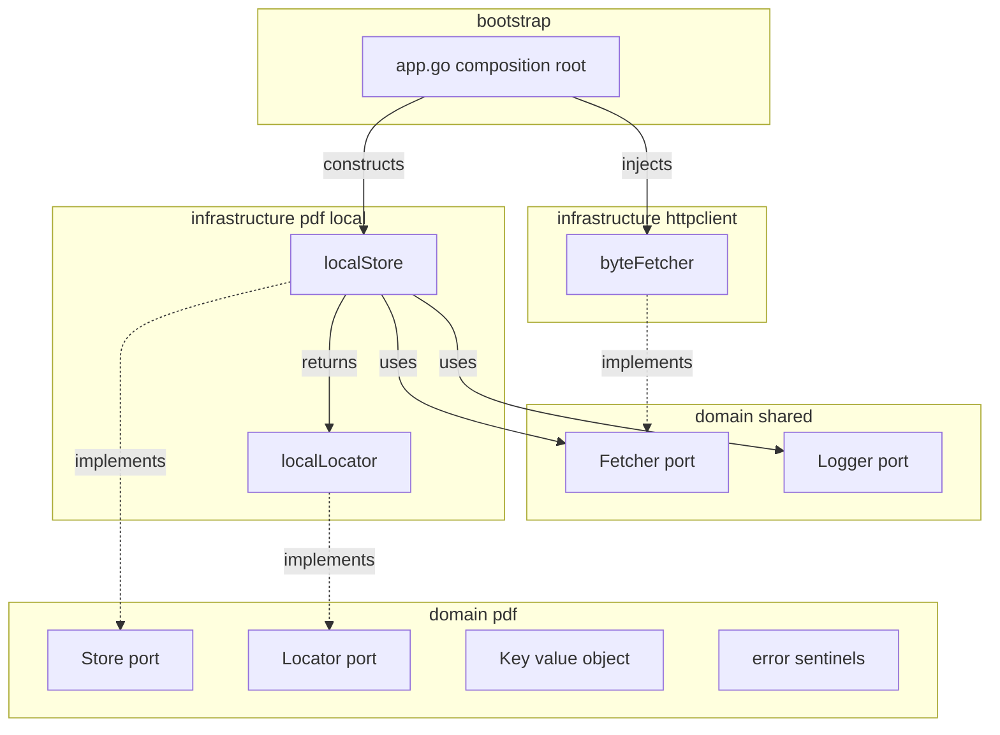

# Design Document — pdf-storage

## Overview

The PDF Store materializes a paper's PDF bytes onto local disk so that downstream tools (today: the `mineru` extraction adapter; tomorrow: any path- or stream-based consumer) can read them without managing downloads, paths, or temp files. It exposes a single domain port — `pdf.Store.Ensure(ctx, Key) (Locator, error)` — backed in v1 by a local-filesystem implementation that fetches via the existing `shared.Fetcher`, writes through a tmp+rename atomic recipe, and returns a `Locator` that satisfies both path-based and stream-based callers.

**Users**: the document-extraction worker (future integration) and the operator who configures storage location and inspects stored files on disk.

**Impact**: introduces a new domain aggregate `pdf` and a new infrastructure adapter `pdf/local`. Adds one env var (`PDF_STORE_ROOT`) and one composition-root wiring block. No changes to `arxiv-fetcher`, `paper-persistence`, or `document-extraction`.

### Goals

- Single port that owns "ensure a paper's PDF is present locally and hand back a handle".
- Idempotent on repeat calls (cache hit → no fetch).
- Atomic visibility: consumers never observe a partial file.
- Handle abstraction (`Locator`) so a future S3/NFS implementation requires zero caller change.
- Operator-configurable storage root; fail-fast on misconfiguration.
- Structured logs distinguishing fetch / cache-hit / failure outcomes.

### Non-Goals

- Integrating the store into `document-extraction` — that is a follow-on update to that spec.
- HTTP surface for the store (no `GET /pdfs/...`).
- Background sweepers, TTL, content-hash deduplication.
- Non-local backends (S3, NFS) — the design must accommodate them, but no implementation is delivered here.
- In-process locking / `singleflight`. Two concurrent `Ensure` calls for the same key are tolerated (see Concurrency note in Components).

## Boundary Commitments

### This Spec Owns

- The `pdf.Store` and `pdf.Locator` ports and the `pdf.Key` value object.
- The `pdf` typed-error sentinels (`ErrInvalidKey`, `ErrFetch`, `ErrStore`).
- The local-filesystem implementation: existence gate, fetch orchestration, atomic write, on-disk layout.
- The `PDF_STORE_ROOT` env field, its default, its startup-time validation.
- Bootstrap wiring of the local implementation into `app.go`.

### Out of Boundary

- Any change to `domain/paper`, `domain/extraction`, or their adapters. Mapping `Paper.PDFURL` → `pdf.Key` is the consumer's job.
- HTTP routes, controllers, request DTOs.
- Retention, cleanup, deduplication, content addressing.
- Concrete S3/NFS implementations. The shape of the abstraction must permit them; the code does not deliver them.

### Allowed Dependencies

- `domain/shared.Fetcher` (consumed for HTTP GET; no direct `net/http` calls in `pdf` packages).
- `domain/shared.Logger` (consumed for structured logging).
- Go stdlib (`os`, `io`, `path/filepath`, `errors`, `fmt`, `context`).
- `internal/bootstrap/env.go` (extended by one field).

Forbidden: importing `domain/paper`, `domain/extraction`, any `infrastructure/persistence/*`, or any package outside `domain/shared` and stdlib from `domain/pdf`.

### Revalidation Triggers

Any change in this list forces consumers (and the future `document-extraction` integration spec) to re-check integration:

- Method-signature change on `pdf.Store` or `pdf.Locator`.
- New required field on `pdf.Key`.
- New error sentinel exposed in the public API of `domain/pdf`.
- Layout change under the storage root that breaks operator-side inspection (`<root>/<source_type>/<source_id>.pdf`).
- Change in retention semantics (anything other than keep-forever).
- New runtime prerequisite at startup (e.g., a second env var, a remote dependency).

## Architecture

### Existing Architecture Analysis

The backend follows a strict inward-only dependency rule (see `.kiro/steering/structure.md` §2). Domain packages define ports; infrastructure packages implement them; bootstrap wires concretes. Cross-cutting ports (`Fetcher`, `Logger`, `Clock`, `LLMClient`) live in `domain/shared/ports.go`. Aggregate-shaped ports live in `domain/<entity>/ports.go`.

The existing `shared.Fetcher` HTTP implementation (`internal/infrastructure/httpclient/byte_fetcher.go:19-71`) already wraps non-2xx as `shared.ErrBadStatus` and surfaces stdlib transport errors verbatim. PDF Store consumes it unchanged.

No `pdf` package exists today. No atomic-write helper exists; the design uses `os.CreateTemp` + `os.Rename` directly.

### Architecture Pattern & Boundary Map

**Pattern**: Hexagonal / Ports-and-Adapters. `pdf.Store` and `pdf.Locator` are ports in `domain/pdf/`. `infrastructure/pdf/local/` is the v1 adapter. A future S3 adapter at `infrastructure/pdf/s3/` plugs into the same port.



**Key decisions**:

- **Pattern: Hexagonal**, consistent with every other aggregate in the codebase (`source`, `extraction`, `paper`).
- **Domain/feature boundaries**: `domain/pdf` does not import `domain/paper`. The caller maps `Paper.PDFURL` → `pdf.Key`.
- **Existing patterns preserved**: cross-cutting ports stay in `domain/shared`; aggregate-shaped ports go in `domain/pdf`.
- **Steering compliance**: dependency rule (`.kiro/steering/structure.md` §2) holds; no `domain/` → `infrastructure/persistence/` import is introduced (not relevant here).

### Technology Stack

| Layer | Choice / Version | Role in Feature | Notes |
|---|---|---|---|
| Backend / Services | Go 1.25 stdlib (`os`, `io`, `path/filepath`, `errors`) | Filesystem I/O, atomic write recipe, path computation | No new third-party dependency |
| Backend / Services | Existing `shared.Fetcher` (`httpclient.byteFetcher`, 15s timeout, custom UA) | HTTP GET of PDF URL | Unchanged; reused |
| Data / Storage | Local filesystem under `PDF_STORE_ROOT` (default `data/pdfs`) | PDF bytes at rest | One file per `(source_type, source_id)` |
| Infrastructure / Runtime | viper-backed env loading (`internal/bootstrap/env.go`) | New field `PDFStoreRoot string \`mapstructure:"PDF_STORE_ROOT"\`` with default + startup validation | Pattern matches `SQLitePath` |
| Logging | `log/slog` via `shared.Logger` | Three structured events: `pdf.store.fetched`, `pdf.store.cache_hit`, `pdf.store.failed` | No new logger |

## File Structure Plan

### Directory Structure

```
internal/
├── domain/
│   └── pdf/
│       ├── doc.go               # package doc: purpose, dependency rule
│       ├── ports.go             # Store, Locator interfaces
│       ├── model.go             # Key value object
│       ├── errors.go            # ErrInvalidKey, ErrFetch, ErrStore
│       └── model_test.go        # Key.Validate() unit tests
└── infrastructure/
    └── pdf/
        └── local/
            ├── store.go         # localStore: Ensure() implementation
            ├── store_test.go    # store unit tests (real FS via t.TempDir, inline fakeFetcher)
            ├── locator.go       # localLocator: Path()/Open() implementation
            └── locator_test.go  # locator unit tests
```

### Modified Files

- `internal/bootstrap/env.go` — add `PDFStoreRoot string \`mapstructure:"PDF_STORE_ROOT"\`` with default `data/pdfs`; add post-Unmarshal validation that the parent dir is creatable / writable. Pattern follows the existing `SQLitePath` validation block.
- `internal/bootstrap/app.go` — instantiate `pdfStore := pdflocal.NewStore(env.PDFStoreRoot, byteFetcher, logger)` next to the existing `byteFetcher` construction (`app.go:72-76`). Not yet consumed by any caller in this spec; wired so the follow-on `document-extraction` integration can pick it up. Pass into `route.Deps` only when a consumer needs it (in this spec: not needed — leave the wiring at the variable level until the consumer integration arrives, OR add it to `route.Deps` now to make the consumer change in the next spec one-line).
  - **Decision**: wire it into `route.Deps` now. It's a one-line addition and avoids a round-trip in the next spec. The store has no observable HTTP surface, so unused `route.Deps` field is harmless.
- `.env.example` — add `PDF_STORE_ROOT=data/pdfs` line with comment.

Each file has one responsibility; the four `local/*.go` files split write-orchestration (`store.go`) from handle representation (`locator.go`) so a future `s3/*.go` adapter can mirror the split.

## System Flows

### Ensure() — happy path and cache hit

```mermaid
sequenceDiagram
    participant Caller
    participant Store as localStore
    participant FS as filesystem
    participant Fetcher as shared.Fetcher

    Caller->>Store: Ensure(ctx, Key)
    Store->>Store: Key.Validate()
    Store->>FS: Stat(canonical path)
    alt file exists and size > 0
        FS-->>Store: FileInfo
        Store->>Caller: Locator (cache_hit log)
    else missing or empty
        Store->>FS: MkdirAll(<root>/<source_type>)
        Store->>FS: CreateTemp(dir, "<source_id>.*.pdf.tmp")
        Store->>Fetcher: Fetch(ctx, url)
        Fetcher-->>Store: bytes or error
        alt fetch error
            Store->>FS: Remove(tmp)
            Store->>Caller: ErrFetch wrapping cause (failed log)
        else fetch ok
            Store->>FS: Write(tmp, bytes); Close(tmp)
            Store->>FS: Rename(tmp, canonical)
            alt rename ok
                Store->>Caller: Locator (fetched log)
            else rename error
                Store->>FS: Remove(tmp)
                Store->>Caller: ErrStore wrapping cause (failed log)
            end
        end
    end
```

**Key flow decisions**:

- Existence gate uses `os.Stat` and treats `Size() == 0` as "not stored" (Req 2.4). A successful `Stat` with non-zero size short-circuits before any fetch.
- Tmp file lives in the *same directory* as the canonical file so `os.Rename` is guaranteed atomic on POSIX (same filesystem). Cross-FS renames are not a concern here.
- On any error after `CreateTemp` and before `Rename`, the tmp file is `os.Remove`-d in a deferred cleanup. Stale `*.tmp` siblings from previously-killed processes are harmless: they are never linked into the canonical path, and the next `CreateTemp` call generates a fresh random suffix.
- ctx cancellation surfaces from `shared.Fetcher` as `context.Canceled` / `context.DeadlineExceeded`; the store wraps them as `ErrFetch` but preserves the cause (Req 3.3) so callers can `errors.Is(err, context.Canceled)`.

## Requirements Traceability

| Requirement | Summary | Components | Interfaces | Flows |
|---|---|---|---|---|
| 1.1 | Fetch on miss, persist, return handle | `localStore.Ensure` | `pdf.Store.Ensure`, `pdf.Locator` | Ensure happy path |
| 1.2 | Return cached handle without re-fetch | `localStore.Ensure` (existence gate) | `pdf.Store.Ensure` | Ensure cache-hit branch |
| 1.3 | Handle exposes both path and stream | `localLocator` | `pdf.Locator.Path`, `pdf.Locator.Open` | — |
| 1.4 | Reject invalid input, no I/O | `pdf.Key.Validate`, `localStore.Ensure` | `pdf.Key.Validate`, `pdf.ErrInvalidKey` | — |
| 1.5 | No partial files visible | tmp+rename in `localStore.Ensure` | — | Ensure happy path |
| 2.1 | Idempotent, fetch at most once | `localStore.Ensure` (existence gate) | — | Ensure cache-hit branch |
| 2.2 | Publish only after full write | `localStore.Ensure` (rename after close) | — | Ensure happy path |
| 2.3 | Recover from prior partial / stale tmp | `os.CreateTemp` random suffix; canonical never half-written | — | (implicit) |
| 2.4 | Empty file = not stored | `localStore.Ensure` (size check) | — | Ensure existence gate |
| 3.1 | Fetch failure preserves cause | `localStore.Ensure` error wrapping | `pdf.ErrFetch` | Ensure fetch-error branch |
| 3.2 | Storage failure distinguishable | `localStore.Ensure` rename/write error wrapping | `pdf.ErrStore` | Ensure rename-error branch |
| 3.3 | Cancellation cleanup, surfaced | `localStore.Ensure` deferred tmp cleanup | `pdf.ErrFetch` (wraps `context.Canceled`) | Ensure fetch-error branch |
| 3.4 | No silent placeholders | tmp removed on any failure | — | Ensure error branches |
| 4.1-4.4 | Handle abstraction, future-backend ready | `pdf.Locator` interface; `localLocator` impl | `pdf.Locator` | — |
| 5.1 | Env-driven root with default | `env.go` `PDFStoreRoot` field, default `data/pdfs` | — | — |
| 5.2 | Create root if missing | `localStore.New` calls `os.MkdirAll(root, 0o755)` | — | — |
| 5.3 | Fail fast on misconfiguration | `env.go` validation + `localStore.New` Stat check | — | — |
| 5.4 | Layout `<root>/<source_type>/<source_id>.pdf` | `localStore.canonicalPath` | — | — |
| 6.1 | Keep forever | No deletion code in `localStore` | — | — |
| 6.2 | Survives restart | Filesystem persistence | — | — |
| 6.3 | Future retention is opt-in | (deferred; design does not preclude) | — | — |
| 7.1 | Log on fetch | `localStore.Ensure` | `shared.Logger.InfoContext` event `pdf.store.fetched` | — |
| 7.2 | Log on cache hit | `localStore.Ensure` | `shared.Logger.InfoContext` event `pdf.store.cache_hit` | — |
| 7.3 | Log on failure | `localStore.Ensure` | `shared.Logger.WarnContext` event `pdf.store.failed` | — |
| 7.4 | No body bytes in logs | log call sites only emit identity + size + duration | — | — |

## Components and Interfaces

| Component | Domain/Layer | Intent | Req Coverage | Key Dependencies | Contracts |
|---|---|---|---|---|---|
| `pdf.Key` | domain/pdf | Stable identity + URL value object | 1.4, 5.4 | — | State |
| `pdf.Store` | domain/pdf | Port: ensure PDF materialized, return handle | 1.1, 1.2, 2.1, 6.1 | — | Service |
| `pdf.Locator` | domain/pdf | Port: handle exposing path + stream | 1.3, 4.1-4.4 | — | Service |
| `pdf` errors | domain/pdf | Typed sentinels for failure surfacing | 1.4, 3.1, 3.2 | — | State |
| `localStore` | infrastructure/pdf/local | v1 implementation of `pdf.Store` over local FS | 1.1-1.5, 2.1-2.4, 3.1-3.4, 5.2-5.4, 7.1-7.3 | `shared.Fetcher` (P0), `shared.Logger` (P0) | Service |
| `localLocator` | infrastructure/pdf/local | v1 implementation of `pdf.Locator` for local FS | 1.3, 4.1-4.3 | — | Service |
| env extension | bootstrap | New `PDF_STORE_ROOT` field + validation | 5.1, 5.3 | viper (existing) | State |

### domain/pdf

#### `pdf.Key`

| Field | Detail |
|---|---|
| Intent | Stable identity (`SourceType`, `SourceID`) plus the URL the bytes can be fetched from. |
| Requirements | 1.4, 5.4 |

**Responsibilities & Constraints**
- Carries identity used for both canonical-path computation and logging.
- `Validate()` returns `ErrInvalidKey` (wrapping a descriptive cause) when any field is empty after trimming. The store calls `Validate()` before any I/O.
- Identity-bearing fields (`SourceType`, `SourceID`) are pure ASCII identifiers in current use; the design assumes they are filesystem-safe. Sanitization is **not** required for v1 (callers come from `domain/paper.Paper.SourceType`/`SourceID` which are already constrained). A future caller from outside the codebase would require a sanitization pass — flagged as a Risk.

**State Management**
- Pure value object, no internal mutation.

##### Service Interface

```go
package pdf

type Key struct {
    SourceType string // e.g. "paper"
    SourceID   string // e.g. "2404.12345v1"
    URL        string // upstream PDF URL
}

func (k Key) Validate() error
```

- Preconditions: none.
- Postconditions: returns `nil` if all three fields are non-empty after `strings.TrimSpace`; returns an error wrapping `ErrInvalidKey` otherwise.
- Invariants: zero value is invalid.

#### `pdf.Store`

| Field | Detail |
|---|---|
| Intent | Port: idempotently materialize the PDF for `Key` and return a handle. |
| Requirements | 1.1, 1.2, 2.1, 6.1 |

**Responsibilities & Constraints**
- Single method `Ensure(ctx, Key) (Locator, error)`. No streaming variant (the `Locator` provides streaming).
- Implementations must be safe to call from multiple goroutines.
- Implementations may not silently substitute placeholder bytes on failure (Req 3.4).

**Dependencies**
- Outbound: `pdf.Locator` (P0) — the return type.

**Contracts**: Service.

##### Service Interface

```go
package pdf

type Store interface {
    Ensure(ctx context.Context, key Key) (Locator, error)
}
```

- Preconditions: `ctx` not nil; `key.Validate()` is the implementation's responsibility.
- Postconditions on success: a non-nil `Locator` whose `Path()` resolves to a complete file or whose `Open()` returns a reader of the complete bytes.
- Postconditions on error: returned error wraps one of `ErrInvalidKey`, `ErrFetch`, `ErrStore`, or a `context.Context` error; no partial file under the canonical path.

#### `pdf.Locator`

| Field | Detail |
|---|---|
| Intent | Handle decoupling "where bytes live" from "how callers read". |
| Requirements | 1.3, 4.1-4.4 |

**Responsibilities & Constraints**
- `Path()` must return a real on-disk path that any path-only tool (e.g. `mineru -p <path>`) can read. For non-local backends, the implementation is responsible for materializing a temp file lazily and is permitted to return its path here. This v1 returns the canonical path directly.
- `Open(ctx)` returns a `io.ReadCloser` over the same bytes. Caller is responsible for closing.
- Both methods must agree byte-for-byte on the same `Locator` instance.

##### Service Interface

```go
package pdf

type Locator interface {
    Path() string
    Open(ctx context.Context) (io.ReadCloser, error)
}
```

- Preconditions: locator obtained from a successful `Store.Ensure` call.
- Postconditions: `Path()` is stable for the lifetime of the locator; `Open` opens that path (v1) or a materialized equivalent (future backends).

#### `pdf` error sentinels

```go
package pdf

var (
    ErrInvalidKey = errors.New("pdf: invalid key")
    ErrFetch      = errors.New("pdf: fetch failed")
    ErrStore      = errors.New("pdf: store failed")
)
```

- Implementations wrap these with `fmt.Errorf("...: %w", ErrFetch)` and additionally wrap the underlying cause when present (e.g. `errors.Join(ErrFetch, fetcherErr)` or a chained `%w` so callers can `errors.Is(err, shared.ErrBadStatus)`).

### infrastructure/pdf/local

#### `localStore`

| Field | Detail |
|---|---|
| Intent | v1 `pdf.Store` over local filesystem. |
| Requirements | 1.1-1.5, 2.1-2.4, 3.1-3.4, 5.2-5.4, 7.1-7.3 |

**Responsibilities & Constraints**
- Owns canonical-path computation: `<root>/<source_type>/<source_id>.pdf`.
- Owns the existence gate: `os.Stat`, treat `Size()==0` as miss.
- Owns the atomic-write recipe: `MkdirAll(parent)`, `CreateTemp(parent, "<source_id>.*.pdf.tmp")`, write bytes, `Close`, `Rename(tmp, canonical)`. Tmp removed in deferred cleanup on any error path.
- Owns the three log call sites and their structured fields.
- Constructor `NewStore(root string, fetcher shared.Fetcher, logger shared.Logger) (pdf.Store, error)` performs `os.MkdirAll(root, 0o755)` and fails if the resulting path is not a writable directory.

**Dependencies**
- Outbound: `shared.Fetcher` (P0) — HTTP GET; `shared.Logger` (P0) — observability.
- Inbound: bootstrap composition root only.

**Contracts**: Service (implements `pdf.Store`).

##### State Management
- Stateless apart from injected dependencies (`root`, `fetcher`, `logger`).

**Implementation Notes**
- Integration: returned by `NewStore(root, fetcher, logger)`. Bootstrap calls this once at startup.
- Validation: reject zero-length response bodies from `Fetcher` as `ErrFetch` (treat as a sentinel for "fetcher returned nothing"; the alternative is silently storing an empty file, which Req 2.4 then treats as not-stored, causing infinite re-fetch). **Decision**: empty body → return `ErrFetch` wrapping a descriptive cause; do not write the file.
- Risks:
  - **Concurrency**: two goroutines `Ensure`-ing the same `Key` simultaneously will both fetch and both rename. The rename loser's bytes silently overwrite the winner's bytes; the consumer still sees a complete file. Documented and accepted for v1 (single-user system); call out as Risk for future revisit.
  - **`SourceType`/`SourceID` filesystem safety**: see `pdf.Key` notes.

#### `localLocator`

| Field | Detail |
|---|---|
| Intent | v1 `pdf.Locator` for local FS. |
| Requirements | 1.3, 4.1-4.3 |

**Responsibilities & Constraints**
- Holds the canonical path string. `Path()` returns it. `Open(ctx)` returns `os.Open(path)` wrapped in an `io.ReadCloser`. ctx is accepted for interface conformance with future remote backends; v1 does not consult it.

**Implementation Notes**
- Integration: constructed by `localStore.Ensure` and returned through the `pdf.Locator` interface.

### bootstrap

#### env extension

| Field | Detail |
|---|---|
| Intent | Operator-configurable storage root with a default and fail-fast validation. |
| Requirements | 5.1, 5.3 |

**Responsibilities & Constraints**
- New field `PDFStoreRoot string \`mapstructure:"PDF_STORE_ROOT"\`` on the env struct.
- Default `data/pdfs` set via `viper.SetDefault("PDF_STORE_ROOT", "data/pdfs")` in env-load init.
- Post-Unmarshal validation: parent directory must be creatable; if `PDFStoreRoot` exists, it must be a directory and writable. Failure surfaces as a startup error naming the offending field.

## Data Models

### Domain Model

- **Aggregate**: `pdf.Key` (value object). No persistent identifier beyond `(SourceType, SourceID)`.
- **Invariant**: `Key.Validate()` rejects any empty trimmed field. No other domain invariants.
- **Domain events**: none.

### Physical Data Model

On-disk layout under `PDF_STORE_ROOT`:

```
<root>/
└── <source_type>/         # e.g. "paper"
    └── <source_id>.pdf    # e.g. "2404.12345v1.pdf"
```

- One file per `(source_type, source_id)`.
- File mode `0o644`; directory mode `0o755`.
- No index, manifest, or sidecar metadata. Inspection is by listing the directory.

## Error Handling

### Error Strategy

Three failure categories, each wrapped with a typed sentinel and the underlying cause preserved:

| Category | Sentinel | Source |
|---|---|---|
| Validation | `ErrInvalidKey` | `Key.Validate()` |
| Fetch | `ErrFetch` | `shared.Fetcher` (transport, non-2xx, ctx cancel, empty body) |
| Storage | `ErrStore` | `os.MkdirAll` / `CreateTemp` / `Write` / `Rename` failures |

Callers use `errors.Is(err, pdf.ErrFetch)` for retry-vs-give-up decisions and may further inspect with `errors.Is(err, shared.ErrBadStatus)` or `errors.Is(err, context.Canceled)` because the underlying cause is preserved via `%w`.

### Error Categories and Responses

- **Validation** (`ErrInvalidKey`): caller bug. No I/O performed. No log emitted (the caller is the bug; let the caller log).
- **Fetch** (`ErrFetch`): network or upstream issue, often transient. `pdf.store.failed` log at warn level with `category=fetch`. Tmp file removed.
- **Storage** (`ErrStore`): filesystem misconfiguration or exhaustion, usually permanent in-process. `pdf.store.failed` log at error level with `category=store`. Tmp file removed.

### Monitoring

Three structured `slog` events:

| Event | Level | Fields |
|---|---|---|
| `pdf.store.fetched` | Info | `source_type`, `source_id`, `bytes`, `duration_ms` |
| `pdf.store.cache_hit` | Info | `source_type`, `source_id`, `bytes` |
| `pdf.store.failed` | Warn (fetch) / Error (store) | `source_type`, `source_id`, `category` (`fetch`/`store`/`invalid_key`), `error` (formatted cause; never response body) |

## Testing Strategy

All tests follow `.kiro/steering/testing.md`: `t.Parallel()`, `t.Run` even for single cases, AAA via blank lines, hand-rolled fakes for non-DB collaborators in inline test helpers, real filesystem via `t.TempDir()`.

### Unit Tests

1. `Key_Validate_rejects_empty_fields` — every empty/whitespace combination of `SourceType` / `SourceID` / `URL` returns an error wrapping `ErrInvalidKey`. (Req 1.4)
2. `localStore_Ensure_cache_miss_writes_atomically_and_returns_locator` — empty TempDir, fake fetcher returns 1 KiB, verify `<root>/<source_type>/<source_id>.pdf` exists with exact bytes, no `*.tmp` siblings remain, fetcher invoked exactly once. (Req 1.1, 1.5, 2.2)
3. `localStore_Ensure_cache_hit_does_not_invoke_fetcher` — pre-seed canonical file, call `Ensure`, assert fetcher invocation count == 0 and returned `Locator.Path()` resolves to the seeded bytes. (Req 1.2, 2.1)
4. `localStore_Ensure_empty_file_treated_as_miss` — pre-seed canonical file with zero bytes, call `Ensure`, fetcher must run, file is replaced with non-zero bytes. (Req 2.4)
5. `localStore_Ensure_fetch_error_surfaces_ErrFetch_and_removes_tmp` — fake fetcher returns `shared.ErrBadStatus`, assert returned error satisfies `errors.Is(err, pdf.ErrFetch)` AND `errors.Is(err, shared.ErrBadStatus)`, no canonical file, no `*.tmp` siblings. (Req 3.1, 3.4)
6. `localStore_Ensure_storage_error_surfaces_ErrStore` — root pointed at a non-writable path (drop write perms on a `t.TempDir` subdir), assert returned error satisfies `errors.Is(err, pdf.ErrStore)`. (Req 3.2)
7. `localStore_Ensure_ctx_cancel_surfaces_cancellation_and_removes_tmp` — fake fetcher honors ctx; cancel before return; assert `errors.Is(err, context.Canceled)` AND `errors.Is(err, pdf.ErrFetch)`, no canonical file. (Req 3.3, 3.4)
8. `localStore_Ensure_logs_three_events_with_correct_fields` — using `tests/mocks.RecordingLogger`, drive cache-miss, cache-hit, and failure paths; assert event names and field keys; assert no field contains response body bytes. (Req 7.1-7.4)
9. `localStore_NewStore_fails_when_root_is_unwritable` — pass a path whose parent is not a directory or is read-only, assert constructor returns error mentioning `PDF_STORE_ROOT`. (Req 5.3)
10. `localLocator_Path_and_Open_agree_byte_for_byte` — write a file under `t.TempDir`, build a `localLocator`, assert `Open()` reads the same bytes as `os.ReadFile(loc.Path())`. (Req 1.3, 4.2, 4.3)
11. `localStore_Ensure_layout_matches_<root>_<source_type>_<source_id>.pdf` — verify exact filesystem layout for a representative key. (Req 5.4)

### Integration Tests

This spec deliberately does not introduce HTTP or DB integration. The cross-package behavior between `localStore` and the real `httpclient.byteFetcher` is exercised via:

12. `localStore_with_real_byteFetcher_against_httptest_server` — wire `httpclient.NewByteFetcher` against `httptest.NewServer` returning a small known PDF byte sequence; call `Ensure`; verify atomic write and that ctx-deadline mid-handler surfaces as `ErrFetch` wrapping `context.DeadlineExceeded`. Lives at `internal/infrastructure/pdf/local/integration_test.go` with no build tag (the existing `httpclient` test does the same).

### Performance / Load

Not applicable for v1 (single-user system, modest paper count). No targets defined.

## Security Considerations

- **Path traversal**: `Key.SourceType` / `Key.SourceID` are joined directly into `filepath.Join(root, type, id+".pdf")`. A malicious value containing `..` could escape `root`. v1 callers come from `domain/paper.Paper`, where these fields are produced by `arxiv-fetcher` from arxiv metadata — not from end-user input — so the risk surface is internal. **Decision**: no sanitization in v1; document in `Key`'s godoc that callers MUST supply filesystem-safe identifiers. Add `Key.Validate()` rejection of any field containing `..`, `/`, or `\` as a defense-in-depth check (cheap, no false-positive risk for arxiv IDs).
- **Body content**: `shared.Fetcher` returns bytes as-is. The PDF Store does not validate that the bytes are a valid PDF; that is the extractor's job. Storing a non-PDF response is acceptable — extraction will fail with `ErrParseFailed`, which is already a documented failure path in `domain/extraction`.
- **Logging**: response body bytes never appear in log fields (Req 7.4). Fields are constrained to identifiers + sizes + durations + formatted error strings.

## Open Questions / Risks

- **Concurrent `Ensure` for the same key** (already discussed): accepted for single-user v1; revisit if a multi-worker setup arrives. Mitigation path: per-key `singleflight`.
- **`route.Deps` carrying an unused `pdf.Store` field until the next spec wires extraction integration**: trivial, accepted to avoid a follow-on bootstrap edit.
- **No content-hash dedup**: two distinct papers sharing the same PDF (rare in practice for arXiv) will be stored twice. Accepted; trivially deferrable.
