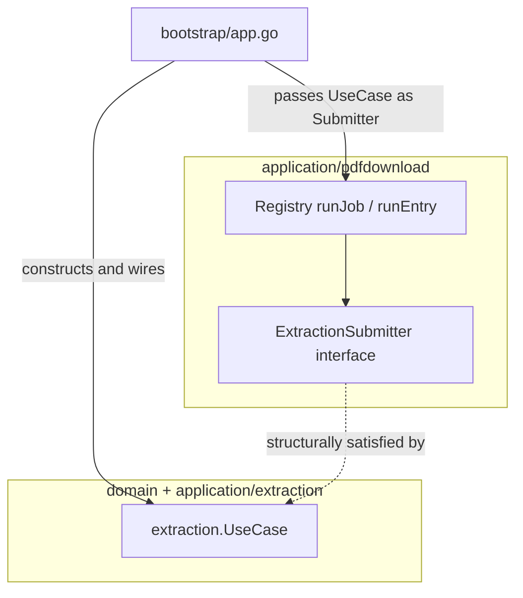
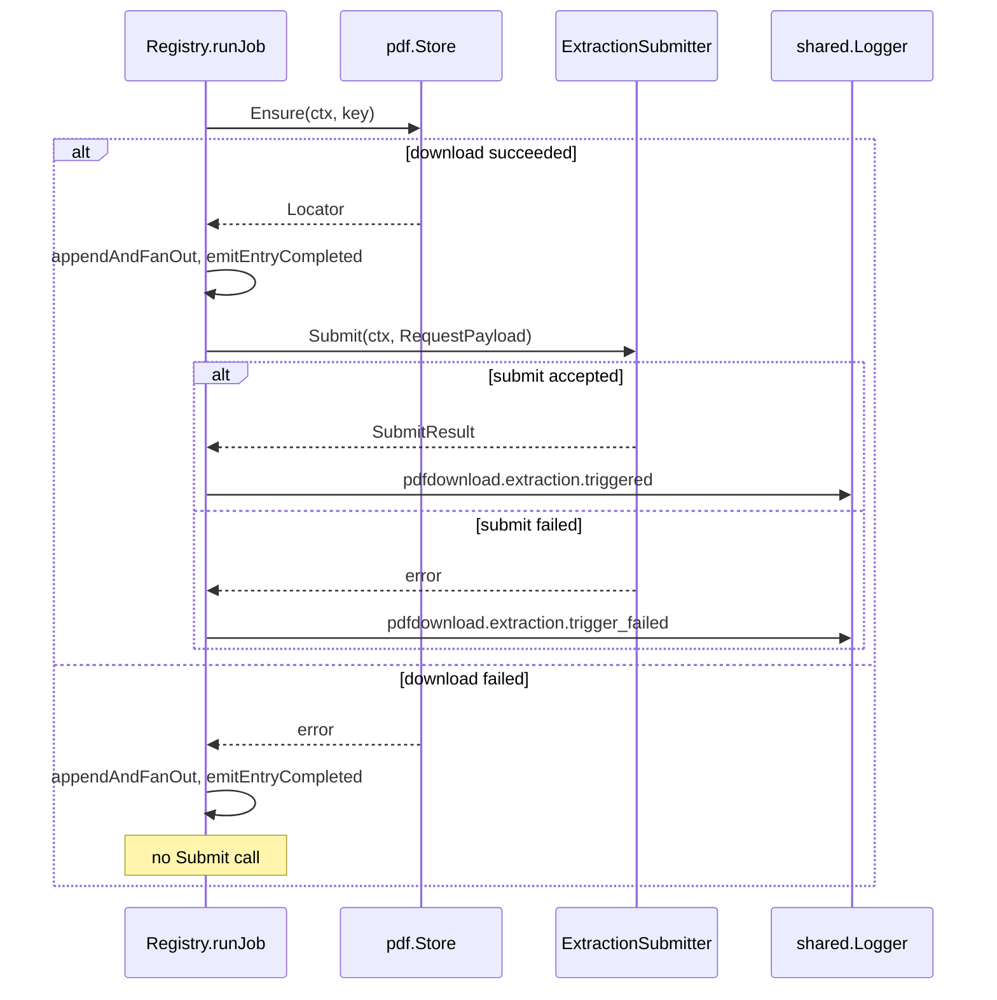

# Design: pdf-to-extraction-trigger

## Overview

**Purpose**: This feature delivers automatic extraction submission to the sole-user researcher the moment a PDF download succeeds, removing the last hand-carried `pdf_path` in the fetch → download → extract leg of the pipeline.

**Users**: The single researcher, indirectly — no new endpoint or UI surface. The direct "caller" is the `application/pdfdownload` worker itself; the change is invisible except that `GET /api/extractions/:id` now shows a row without the operator ever calling `POST /api/extractions`.

**Impact**: Adds one new call site inside `application/pdfdownload`'s per-job worker loop and one new narrow interface it depends on. No existing endpoint, wire contract, or persisted schema changes. Both places that construct a `pdfdownload.Registry` — `internal/bootstrap/app.go` and `tests/integration/setup/setup.go` — reorder their existing composition so an `ExtractionSubmitter` value exists before the registry that now requires one.

### Goals
- Every successful PDF download automatically produces an extraction request, with no operator action and no way to opt out per-download.
- The trigger call never widens `pdfdownload`'s existing public wire shapes (`EntryResult`, SSE events, REST responses).
- A failed trigger call is visible in structured logs and never retried automatically.

### Non-Goals
- Changing `extraction.UseCase.Submit`'s contract, `document-extraction`'s domain/persistence, or its worker.
- Changing `pdf.Store`'s contract or the byte-fetch path.
- Triggering analysis after extraction (`extraction-to-analysis-trigger`, a separate sibling spec).
- Any new HTTP endpoint or SSE event.
- Retrying a failed download or a failed extraction submission.

## Boundary Commitments

### This Spec Owns
- The call site inside `application/pdfdownload`'s worker that fires after a successful per-entry download.
- The narrow interface `application/pdfdownload` depends on to submit an extraction, and the translation from a completed download's identity (`paper.ID`) and resolved file path into `extraction.RequestPayload`.
- The composition-root wiring — both `bootstrap/app.go` (production) and `tests/integration/setup/setup.go` (the integration test harness, which constructs a `Registry` independently of `bootstrap.NewApp` and must be updated in lockstep) — that supplies an `ExtractionSubmitter` to `pdfdownload.NewRegistry`, including the construction-order fix each requires.
- The test harness's fallback: when a test opts into `WirePDFDownload` without also opting into `Extractor` (the two flags are independent today), the harness must still supply a valid `ExtractionSubmitter` so the registry compiles and does not panic on a nil dependency.
- Structured logging for a triggered submission and for a failed one.

### Out of Boundary
- Anything inside `internal/domain/extraction`, `internal/application/extraction`, or `internal/infrastructure/persistence/extraction` — this spec calls `extraction.UseCase`, it does not modify it.
- Anything inside `internal/domain/pdf` or `internal/infrastructure/pdf/local` — `pdf.Store`'s contract is unchanged; only the already-computed path is threaded one call frame further.
- The extraction → analysis handoff (`extraction-to-analysis-trigger`).
- Frontend rendering of any new pipeline state.

### Allowed Dependencies
- `application/pdfdownload` may depend on `domain/extraction` types (`RequestPayload`, `SubmitResult`) — consistent with its existing direct dependencies on `domain/paper` and `domain/pdf`.
- `application/pdfdownload` may depend on the concrete `extraction.UseCase` value only through the narrow interface this spec defines — never on `application/extraction` package types directly.
- Only composition-root code constructs a `pdfdownload.Registry` and supplies its `ExtractionSubmitter`: `bootstrap/app.go` (production, always the real `extraction.UseCase`) and `tests/integration/setup/setup.go` (the real `extraction.UseCase` when the test also opts into `Extractor`, otherwise a hand-written fake — never a third construction site).

### Revalidation Triggers
- If `extraction.UseCase.Submit`'s method signature changes, the interface defined here must change in lockstep (compile-time enforced) — no design work is deferred, but it is a signal to re-check this spec.
- If `document-extraction` ever changes what `source_type`/`source_id` mean or accepts, the identity-mapping decision in `research.md` must be re-verified.
- If a second, non-arXiv `paper.Source` is introduced, the fixed `SourceType = "paper"` literal and the version-less `SourceID` mapping must be re-checked against the new source's identity shape.

## Architecture

### Existing Architecture Analysis

`application/pdfdownload` already establishes the shape this feature extends: `Registry.runJob` iterates requests, calls `runEntry` (which performs the actual `pdf.Store.Ensure` download), then `appendAndFanOut` (commit + SSE fan-out) and `emitEntryCompleted` (structured log) per entry. `runEntry` currently discards the resolved `*pdf.Locator` after using it for a best-effort byte-size stat — the only gap preventing today's code from already knowing "the exact file location the successful download produced."

`document-extraction` already exposes exactly the entry point this feature needs (`extraction.UseCase.Submit`), unmodified.

### Architecture Pattern & Boundary Map



**Architecture Integration**:
- Selected pattern: consumer-defined interface, structurally satisfied by an existing concrete type — no adapter. Mirrors the shape of `extraction.Notifier` (a narrow, purpose-built interface already living beside a use case it decouples from a concrete concern).
- Domain/feature boundaries: `application/pdfdownload` never imports `application/extraction`; it only imports `domain/extraction` for the two DTO types and declares its own interface locally. `domain/extraction` and `application/extraction` remain unaware this caller exists.
- Existing patterns preserved: worker loop stays synchronous and single-threaded per job; `EntryResult`'s wire shape is untouched; logging follows the existing `pdfdownload.<noun>.<verb>` naming convention (`pdfdownload.entry.completed`, `pdfdownload.job.completed`).
- New components rationale: exactly one new interface (`ExtractionSubmitter`) and one new unexported helper (payload construction) — no new package, no new domain subpackage. The "Build vs. Adopt" and "Simplification" lenses both point at reusing `extraction.UseCase.Submit` as-is (see `research.md`).
- Steering compliance: dependency rule preserved (`application/` → `domain/` only); `context.Context` remains the first parameter on the new interface method; `log/slog` via `shared.Logger` for the new log lines.

### Technology Stack

| Layer | Choice / Version | Role in Feature | Notes |
|-------|------------------|------------------|-------|
| Backend / Services | Go 1.25 (existing) | New interface + call site in `application/pdfdownload`; composition-order change in `bootstrap/app.go` | No new dependency added |

## File Structure Plan

### Modified Files
- `internal/application/pdfdownload/types.go` — add the `ExtractionSubmitter` interface and an unexported `extractionPayload(id paper.ID, pdfPath string) extraction.RequestPayload` helper.
- `internal/application/pdfdownload/worker.go` — `runEntry` gains a second return value (resolved path, empty on failure). `runJob` calls the new unexported `triggerExtraction` helper right after `emitEntryCompleted` when `result.Status == StatusSuccess`, and the two new structured log lines (`pdfdownload.extraction.triggered`, `pdfdownload.extraction.trigger_failed`) are emitted from that helper.
- `internal/application/pdfdownload/service.go` — `NewRegistry` gains a new required parameter (`extractionSubmitter ExtractionSubmitter`) stored on `*Registry`; `Options` is unchanged (dependencies stay as constructor parameters, matching `store`/`logger`/`clock`, not config).
- `internal/application/pdfdownload/service_test.go` — update every `NewRegistry(...)` call site to pass a fake `ExtractionSubmitter`.
- `internal/bootstrap/app.go` — move the "Extraction composition" block (`extractionRepo` → `mineruExtractor` → `extractionNotifier` → `extractionUseCase`) above the `pdfDownloadRegistry` construction; pass `extractionUseCase` into `apppdfdownload.NewRegistry(...)` as the new `ExtractionSubmitter` argument. The extraction worker/recovery/startup-notify block that follows is unaffected and keeps its current relative position.
- `tests/integration/setup/setup.go` — a **second, independent** construction site for `pdfdownload.Registry` (line ~315), not part of `bootstrap.NewApp`. `WirePDFDownload` (gates the registry) and `Extractor` (gates the extraction stack) are today two independently-toggleable `TestEnvOpts` fields, and every existing `WirePDFDownload: true` test (`arxiv_pdf_download_test.go`, `arxiv_pdf_download_retention_test.go`, `arxiv_pdf_download_concurrency_test.go`) sets `Extractor` to its zero value. Fix: move only the `extractionUseCase` *construction* (not its `deps.Extraction` assignment or `route.ExtractionRouter` registration, both of which must stay after `deps` is built) ahead of the PDF-download block. When `o.WirePDFDownload` is true, pass `extractionUseCase` if `o.Extractor != nil`, otherwise pass a fresh `&mocks.ExtractionUseCaseFake{}` — already structurally an `ExtractionSubmitter`, so no new fake type is needed, matching the existing sibling pattern one branch above (`mocks.NewPDFDownloadScheduler()` substituted when `WirePDFDownload` is false but arxiv is wired).
- `tests/mocks/pdfdownload_scheduler.go` or a sibling file — no change; unrelated fake. (Listed to confirm it was checked, not touched — it fakes `paper.PDFScheduler`, a different interface.)

### New Files
- `tests/mocks/extraction_submitter.go` — not created; `tests/mocks.ExtractionUseCaseFake` (already exists, implements `Submit` with the identical signature) is reused directly wherever a fake `ExtractionSubmitter` is needed — both in `service_test.go` and in the integration harness fallback above — since Go interfaces are structural. No new mock file is required.
- `tests/integration/pdf_to_extraction_trigger_test.go` — new integration test exercising the end-to-end handoff (see Testing Strategy). Depends on the `setup.go` fix above being in place first, since it needs `WirePDFDownload` and `Extractor` wired together in the same test — a combination no existing test exercises.

> No new package or domain subpackage is introduced. Every touched file is inside `application/pdfdownload` (this spec's owned call site) or composition-root code (`bootstrap/app.go`, `tests/integration/setup/setup.go`); no file inside `domain/extraction`, `application/extraction`, `domain/pdf`, or `infrastructure/pdf/*` is modified.

## System Flows



Key decision not obvious from the diagram: the trigger call happens *after* the existing commit/fan-out/log steps for the download itself, not before — a slow or failing trigger never delays the SSE event or the download's own completion log, and the two concerns stay in their existing chronological order in the log stream.

## Requirements Traceability

| Requirement | Summary | Components | Interfaces | Flows |
|-------------|---------|-------------|------------|-------|
| 1.1 | Auto-submit on download success | `Registry.runJob`, `triggerExtraction` | `ExtractionSubmitter.Submit` | Sequence: submit-accepted branch |
| 1.2 | Use the exact download-produced file path | `runEntry` (second return value), `extractionPayload` | — | Sequence: download-succeeded branch |
| 1.3 | Derive source type/id from paper identity | `extractionPayload` | — | — |
| 1.4 | Unconditional across trigger sources | `Registry.runJob` (no caller-identity branching) | — | — |
| 1.5 | No per-download opt-out | `Registry.runJob` (no conditional/config gate) | — | — |
| 2.1 | No extraction on download failure | `Registry.runJob` (branch guard on `StatusSuccess`) | — | Sequence: download-failed branch |
| 2.2 | Failure visibility stays on existing surfaces | `emitEntryCompleted` (unchanged) | — | — |
| 3.1 | Re-download re-triggers extraction | `extractionPayload` (version-less `SourceID`), `extraction.UseCase.Submit` (existing overwrite-in-place `Upsert`) | `ExtractionSubmitter.Submit` | — |
| 4.1 | Log a failed trigger submission | `triggerExtraction` | `shared.Logger` | Sequence: submit-failed branch |
| 4.2 | No automatic retry of a failed trigger | `triggerExtraction` (single call, no retry loop) | — | — |

## Components and Interfaces

| Component | Domain/Layer | Intent | Req Coverage | Key Dependencies (P0/P1) | Contracts |
|-----------|---------------|--------|----------------|---------------------------|-----------|
| `ExtractionSubmitter` | application/pdfdownload | Narrow interface the worker depends on to submit an extraction | 1.1, 1.2, 1.3, 3.1, 4.1 | `extraction.UseCase` (P0, structural) | Service |
| `Registry` (modified) | application/pdfdownload | Orchestrates the per-entry download loop and the new trigger call site | 1.1, 1.4, 1.5, 2.1, 2.2, 4.1, 4.2 | `ExtractionSubmitter` (P0), `pdf.Store` (P0, existing) | Service |
| Bootstrap wiring (modified) | bootstrap | Constructs `extractionUseCase` before `pdfDownloadRegistry` and passes it as the `ExtractionSubmitter` | 1.1 | `appextraction.NewExtractionUseCase` (P0), `apppdfdownload.NewRegistry` (P0) | Service |
| Test harness wiring (modified) | tests/integration/setup | Reorders `extractionUseCase` construction ahead of the harness's own `pdfdownload.Registry`; supplies the real use case when `Extractor` is set, else a fake, so every existing `WirePDFDownload: true` test keeps compiling and running hermetically | 1.1 | `mocks.ExtractionUseCaseFake` (P0, structural), `apppdfdownload.NewRegistry` (P0) | Service |

### application/pdfdownload

#### ExtractionSubmitter

| Field | Detail |
|-------|--------|
| Intent | The only contract `application/pdfdownload` depends on to hand off a completed download to extraction. |
| Requirements | 1.1, 1.2, 1.3, 3.1, 4.1 |

**Responsibilities & Constraints**
- Declares exactly one method, shaped identically to `extraction.UseCase.Submit`, so the concrete `extraction.UseCase` value satisfies it with no wrapper.
- Owned and declared inside `application/pdfdownload` (not `domain/extraction`, not a new domain subpackage) — see `research.md` for why no shared domain entity justifies a `domain/` placement here.

**Dependencies**
- Outbound: `domain/extraction` (`RequestPayload`, `SubmitResult` types) — P0.

**Contracts**: Service [x] / API [ ] / Event [ ] / Batch [ ] / State [ ]

##### Service Interface
```go
// ExtractionSubmitter is the narrow contract the pdfdownload worker
// depends on to hand a completed download to extraction. Its method
// signature intentionally mirrors extraction.UseCase.Submit so the
// concrete use case satisfies it without an adapter.
type ExtractionSubmitter interface {
    Submit(ctx context.Context, payload extraction.RequestPayload) (extraction.SubmitResult, error)
}
```
- Preconditions: `payload.PDFPath` refers to a file the download just wrote; `payload.SourceType == "paper"`; `payload.SourceID` is non-empty.
- Postconditions: on success, an extraction row exists in `pending` for `(payload.SourceType, payload.SourceID)`, is a fresh row on a first-time paper, or overwrites a prior row for a re-download.
- Invariants: never called for a download whose `EntryStatus != StatusSuccess`.

#### Registry (modified) — trigger call site

| Field | Detail |
|-------|--------|
| Intent | After a successful per-entry download, translate its identity and resolved path into an extraction request and submit it. |
| Requirements | 1.1, 1.4, 1.5, 2.1, 2.2, 4.1, 4.2 |

**Responsibilities & Constraints**
- `runEntry(req Request) (EntryResult, string)` — second return value is the resolved on-disk path from `store.Ensure`'s `Locator.Path()`, empty string when the download failed. `EntryResult`'s fields are unchanged.
- `runJob`, after `appendAndFanOut` and `emitEntryCompleted` for a given entry, calls the new unexported `triggerExtraction(ctx, req.PaperID, path)` iff `result.Status == StatusSuccess`. No branch exists for "job started by the automated fetch flow vs. any other caller" (Registry has no such concept today — satisfying 1.4 by construction) and no config flag gates the call (satisfying 1.5 by construction).
- `triggerExtraction` builds the payload via `extractionPayload(id, path)` (`SourceType: "paper"`, `SourceID: id.SourceID`, `PDFPath: path`), calls `r.extractionSubmitter.Submit(r.bgCtx, payload)`, and logs `pdfdownload.extraction.triggered` (info, with `paper_id`, `extraction_id`) on success or `pdfdownload.extraction.trigger_failed` (warn, with `paper_id`, `err`) on error. It does not return an error to `runJob` and never retries — a failed trigger cannot fail or halt the job.
- Uses `r.bgCtx` (the registry's background context, same as the rest of `runJob`), not a request-scoped context — consistent with R3.5's existing precedent that download work must outlive the originating HTTP request.

**Dependencies**
- Outbound: `ExtractionSubmitter` (P0).
- Outbound: `pdf.Store` (P0, existing, unchanged).

**Contracts**: Service [x] / API [ ] / Event [ ] / Batch [ ] / State [ ]

**Implementation Notes**
- Integration: `NewRegistry`'s parameter list grows by one (`extractionSubmitter ExtractionSubmitter`), immediately after `clock`. Every existing call site (`bootstrap/app.go`, `service_test.go`) must be updated; this is a compile-time-enforced list, not a discovery task.
- Validation: none new — `extraction.UseCase.Submit` already validates the payload; this component only needs to guarantee `SourceType`/`SourceID`/`PDFPath` are non-empty by construction (they are, since they derive from a successful download's own identity and path).
- Risks: none beyond the construction-order fix captured in `research.md`.

### bootstrap

#### Bootstrap wiring (modified)

| Field | Detail |
|-------|--------|
| Intent | Ensure `extractionUseCase` exists before `pdfDownloadRegistry` is constructed, and pass it through. |
| Requirements | 1.1 |

**Responsibilities & Constraints**
- Move the existing "Extraction composition: extractor → repository → notifier → use case" block (current lines ~122–138 of `internal/bootstrap/app.go`) to before the existing `pdfDownloadRegistry` construction (current lines ~101–109). `extractionWorker`, `RecoverRunningOnStartup`, `ListPendingIDs`, and `extractionWorker.Start(ctx)` keep their current relative order after that.
- Pass `extractionUseCase` as the new final argument to `apppdfdownload.NewRegistry(...)`.

**Dependencies**
- Inbound: none (composition root).
- Outbound: `appextraction.NewExtractionUseCase` (P0, existing), `apppdfdownload.NewRegistry` (P0, existing, signature change).

**Contracts**: Service [x] / API [ ] / Event [ ] / Batch [ ] / State [ ]

**Implementation Notes**
- Integration: purely a reordering plus one new argument — no new construction logic, no new config.
- Validation: `go build`/`go vet` catch a missed reorder immediately (use-before-declare), but verify with the full build-tag matrix (`integration`, `manual`, `mineru`) per the `user-auth` spec's documented lesson that a bare `go build` can miss tag-gated breakage.
- Risks: none beyond what's already covered in `research.md`.

#### Test harness wiring (modified)

| Field | Detail |
|-------|--------|
| Intent | Give the integration test harness's independent `pdfdownload.Registry` construction a valid `ExtractionSubmitter` regardless of whether the test also opts into the real extraction stack. |
| Requirements | 1.1 |

**Responsibilities & Constraints**
- `tests/integration/setup/setup.go` constructs a `pdfdownload.Registry` (line ~315) entirely independently of `bootstrap.NewApp` — it is not covered by the bootstrap reorder above and must be fixed separately.
- `WirePDFDownload` and `Extractor` are today two independently-toggleable `TestEnvOpts` fields; every existing `WirePDFDownload: true` test leaves `Extractor` unset. Move only the `extractionUseCase` *construction* (repo → notifier → use case, not the `deps.Extraction` assignment or `route.ExtractionRouter` call, both of which stay after `deps` is built) ahead of the PDF-download block.
- When `o.WirePDFDownload` is true: pass `extractionUseCase` if `o.Extractor != nil`; otherwise pass `&mocks.ExtractionUseCaseFake{}` (zero value — returns a zero `SubmitResult` and nil error, recording the call). No new mock type is created; the existing fake already satisfies `ExtractionSubmitter` structurally.

**Dependencies**
- Inbound: none (test composition root).
- Outbound: `appextraction.NewExtractionUseCase` (P0, existing), `apppdfdownload.NewRegistry` (P0, existing, signature change), `mocks.ExtractionUseCaseFake` (P0, existing).

**Contracts**: Service [x] / API [ ] / Event [ ] / Batch [ ] / State [ ]

**Implementation Notes**
- Integration: every existing `WirePDFDownload: true` test (`arxiv_pdf_download_test.go`, `arxiv_pdf_download_retention_test.go`, `arxiv_pdf_download_concurrency_test.go`) must keep passing unchanged — the fake path exists precisely so those tests stay hermetic without adopting the real extraction stack.
- Validation: run the full `tests/integration/...` suite under `-tags=integration` after this change, not just the new feature's own test, since every existing `WirePDFDownload: true` test is a regression risk here.
- Risks: this was found only during task-graph sanity review, not the original design pass — flagged in `research.md` as a lesson for the next spec's discovery step (grep all construction call sites of a type before assuming bootstrap is the only one).

## Data Models

Not applicable — this feature introduces no new persisted schema, no new domain aggregate, and no change to `extraction`'s or `pdfdownload`'s existing data shapes. `EntryResult`'s wire shape is explicitly unchanged (see File Structure Plan).

## Error Handling

### Error Strategy
The only new failure mode is "the extraction feature did not accept the automatically submitted request." Per Requirement 4, this is logged and not retried — there is no error to surface to any caller, since nothing calls `runJob` synchronously and waits on its result.

### Error Categories and Responses
- **Submit rejects the payload** (`ErrInvalidRequest`, `ErrUnsupportedSourceType`, or a persistence error surfaced through `Upsert`): logged at `warn` via `pdfdownload.extraction.trigger_failed` with `paper_id` and `err`; the download job itself still completes normally (its own `EntryResult` and SSE/REST surfaces are unaffected).

### Monitoring
Reuses the existing `shared.Logger` port; no new observability infrastructure. The two new log event names follow the existing `pdfdownload.<noun>.<verb>` convention already used by `pdfdownload.entry.completed` and `pdfdownload.job.completed`.

## Testing Strategy

### Unit Tests
- `runEntry` returns the resolved path on a successful `store.Ensure` and an empty string on failure (`internal/application/pdfdownload/worker_test.go` or `service_test.go`, whichever currently hosts `runEntry` coverage).
- `Registry.runJob` calls `ExtractionSubmitter.Submit` exactly once per successful entry, with a payload whose `SourceType == "paper"`, `SourceID == req.PaperID.SourceID` (no version suffix), and `PDFPath` matching the entry's resolved path — using `mocks.ExtractionUseCaseFake` and asserting `Calls.Submit`.
- `Registry.runJob` does not call `Submit` for a failed entry (`mocks.ExtractionUseCaseFake.Calls.Submit` stays empty for that entry).
- A `Submit` error from the fake produces the `pdfdownload.extraction.trigger_failed` log line via `mocks.RecordingLogger`, and does not affect the job's own `EntryResult`/`JobSnapshot` outcome (Requirement 4.1, 2.1/2.2 non-interference).

### Integration Tests
- `tests/integration/pdf_to_extraction_trigger_test.go`: schedule a download job against the real `Registry` wired to the real `extraction.UseCase` (matching the harness's existing wiring pattern in `tests/integration/setup`), wait for the job to complete, then `GET /api/extractions?source_id=...` (or the equivalent lookup available) and assert a `pending`/`done` row exists without ever calling `POST /api/extractions` — directly exercising Requirement 1.1–1.3 end-to-end across the real package boundary this design touches.
- Re-download scenario: schedule the same paper identity twice (simulating two versions), assert the second `Submit` overwrites the same extraction row (Requirement 3.1), reusing `document-extraction`'s own existing re-extraction assertions as a reference.

### Performance/Load
Not applicable — `Submit` is a fast DB write (confirmed in `research.md`); no new latency-sensitive path is introduced.
