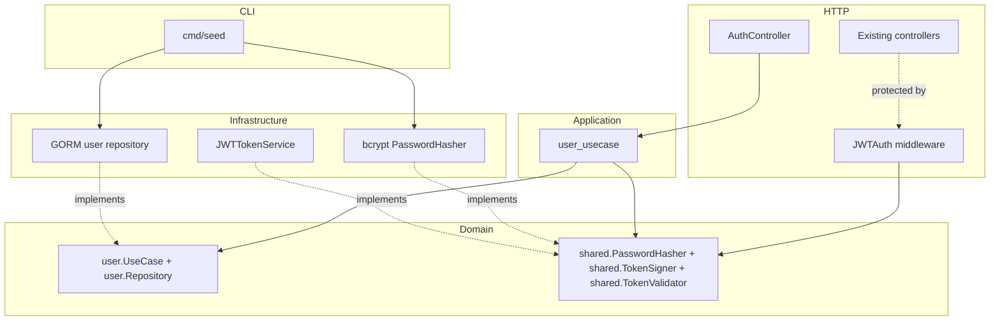
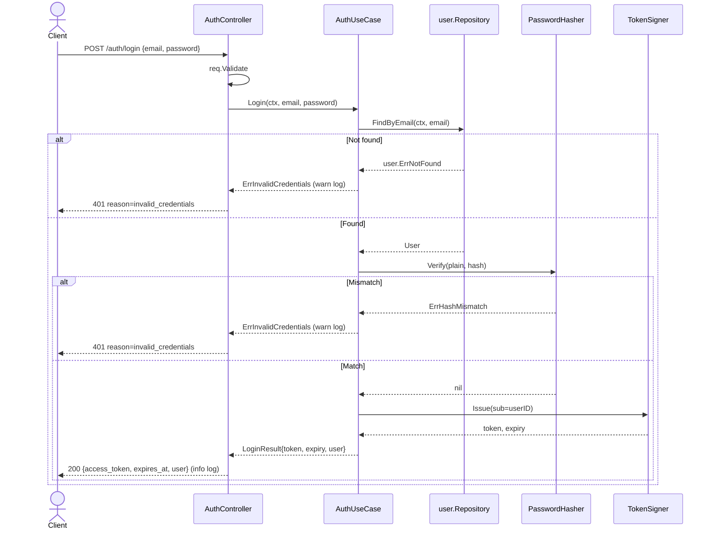
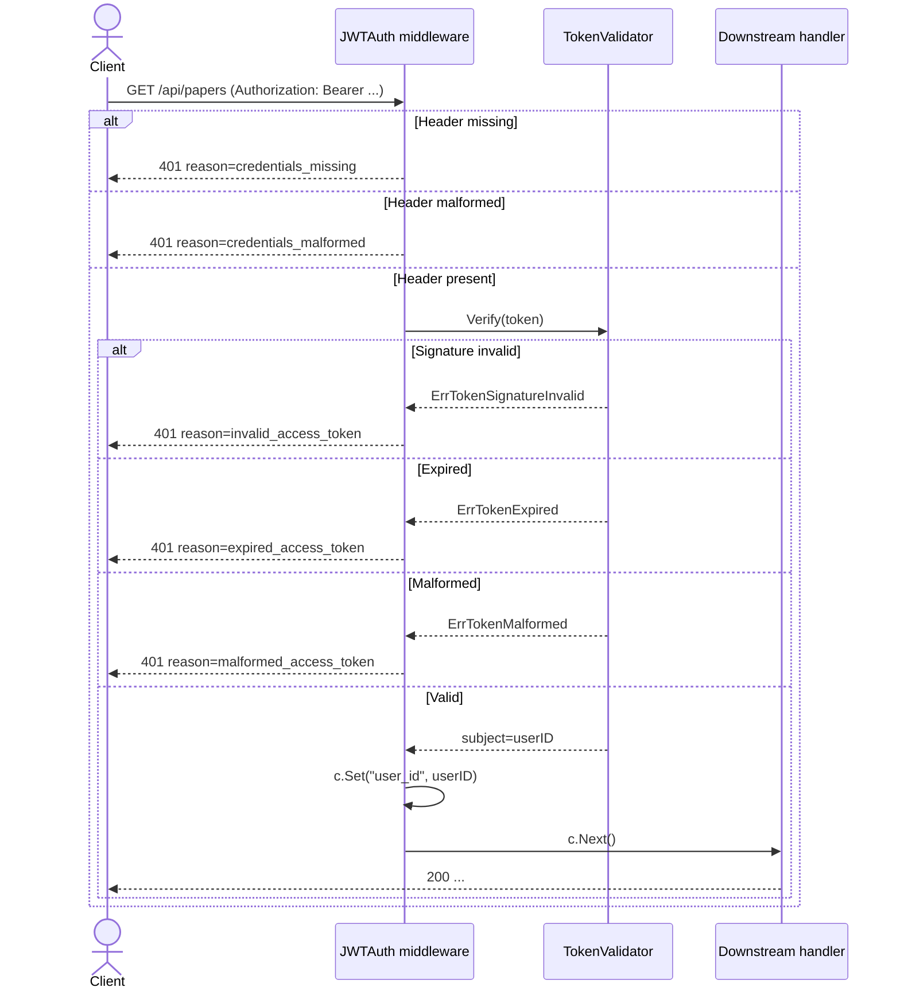
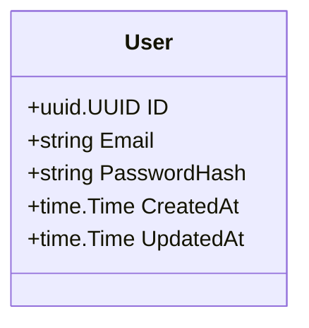

# Design — user-auth

## Overview

**Purpose**: Replace the single static `X-API-Token` middleware with username + password authentication backed by a stateless JSON Web Token. The thesis backend gains the ability to identify which operator is calling, rotate credentials in-app, and admit additional equal-role operators — without taking on registration, refresh tokens, cookies, logout endpoints, RBAC, password reset, or session storage.

**Users**: The single researcher operating the thesis backend today, and at most one additional equal-role operator added later via `cmd/seed`. The operator is also the integration-test runner.

**Impact**: The `/api/*` group switches from a single shared-secret credential to per-operator JWT-bearer credentials. The `X-API-Token` middleware, its env var, and its swag `@Security APIToken` annotations are deleted in this change set; the running system has exactly one auth scheme afterward. Every existing integration test that calls `/api/*` is updated to authenticate via login.

### Goals

- Issue a stateless JWT (24h TTL) from `POST /auth/login` after bcrypt verification.
- Expose the current session via `GET /auth/session` and in-app password rotation via `POST /auth/change-password`.
- Protect `/api/*` with a new JWT middleware. Delete the static-token middleware and its env field.
- Seed users via a new `users` subcommand of the existing `cmd/seed` binary, idempotent on duplicate email.
- Update the integration-test harness so every existing protected test continues to pass under the new auth scheme.

### Non-Goals

- Refresh tokens, refresh cookies, cookie security attributes (`HttpOnly`, `SameSite`, `Path`, `Secure`), `Origin`/`Referer` checks, CSRF token plumbing.
- A logout endpoint. With no cookie, "logout" is the client discarding the token.
- Public registration, RBAC, roles, or any authorization beyond authenticated/not-authenticated.
- Password reset by email or any out-of-band mechanism; email/2FA/OAuth/SSO flows.
- Server-side revocation, rotation, jti tables, session listing, "log out everywhere", device tracking.
- Rate limiting, brute-force lockout.
- Postgres migration (stays on SQLite); frontend code; machine-to-machine API keys.

## Boundary Commitments

### This Spec Owns

- The `user` aggregate (`internal/domain/user/`): `User` entity, `user.UseCase` and `user.Repository` ports, request/response DTOs, aggregate-specific error sentinels.
- The authentication use-case (`internal/application/user_usecase.go`): `Login`, `Session`, `ChangePassword`.
- The credentials repository (`internal/infrastructure/persistence/user/`): GORM model with bcrypt hash and unique email; conversion via `ToDomain()` / `FromDomain()`.
- Crypto adapters (`internal/infrastructure/auth/`): `bcrypt`-backed `PasswordHasher` and JWT-backed `TokenSigner` + `TokenValidator`.
- HTTP surface (`internal/http/{controller,middleware,route}/`): `auth_controller.go`, `auth_responses.go`, `jwt_auth.go` middleware, `auth_route.go` router; swag annotations on every new endpoint.
- New cross-cutting ports in `internal/domain/shared/ports.go`: `PasswordHasher`, `TokenSigner`, `TokenValidator`.
- Composition root changes: new env fields in `bootstrap/env.go`; rewiring of the `/api` group in `bootstrap/app.go`; user-seeding subcommand in `cmd/seed/main.go` plus a `SeedUser` helper in `internal/bootstrap/seed.go`.
- Deletion of `internal/http/middleware/api_token.go` and every reference to `APITokenHeader`, the `API_TOKEN` env field, and `@Security APIToken` swag tags throughout the codebase.
- Integration-test harness update (`tests/integration/setup/setup.go`): test-user provisioning, a login-derived bearer-token helper, and a swap of every existing test's auth header.

### Out of Boundary

- Authorization beyond authentication (no RBAC, scopes, attribute checks).
- Any HTTP endpoint that creates users (user creation is CLI-only).
- Email infrastructure, SMS infrastructure, password-reset flows, or "forgot password" surfaces.
- Refresh tokens, refresh cookies, logout endpoints, token rotation, reuse-detection storage, or session listing.
- `Origin`/`Referer` checking, `SameSite` cookie attributes, CSRF token plumbing.
- Rate limiting, account lockout, login-attempt counters.
- Postgres migration. The repository contract stays DB-agnostic; the implementation stays on SQLite for now per [tech.md](../../steering/tech.md).

### Allowed Dependencies

- `internal/domain/shared`: `Logger`, `Clock`, `HTTPError`. New crypto ports (`PasswordHasher`, `TokenSigner`, `TokenValidator`) are added here in this spec.
- `internal/http/common`: error-envelope serialization helpers.
- `internal/infrastructure/persistence`: shared `OpenSQLite` and `AutoMigrate` plumbing.
- `internal/bootstrap`: composition root and seed plumbing.
- `github.com/golang-jwt/jwt/v5`: token signing/verification — new dependency.
- `golang.org/x/crypto/bcrypt`: password hashing — new dependency.
- `github.com/google/uuid`: user IDs — already in [tech.md](../../steering/tech.md).
- `tests/integration/setup`: shared HTTP+DB harness — updated, not replaced.

### Revalidation Triggers

The following changes force every downstream consumer to re-check integration:

- Any change to the JWT claim shape (`sub`, `iat`, `exp`) or the `Authorization: Bearer` header contract on `/api/*`.
- Any change to the documented reason-code strings in error envelopes (e.g., `invalid_credentials`, `expired_access_token`).
- Any change to the env-var names introduced here (`AUTH_JWT_SECRET`, `AUTH_JWT_TTL`).
- Any change to the `User` schema's persisted columns.
- Any reintroduction of the `X-API-Token` header in any form.

## Architecture

### Architecture Pattern & Boundary Map



**Key decisions**:

- Crypto ports sit in `domain/shared/ports.go`, not in the user aggregate. They are crypto primitives, not user-specific.
- `TokenSigner` and `TokenValidator` are two distinct interfaces so the middleware depends only on verification.
- Tokens are stateless. No DB lookup on `/api/*` request. No rotation. No revocation table. A leaked JWT is valid until its 24h expiry — operational play for credential compromise is "rotate `AUTH_JWT_SECRET` and redeploy".

### Technology Stack

| Layer | Choice / Version | Role in Feature | Notes |
|-------|------------------|-----------------|-------|
| Backend / Services | Go 1.25 | Language | Unchanged from [tech.md](../../steering/tech.md). |
| HTTP framework | `github.com/gin-gonic/gin` (existing) | Routing and middleware | Bearer header read directly. |
| JWT | `github.com/golang-jwt/jwt/v5` (new) | Sign and verify the JWT | MIT. Pin a current `v5.x` release that includes the CVE-2025-30204 fix (≥ v5.2.2). |
| Password hashing | `golang.org/x/crypto/bcrypt` (new) | One-way password storage and verify | BSD-3-Clause. Cost 12, OWASP 2026 baseline. |
| Data / Storage | GORM + SQLite (existing) | `users` table via `AutoMigrate` | New user model appended to the AutoMigrate list. |
| Config | viper-backed flat struct (existing) | Two new env fields | `AUTH_JWT_SECRET` (required), `AUTH_JWT_TTL` (default `24h`). |
| Logging | `log/slog` via `domain/shared.Logger` (existing) | Structured auth events | Redaction enforced at the call site. |
| IDs | `github.com/google/uuid` (existing) | User IDs and JWT `sub` claim | UUIDv4. |

Deeper rationale on JWT v5 pinning and bcrypt cost choice is recorded in [research.md](research.md).

## File Structure Plan

### Directory Structure

```
internal/
├── domain/
│   ├── user/                                 # NEW aggregate (landed in Phase 1)
│   │   ├── model.go                          # User entity
│   │   ├── ports.go                          # user.UseCase + user.Repository
│   │   ├── requests.go                       # LoginRequest, ChangePasswordRequest with Validate()
│   │   ├── responses.go                      # LoginResponse, SessionResponse, LoginResult
│   │   └── errors.go                         # sentinels + Reason* constants
│   └── shared/
│       ├── ports.go                          # MODIFIED — PasswordHasher, TokenSigner, TokenValidator
│       └── errors.go                         # MODIFIED — ErrHashMismatch, ErrTokenMalformed,
│                                             # ErrTokenSignatureInvalid, ErrTokenExpired
├── application/
│   └── user_usecase.go                       # NEW — Login, Session, ChangePassword
├── infrastructure/
│   ├── persistence/
│   │   ├── migrate.go                        # MODIFIED — append the user model to AutoMigrate
│   │   └── user/                             # NEW
│   │       ├── model.go                      # GORM model + ToDomain/FromDomain
│   │       └── repo.go                       # NewRepository(db) implementing user.Repository
│   └── auth/                                 # NEW area
│       ├── bcrypt_hasher.go                  # NewBcryptHasher(cost int) shared.PasswordHasher
│       └── jwt_token_service.go              # NewJWTTokenService(cfg) implements
│                                             # shared.TokenSigner + shared.TokenValidator
├── http/
│   ├── controller/
│   │   ├── auth_controller.go                # NEW — Login, Session, ChangePassword handlers
│   │   └── auth_responses.go                 # NEW — envelope wrappers for swag
│   ├── middleware/
│   │   ├── jwt_auth.go                       # NEW — JWTAuth(validator) gin.HandlerFunc
│   │   └── api_token.go                      # DELETED
│   └── route/
│       ├── auth_route.go                     # NEW — AuthRouter(d Deps)
│       └── route.go                          # MODIFIED — Deps gains Hasher, Signer, Validator, JWTTTL
└── bootstrap/
    ├── env.go                                # MODIFIED — remove APIToken; add AUTH_JWT_SECRET,
    │                                         # AUTH_JWT_TTL
    ├── app.go                                # MODIFIED — replace APIToken mount with JWTAuth;
    │                                         # mount /auth group
    └── seed.go                               # MODIFIED — append SeedUser

cmd/
└── seed/
    └── main.go                               # MODIFIED — subcommand dispatch

tests/
└── integration/
    ├── auth_login_test.go                    # NEW
    ├── auth_api_guard_test.go                # NEW
    ├── auth_session_change_test.go           # NEW
    ├── setup/
    │   └── setup.go                          # MODIFIED — replace TestToken with login helpers
    ├── arxiv_test.go                         # MODIFIED — Bearer instead of X-API-Token
    ├── analyzer_test.go                      # MODIFIED — same
    ├── extraction_test.go                    # MODIFIED — same
    ├── paper_test.go                         # MODIFIED — same
    ├── pdf_test.go                           # MODIFIED — same
    └── source_test.go                        # MODIFIED — same
```

### Modified Files Summary

| Path | Change |
|------|--------|
| [internal/domain/shared/ports.go](../../../internal/domain/shared/ports.go) | Append `PasswordHasher`, `TokenSigner`, `TokenValidator` interfaces. (Phase 1.) |
| [internal/domain/shared/errors.go](../../../internal/domain/shared/errors.go) | Append four crypto error sentinels. (Phase 1.) |
| [internal/infrastructure/persistence/migrate.go](../../../internal/infrastructure/persistence/migrate.go) | Append the GORM user model to `AutoMigrate`. (Phase 1.) |
| [internal/http/route/route.go](../../../internal/http/route/route.go) | Add `Hasher`, `Signer`, `Validator`, `JWTTTL` to `Deps`. |
| [internal/bootstrap/env.go](../../../internal/bootstrap/env.go) | Remove `APIToken`. Add `AUTH_JWT_SECRET` (required, ≥32 bytes) and `AUTH_JWT_TTL` (default `24h`). |
| [internal/bootstrap/app.go](../../../internal/bootstrap/app.go) | Replace `middleware.APIToken` mount with `middleware.JWTAuth(validator)`. Mount unauthenticated `POST /auth/login` and authenticated `GET /auth/session` + `POST /auth/change-password`. |
| [internal/bootstrap/seed.go](../../../internal/bootstrap/seed.go) | Add `SeedUser(ctx, db, hasher, log, email, plain)` — idempotent on duplicate email. |
| [cmd/seed/main.go](../../../cmd/seed/main.go) | Subcommand dispatch: no args → existing sources; `users <email> <password>` → `SeedUser`. |
| All `@Security APIToken` annotations in existing controllers | Replace with `@Security BearerAuth`. Run `task swag`. |
| All integration test files calling `/api/*` | Swap `middleware.APITokenHeader` for the new `setup.AuthorizedRequest` helper. |
| [.kiro/steering/product.md](../../steering/product.md) | Update "Auth" section to describe the JWT model. |

## System Flows

### Login



### Protected `/api/*` request



The middleware never reaches the DB or any external service.

## Requirements Traceability

| Requirement | Summary | Components | Interfaces |
|-------------|---------|------------|------------|
| 1.1–1.7 | Login | AuthController, AuthUseCase, user.Repository, PasswordHasher, TokenSigner | `POST /auth/login` |
| 2.1–2.7 | Protected access | JWTAuth middleware, TokenValidator | gin middleware on `/api/*` |
| 3.1–3.3 | Session | AuthController, AuthUseCase, user.Repository | `GET /auth/session` |
| 4.1–4.7 | Change password | AuthController, AuthUseCase, user.Repository, PasswordHasher | `POST /auth/change-password` |
| 5.1–5.6 | Seed provisioning | cmd/seed, bootstrap.SeedUser, user.Repository, PasswordHasher | CLI subcommand |
| 6.1–6.5 | Replace static token | bootstrap/app.go, deletion of api_token.go, swag annotations | DELETE of `middleware.APIToken` and friends |
| 7.1–7.5 | Password hashing | PasswordHasher impl, AuthUseCase, ChangePasswordRequest, LoginRequest | `shared.PasswordHasher` |
| 8.1–8.5 | Credential confidentiality | AuthController, AuthUseCase, cmd/seed, request-body logging | log redaction; envelope omits credential fields |

## Components and Interfaces

| Component | Domain / Layer | Intent | Req Coverage |
|-----------|----------------|--------|--------------|
| User Domain | `domain/user/` | Aggregate types, ports, errors, DTOs | 1, 3, 4, 5, 7 |
| AuthUseCase | `application/` | Orchestrates login/session/change-password | 1, 2, 3, 4, 7, 8 |
| User Repository | `infrastructure/persistence/user/` | GORM-backed user storage | 1, 3, 4, 5 |
| Bcrypt Hasher | `infrastructure/auth/` | Hash and verify passwords | 1, 4, 5, 7 |
| JWT Token Service | `infrastructure/auth/` | Issue and validate JWTs | 1, 2 |
| HTTP Surface | `internal/http/` | Routes, handlers, middleware, swag annotations | 1, 2, 3, 4, 6, 8 |
| Composition Root | `internal/bootstrap/`, `cmd/seed/` | Env loading, app wiring, user seeding | 1, 5, 6 |

### User Domain

```go
// internal/domain/user/ports.go
type UseCase interface {
    Login(ctx context.Context, req LoginRequest) (LoginResult, error)
    Session(ctx context.Context, userID uuid.UUID) (*User, error)
    ChangePassword(ctx context.Context, userID uuid.UUID, req ChangePasswordRequest) error
}

type Repository interface {
    FindByEmail(ctx context.Context, email string) (*User, error)
    FindByID(ctx context.Context, id uuid.UUID) (*User, error)
    Save(ctx context.Context, u *User) error                       // returns ErrEmailExists on duplicate
    UpdatePasswordHash(ctx context.Context, id uuid.UUID, hash string) error
}
```

`Logout` is not in the contract — without a cookie or server-side state there is nothing to clear; the client discards the token.

**Sentinels and reason codes** (`errors.go`): six aggregate sentinels plus the file-level `Reason*` constants (`ReasonValidationFailed`, `ReasonPasswordTooLong`, `ReasonPasswordPolicyViolation`, `ReasonInvalidCredentials`, `ReasonCurrentPasswordIncorrect`, `ReasonPasswordUnchanged`). Producers (DTO validators, use-case, controller) and tests reference these constants — never raw strings.

### AuthUseCase

```go
func NewUserUseCase(
    repo user.Repository,
    hasher shared.PasswordHasher,
    signer shared.TokenSigner,
    clock shared.Clock,
    log shared.Logger,
) user.UseCase
```

- Login returns `user.ErrInvalidCredentials` for both unknown email and password mismatch (Requirement 1.2, 1.3).
- ChangePassword: pre-change tokens remain valid until normal expiry — stateless tokens, no server-side revocation (Requirement 4.7).
- Any `Verify` error other than `shared.ErrHashMismatch` is treated as `user.ErrInvalidCredentials` so storage corruption never surfaces as 500 (Requirement 7.4).

### User Repository

GORM-backed implementation already landed in Phase 1 (`internal/infrastructure/persistence/user/`). Schema:

| Column | Type | Constraints |
|--------|------|-------------|
| `id` | `text` | primary key |
| `email` | `text` | not null, unique index |
| `password_hash` | `text` | not null |
| `created_at` | `datetime` | not null |
| `updated_at` | `datetime` | not null |

`ToDomain()` parses the stored UUID and returns an error on corruption; the use-case maps any error to `ErrInvalidCredentials`.

### Bcrypt Hasher & JWT Token Service

```go
// internal/domain/shared/ports.go
type PasswordHasher interface {
    Hash(plain string) (string, error)
    Verify(plain, hash string) error // returns ErrHashMismatch on mismatch
}

type TokenSigner interface {
    Issue(subject string) (token string, expiresAt time.Time, err error)
}

type TokenValidator interface {
    Verify(token string) (subject string, err error)
}
```

Single-method signer and validator — no separate access vs refresh kind. `JWTTokenService` implements both interfaces with one signing key. Claims are minimal: `sub` (user id), `iat`, `exp`. HS256.

Bootstrap fails fast if `AUTH_JWT_SECRET` is empty or shorter than 32 bytes (HS256 baseline).

`token.Valid` is checked alongside the parse error in `Verify` (CVE-2024-51744 guard).

### HTTP Surface

Three endpoints, one middleware:

| Method | Endpoint | Auth | Request | Response (200) | Failure status / reason |
|--------|----------|------|---------|----------------|--------------------------|
| POST | `/auth/login` | none | `{email, password}` | `{access_token, expires_at, user{id,email,created_at}}` | 400 `validation_failed`; 401 `invalid_credentials`; 400 `password_too_long` |
| GET | `/auth/session` | bearer | (none) | `{id, email, created_at}` | 401 `credentials_missing` / `credentials_malformed` / `invalid_access_token` / `expired_access_token` |
| POST | `/auth/change-password` | bearer | `{current_password, new_password}` | 204 | 400 `validation_failed` / `current-password-incorrect` / `password-policy-violation` / `password-unchanged` / `password_too_long`; 401 (token errors) |

**JWTAuth middleware**:

```go
func JWTAuth(validator shared.TokenValidator) gin.HandlerFunc
```

Reads `Authorization: Bearer <token>`, calls `validator.Verify`, sets `user_id` on the Gin context on success, returns 401 with the appropriate reason on failure.

**`AuthRouter(d Deps)`** mounts `POST /auth/login` on the root group and mounts `GET /auth/session` plus `POST /auth/change-password` under `Group("/auth", JWTAuth(d.Validator))`.

### Composition Root Changes

**Env additions** (`internal/bootstrap/env.go`):

| Field | Env Var | Default | Purpose |
|-------|---------|---------|---------|
| `JWTSecret` | `AUTH_JWT_SECRET` | (required, ≥ 32 bytes) | HS256 signing key. |
| `JWTTTL` | `AUTH_JWT_TTL` | `24h` | JWT lifetime. |

And the `APIToken` field is removed.

**`bootstrap/app.go`** swaps:

- `engine.Group("/api", middleware.APIToken(env.APIToken))` → `engine.Group("/api", middleware.JWTAuth(validator))`
- Mounts `POST /auth/login` on the root group, `GET /auth/session` and `POST /auth/change-password` under a JWT-protected `/auth` subgroup.

**`internal/bootstrap/seed.go`** adds:

```go
func SeedUser(ctx context.Context, db *gorm.DB, hasher shared.PasswordHasher, log shared.Logger, email, plain string) error
```

- Validates email syntax and password policy.
- Hashes via `hasher.Hash(plain)`.
- Inserts the row; on `user.ErrEmailExists` logs `"user already exists: skipped"` and returns `nil` (idempotent).
- Never logs `plain`.

**`cmd/seed/main.go`** becomes a subcommand dispatcher: `seed` (no args) → existing sources; `seed users <email> <password>` → `SeedUser`.

## Data Models

### Domain Model



Invariants: `Email` is non-empty and a syntactically valid RFC 5322 address; `PasswordHash` is a bcrypt hash; `Email` is unique across all `User` rows.

### Data Contracts

Request and response bodies are JSON in snake_case. The standard envelope wraps every response per the existing `internal/http/common` convention.

```go
// internal/domain/user/requests.go
type LoginRequest struct {
    Email    string `json:"email" binding:"required"`
    Password string `json:"password" binding:"required"`
}

type ChangePasswordRequest struct {
    CurrentPassword string `json:"current_password" binding:"required"`
    NewPassword     string `json:"new_password" binding:"required"`
}

// internal/domain/user/responses.go
type LoginResponse struct {
    AccessToken string          `json:"access_token"`
    ExpiresAt   time.Time       `json:"expires_at"`
    User        SessionResponse `json:"user"`
}

type SessionResponse struct {
    ID        uuid.UUID `json:"id"`
    Email     string    `json:"email"`
    CreatedAt time.Time `json:"created_at"`
}

type LoginResult struct {
    Token     string
    ExpiresAt time.Time
    User      *User
}
```

Password hashes never appear in any response DTO.

## Error Handling

The auth feature uses the existing `shared.HTTPError` + `ErrorEnvelope` middleware. Reason codes are listed in the API table. Pattern at the call site:

```go
return shared.NewHTTPError(http.StatusUnauthorized, "invalid credentials", user.ErrInvalidCredentials).
    WithReason(user.ReasonInvalidCredentials)
```

**Reason taxonomy**:

- **400 Validation** — `validation_failed`, `password_too_long`, `password-policy-violation`, `password-unchanged`, `current-password-incorrect`.
- **401 Authentication** — `invalid_credentials`, `credentials_missing`, `credentials_malformed`, `invalid_access_token`, `expired_access_token`, `malformed_access_token`.
- **500 Internal** — never surfaces a credential detail. Hash-storage corruption is mapped to `invalid_credentials` (Requirement 7.4).

**Monitoring**:

- `info` log on successful login (Requirement 1.6) with `user_id` and `request_id`.
- `warn` log on failed login (Requirement 1.7) with `email`, `request_id`, and `reason`.
- `info` log on successful change-password.

## Testing Strategy

Per [testing.md](../../steering/testing.md): real SQLite over fakes; hand-written fakes in `tests/mocks/` only when a contract violation is needed; `t.Parallel()` everywhere; sentence subtests; AAA via blank lines.

### Unit Tests (colocated `*_test.go`)

1. `internal/application/user_usecase_test.go` — drives the use-case against a real in-memory SQLite repo + real bcrypt (cost 4) + real `JWTTokenService` + a deterministic `Clock`. Covers account-enumeration parity, change-password rotation, ChangePassword policy/unchanged/incorrect, pre-change tokens still validate, info/warn logging.
2. `internal/infrastructure/auth/jwt_token_service_test.go` — `Issue then Verify round-trips a subject`; `Verify rejects an expired token`; `Verify rejects a token whose signature does not match the key`; `Verify rejects a token that parses but has Valid=false` (CVE-2024-51744 guard).
3. `internal/infrastructure/auth/bcrypt_hasher_test.go` — round-trip; mismatch returns `shared.ErrHashMismatch`.
4. `internal/domain/user/requests_test.go` — already landed.

### Integration Tests (`tests/integration/`, build tag `integration`)

1. **`auth_login_test.go`** — happy path; identical 401 for unknown email vs wrong password; 400 `validation_failed` for malformed email or empty body; 400 `password_too_long` for >72 bytes.
2. **`auth_api_guard_test.go`** — hits `GET /api/sources`: missing/non-Bearer/tampered/expired all reject with distinct reasons; valid token reaches the downstream handler.
3. **`auth_session_change_test.go`** — session returns id/email/created_at without password_hash; change-password rotates and a prior-issued JWT still passes `/api/*` until expiry; wrong current → `current-password-incorrect`; weak new → `password-policy-violation`; unchanged → `password-unchanged`.

No refresh, no logout, no cookie-attribute test file — those concerns are out of scope.

## Security Considerations

- **No revocation by design.** JWTs (24h) cannot be revoked server-side. Operational play for credential compromise: rotate `AUTH_JWT_SECRET` and redeploy — invalidates all outstanding tokens immediately.
- **Account enumeration.** Login responds identically (status, body, reason) for unknown email and wrong password.
- **Bcrypt 72-byte limit.** Input passwords longer than 72 bytes are rejected at the validation layer (Requirement 7.5), preventing silent truncation.
- **`token.Valid` check.** Every verification path checks `token.Valid` alongside the parse error to defend against CVE-2024-51744.
- **No credential material in logs or responses.** Requirement 8 is enforced at the call sites. No request-body logger is registered today; if one is added later, password and token fields must be redacted before emission.
