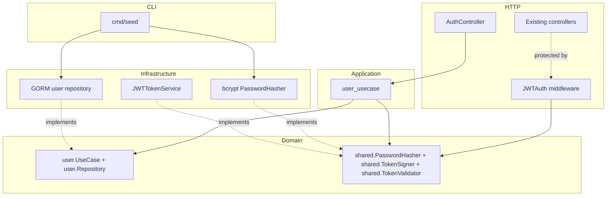
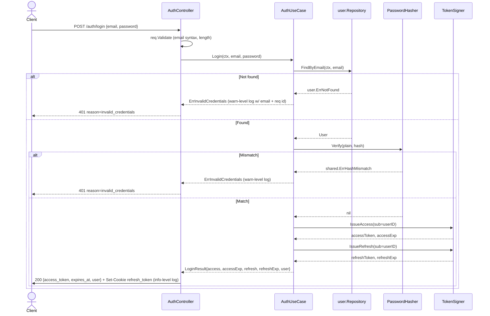
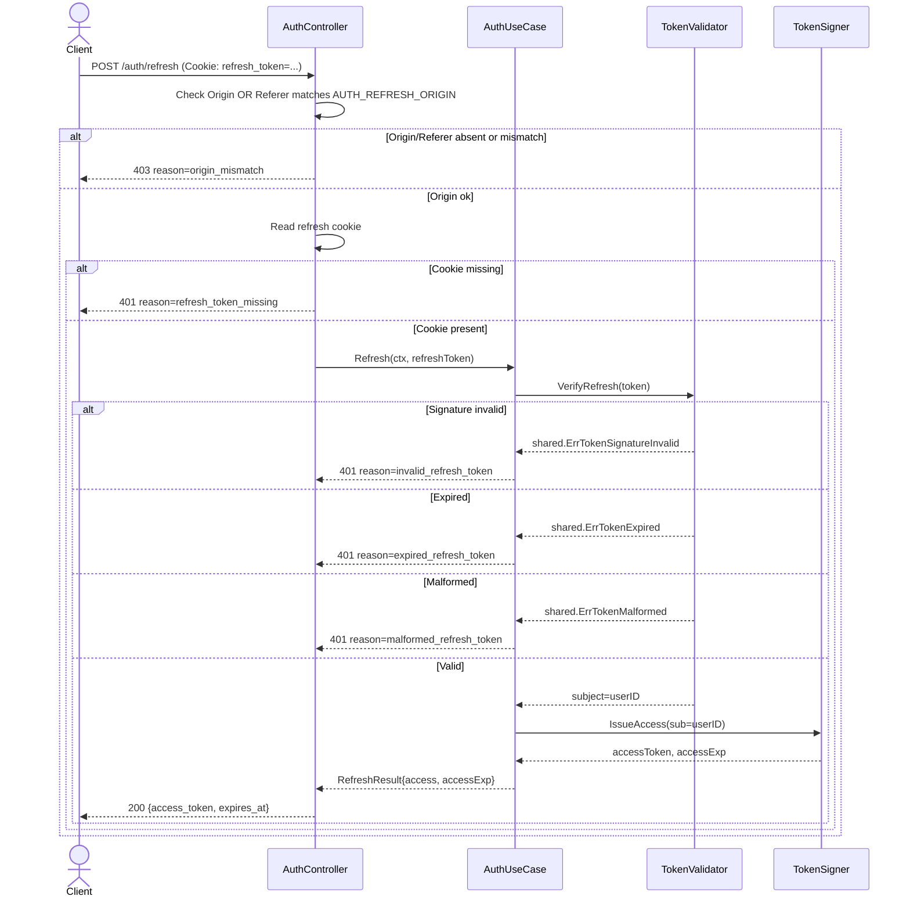
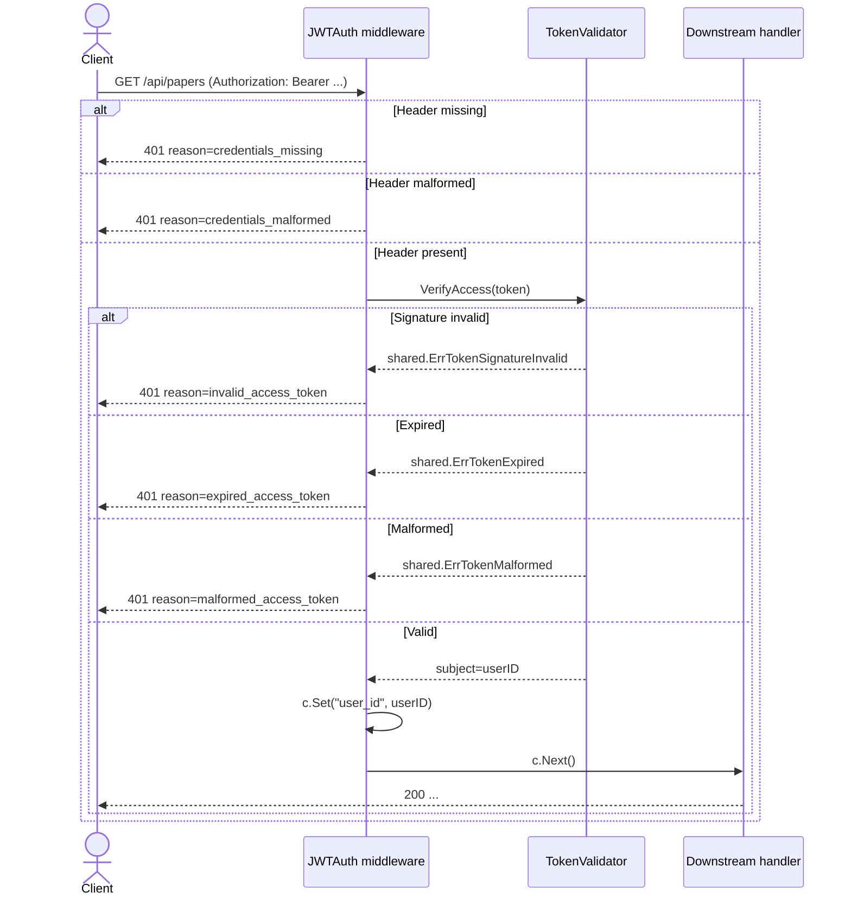
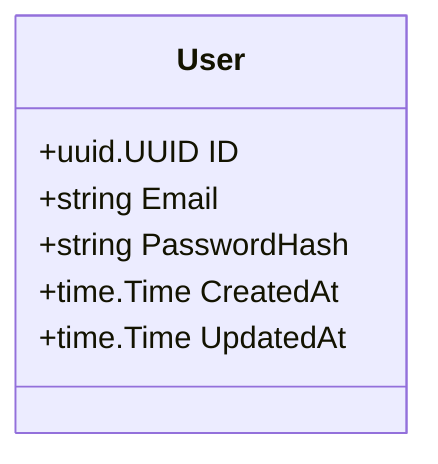

# Design — user-auth

## Overview

**Purpose**: Replace the single static `X-API-Token` middleware with username + password authentication backed by stateless JSON Web Tokens. The thesis backend gains the ability to identify which operator is calling, rotate credentials in-app, and admit additional equal-role operators — without taking on registration, RBAC, password reset, or session storage.

**Users**: The single researcher operating the thesis backend today (and at most one additional equal-role operator added later via `cmd/seed`). The operator is also the integration-test runner.

**Impact**: The `/api/*` group switches from a single shared-secret credential to per-operator JWT-bearer credentials. The `X-API-Token` middleware, its env var, and its swag `@Security APIToken` annotations are deleted in this change set; the running system has exactly one auth scheme afterward. Every existing integration test that calls `/api/*` is updated to authenticate via login.

### Goals

- Issue stateless access (15 min) and refresh (24 h) JWTs from `POST /auth/login` after bcrypt verification.
- Allow refresh of access tokens via `POST /auth/refresh` reading the `HttpOnly`+`SameSite=Strict` cookie.
- Expose the current session via `GET /auth/session` and in-app password rotation via `POST /auth/change-password`.
- Protect `/api/*` with a new JWT middleware. Delete the static-token middleware and its env field.
- Seed users via a new `users` subcommand of the existing `cmd/seed` binary, idempotent on duplicate email.
- Update the integration-test harness so every existing protected test continues to pass under the new auth scheme.

### Non-Goals

- Public registration, RBAC, roles, or any authorization beyond authenticated/not-authenticated.
- Password reset by email or any out-of-band mechanism; email/2FA/OAuth/SSO flows.
- Refresh-token rotation, reuse detection, server-side revocation, or any `refresh_token_jti` table.
- Rate limiting, brute-force lockout, session listing, "log out everywhere", device tracking.
- Postgres migration (stays on SQLite); frontend code; machine-to-machine API keys.

## Boundary Commitments

### This Spec Owns

- The `user` aggregate (`internal/domain/user/`): `User` entity, `user.UseCase` and `user.Repository` ports, request/response DTOs, aggregate-specific error sentinels.
- The authentication use-case (`internal/application/user_usecase.go`): `Login`, `Refresh`, `Logout`, `Session`, `ChangePassword`.
- The credentials repository (`internal/infrastructure/persistence/user/`): GORM model with bcrypt hash and unique email; conversion via `ToDomain()` / `FromDomain()`.
- Crypto adapters (`internal/infrastructure/auth/`): `bcrypt`-backed `PasswordHasher` and JWT-backed `TokenSigner` + `TokenValidator`.
- HTTP surface (`internal/http/{controller,middleware,route}/`): `auth_controller.go`, `auth_responses.go`, `jwt_auth.go` middleware, `auth_route.go` router; swag annotations on every new endpoint.
- New cross-cutting ports in `internal/domain/shared/ports.go`: `PasswordHasher`, `TokenSigner`, `TokenValidator`.
- Composition root changes: new env fields in `bootstrap/env.go`; rewiring of the `/api` group in `bootstrap/app.go`; user-seeding subcommand in `cmd/seed/main.go` plus a `SeedUser` helper in `internal/bootstrap/seed.go`.
- Deletion of `internal/http/middleware/api_token.go` and every reference to `APITokenHeader`, the `API_TOKEN` env field, and `@Security APIToken` swag tags throughout the codebase.
- Integration-test harness update (`tests/integration/setup/setup.go`): test-user provisioning, a login-derived bearer-token helper, and a swap of every existing test's auth header.

### Out of Boundary

- Authorization beyond authentication (no RBAC, scopes, attribute checks).
- Any HTTP endpoint that creates users (user creation is CLI-only).
- Email infrastructure, SMS infrastructure, password-reset flows, or "forgot password" surfaces.
- Token revocation, rotation, reuse-detection storage, or session listing.
- Rate limiting, account lockout, login-attempt counters.
- Browser-side CSRF token plumbing (the `SameSite=Strict` cookie plus the `Origin`/`Referer` check on `/auth/refresh` is the chosen mitigation).
- Postgres migration. The repository contract stays DB-agnostic; the implementation stays on SQLite for now per [tech.md](../../steering/tech.md).

### Allowed Dependencies

- `internal/domain/shared`: `Logger`, `Clock`, `HTTPError`. New crypto ports (`PasswordHasher`, `TokenSigner`, `TokenValidator`) are added here in this spec.
- `internal/http/common`: error-envelope serialization helpers.
- `internal/infrastructure/persistence`: shared `OpenSQLite` and `AutoMigrate` plumbing.
- `internal/bootstrap`: composition root and seed plumbing.
- `github.com/golang-jwt/jwt/v5`: token signing/verification — new dependency.
- `golang.org/x/crypto/bcrypt`: password hashing — new dependency.
- `github.com/google/uuid`: user IDs — already in [tech.md](../../steering/tech.md).
- `tests/integration/setup`: shared HTTP+DB harness — updated, not replaced.

### Revalidation Triggers

The following changes force every downstream consumer to re-check integration:

- Any change to the JWT claim shape (`sub`, `iat`, `exp`) or the `Authorization: Bearer` header contract on `/api/*`.
- Any change to the refresh cookie's name, `Path`, `SameSite`, or `HttpOnly` attributes.
- Any change to the documented reason-code strings in error envelopes (e.g., `invalid_credentials`, `expired_access_token`, `expired_refresh_token`).
- Any change to the env-var names introduced here (`AUTH_ACCESS_SECRET`, `AUTH_REFRESH_SECRET`, `AUTH_ACCESS_TTL`, `AUTH_REFRESH_TTL`, `AUTH_COOKIE_INSECURE`, `AUTH_REFRESH_ORIGIN`).
- Any change to the `User` schema's persisted columns (`id`, `email`, `password_hash`, `created_at`, `updated_at`).
- Any reintroduction of the `X-API-Token` header in any form (would break the "exactly one auth scheme" invariant).

## Architecture

### Existing Architecture Analysis

The thesis backend follows the dependency rule in [structure.md](../../steering/structure.md): `domain → application → infrastructure → interface (http) → bootstrap`. Aggregates live under `internal/domain/<entity>/` with ports in `ports.go`, implemented by structs in `internal/application/` (use-cases) and `internal/infrastructure/persistence/<entity>/` (repositories). Cross-cutting capabilities (`Logger`, `Clock`, `LLMClient`, `Extractor`, `Fetcher`) live in `internal/domain/shared/ports.go`. The HTTP layer (`internal/http/`) has per-feature `XxxRouter(d Deps)` functions that build their own `repo → usecase → controller` chain locally. The composition root (`internal/bootstrap/app.go`) wires everything once at startup.

The existing static-token middleware ([internal/http/middleware/api_token.go](../../../internal/http/middleware/api_token.go)) is mounted onto the `/api` group in `bootstrap/app.go` and gated by the `API_TOKEN` env field. Every protected controller carries a `@Security APIToken` swag annotation.

This design slots in cleanly with **zero deviation** from the established pattern. The only architectural addition is three new cross-cutting ports (`PasswordHasher`, `TokenSigner`, `TokenValidator`) in `domain/shared/ports.go`.

### Architecture Pattern & Boundary Map



**Key decisions** (rationale lives in [research.md](research.md)):

- Crypto ports (`PasswordHasher`, `TokenSigner`, `TokenValidator`) sit in `domain/shared/ports.go`, not in the user aggregate. They are crypto primitives, not user-specific.
- `TokenSigner` and `TokenValidator` are **two distinct interfaces** so the middleware depends only on verification.
- Tokens are stateless. No DB lookup on `/api/*` request. No rotation. No revocation table.
- Access and refresh tokens use **separate signing keys**, so a refresh token presented as an access token fails signature verification immediately (no `typ` claim needed).

### Technology Stack

| Layer | Choice / Version | Role in Feature | Notes |
|-------|------------------|-----------------|-------|
| Backend / Services | Go 1.25 | Language | Unchanged from [tech.md](../../steering/tech.md). |
| HTTP framework | `github.com/gin-gonic/gin` (existing) | Routing, middleware, cookie handling | `c.SetCookie` used directly. |
| JWT | `github.com/golang-jwt/jwt/v5` (new) | Sign/verify access and refresh tokens | MIT license. Pin a current `v5.x` release that includes the CVE-2025-30204 fix (≥ v5.2.2). |
| Password hashing | `golang.org/x/crypto/bcrypt` (new) | One-way password storage and verify | BSD-3-Clause. Cost 12, OWASP 2026 baseline. |
| Data / Storage | GORM + SQLite (existing) | `users` table via `AutoMigrate` | New `users` row appended to the AutoMigrate list in [migrate.go](../../../internal/infrastructure/persistence/migrate.go). |
| Config | viper-backed flat struct (existing) | Six new env fields | See [Components — Composition Root Changes](#composition-root-changes). |
| Logging | `log/slog` via `domain/shared.Logger` (existing) | Structured auth events | Redaction enforced at the call site. |
| IDs | `github.com/google/uuid` (existing) | User IDs and JWT `sub` claim | UUIDv4. |

Deeper rationale on JWT v5 pinning, bcrypt cost choice, and cookie attribute trade-offs is recorded in [research.md](research.md).

## File Structure Plan

### Directory Structure

```
internal/
├── domain/
│   ├── user/                                 # NEW aggregate
│   │   ├── model.go                          # User entity (id, email, password_hash, timestamps)
│   │   ├── ports.go                          # user.UseCase + user.Repository
│   │   ├── requests.go                       # LoginRequest, ChangePasswordRequest with Validate()
│   │   ├── responses.go                      # LoginResponse, RefreshResponse, SessionResponse
│   │   └── errors.go                         # ErrInvalidCredentials, ErrCurrentPasswordIncorrect,
│   │                                         # ErrPasswordPolicyViolation, ErrPasswordUnchanged,
│   │                                         # ErrEmailExists
│   └── shared/
│       └── ports.go                          # MODIFIED — append PasswordHasher,
│                                             # TokenSigner, TokenValidator + their error sentinels
├── application/
│   └── user_usecase.go                       # NEW — Login, Refresh, Logout, Session, ChangePassword
├── infrastructure/
│   ├── persistence/
│   │   ├── migrate.go                        # MODIFIED — append &User{} to AutoMigrate
│   │   └── user/                             # NEW
│   │       ├── model.go                      # GORM model + ToDomain/FromDomain
│   │       └── repo.go                       # NewRepository(db) implementing user.Repository
│   └── auth/                                 # NEW area
│       ├── bcrypt_hasher.go                  # NewBcryptHasher(cost int) shared.PasswordHasher
│       └── jwt_token_service.go              # NewJWTTokenService(cfg) implements
│                                             # shared.TokenSigner + shared.TokenValidator
├── http/
│   ├── controller/
│   │   ├── auth_controller.go                # NEW — Login, Refresh, Logout, Session, ChangePassword
│   │   ├── auth_responses.go                 # NEW — envelope wrappers for swag (LoginEnvelope, etc.)
│   │   └── (existing controllers unchanged)
│   ├── middleware/
│   │   ├── jwt_auth.go                       # NEW — JWTAuth(verifier) gin.HandlerFunc; sets user_id on ctx
│   │   └── api_token.go                      # DELETED
│   └── route/
│       ├── auth_route.go                     # NEW — AuthRouter(d Deps) wires repo→usecase→controller
│       └── route.go                          # MODIFIED — Deps struct gains JWT secrets/TTLs and Hasher/Signer/Validator
└── bootstrap/
    ├── env.go                                # MODIFIED — remove APIToken; add AUTH_* fields
    ├── app.go                                # MODIFIED — replace APIToken mount with JWTAuth; mount /auth group
    └── seed.go                               # MODIFIED — append SeedUser(ctx, db, hasher, email, plain) helper

cmd/
└── seed/
    └── main.go                               # MODIFIED — subcommand dispatch:
                                              # default → sources (existing);  users <email> <password> → SeedUser

tests/
├── integration/
│   ├── auth_test.go                          # NEW — login success/failure, refresh, logout, session,
│   │                                         # change-password, /api 401, cookie attributes,
│   │                                         # Origin check on /auth/refresh
│   ├── setup/
│   │   └── setup.go                          # MODIFIED — remove TestToken; add SeedTestUser +
│   │                                         # LoginAsTestUser; AuthorizedRequest helper sets Bearer
│   ├── arxiv_test.go                         # MODIFIED — swap APITokenHeader for AuthorizedRequest
│   ├── analyzer_test.go                      # MODIFIED — same
│   ├── extraction_test.go                    # MODIFIED — same
│   ├── paper_test.go                         # MODIFIED — same
│   ├── pdf_test.go                           # MODIFIED — same
│   └── source_test.go                        # MODIFIED — same
└── mocks/
    ├── password_hasher.go                    # NEW — hand-written fake; deterministic, no real crypto
    ├── token_signer.go                       # NEW — hand-written fake; predictable token strings
    └── token_validator.go                    # NEW — hand-written fake; configurable accept/reject
```

### Modified Files Summary

| Path | Change |
|------|--------|
| [internal/domain/shared/ports.go](../../../internal/domain/shared/ports.go) | Append three new interfaces and their error sentinels (`ErrTokenMalformed`, `ErrTokenSignatureInvalid`, `ErrTokenExpired`, `ErrHashMismatch`). |
| [internal/infrastructure/persistence/migrate.go](../../../internal/infrastructure/persistence/migrate.go) | Append the GORM user model to `AutoMigrate`. |
| [internal/http/route/route.go](../../../internal/http/route/route.go) | Add `Hasher`, `Signer`, `Validator`, `AccessTTL`, `RefreshTTL`, `RefreshCookieInsecure`, `RefreshOrigin` to `Deps`. |
| [internal/bootstrap/env.go](../../../internal/bootstrap/env.go) | Remove `APIToken` field. Add `AUTH_ACCESS_SECRET`, `AUTH_REFRESH_SECRET`, `AUTH_ACCESS_TTL`, `AUTH_REFRESH_TTL`, `AUTH_COOKIE_INSECURE`, `AUTH_REFRESH_ORIGIN`. |
| [internal/bootstrap/app.go](../../../internal/bootstrap/app.go) | Replace `middleware.APIToken` mount with `middleware.JWTAuth(validator)`. Mount unauthenticated `/auth` group separately. Pass new deps into `route.Setup`. |
| [internal/bootstrap/seed.go](../../../internal/bootstrap/seed.go) | Add `SeedUser(ctx, db, hasher, email, plain)` — idempotent on duplicate email. |
| [cmd/seed/main.go](../../../cmd/seed/main.go) | Add subcommand router: `users <email> <password>` invokes `SeedUser`; no args keeps the existing sources path. |
| All `@Security APIToken` annotations in existing controllers | Replace with `@Security BearerAuth`. Run `task swag`. |
| All integration test files calling `/api/*` | Swap `middleware.APITokenHeader` setting for the new `setup.AuthorizedRequest` helper. |
| [.kiro/steering/product.md](../../steering/product.md) | Update the "Auth" section: replace "Single static API token, header `X-API-Token`" with a one-line description of the new JWT model (Requirement 8.4). |

## System Flows

### Login



### Refresh



Refresh does **not** issue a new refresh cookie (Requirement 3.6). It also does not consult the DB (Requirement 3.7).

### Protected `/api/*` request



The middleware never reaches the DB or any external service (Requirement 2.7).

## Requirements Traceability

| Requirement | Summary | Components | Interfaces |
|-------------|---------|------------|------------|
| 1.1–1.10 | Login | AuthController, AuthUseCase, user.Repository, PasswordHasher, TokenSigner | `POST /auth/login` |
| 2.1–2.7 | Protected access | JWTAuth middleware, TokenValidator | gin middleware on `/api/*` |
| 3.1–3.9 | Refresh | AuthController, AuthUseCase, TokenValidator, TokenSigner | `POST /auth/refresh` |
| 4.1–4.4 | Logout | AuthController | `POST /auth/logout` |
| 5.1–5.3 | Session | AuthController, AuthUseCase, user.Repository | `GET /auth/session` |
| 6.1–6.7 | Change password | AuthController, AuthUseCase, user.Repository, PasswordHasher | `POST /auth/change-password` |
| 7.1–7.6 | Seed provisioning | cmd/seed, bootstrap.SeedUser, user.Repository, PasswordHasher | CLI subcommand |
| 8.1–8.5 | Replace static token | bootstrap/app.go, deletion of api_token.go, swag annotations | DELETE of `middleware.APIToken`, `APITokenHeader`, `API_TOKEN` env, `@Security APIToken` |
| 9.1–9.5 | Password hashing | PasswordHasher impl, AuthUseCase, ChangePasswordRequest, LoginRequest | `shared.PasswordHasher` |
| 10.1–10.5 | Credential confidentiality | AuthController, AuthUseCase, cmd/seed, request-body logging | log redaction; envelope omits credential fields |

## Components and Interfaces

| Component | Domain / Layer | Intent | Req Coverage | Key Dependencies | Contracts |
|-----------|----------------|--------|--------------|------------------|-----------|
| User Domain | `domain/user/` | Aggregate types, ports, errors, DTOs | 1, 5, 6, 7, 9 | `domain/shared` (P0) | State, Service |
| AuthUseCase | `application/` | Orchestrates login/refresh/logout/session/change-password | 1–6, 9, 10 | user.Repository (P0), PasswordHasher (P0), TokenSigner (P0), Logger (P1), Clock (P1) | Service |
| User Repository | `infrastructure/persistence/user/` | GORM-backed user storage | 1, 5, 6, 7 | GORM/SQLite (P0) | Service |
| Bcrypt Hasher | `infrastructure/auth/` | Hash and verify passwords | 1, 6, 7, 9 | `x/crypto/bcrypt` (P0) | Service |
| JWT Token Service | `infrastructure/auth/` | Issue and validate access + refresh JWTs | 1, 2, 3, 6 | `golang-jwt/jwt/v5` (P0), Clock (P1) | Service |
| HTTP Surface | `internal/http/` | Routes, handlers, middleware, swag annotations | 1–6, 8, 10 | AuthUseCase (P0), TokenValidator (P0) | API |
| Composition Root Changes | `internal/bootstrap/`, `cmd/seed/` | Env loading, app wiring, user seeding | 1–10 | All of the above | Config, CLI |

### User Domain

| Field | Detail |
|-------|--------|
| Intent | The `user` aggregate: entity, ports, DTOs, error sentinels. |
| Requirements | 1.1, 1.4, 1.6, 5.1, 5.3, 6.3, 6.6, 7.5, 9.5 |

**Responsibilities & Constraints**

- Owns the `User` entity (`id uuid.UUID`, `email string`, `passwordHash string`, `createdAt time.Time`, `updatedAt time.Time`) and the invariant that `email` is unique.
- Defines `user.UseCase` and `user.Repository` ports per [structure.md](../../steering/structure.md) §4.
- Defines validation for inbound DTOs (`LoginRequest.Validate()`, `ChangePasswordRequest.Validate()`); returns `*shared.HTTPError` with `WithReason("...")` so the envelope middleware serializes consistently.
- Defines aggregate-specific error sentinels in `errors.go`.

**Dependencies**

- Inbound: AuthUseCase — calls into the aggregate (P0).
- Outbound: `domain/shared` only — `HTTPError`, `Clock` (P1).
- External: none.

**Contracts**: Service [x] / API [ ] / Event [ ] / Batch [ ] / State [x]

##### Service Interface

```go
// internal/domain/user/ports.go
package user

import (
    "context"

    "github.com/google/uuid"
)

type UseCase interface {
    Login(ctx context.Context, req LoginRequest) (LoginResult, error)
    Refresh(ctx context.Context, refreshToken string) (RefreshResult, error)
    Session(ctx context.Context, userID uuid.UUID) (*User, error)
    ChangePassword(ctx context.Context, userID uuid.UUID, req ChangePasswordRequest) error
}

type Repository interface {
    FindByEmail(ctx context.Context, email string) (*User, error)
    FindByID(ctx context.Context, id uuid.UUID) (*User, error)
    Save(ctx context.Context, u *User) error                       // Insert; returns ErrEmailExists on duplicate.
    UpdatePasswordHash(ctx context.Context, id uuid.UUID, hash string) error
}
```

Notes:

- `Logout` is HTTP-only (cookie clearing); it does not need a use-case method.
- `Refresh` takes the raw token string, not a `RefreshRequest`, because the token comes from a cookie not a JSON body.
- The use-case never returns a password hash to the controller. `Session` returns the `*User` but the response DTO drops the hash.

**Error Sentinels (`errors.go`)**

```go
var (
    ErrNotFound                 = errors.New("user: not found")
    ErrEmailExists              = errors.New("user: email already exists")
    ErrInvalidCredentials       = errors.New("user: invalid credentials")
    ErrCurrentPasswordIncorrect = errors.New("user: current password incorrect")
    ErrPasswordPolicyViolation  = errors.New("user: password violates policy")
    ErrPasswordUnchanged        = errors.New("user: new password equals current password")
)
```

##### State Management

- The aggregate has one persistent invariant: `email` uniqueness, enforced at the persistence layer via a unique index.
- The `password_hash` column is treated as opaque by the domain; the hasher port is the only thing that interprets it.

**Implementation Notes**

- Integration: DTO validators reject empty fields, malformed emails (via `net/mail.ParseAddress`), and passwords longer than 72 bytes (Requirement 9.5).
- Validation: `ChangePasswordRequest.Validate()` enforces the 12-character minimum and the 72-byte maximum (Requirement 6.5).
- Risks: callers must use `*User` pointers only inside the request lifecycle (no caching across requests). Documented at the port.

### AuthUseCase

| Field | Detail |
|-------|--------|
| Intent | Single use-case orchestrating all authentication flows. |
| Requirements | 1, 2 (via Validator), 3, 5, 6, 9, 10 |

**Responsibilities & Constraints**

- Drives the login/refresh/session/change-password flows.
- Never logs credential material; passes structured fields (user_id, email, request_id) to the `shared.Logger` port.
- Returns aggregate sentinels (`user.ErrInvalidCredentials`, etc.). The controller wraps them as `*shared.HTTPError` with the right reason code.

**Dependencies**

- Inbound: AuthController.
- Outbound: `user.Repository` (P0), `shared.PasswordHasher` (P0), `shared.TokenSigner` (P0), `shared.Logger` (P1), `shared.Clock` (P1).

**Contracts**: Service [x] / API [ ] / Event [ ] / Batch [ ] / State [ ]

##### Service Interface

```go
// internal/application/user_usecase.go
package application

import "github.com/yoavweber/research-monitor/backend/internal/domain/user"

func NewUserUseCase(
    repo user.Repository,
    hasher shared.PasswordHasher,
    signer shared.TokenSigner,
    clock shared.Clock,
    log shared.Logger,
) user.UseCase
```

- Preconditions: all injected ports non-nil.
- Postconditions: after successful `ChangePassword`, subsequent `Login` calls with the new password succeed; the old hash is gone.
- Invariants: the use-case never persists plaintext passwords; never writes credential material into the logger.

**Implementation Notes**

- Integration: returns `user.ErrInvalidCredentials` for both unknown email and password mismatch (Requirement 1.4, 1.5).
- Validation: validates `ChangePasswordRequest` returns `user.ErrPasswordPolicyViolation` or `user.ErrPasswordUnchanged` as appropriate.
- Risks: stateless tokens mean a successful password change does not invalidate outstanding access tokens. Documented in the response message of change-password ("session tokens issued before this change remain valid until expiry").

### User Repository

| Field | Detail |
|-------|--------|
| Intent | GORM-backed persistence for `User`. |
| Requirements | 1.1, 5.1, 6.1, 7.1, 7.2, 7.5 |

**Responsibilities & Constraints**

- Stores users in a SQLite table named `users` via GORM `AutoMigrate`.
- Converts `gorm.ErrRecordNotFound` to `user.ErrNotFound`.
- Returns `user.ErrEmailExists` on insert constraint violation (unique index on email).
- Does no hashing or token logic — that's the hasher/signer's job.

**Dependencies**

- Inbound: AuthUseCase, SeedUser helper.
- Outbound: `*gorm.DB`.
- External: SQLite via `gorm.io/driver/sqlite` (P0).

**Contracts**: Service [x] / State [x]

##### Service Interface

Implements `user.Repository`. Constructor `NewRepository(db *gorm.DB) user.Repository`.

##### State Management

- The persistence model:

  | Column | Type | Constraints |
  |--------|------|-------------|
  | `id` | `text` | primary key |
  | `email` | `text` | not null, unique index |
  | `password_hash` | `text` | not null |
  | `created_at` | `datetime` | not null |
  | `updated_at` | `datetime` | not null |

- `ToDomain()` and `FromDomain()` live on the persistence model. The domain does not import GORM.

**Implementation Notes**

- Integration: `migrate.go` appends `&user.Model{}` to the existing `AutoMigrate` call.
- Validation: schema-level uniqueness is the source of truth; the use-case relies on the repository's error sentinel.
- Risks: GORM's `Update` is replace-by-fields; `UpdatePasswordHash` explicitly updates `password_hash` and `updated_at` only.

### Bcrypt Hasher & JWT Token Service

| Field | Detail |
|-------|--------|
| Intent | The two crypto adapters that back the shared crypto ports. |
| Requirements | 1, 3, 6, 9, 2 (Validator), 10 |

**Responsibilities & Constraints**

- `BcryptHasher` implements `shared.PasswordHasher`. Constructor `NewBcryptHasher(cost int)`; default cost 12 in bootstrap.
- `JWTTokenService` implements both `shared.TokenSigner` and `shared.TokenValidator`. Constructor `NewJWTTokenService(cfg JWTConfig)` where `JWTConfig` carries the two signing keys and the two TTLs.
- Token claims: `sub` (user id as string), `iat`, `exp`. No `email`, no `typ`, no roles.
- Verifier always checks `token.Valid` alongside the parse error (CVE-2024-51744 footgun).
- Returns typed errors from `domain/shared` (`ErrTokenMalformed`, `ErrTokenSignatureInvalid`, `ErrTokenExpired`, `ErrHashMismatch`) so callers can map to reason codes.

**Dependencies**

- External: `golang.org/x/crypto/bcrypt` (P0), `github.com/golang-jwt/jwt/v5` (P0), `github.com/google/uuid` (P0).
- Outbound: `shared.Clock` for `iat`/`exp` (P1).

**Contracts**: Service [x]

##### Service Interfaces (added to `internal/domain/shared/ports.go`)

```go
// internal/domain/shared/ports.go (appended)

type PasswordHasher interface {
    Hash(plain string) (string, error)
    Verify(plain, hash string) error // returns ErrHashMismatch on mismatch
}

type TokenSigner interface {
    IssueAccess(subject string) (token string, expiresAt time.Time, err error)
    IssueRefresh(subject string) (token string, expiresAt time.Time, err error)
}

type TokenValidator interface {
    VerifyAccess(token string) (subject string, err error)
    VerifyRefresh(token string) (subject string, err error)
}

var (
    ErrHashMismatch         = errors.New("shared: hash mismatch")
    ErrTokenMalformed       = errors.New("shared: token malformed")
    ErrTokenSignatureInvalid = errors.New("shared: token signature invalid")
    ErrTokenExpired         = errors.New("shared: token expired")
)
```

- Preconditions: subject must be a parseable UUID string. Implementations may reject non-UUID subjects on issuance to fail loudly.
- Postconditions: an issued access token verifies under `VerifyAccess` until `expiresAt`; an issued refresh token verifies under `VerifyRefresh` until its `expiresAt`. Cross-key verification fails with `ErrTokenSignatureInvalid`.
- Invariants: the hasher never returns nil error with an empty hash; the signer never returns a token with `exp <= iat`.

**Implementation Notes**

- Integration: `JWTTokenService` is wired once in `bootstrap/app.go` and passed as both `shared.TokenSigner` (to the use-case) and `shared.TokenValidator` (to the middleware) via the `Deps` struct.
- Validation: bcrypt cost 12 is set explicitly via `NewBcryptHasher(12)` in bootstrap.
- Risks: signing keys are loaded from env. Bootstrap fails fast if either is empty or shorter than 32 bytes (HS256 minimum recommendation).

### HTTP Surface

| Field | Detail |
|-------|--------|
| Intent | Auth endpoints, JWT middleware, and route wiring. |
| Requirements | 1, 2, 3, 4, 5, 6, 8, 10 |

**Responsibilities & Constraints**

- Five endpoints under `/auth/*`; the new `JWTAuth` middleware on `/api/*`.
- The `/auth/login`, `/auth/refresh`, and `/auth/logout` routes are mounted **outside** the JWT-protected group (Requirement 8.5).
- The `/auth/session` and `/auth/change-password` routes are mounted **inside** a thin authenticated `/auth` subgroup that also uses `JWTAuth`.
- Every handler carries a swag annotation block with `@Security BearerAuth` where authentication is required.
- All errors flow through `c.Error(err)`; the existing `ErrorEnvelope` middleware handles serialization.

**Dependencies**

- Inbound: Gin engine.
- Outbound: `user.UseCase` (P0), `shared.TokenValidator` (P0, middleware only).

**Contracts**: API [x] / Service [x]

##### API Contract

| Method | Endpoint | Auth | Request | Response (200) | Failure status / reason |
|--------|----------|------|---------|----------------|--------------------------|
| POST | `/auth/login` | none | `{email, password}` | `{access_token, expires_at, user{id,email,created_at}}` + `Set-Cookie: refresh_token` | 400 `validation_failed`; 401 `invalid_credentials`; 400 `password_too_long` |
| POST | `/auth/refresh` | refresh cookie + Origin | (none; cookie carries token) | `{access_token, expires_at}` | 401 `refresh_token_missing` / `invalid_refresh_token` / `expired_refresh_token` / `malformed_refresh_token`; 403 `origin_mismatch` |
| POST | `/auth/logout` | none | (none) | 204 + `Set-Cookie: refresh_token=; Max-Age=0` | (never fails) |
| GET | `/auth/session` | bearer access | (none) | `{id, email, created_at}` | 401 `credentials_missing` / `credentials_malformed` / `invalid_access_token` / `expired_access_token` |
| POST | `/auth/change-password` | bearer access | `{current_password, new_password}` | 204 | 400 `validation_failed` / `current-password-incorrect` / `password-policy-violation` / `password-unchanged` / `password_too_long`; 401 (token errors) |

Refresh-cookie attributes (Requirement 1.2, 1.3):

- `HttpOnly`, `SameSite=Strict`, `Path=/auth/refresh`, no `Domain`.
- `Secure` set when `AUTH_COOKIE_INSECURE != "true"`. The env var is the only way to disable `Secure`; default keeps it on.

##### Service Interface — JWTAuth middleware

```go
// internal/http/middleware/jwt_auth.go
package middleware

func JWTAuth(validator shared.TokenValidator) gin.HandlerFunc
```

- Reads `Authorization: Bearer <token>` from the request.
- Calls `validator.VerifyAccess(token)`.
- On success: `c.Set("user_id", uuid.UUID(subject))` and `c.Next()`.
- On failure: aborts with the appropriate `*shared.HTTPError` via `c.Error(err)` + `c.AbortWithStatus(...)` (or `c.AbortWithStatusJSON` using the envelope helper from `internal/http/common`).

**Implementation Notes**

- Integration: `AuthRouter(d Deps)` mounts the unauthenticated paths on `d.RootGroup` and the authenticated paths on `d.RootGroup.Group("/auth", middleware.JWTAuth(d.Validator))`. The current `Deps` struct gains `RootGroup *gin.RouterGroup` (or the engine itself) since `/auth/*` is not under `/api`.
- Validation: every handler invokes `req.Validate()` before calling the use-case.
- Risks: the integration test harness depends on the test runner being able to set `Origin` on requests to `/auth/refresh`. Documented in the harness change.

### Composition Root Changes

| Field | Detail |
|-------|--------|
| Intent | Wire the new components, delete the old static-token path, extend `cmd/seed`. |
| Requirements | 1.3, 7, 8, 10.5 |

**Responsibilities & Constraints**

- `bootstrap/env.go` gains six new fields:

  | Field | Env Var | Default | Purpose |
  |-------|---------|---------|---------|
  | `AccessSecret` | `AUTH_ACCESS_SECRET` | (required) | Access-token HMAC key (≥ 32 bytes). |
  | `RefreshSecret` | `AUTH_REFRESH_SECRET` | (required) | Refresh-token HMAC key (≥ 32 bytes, distinct from access). |
  | `AccessTTL` | `AUTH_ACCESS_TTL` | `15m` | Access-token lifetime. |
  | `RefreshTTL` | `AUTH_REFRESH_TTL` | `24h` | Refresh-token lifetime. |
  | `CookieInsecure` | `AUTH_COOKIE_INSECURE` | `false` | When `true`, omit cookie `Secure` flag (local-dev only). |
  | `RefreshOrigin` | `AUTH_REFRESH_ORIGIN` | (required) | Expected `Origin`/`Referer` on `/auth/refresh` (e.g., `http://localhost:8080`). |

  And **loses** the `APIToken` field.

- `bootstrap/app.go` swaps:
  - `engine.Group("/api", middleware.APIToken(env.APIToken))` → `engine.Group("/api", middleware.JWTAuth(validator))`
  - Mounts a parallel unauthenticated group at `/auth` for login/refresh/logout, and an authenticated subgroup for session/change-password.
  - Passes `JWTTokenService` once to the engine as both `TokenSigner` (in `Deps`) and `TokenValidator` (to the middleware).

- `internal/bootstrap/seed.go` adds:

  ```go
  func SeedUser(ctx context.Context, db *gorm.DB, hasher shared.PasswordHasher, log shared.Logger, email, plain string) error
  ```

  Behavior:
  - Validates email syntax and password policy; returns a clear error otherwise.
  - Hashes via `hasher.Hash(plain)`.
  - Inserts the row; on `user.ErrEmailExists`, logs `"user already exists: skipped"` and returns `nil` (idempotent).
  - Never logs `plain`.

- `cmd/seed/main.go` becomes a tiny subcommand dispatcher:

  - `seed` (no args, current behavior) → runs `SeedSources`.
  - `seed users <email> <password>` → runs `SeedUser`.
  - `seed -h` documents both.

**Dependencies**

- All of the above components.

**Implementation Notes**

- Integration: every existing controller's `@Security APIToken` annotation is replaced with `@Security BearerAuth`. A single `task swag` regenerates the OpenAPI doc.
- Validation: bootstrap rejects empty `AUTH_ACCESS_SECRET` or `AUTH_REFRESH_SECRET`, rejects identical access and refresh secrets, and rejects secrets shorter than 32 bytes — fail-fast at startup.
- Risks: deleting `APITokenHeader` breaks any external script that still uses it. Acceptable per Requirement 8.3.

## Data Models

### Domain Model



Invariants:
- `Email` is non-empty and a syntactically valid RFC 5322 address.
- `PasswordHash` is non-empty and is a bcrypt hash.
- `Email` is unique across all `User` rows.

### Logical Data Model

- Single new table `users`.
- Primary key: `id` (UUID v4, stored as text).
- Unique index: `email`.
- No foreign keys in this spec. (Future specs that attribute writes to a user can add `user_id` foreign keys at that time.)

### Physical Data Model (SQLite via GORM)

```go
// internal/infrastructure/persistence/user/model.go
package user

type Model struct {
    ID           string    `gorm:"type:text;primaryKey"`
    Email        string    `gorm:"type:text;not null;uniqueIndex"`
    PasswordHash string    `gorm:"type:text;not null"`
    CreatedAt    time.Time `gorm:"not null"`
    UpdatedAt    time.Time `gorm:"not null"`
}

func (Model) TableName() string { return "users" }
```

`ToDomain()` and `FromDomain()` parse/serialize the `ID` field via `uuid.Parse` / `.String()`.

### Data Contracts & Integration

**API Data Transfer**

- Request and response bodies are JSON. Serialization tags use snake_case for the wire format.
- The standard envelope (`{ "data": ..., "error": ... }`) wraps every response per the existing `internal/http/common` convention.

```go
// internal/domain/user/requests.go (excerpt)
type LoginRequest struct {
    Email    string `json:"email" binding:"required"`
    Password string `json:"password" binding:"required"`
}

type ChangePasswordRequest struct {
    CurrentPassword string `json:"current_password" binding:"required"`
    NewPassword     string `json:"new_password" binding:"required"`
}

// internal/domain/user/responses.go (excerpt)
type LoginResponse struct {
    AccessToken string         `json:"access_token"`
    ExpiresAt   time.Time      `json:"expires_at"`
    User        SessionResponse `json:"user"`
}

type RefreshResponse struct {
    AccessToken string    `json:"access_token"`
    ExpiresAt   time.Time `json:"expires_at"`
}

type SessionResponse struct {
    ID        uuid.UUID `json:"id"`
    Email     string    `json:"email"`
    CreatedAt time.Time `json:"created_at"`
}
```

Password hashes never appear in any response DTO.

## Error Handling

### Error Strategy

The auth feature uses the existing `shared.HTTPError` + `ErrorEnvelope` middleware. Reason codes — the new contract surface — are listed in the API table above. Pattern at the call site:

```go
return shared.NewHTTPError(http.StatusUnauthorized, "invalid credentials", user.ErrInvalidCredentials).
    WithReason("invalid_credentials")
```

The middleware translates that to `{"error":{"code":401,"message":"invalid credentials","details":{"reason":"invalid_credentials"}}}`.

### Error Categories and Responses

- **400 Validation** — `validation_failed` (missing/empty fields), `password_too_long`, `password-policy-violation`, `password-unchanged`, `current-password-incorrect`.
- **401 Authentication** — `invalid_credentials`, `credentials_missing`, `credentials_malformed`, `invalid_access_token`, `expired_access_token`, `malformed_access_token`, `refresh_token_missing`, `invalid_refresh_token`, `expired_refresh_token`, `malformed_refresh_token`.
- **403 Origin guard** — `origin_mismatch` (refresh only).
- **500 Internal** — never surfaces a credential detail; reason is `internal_error`. Hash-storage corruption is mapped to `invalid_credentials` (Requirement 9.4) so it does not leak as a server error.

### Monitoring

- `info` log on successful login (Requirement 1.9): structured fields `user_id`, `request_id`, `event=auth.login.ok`.
- `warn` log on failed login (Requirement 1.10): structured fields `email`, `request_id`, `event=auth.login.fail`, `reason=invalid_credentials | validation_failed | password_too_long`.
- `info` log on successful refresh, change-password, and logout.
- No metric or alerting in this spec; deferred.

## Testing Strategy

Per [testing.md](../../steering/testing.md): real SQLite over fakes for repository tests, hand-written fakes in `tests/mocks/` for crypto ports, `t.Parallel()` everywhere, sentence-style subtests, AAA via blank lines.

### Unit Tests (colocated `*_test.go`)

1. `internal/application/user_usecase_test.go` — drives the use-case against fake `Repository`, `PasswordHasher`, `TokenSigner`, `Clock`. Subtests:
   - `login returns invalid credentials when email is unknown` (Req 1.4)
   - `login returns invalid credentials when password does not match` (Req 1.5)
   - `login emits info log on success and warn log on failure` (Req 1.9, 1.10)
   - `change password rejects when new equals current` (Req 6.6)
   - `change password rejects when new password is shorter than 12 characters` (Req 6.5)
2. `internal/infrastructure/auth/jwt_token_service_test.go` — real `golang-jwt/jwt/v5` against a deterministic clock. Subtests:
   - `access token issued by one secret is rejected by the refresh verifier` (Req 3.9)
   - `verifier rejects token with valid signature but expired exp` (Req 2.5, 3.4)
   - `verifier rejects token that parses but has Valid=false` (CVE-2024-51744 guard)
3. `internal/infrastructure/auth/bcrypt_hasher_test.go` — round-trip hash and verify; mismatch returns `shared.ErrHashMismatch`.
4. `internal/domain/user/requests_test.go` — `LoginRequest.Validate()` rejects malformed email; `ChangePasswordRequest.Validate()` enforces the 12-byte minimum and the 72-byte maximum.

### Integration Tests (`tests/integration/auth_test.go`, build tag `integration`)

Each test runs against the real `SetupTestEnv(t)` (temp SQLite, real Gin engine, real JWT signer with test secrets).

1. `login with correct credentials returns 200 with access token and refresh cookie attributes` — asserts `HttpOnly`, `SameSite=Strict`, `Path=/auth/refresh`, no `Domain`, `Secure` controllable via env (Req 1.1, 1.2, 1.3).
2. `login with unknown email and login with wrong password return the same 401 envelope` (Req 1.4, 1.5).
3. `refresh exchanges a valid cookie for a new access token` (Req 3.1, 3.8).
4. `refresh without Origin header returns 403 origin_mismatch` (Req 3.5).
5. `refresh with expired refresh token returns 401 expired_refresh_token` (Req 3.4).
6. `protected /api/* request without Authorization header returns 401 credentials_missing` (Req 2.2).
7. `protected /api/* request with expired access token returns 401 expired_access_token` (Req 2.5).
8. `protected /api/* request with valid access token reaches downstream handler` (Req 2.1, 2.6).
9. `change password with correct current password rotates the hash; subsequent login with new password succeeds; access tokens issued before the change remain valid until expiry` (Req 6.1, 6.7).
10. `change password with weak new password returns 400 password-policy-violation` (Req 6.4).
11. `session endpoint returns user without password hash` (Req 5.1, 5.3).
12. `logout returns 204 and Set-Cookie clears the refresh cookie` (Req 4.1).

### E2E / Migration

Not applicable — no frontend in scope. Migration of existing integration tests is itself covered by the existing test suite passing after the harness swap.

### Performance

Not a target. The bcrypt cost (12) is the only deliberate latency choice; smoke-test that login p95 stays under 250 ms in CI.

## Security Considerations

Feature-specific decisions only; baseline practices are inherited from steering.

- **No revocation by design.** Access tokens (15 min) and refresh tokens (24 h) cannot be revoked server-side. Operational play for credential compromise: rotate `AUTH_ACCESS_SECRET` and/or `AUTH_REFRESH_SECRET` and redeploy — invalidates all outstanding tokens of that kind immediately.
- **Two distinct signing keys.** The access and refresh keys must be different (bootstrap fails fast if identical). This prevents using a refresh token as an access token without a `typ` claim.
- **Account enumeration.** Login responds identically (status, body, reason) for unknown email and wrong password.
- **CSRF.** `SameSite=Strict` on the refresh cookie + `Origin`/`Referer` check on `/auth/refresh` is the chosen mitigation. No CSRF token plumbing.
- **Cookie scope.** `Path=/auth/refresh` keeps the refresh cookie off every other route. No `Domain` attribute (host-only).
- **Bcrypt 72-byte limit.** Input passwords longer than 72 bytes are rejected at the validation layer (Requirement 9.5), preventing silent truncation.
- **`token.Valid` check.** Every verification path checks `token.Valid` alongside the parse error to defend against CVE-2024-51744.
- **No credential material in logs or responses.** Requirement 10 is enforced at the call sites; the request-body logger (if any) must redact `password`, `current_password`, `new_password`, `access_token`, `refresh_token`. Where the platform middleware logs request bodies, redaction is applied before emission.
